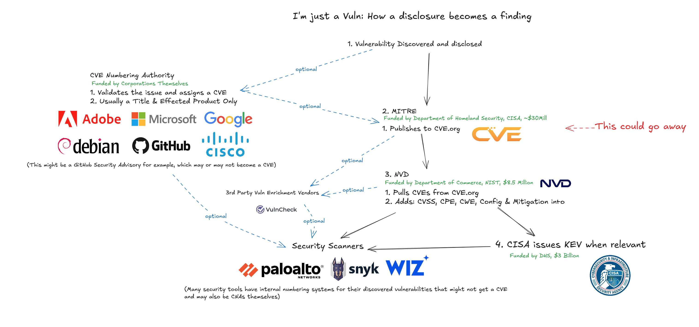

# Funding Cuts Threaten Foundational Cybersecurity Infrastructure, Harming U.S. Interests and global Cyber resiliency

The zealous government budget and staffing cutting of the Trump administration has been affecting global Cybersecurity and the latest example is that we might soon lose the Common Vulnerabilities and Exposures (CVE) database maintained by the federally funded, non-profit research and development organization MITRE. This has been reported and verified by U.S. based Cybersecurity reporter Brian Krebs[^1]

U.S. institutions, notably the Cybersecurity and Infrastructure Security Agency (CISA) and MITRE, serve as indispensable hubs for coordinating cybersecurity efforts on an international scale. The CVE list, in particular, provides a universal dictionary for identifying and tracking vulnerabilities, forming the bedrock for effective communication and response among defenders worldwide. While these platforms foster crucial global cooperation, it is undeniable that the foremost beneficiaries of this public-private coordination are the major U.S.-based technology and cybersecurity corporations. Companies such as **Google, Microsoft, Palo Alto Networks, CrowdStrike, SentinelOne, Cybereason**, and countless others heavily rely on this shared intelligence infrastructure to secure their products, services, and customers.

CVE Interplay between public and private organizations[^2]

The cuts made to the publicly funded programs at CISA[^3] and MITRE are potentially seen by the Musk lead DOGE team as cutting tax payer funded program that benefit disproportionately organizations outside the U.S., who are not contributing towards them, but the truth is that this going to predominately destroy value for US based organizations and their shareholders, while reducing cyber resiliency on a global level. 

This creates a clear lose-lose situation: global security is weakened, while significant economic value within the U.S. is put at risk. Furthermore, such targeted cuts often fail to make a substantial impact on overall budget deficits[^4], making the strategic cost disproportionately high compared to any potential fiscal savings. Investing in shared cybersecurity infrastructure is not simply expenditure; it is a critical investment in national security, global stability, and the continued prosperity of the U.S. digital economy.

## References:
[^1]: [Brian Krebs,Funding Expires for Key Cyber Vulnerability Database, KrebsOnSecurity](https://krebsonsecurity.com/2025/04/funding-expires-for-key-cyber-vulnerability-database/)\
[^2]: [James Berthoty, LinkedIn](https://www.linkedin.com/posts/james-berthoty_okay-its-really-hard-to-say-how-disastrous-activity-7318033864096972802-2TyH?utm_source=share&utm_medium=member_desktop&rcm=ACoAAAzCIYwBB3cbFhIEI7d_ajRyImEaQD6KRPw)\
[^3]: [Brian Krebs, Trump Revenge Tour Targets Cyber Leaders, Elections ](https://krebsonsecurity.com/2025/04/trump-revenge-tour-targets-cyber-leaders-elections)\
[^4]: [AP, US budget deficit grows to $1.3 trillion, the second highest six-month level on record, Associated Press](https://apnews.com/article/trump-biden-budget-deficit-spending-tax-revenues-f2718421a0f0c1a9f856d06ac4563e41)