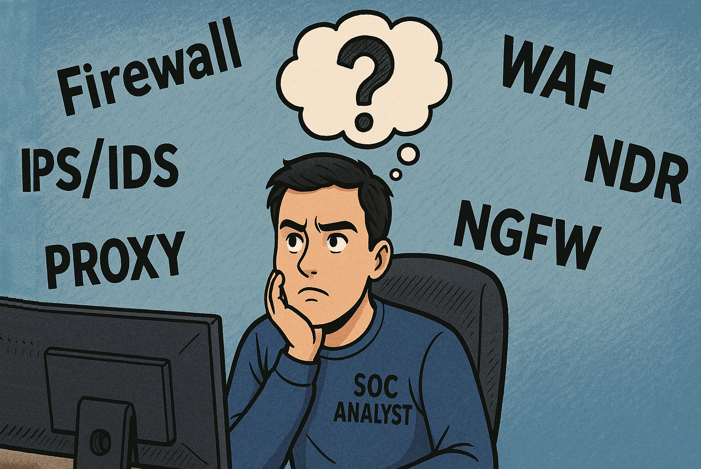
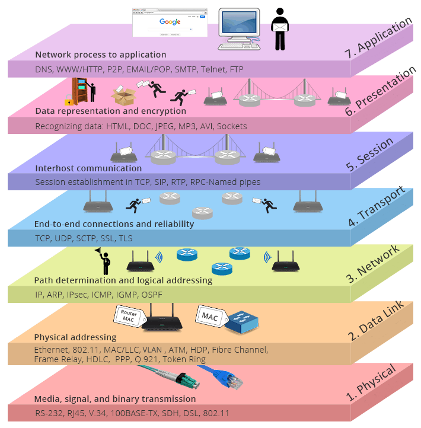
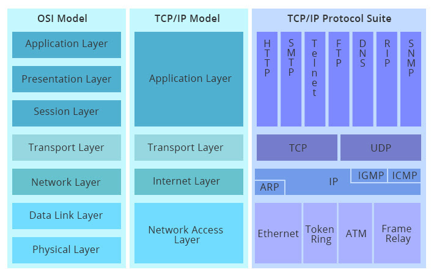
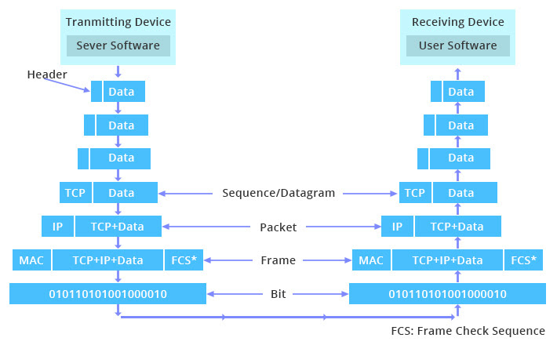
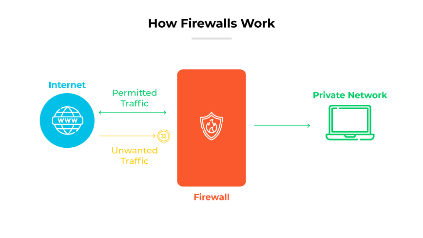
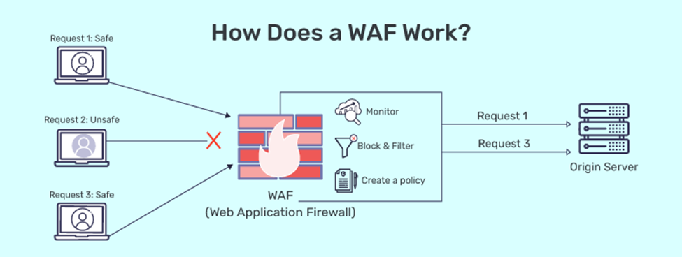
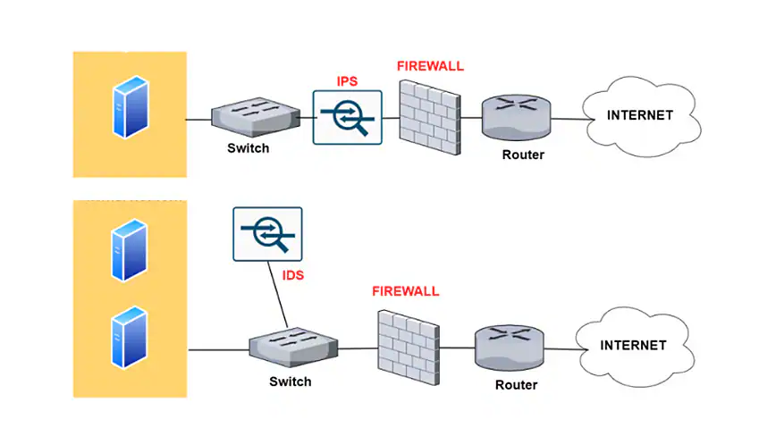
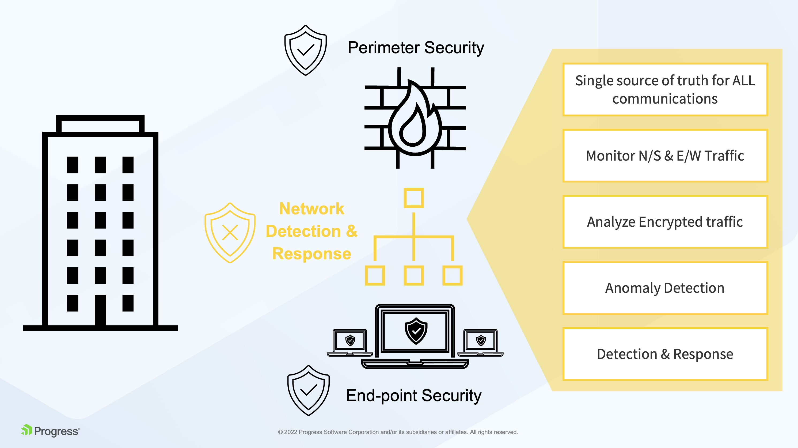
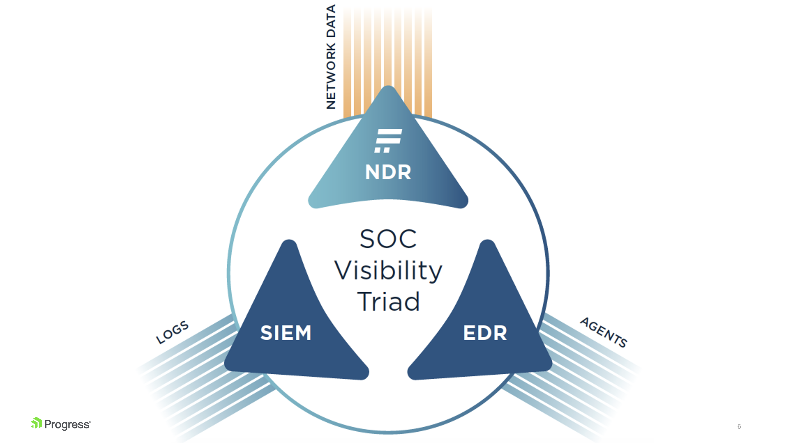
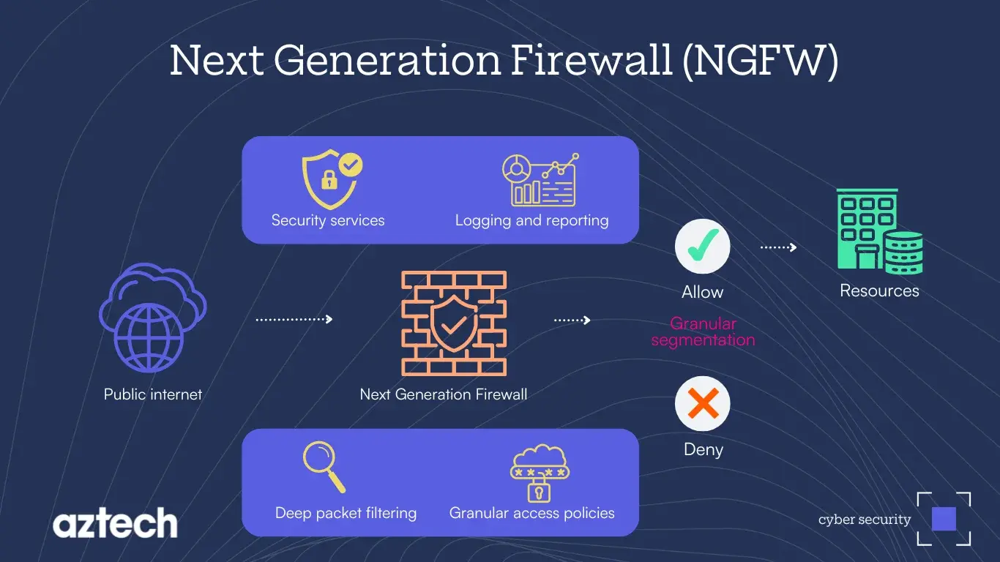

# Networking for Security Analysts


-   [Introduction](#introduction)
-   [Understanding the Basics of Networking](#understanding-the-basics-of-networking)
    -   [The Open Systems Interconnection (OSI) Model](#the-open-systems-interconnection-osi-model)
    -   [The TCP/IP Model](#the-tcpip-model)
    -   [Packet Encapsulation and Transfer](#packet-encapsulation-and-transfer)
    -   [Logical and Physical Addressing](#logical-and-physical-addressing)
    -   [Significance for SOC Analysts](#significance-for-soc-analysts)
-   [Understanding Traditional Firewall Systems](#understanding-traditional-firewall-systems)
    - [Understanding the Historical Context and Core Functionality of Traditional Firewalls](#understanding-the-historical-context-and-core-functionality-of-traditional-firewalls)
    - [Stateless vs Stateful packet inspection](#stateless-vs-stateful-packet-inspection)
-   [Proxies and how they are different to firewalls:](#proxies-and-how-they-are-different-to-firewalls)
    -   [Understanding Proxy Server Functioning and it's part in the OSI Layer](#understanding-proxy-server-functioning-and-its-part-in-the-osi-layer)
-   [Understanding Web Application Firewalls (WAFs)](#understanding-web-application-firewalls-wafs)
    -   [How Does a WAF Differ from a Traditional Firewall or an IDS?](#how-does-a-waf-differ-from-a-traditional-firewall-or-an-ids)
    -   [What Attacks Will a WAF Detect and Prevent?](#what-attacks-will-a-waf-detect-and-prevent)
    -   [Web application Firewall rules](#web-application-firewall-rules)
-   [Intrusion Detection Systems (IDS) and Intrusion Prevention Systems (IPS)](#intrusion-detection-systems-ids-and-intrusion-prevention-systems-ips)
    -   [Differences Between IDS/IPS and Firewalls, WAFs](#differences-between-idsips-and-firewalls-wafs)
    -   [Purpose of Intrusion Detection Systems](#purpose-of-intrusion-detection-systems)
    -   [Understanding IDS/IPS Types and Their Differences in the Detection Stack](#understanding-idsips-types-and-their-differences-in-the-detection-stack)
    -   [Different Types of Detections](#different-types-of-detections)
    -   [Example of an IDS Signature (Rule)](#example-of-an-ids-signature-rule)
    -   [Challenges with IDS/IPS](#challenges-with-idsips)
-   [What are Network Detection and Response - NDR and why was there a need for new network traffic analysis?](#what-are-network-detection-and-response---ndr-and-why-was-there-a-need-for-new-network-traffic-analysis)
    -   [How Does NDR Detect Malicious Activity?](#how-does-ndr-detect-malicious-activity)
    -   [How is NDR Different from IDS/IPS Systems?](#how-is-ndr-different-from-idsips-systems)
    -   [Real Examples of Attacks and How NDR Enhances Detection and Investigation:](#real-examples-of-attacks-and-how-ndr-enhances-detection-and-investigation)
-   [Understanding  Next-Generation Firewalls (NGFWs)](#understanding--next-generation-firewalls-ngfws)
    -   [What are Next-Generation Firewalls (NGFWs)?](#what-are-next-generation-firewalls-ngfws)
    -   [How do NGFWs Compare to Traditional Firewalls?](#how-do-ngfws-compare-to-traditional-firewalls)
    -   [What Features and Capabilities do They Support?](#what-features-and-capabilities-do-they-support)
-   [Conclusion](#conclusion)
-   [References](#references)

## AI Generated Podcast:

[NoteBookLM](https://notebooklm.google.com/notebook/e2774871-3eb0-47a8-9f25-712c1e7a385f/audio)
---
@author:[Ruslan Rustchev](https://www.linkedin.com/in/ruslan-rustchev/)\
#Date: 2025-04-09 (last change)

---
## Introduction 

As a Security Operations Center Manager, I want to underscore the paramount importance of a robust comprehension of networking fundamentals for our team of experienced security analysts. The very essence of our daily responsibilities—detecting, investigating, and preventing security incidents is inextricably linked with the intricate mechanisms of network communication. Without a thorough understanding of how networks function, analysts are significantly hampered in their ability to effectively interpret security alerts, analyze suspicious network traffic, and trace the pathways of malicious activity. This paper is designed to address this critical need by providing a comprehensive exploration of networking concepts, from the foundational principles governing data transmission to the operational intricacies of key security technologies that secure network communication. A strong grasp of these fundamentals is not merely beneficial, but absolutely essential for tasks such as accurately dissecting security incidents, comprehending the operational context and limitations of various security devices like firewalls and intrusion detection systems, and effectively tracing the origins and destinations of attacks during incident investigations. This paper will therefore lay the necessary groundwork by detailing these technical concepts, ensuring that analysts possess the requisite knowledge to excel in their mission of safeguarding our organization's digital assets.

## Understanding the Basics of Networking

For experienced Security Operations Center (SOC) analysts, a robust comprehension of networking fundamentals is paramount. Our daily tasks of detecting, investigating, and preventing security incidents are deeply intertwined with the intricacies of how network communications function. This chapter lays the groundwork by exploring these essential concepts, starting with the Open Systems Interconnection (OSI) model and progressing through packet encapsulation and transfer mechanisms. This foundational knowledge will be critical as we delve into specific security systems in subsequent chapters.

### The Open Systems Interconnection (OSI) Model

The OSI model is a conceptual framework that standardizes the functions of a telecommunication or computing system in terms of the communication functions of its components. It provides a layered approach, dividing the complex process of network communication into seven distinct layers, each with specific responsibilities. Understanding these layers is crucial for deciphering network traffic, identifying anomalies, and comprehending the operational context of various security technologies.


OSI Layer Model Graphical representation 

The seven layers of the OSI model, from the lowest to the highest, are:

1.  **Physical Layer:** This is the foundational layer, defining the electrical and physical specifications for data connections. It deals with the transmission and reception of unstructured raw data as a stream of bits over a physical medium. This layer specifies characteristics such as voltage levels, cable specifications (e.g., copper, fiber optic), connector types, and wireless frequencies. It is concerned with the physical signaling and the media through which data is transmitted. Low-level networking equipment operates at this layer, and it is not concerned with protocols or higher-layer items.

2.  **Data Link Layer:** This layer is responsible for the reliable transfer of data frames between two directly connected nodes across the physical layer. It handles physical addressing (MAC addresses), framing, error detection, and sometimes flow control. The data link layer is often divided into two sub-layers: the Media Access Control (MAC) layer, which controls how devices on the same network segment share the medium, and the Logical Link Control (LLC) layer, which provides an interface to the network layer. Technologies such as Ethernet, Wi-Fi (802.11), and protocols like the Address Resolution Protocol (ARP) operate at this layer. The Data Link Layer packages data into frames for transmission over the physical medium.

3.  **Network Layer:** The primary function of the network layer is to handle packet routing via logical addressing (IP addresses) and switching functions, enabling data to travel across multiple networks. This layer is responsible for path determination, logical addressing (assigning IP addresses), and packet forwarding. If a message is too large, the network layer may handle fragmentation (splitting packets) at the source and reassembly at the destination. Key protocols at this layer include the Internet Protocol (IP), Internet Control Message Protocol (ICMP), and Internet Group Management Protocol (IGMP). Both IPv4 (32-bit) and IPv6 (128-bit) addresses are defined at this layer.

4.  **Transport Layer:** The transport layer provides end-to-end connections between hosts and ensures the reliable and ordered delivery of data. It handles segmentation and reassembly of data, as well as error control and flow control to ensure data integrity. The transport layer provides quality of service (QoS) functions. The two main protocols at this layer are the Transmission Control Protocol (TCP), which is connection-oriented and provides reliable, ordered delivery, and the User Datagram Protocol (UDP), which is connectionless and provides faster but less reliable delivery. Protocols like Secure Sockets Layer (SSL) and Transport Layer Security (TLS) can also operate at this layer to provide encryption. The Transport Layer breaks down data into segments (for TCP) or datagrams (for UDP) for network transmission.

5.  **Session Layer:** This layer is responsible for establishing, managing, and terminating connections (sessions) between applications on different hosts. It handles authentication and authorization functions and ensures data is delivered as intended. The session layer is often explicitly implemented in applications using remote procedure calls.

6.  **Presentation Layer:** The presentation layer is concerned with data representation and encryption. It ensures that information sent by the application layer of one system is readable by the application layer of another system. This layer handles tasks such as data format conversion, character encoding, and data compression. It also deals with encryption and decryption of data for security purposes.

7.  **Application Layer:** This is the layer closest to the end user, providing communication functions directly to software applications. It interacts directly with applications and provides protocols for end-user services. Examples of protocols at this layer include the Domain Name System (DNS), Hypertext Transfer Protocol (HTTP), File Transfer Protocol (FTP), Simple Mail Transfer Protocol (SMTP), and Secure Shell (SSH). This layer defines how applications interact with the network.

### The TCP/IP Model

While the OSI model is a conceptual reference, the TCP/IP model is the protocol suite that underpins the internet and most modern networks. It is older than the OSI model and was designed to solve specific networking problems. The TCP/IP model has four layers, which can be mapped to the OSI model:


TCP/IP Model Layers Graphical representation 

1.  **Application Layer:** This layer combines the functionalities of the OSI model's Application, Presentation, and Session layers. It provides protocols for application-level communication, such as HTTP, FTP, SMTP, DNS, and SSH.

2.  **Transport Layer:** This layer corresponds directly to the OSI model's Transport Layer. It provides end-to-end communication services, including TCP for reliable, connection-oriented communication and UDP for faster, connectionless communication.

3.  **Internet Layer:** This layer maps to the OSI model's Network Layer. Its primary responsibility is routing packets across networks. The main protocol at this layer is IP, along with supporting protocols like ARP, ICMP, and IGMP.

4.  **Network Access Layer (or Link Layer):** This layer combines the functionalities of the OSI model's Data Link and Physical layers. It handles the physical transmission of data and the interaction with the network hardware, encompassing technologies like Ethernet, Wi-Fi, and others responsible for placing and receiving TCP/IP packets on the network medium.

Understanding both models is beneficial. The OSI model provides a comprehensive theoretical framework, while the TCP/IP model reflects the practical implementation of internet protocols.

### Packet Encapsulation and Transfer

Network communication involves data originating from an application on one host being prepared for transmission across a network to an application on another host. This process involves encapsulation at the sending end and de-encapsulation at the receiving end. Data is broken down and encapsulated into packets, which are the fundamental units of data transfer across networks. Each packet contains several key components:


Data being encapsulated in a frame and transmitted over a network before being de-encapsulated at the receiving end 

*   **Data:** This is the actual payload or the information being transmitted, originating from the application layer, which could be part of an email, a segment of a webpage, or any other form of digital content. This data is usually broken down in multiple packets for transfers and encapsulated with additional information to enable the actual data transfer. 

*   **Transport Layer Header:** This header, added by the Transport Layer, includes information such as source and destination port numbers, sequence numbers (for TCP), and checksums. It's responsible for end-to-end communication, ensuring data integrity and proper sequencing.

*   **Network Layer Header (IP Header):** Added by the Network Layer, this header contains the source and destination IP addresses, routing information, and the Time-to-Live (TTL) value. It's crucial for routing packets across different networks.

*   **Data Link Layer Header:** This header, added by the Data Link Layer, includes the source and destination MAC addresses, which are used for communication within the same local network segment.

*   **Data Link Layer Trailer:** Often included at the end of the frame, this trailer contains error detection information, such as the Frame Check Sequence (FCS), to ensure data integrity during transmission.

**Encapsulation, Transfer, and De-encapsulation:**

The process begins with **encapsulation**, where the application data is passed down through the layers of the TCP/IP model on the sending host. Each layer adds its respective header (and sometimes a trailer) to the data, forming a Protocol Data Unit (PDU). Once encapsulated into a frame at the Network Access Layer, the data is ready for **transfer** across the network. Switches and routers, operating at Layers 2 and 3 respectively, use MAC and IP addresses to forward frames and route packets. As the frame or packet traverses the network, intermediate devices examine the headers to make forwarding decisions. Upon reaching the receiving host, the process is reversed through **de-encapsulation**. Each layer removes its corresponding header (and trailer), passing the PDU up to the next higher layer until the application data is delivered to the receiving application.

### Logical and Physical Addressing

Understanding the difference between logical (IP) and physical (MAC) addresses is fundamental to comprehending network communication.

*   **MAC Addresses (Media Access Control):** These are physical addresses assigned to the network interface card (NIC) of a device. They are typically 48-bit hexadecimal addresses and are used for communication within the same local network segment (Layer 2). MAC addresses are unique within a local network and are used by switches to forward frames based on the destination MAC address.

*   **IP Addresses (Internet Protocol):** These are logical addresses assigned to devices on a network (Layer 3). IP addresses are hierarchical and are used for routing packets across different networks. Both IPv4 and IPv6 are used, with IPv4 being a 32-bit address and IPv6 being a 128-bit address. Routers use destination IP addresses to determine the path a packet should take to reach its destination network.

The ARP protocol plays a crucial role in resolving IP addresses to MAC addresses within a local network. When a host needs to send a packet to an IP address on the same local network, it uses ARP to determine the corresponding MAC address.

### Significance for SOC Analysts

A solid grasp of these networking fundamentals is essential for SOC analysts in numerous ways:

*   **Traffic Analysis:** Understanding packet headers and the functions of each layer allows analysts to interpret network traffic captures (e.g., PCAPs) effectively. This is crucial for identifying malicious activity, such as unusual protocols, suspicious ports, or anomalous traffic patterns.

*   **Security Device Operation:** Security devices like firewalls, Intrusion Detection/Prevention Systems (IDS/IPS), and Web Application Firewalls (WAFs) operate at different layers of the OSI model. Knowing the layer at which a device operates helps analysts understand its capabilities and limitations. For example, a traditional firewall primarily operates at Layers 3 and 4, while a WAF operates at Layer 7.

*   **Incident Investigation:** When investigating security incidents, understanding how network communication flows can help analysts trace the origin and destination of attacks, identify affected systems, and understand the scope of a breach. For instance, analyzing network logs and traffic can reveal lateral movement within a network.

*   **Rule and Policy Creation:** For managing security devices, analysts need to define rules and policies based on network protocols, IP addresses, ports, and application-layer information. A strong understanding of networking is essential for creating effective and accurate security rules.

*   **Threat Detection:** Recognizing normal network behavior and identifying deviations that might indicate malicious activity relies on understanding how legitimate network communication works. For example, understanding DNS queries and responses is crucial for detecting DNS exfiltration attempts.

### Understanding Traditional Firewall Systems

For many years, the firewall has served as the primary barrier between protected internal networks and potentially hostile external networks, playing a critical role in controlling the flow of network traffic and preventing unauthorized access.

### Understanding the Historical Context and Core Functionality of Traditional Firewalls

Traditional firewalls emerged in the late 1980s as a response to the growing need to protect internal resources from external threats. The earliest forms were packet filtering systems that operated by examining the headers of network packets. These firewalls made decisions about whether to permit or deny traffic based on a predefined set of rules that typically considered the source and destination IP addresses, port numbers, and network protocols (like TCP, UDP, ICMP). If a packet's header information matched a rule, the associated action (allow or block) was taken.

The fundamental objective of a traditional network firewall is to establish a secure boundary by separating a secured internal zone from a less secure external zone, meticulously controlling communications between the two. Without a firewall, any device with a public IP address would be directly accessible from the internet, significantly increasing the risk of attacks. Firewall policies define the specific types of traffic that are permitted to enter or leave the network, and any traffic that does not conform to these policies is blocked. This helps to prevent unauthorized users and malicious activities originating from less trusted zones.


Traditional firewall as a boundary between untrusted (external network) and trusted (internal network) zones

Traditional firewalls function as a checkpoint, inspecting and regulating network traffic based on the security rules configured by network administrators. Every piece of data traversing the internet or a network is encapsulated within network packets, as we discussed previously. Traditional firewalls analyze the header information of these packets against their configured rules to determine their legitimacy. Traffic that does not meet the specified criteria is blocked or dropped, ensuring that only safe and legitimate traffic is allowed to pass.

| Source Address | Source Port | Destination Address | Destination Port | Action | Explanation |
|----------------|-------------|---------------------|------------------|--------|-------------|
|   192.168.1.2 |           80 |         10.10.10.20 |               22 |  Allow | This rule allows traffic. Specifically, it permits connections originating from the IP address 192.168.1.2 on port 80 (typically HTTP) to the IP address 10.10.10.20 on port 22 (SSH). This suggests an internal machine (192.168.1.2) is allowed to connect to an external SSH server.
| 10.10.0.0 / 24 | Any | 192.168.0.0/24 | 443 | Deny | This rule denies traffic. It blocks any traffic coming from the IP range 10.10.0.0/24 to the IP range 192.168.0.0/24 on port 443 (typically HTTPS). This is a more restrictive rule, preventing a whole network from accessing a specific internal network's HTTPS services. The Any in the source port means any source port is blocked.
| Any | Any | Any | Any | Deny | This is a default deny rule. It's a crucial security best practice. It states that any traffic not explicitly allowed by a previous rule is blocked. This prevents unexpected or not configured traffic from passing through the firewall.

Table 1: Example traditional firewall rules for traffic management 

### Stateless vs Stateful packet inspection
**Stateless Packet Inspection**

One of the earlier methods employed by traditional firewalls for traffic filtering is **stateless packet inspection**. In this mode of operation, the firewall examines each network packet in isolation, without considering its relationship to any other packets or the overall state of a network connection. The decision to allow or block a packet is based solely on the information contained within that individual packet's header, such as the source and destination IP addresses and port numbers.

**Stateful Packet Inspection**

To address the limitations of stateless inspection, more advanced traditional firewalls implemented **stateful packet inspection**. A stateful firewall monitors the state of active network connections, keeping track of information such as the source and destination IP addresses and ports, the sequence numbers (for TCP), and the overall connection status. This information is maintained in a **state table**.

For instance, if an internal user initiates an HTTP request to an external web server (typically using TCP port 80 or 443), the stateful firewall will allow the initial outgoing packets based on the outbound rules. It will then create a state table entry for this connection, noting the source and destination IP addresses and ports, and the TCP sequence numbers. When the web server responds to this request, the firewall will examine the incoming packets and check if they match an existing entry in the state table. If a match is found (indicating that these incoming packets are part of the previously established connection initiated by the internal user), the packets are allowed through. However, unsolicited incoming packets that do not correspond to any active session in the state table are typically blocked.

Stateful inspection offers several advantages over stateless inspection:

*   **Enhanced Security:** By tracking the state of connections, stateful firewalls can better identify and block various types of attacks, such as connection hijacking and certain denial-of-service (DoS) attacks, that rely on manipulating the state of TCP sessions.

*   **More Granular Control:** Stateful firewalls can enforce more precise rules based on the connection state, allowing, for example, incoming traffic only in response to a previously initiated outgoing request.

*   **Simplified Rule Sets:** In some cases, stateful inspection can simplify firewall rule configuration. For instance, instead of needing explicit rules to allow all possible response packets for every type of outbound connection, a stateful firewall can automatically permit return traffic for established sessions.

Traditional packet filtering firewalls primarily operate at the **network layer (Layer 3)** of the OSI model. At this layer, they examine the headers of network packets, focusing on source and destination IP addresses. If the Firewall performs stateful packet inspection, then it operates at the **transport layer (Layer 4)** by tracking the state of active connections and ensuring that incoming traffic is part of an established session.

## Proxies and how they are different to firewalls: 
I often see a lot of confusion between the traditional role of the Firewall and the Proxy or Proxy Firewall. In this section I will briefly discuss their role in modern security architectures in a layered approach to provide comprehensive security.

### Understanding Proxy Server Functioning and it's part in the OSI Layer**

A proxy server functions as an intermediary, acting as a gateway between a user's device and the public internet. When a user requests a resource on the internet, the request is first directed to the proxy server. The proxy server then forwards this request to the destination server on behalf of the user and, upon receiving the response, relays the data back to the user's device. This indirect communication provides several key functionalities. Primarily, a proxy server can mask the user's actual IP address by using its own anonymous IP address when communicating with external servers, thereby enhancing user anonymity. Additionally, proxy servers often implement caching mechanisms, storing frequently accessed web content to reduce server load and improve latency for subsequent requests for the same resources. Some organizations also utilize proxy servers to enforce web access control policies, blocking or allowing traffic to specific URLs or content categories.

Crucially, a proxy server operates at the **application layer (Layer 7)** of the OSI model. At this layer, the proxy server has visibility into the application data being exchanged, such as HTTP/HTTPS requests and responses. This allows for deep packet inspection (DPI) at the application level, enabling the proxy to identify and potentially block malicious content or unauthorized application-specific activities. Due to their operation at the application layer, proxy firewalls are sometimes referred to as application firewalls or application-level gateways.

**Key Functional Differences Summarized**

| Feature             | Proxy Server                                                              | Traditional Firewall                                                        |
| ------------------- | ------------------------------------------------------------------------- | --------------------------------------------------------------------------- |
| Primary Function    | Intermediary for user requests, anonymity, web access control, caching.   | Prevents unauthorized network access, filters traffic based on rules.       |
| OSI Layer           | Application Layer (Layer 7)                                               | Network Layer (Layer 3) and Transport Layer (Layer 4)                       |
| Traffic Handling    | Accepts and forwards application-level connection requests.               | Inspects and either allows or blocks network packets.                       |
| Visibility          | Deep visibility into application data (Layer 7).                          | Primarily focuses on network and transport layer headers (traditional)      |
| Direct Connection   | Prevents direct connections between internal users and external servers.  | Sits between networks, controlling the flow of traffic across boundaries.   |
| Anonymity           | Can hide the user's IP address.                                           | Typically does not provide anonymity on their own.                          |
| Caching             | Often provides caching of web content.                                    | Generally does not provide caching (proxy firewalls being an exception).    |
| Threat Prevention   | Focuses on application-level threats and controlling web access.          | provide limited threat prevention, can implement Allow or Blocklist based on traffic |

In essence, while both proxy servers and firewalls contribute to network security, they operate at different layers of the OSI model and fulfill distinct roles. Proxy servers act as forward or reverse proxies at the application level, mediating and inspecting specific application traffic, whereas firewalls, especially traditional ones, operate at lower network layers to control broader network traffic based on defined rules.

## Understanding Web Application Firewalls (WAFs)

A Web Application Firewall (WAF) is a network security device or service that specifically protects web applications by monitoring and filtering Hypertext Transfer Protocol (HTTP) traffic. Unlike a traditional network firewall that acts as a barrier between external and internal network traffic, a WAF sits between external users and web applications. Its primary function is to analyze all HTTP and Hypertext Transfer Protocol Secure (HTTPS) communication, detecting and blocking malicious requests before they reach the web applications or their underlying servers.

Think of a WAF as a reverse proxy, safeguarding the server by requiring clients to pass through the WAF before reaching the destination server. This intermediary position allows the WAF to inspect the content of the application-layer traffic in detail. These appliances focus in securing inbound traffic to the following digital estate: 


WAF deployed to protect a server. A WAF can be placed as well behind a Firewall to further filter down on the requests 

*   **Web Applications:** The WAF protects business-critical web applications from a wide range of application-layer attacks, ensuring their availability, integrity, and confidentiality.

*   **APIs (Application Programming Interfaces):** As businesses expand their digital initiatives, WAFs also play a crucial role in securing APIs, which are increasingly used for communication between different applications and services.

*   **Web Servers:** By sitting in front of web servers, WAFs protect them from direct exposure to malicious traffic, shielding them from attacks targeting the application layer.

*   **Internet-Facing Zones:** WAFs are typically deployed in the internet-facing zones of a network to protect web applications and APIs that are accessible from the public internet.

### How Does a WAF Differ from a Traditional Firewall or an IDS?

**Web Application Firewalls (WAFs):** WAFs operate at OSI model Layer 7, the application layer, as opposed to layer 3 and 4 where traditional Firewalls typically reside. This allows them to analyze the actual content of the HTTP/HTTPS requests and responses. WAFs are specifically designed to understand the intricacies of web applications, including their protocols (HTTP, HTTPS), common vulnerabilities, and typical user interactions. They can identify and control application-specific communications, even those flowing over standard ports like HTTPS (port 443). Traditional firewalls, on the other hand, often lack the ability to differentiate between various types of application traffic on standard ports.

In essence, a traditional firewall provides a broader network security barrier, controlling access based on source and destination, while a WAF provides a more granular, content-aware security layer specifically for web applications. A network firewall alone will not protect against attacks targeting web application vulnerabilities, which is where a WAF's capabilities become essential.

### What Attacks Will a WAF Detect and Prevent?

A WAF is designed to defend against a wide range of attacks targeting web applications. Some common examples include: 

*   **SQL Injection (SQLi):** This is an injection attack where malicious SQL statements are inserted into application input fields, potentially allowing attackers to bypass authentication, retrieve sensitive data, or modify the database.

*   **Cross-Site Scripting (XSS):** This vulnerability allows attackers to inject malicious scripts into web pages viewed by other users, potentially leading to session hijacking, defacement, or the theft of sensitive information.

*   **Distributed Denial-of-Service (DDoS) Attacks:** While network firewalls can help mitigate volumetric DDoS attacks at the network layer, WAFs can protect against application-layer DDoS attacks that target specific web application resources and functionalities by overwhelming the server with HTTP requests. WAFs can employ techniques like rate limiting and traffic filtering to mitigate these attacks.

*   **Command Injection:** Similar to SQL injection, command injection vulnerabilities allow attackers to execute arbitrary operating system commands on the web server. WAFs can be configured to detect and prevent such attempts.

*   **OWASP Top 10 Vulnerabilities:** WAFs are often built to defend against the vulnerabilities listed in the OWASP Top 10, a foundational list of the most commonly seen web application vulnerabilities. This includes attacks like broken authentication, security misconfiguration, and insecure deserialization.

*   **Bot Attacks:** WAFs can identify and block malicious bots that may be used for scraping data, brute-force attacks, or other malicious activities. Some WAFs offer advanced bot protection.

*   **Cookie Poisoning:** Attackers may attempt to modify or inject malicious data into cookies to gain unauthorized access or manipulate application behavior. WAFs can inspect and protect against such cookie manipulation.

*   **URL Attacks:** WAFs can analyze and block requests with malformed or suspicious URLs that may be indicative of an attack.

### Web application Firewall rules
A WAF operates based on a set of rules or policies that are configured to protect against known and potential application vulnerabilities. These policies can be modified rapidly, enabling a swift response to evolving attack vectors, such as implementing rate limiting during a Distributed Denial-of-Service (DDoS) attack.
Let's take an example of a Web Application Firewall (WAF) rule designed to detect common patterns associated with SQL Injection (SQLi) attempts.

WAF rules vary in syntax depending on the specific WAF vendor (e.g., ModSecurity, AWS WAF, Cloudflare WAF, Azure WAF). This example will use a syntax similar to the widely used open-source WAF [**ModSecurity with the OWASP Core Rule Set (CRS)**](https://github.com/coreruleset/coreruleset), as it's well-documented and illustrates the concepts clearly.

---
**Example WAF Rule (Simplified ModSecurity/OWASP CRS Style):**

```
SecRule REQUEST_URI|ARGS|REQUEST_HEADERS "@rx (?i)(\'|\"|--|#|\b(SELECT|UNION|INSERT|DELETE|UPDATE|DROP|EXEC)\b.*\bFROM\b|\bSLEEP\s*\()" \
    "id:942100, \
    phase:2, \
    block, \
    t:none,t:lowercase,t:urlDecodeUni, \
    msg:'Potential SQL Injection Attempt Detected', \
    logdata:'Matched Data: %{MATCHED_VAR} found within %{MATCHED_VAR_NAME}: %{MATCHED_VAR_VALUE}', \
    tag:'application-multi', \
    tag:'language-sql', \
    tag:'platform-multi', \
    tag:'attack-sqli', \
    tag:'OWASP_CRS/WEB_ATTACK/SQL_INJECTION', \
    severity:'CRITICAL'"
```
---
**Breakdown of the Rule:**

*   **`SecRule REQUEST_URI|ARGS|REQUEST_HEADERS`**: Defines the rule and specifies that the WAF should inspect the request URI, arguments, and headers.

*   **`"@rx (?i)(\'|\"|--|#|\b(SELECT|UNION|INSERT|DELETE|UPDATE|DROP|EXEC)\b.*\bFROM\b|\bSLEEP\s*\()"`**: This is the core of the rule, using a regular expression (`@rx`) to match common SQL injection patterns case-insensitively (`(?i)`). It looks for single/double quotes, SQL comments (`--`, `#`), SQL keywords (`SELECT`, `UNION`, etc.), and the `SLEEP` function.

*   **`phase:2`**: Specifies that the rule should run after the request headers and body have been processed.

*   **`block`**: The action to take if the rule matches: block the request.

*   **`t:none,t:lowercase,t:urlDecodeUni`**: Transformation functions to normalize the data before matching (no transformation, lowercase, URL decode).

*   **`msg:'Potential SQL Injection Attempt Detected'`**: The message to log if the rule triggers.

*   **`logdata:'Matched Data: %{MATCHED_VAR} found within %{MATCHED_VAR_NAME}: %{MATCHED_VAR_VALUE}'`**: Specifies what to log, including the matched data, variable name, and value.

*   **`tag:'...'`**: Tags for categorization and reporting.

*   **`severity:'CRITICAL'`**: Sets the severity level of the detected event.
---

**In Summary:**

This WAF rule works by:

1.  Intercepting an incoming HTTP request before it reaches the web application server (at Phase 2).

2.  Applying transformations (decoding, lowercasing) to normalize the data in the URL, arguments, and headers.

3.  Using a regular expression to search the normalized data for common SQLi patterns (like quotes, comments, SQL keywords in suspicious combinations).

4.  If a match is found, it logs detailed information about the match (including the pattern found and where) with a critical severity tag.

5.  Crucially, it takes the `block` action, preventing the potentially malicious request from ever reaching the application's database layer.

## Intrusion Detection Systems (IDS) and Intrusion Prevention Systems (IPS)

Intrusion Detection Systems (IDS) and Intrusion Prevention Systems (IPS) are crucial network security technologies designed to identify and potentially respond to malicious activities targeting a network or its systems. While both aim to enhance security by monitoring network traffic, they differ significantly in their response to detected threats.

An **IDS** is primarily a monitoring system that analyzes network traffic for suspicious patterns or anomalies that may indicate an ongoing attack or a security policy violation.. Critically, an IDS operates out of the main traffic flow and does not actively interfere with data transmission. It acts as a passive observer, analyzing a mirrored copy of network traffic to preserve network performance.

In contrast, an **IPS** takes a more active role in network security. Similar to an IDS, an IPS analyzes network traffic for malicious activities and vulnerabilities. However, when a threat is identified, an IPS can take automated actions to prevent the threat from compromising the network. These preventative measures can include blocking the malicious traffic, dropping harmful data packets, blocking the source IP address, resetting the connection, or triggering other security mechanisms. An IPS is typically deployed in the direct path of network traffic (inline), allowing it to scrutinize and act on threats in real-time.


Difference between IDS and IPS deployed within a network

| 	                                | IPS Deployment                                        |  	IDS Deployment              |
|-----------------------------------|-------------------------------------------------------|-------------------------------|              
|Placement in Network Infrastructure| Part of the direct line of communication (inline)     |Outside direct line of communication (out-of-band)|
|System type                        | Active (monitor & automatically defend) and/or passive|Passive (monitor & notify)     |
|Detection Mechanisms 	            |1. Statistical anomaly-based detection<br>2. Signature detection:<br>- Exploit-facing signatures<br>- Vulnerability-facing signatures|1. Signature detection:<br>- Exploit-facing signatures

Table 3 - Difference between IDS and IPS systems 

### Differences Between IDS/IPS and Firewalls, WAFs

While firewalls, IDS, and IPS are all essential components of a comprehensive network security framework, they serve distinct purposes and operate differently.

In contrast to the Firewall that acts as a barrier or filter that controls network traffic flow, IDS and IPS are specifically designed to detect and respond to malicious activities that may bypass firewall controls or originate from within the network. While a firewall blocks traffic based on rules applied to addresses and ports, an IDS/IPS examines the actual content and behavior of network traffic to identify potential threats.

The placement of these security solutions within the network architecture also differs. A firewall is typically located at the network perimeter as the initial line of defense. An IPS is often positioned behind the firewall to examine traffic that has already passed the initial filtering stage, allowing it to analyze and act on potentially malicious data before it reaches internal resources. An IDS, being a passive monitoring system, is often placed out-of-band, mirroring network traffic for analysis without being directly in the communication path.

IPS/IDS are positioned to analyze traffic from the entire network, however they typically do not have the same level of application awareness as a WAF. They may struggle to differentiate between legitimate and malicious HTTP/HTTPS traffic based solely on network-level characteristics. While an IPS might detect network-level attacks targeting a web server, a WAF is better equipped to identify and prevent attacks that exploit vulnerabilities within the web application itself, such as SQL injection or cross-site scripting. WAFs can analyze the HTTP/HTTPS requests for malicious payloads, malformed parameters, and violations of expected application behavior.

### Purpose of Intrusion Detection Systems

The fundamental purpose of an IDS is to identify potential security breaches, malicious activities, or policy violations occurring within a network or on its systems. By monitoring network traffic and system activities, an IDS aims to detect suspicious patterns, known attack signatures, and deviations from normal behavior.

Specifically, the purposes of an IDS include :

*   **Detecting Exploits:** Identifying attempts to leverage vulnerabilities in applications or operating systems.

*   **Identifying Attack Patterns:** Recognizing known sequences of actions associated with malicious activities, such as network scans or denial-of-service (DoS) attacks.

*   **Monitoring for Anomalous Behavior:** Detecting unusual network traffic patterns or communication that deviate from established baselines, which could indicate the presence of malware or unauthorized activity.

*   **Providing Alerts and Logs:** Generating notifications and maintaining records of detected suspicious events, enabling security analysts to investigate and respond to potential incidents.

*   **Identifying Configuration Issues:** Detecting potential bugs or problems with device configurations that could create security weaknesses.

### Understanding IDS/IPS Types and Their Differences in the Detection Stack

**1. Network-based Intrusion Detection/Prevention System (NIDS/NIPS)**

A Network-based IDS (NIDS) operates by monitoring network traffic across an entire protected network or specific network segments. Typically deployed at strategic points within the network infrastructure, such as the ingress and egress points of internet traffic or at key switching locations, NIDS examines the flow of data to and from devices. By analyzing packet contents and metadata, NIDS aims to identify suspicious patterns and sequences that match known attack signatures or deviate from established baselines of normal network behavior.

**2. Host-based Intrusion Detection/Prevention System (HIDS/HIPS)**

A Host-based IDS (HIDS) is deployed on a specific endpoint or host within the network, such as a server, workstation, or other critical asset. Unlike NIDS, which monitors network traffic, HIDS focuses on the activities occurring on the individual host. This includes monitoring system logs, file system integrity, process activity, and network traffic originating from or destined for the specific host. When suspicious activity is detected, such as unauthorized modifications to critical system files or unusual process execution, the HIDS generates alerts for local administrators or a central security management system. Similar to NIDS, a traditional HIDS is primarily a monitoring and alerting tool and does not typically block malicious actions.

**3. Protocol-based Intrusion Detection System (PIDS)**

A Protocol-based IDS (PIDS) is typically positioned in front of a server, such as a web server, and focuses on monitoring and analyzing the communication protocols being used between a user or device and the server. The PIDS examines the behavior and state of the specific protocol to identify any deviations from expected or acceptable patterns. For instance, a PIDS monitoring HTTP traffic might look for malformed requests, attempts to exploit known web server vulnerabilities, or violations of HTTP protocol standards.

By focusing on the specifics of a particular protocol, PIDS can provide more granular and context-aware detection of attacks targeting services utilizing that protocol. They are often tailored to monitor protocols like HTTP, SMTP, FTP, or DNS and can be effective in identifying application-layer attacks that may not be easily detected by more general network-based or host-based systems.

**4. Application Protocol-based Intrusion Detection System (APIDS)**

An Application Protocol-based IDS (APIDS) takes an even deeper dive into the application layer by focusing on the specific protocols used by particular applications. Typically residing within the server-side of an application, an APIDS monitors and interprets the communication within application-specific protocols. A common example is an APIDS that monitors the SQL protocol used for communication between a web server and a database. By understanding the expected syntax, commands, and data flow within the application protocol, the APIDS can detect anomalous or malicious activity, such as SQL injection attempts or unauthorized data access. This type of IDS has very similar functionality to the already discussed Web Application Firewall (WAF).

**5. Hybrid Intrusion Detection/Prevention System**

A Hybrid Intrusion Detection System combines two or more of the aforementioned IDS approaches to provide a more comprehensive and integrated view of security threats. By integrating information from network-based sensors, host-based agents, and potentially protocol-specific monitors, a hybrid IDS can correlate events and gain a broader understanding of suspicious activities across different layers of the IT infrastructure. For example, a hybrid system might correlate a network-based alert indicating suspicious traffic with host-based logs showing anomalous process activity on a specific endpoint, providing stronger evidence of a potential compromise. An example of a hybrid approach is the integration of network traffic analysis with endpoint detection and response (EDR) data for a more holistic view of potential threats.

### Different Types of Detections

IDS and IPS solutions employ various methods to detect malicious activities, with the most common being signature-based detection and anomaly-based detection. IPS may also utilize policy-based detection.

*   **Signature-Based Detection:** This method relies on a database of pre-defined signatures or patterns of known attacks and vulnerabilities (rules). The IDS/IPS analyzes network traffic and compares it against these signatures. If a match is found, an alert is triggered (IDS) or the traffic is blocked (IPS). Signature-based detection is effective at identifying known threats with high accuracy. However, it is limited in its ability to detect new or zero-day attacks for which signatures do not yet exist. Examples of signature-based rules often look for specific network traffic patterns associated with known malware or exploit attempts. Many traditional IDS/IPS systems primarily rely on signature-based detection.

*   **Policy-Based Detection:** This detection method, primarily used by IPS, relies on predefined security policies configured by administrators. The IPS monitors network traffic to ensure it complies with these established policies. Any traffic that violates a defined policy triggers a preventative action. Policies can be based on various criteria, such as acceptable application usage, allowed communication protocols, or restrictions on specific types of network behavior.

*   **Anomaly-Based Detection:** This method establishes a baseline of normal network behavior by analyzing various network metrics and traffic characteristics over time using techniques like machine learning. Once a baseline is established, the IDS/IPS continuously monitors network traffic and identifies any deviations or anomalies from this normal behavior. Detected anomalies are flagged as potentially malicious. Anomaly-based detection can be effective at detecting new and unknown threats, as it doesn't rely on pre-existing signatures. However, it is more prone to generating false positives, as legitimate but unusual network activity can be misidentified as malicious. Modern IDS/IPS and especially Network Detection and Response (NDR) solutions increasingly incorporate anomaly-based detection capabilities.

### Example of an IDS Signature (Rule)

Creating high-quality and specific detection rules is crucial for effective threat detection while minimizing noise. Many open-source and commercial IDS/IPS systems utilize a rule-based language (e.g., Snort, Suricata).

Let's consider a simplified example of a signature-based IDS rule ([from the SNORT IDS/IPS community ruleset](https://www.snort.org/downloads/#rule-downloads)) designed to detect attempts to exploit a specific vulnerability in a web server:

---
```c
alert tcp $EXTERNAL_NET any -> $HOME_NET $HTTP_PORTS 
(msg:"SERVER-OTHER Apache Log4j logging remote code execution attempt"; 
flow:to_server,established;
http_uri; 
content:"${jndi:",fast_pattern,nocase;
metadata:policy balanced-ips drop,policy connectivity-ips drop,policy max-detect-ips drop,policy security-ips drop,ruleset community;
service:http;
reference:cve,2021-44228; reference:cve,2021-44832; reference:cve,2021-45046; reference:cve,2021-45105; 
classtype:attempted-user; sid:58722; rev:5;)
```
---

**Breakdown of the Rule:**
This Snort rule is designed to detect attempts to exploit the Log4j vulnerability (CVE-2021-44228 and related CVEs). Let's break down the rule:

`alert tcp $EXTERNAL_NET any -> $HOME_NET $HTTP_PORTS`: This line specifies the type of alert (TCP), the source network ($EXTERNAL_NET, representing any external network), any port on the source, the destination network ($HOME_NET, representing your internal network), and the destination ports ($HTTP_PORTS, representing common HTTP ports like 80 and 443). This means the rule triggers on TCP traffic coming from outside your network to HTTP ports within your network.

`msg:"SERVER-OTHER Apache Log4j logging remote code execution attempt"`";: This is the message that will be logged if the rule triggers. It indicates a potential Log4j exploit attempt targeting an Apache server.

`flow:to_server,established`: This specifies that the rule only applies to traffic flowing towards the server and that a connection has already been established.

`http_uri`: This ensures that the rule only applies to HTTP requests, checking the URI part of the HTTP request.

`content:"${jndi:",fast_pattern,nocase`: This is the core of the detection. It looks for the string "`${jndi:`" within the HTTP request URI. This string is a common indicator of Log4j exploitation attempts using JNDI lookup. fast_pattern optimizes the search, and nocase makes the search case-insensitive.

`metadata`: This section adds metadata to the rule. The policy directives indicate that if this rule triggers, the traffic should be dropped by various intrusion prevention systems (IPS). ruleset community indicates the rule comes from a community-contributed ruleset.

`service:http`: This further refines the rule to only apply to HTTP traffic.

`reference`:cve,2021-44228; reference:cve,2021-44832; reference:cve,2021-45046; reference:cve,2021-45105;: These lines provide references to the relevant Common Vulnerabilities and Exposures (CVEs) associated with the Log4j vulnerability.

`classtype:attempted-user`: This classifies the event as an attempted user-level attack.

`sid:58722; rev:5;`: sid is the signature ID, a unique identifier for this rule. rev is the revision number, indicating updates to the rule.

---

In short, this rule acts as a safeguard against Log4j exploits by monitoring incoming HTTP traffic and looking for the telltale `"${jndi:"` string in the URI. If found, it logs the event and, based on the defined policies, may drop the malicious connection.

### Challenges with IDS/IPS

Despite their importance, IDS/IPS systems face several challenges:

*   **Alert Overload and False Positives:** Traditional IDS/IPS, especially signature-based systems, can generate a high volume of alerts, many of which may be false positives (legitimate activity incorrectly identified as malicious). This can lead to alert fatigue among security analysts, making it difficult to identify genuine threats. Tuning rules to reduce false positives often requires significant expertise.

*   **Lack of Context:** IDS alerts often lack the necessary context to understand the full scope and severity of a potential attack. Correlating IDS alerts with events from other security solutions (e.g., EDR, firewalls) is crucial but can be time-consuming.

*   **Evasion Techniques:** Attackers employ various techniques to evade detection by IDS/IPS, such as fragmentation, flooding, obfuscation, and encryption. Encrypted traffic, in particular, poses a challenge for traditional IDS/IPS unless decryption is performed.

*   **Complexity and Management Overhead:** Configuring and managing IDS/IPS rules and policies can be complex and require skilled analysts. Keeping signature databases and detection logic up-to-date is also an ongoing task.

*   **Nonspecific / Too broad Rules** - Generic, broad rules can trigger on common benign activities, leading to noise, while highly specific rules might miss variations of attacks. Balancing specificity and coverage is a constant challenge in rule writing.

While IDS/IPS remain valuable components of a security strategy, understanding their limitations is crucial for building a robust and effective defense-in-depth approach.

## What are Network Detection and Response - NDR and why was there a need for new network traffic analysis? 

Network Detection and Response (NDR) is an emerging category of security solutions that leverages network traffic analysis (NTA) to provide comprehensive threat detection, investigation, and response capabilities. NDR solutions monitor and analyze network traffic in real-time, typically spanning from Layer 2 to Layer 7 of the OSI model, to identify malicious behaviors, anomalous activities, and potential security threats. This visibility extends across various network environments, including on-premises, cloud (public, private, hybrid, multi-cloud), SaaS applications, and even traffic generated by remote users.

The core objective of NDR is to provide security teams with a holistic view of network activities, enabling them to detect threats that may bypass traditional perimeter defenses, such as firewalls and basic IPS, or originate from within the network itself (lateral movement). Those legacy systems, primarily deployed at network ingress/egress points and sometimes within internal segments, operate based on predefined signatures of known attacks. While foundational, this signature-centric approach inherently presents several limitations when confronting modern network architectures: 

*  **Limited Visibility into Lateral Movement:** Traditional perimeter-focused IDS/IPS often lack comprehensive visibility into east-west traffic within the internal network. Once an attacker bypasses the perimeter, they can move laterally across systems, compromise additional assets, and establish persistence without triggering alerts from systems primarily focused on north-south communication. This blind spot is a significant advantage for attackers aiming to deepen their foothold within an organization.

* **Challenges with Encrypted Traffic:** The increasing prevalence of encrypted traffic, with a significant majority of web traffic utilizing HTTPS, poses a substantial challenge for traditional IDS/IPS. While SSL decryption at the perimeter is a possibility, it introduces performance overhead, increases complexity, and raises privacy concerns. Furthermore, advanced attackers may employ customized encryption methods that are difficult or impossible to decrypt. Consequently, IDS/IPS relying on payload inspection become largely ineffective against threats concealed within encrypted sessions.

*  **Limited Insight into Unmanaged Devices and Cloud Environments:** Modern enterprise networks are increasingly heterogeneous, encompassing unmanaged devices (IoT, BYOD) and cloud-based infrastructure (IaaS, SaaS). Traditional IDS/IPS solutions often have limited or no visibility into the network activity of these assets, creating blind spots that attackers can exploit.

### How Does NDR Detect Malicious Activity?

NDR platforms employ a range of sophisticated techniques to detect malicious activity, moving beyond the limitations of traditional signature-based detection prevalent in many IDS/IPS systems. Key detection methodologies include:


NDR Platform features

*   **Network Traffic Analysis (NTA) and Deep Packet Inspection (DPI):** NDR solutions perform real-time inspection of network communications, analyzing every transaction and reconstructing conversations through full-stream reassembly. DPI allows NDR to examine the content of data packets, going beyond basic header information to identify potentially malicious payloads or behaviors.

*   **Behavioral Analytics:** NDR establishes baselines of normal network behavior and then uses advanced analytics and machine learning (ML) to identify deviations and anomalies that could indicate malicious activity. This behavioral approach allows NDR to detect novel or evolving threats, including low-and-slow attacks and tactics, techniques, and procedures (TTPs) that signature-based systems often miss. For instance, an NDR system might detect a user or device initiating an unusual number of connections to internal servers, which could be indicative of reconnaissance or lateral movement.

*   **Machine Learning (ML) and Artificial Intelligence (AI):** ML algorithms are crucial for building predictive behavior models and identifying subtle indicators of compromise. AI-driven analytics help NDR solutions to correlate seemingly disparate events, reduce alert fatigue by providing contextualized and high-fidelity alerts, and prioritize incidents based on risk. For example, ML might identify a combination of unusual DNS requests followed by an SMB session to a rare internal host as suspicious, even if neither action individually triggers a signature-based alert.

*   **Threat Intelligence Integration:** NDR solutions ingest and correlate threat intelligence feeds from various sources to enrich their analysis and identify known malicious entities, patterns, and indicators. This allows NDR to evaluate network activity against real-world risks and identify connections to known command-and-control (C2) infrastructure or malicious domains.

*   **Anomaly Detection:** NDR differentiates between usual network operations and potentially harmful activities by evaluating traffic against established baselines. This helps in identifying unexpected communication patterns, such as a server inside the network communicating with a geographically unusual external IP address on a non-standard port, which could signal a compromised host attempting to establish a C2 channel.

Through these detection methodologies for Network Traffic Analysis (NTA), NDR systems are solving the challenges of modern network infrastructures:

*  **Challenges of a modern distributed workplace - enhanced Visibility Across Modern Network Environments:** NDR platforms are designed to monitor a much broader and more complex environment, including on-premises networks, cloud infrastructure (public, private, hybrid, multi-cloud), SaaS applications, remote user traffic, and various network telemetry sources. By aggregating and analyzing data from these disparate sources, NDR provides a unified view of network activity, improving visibility into lateral movement and attacker progression across the entire attack surface.

*  **Alert fatigue and lack of context for detections - Contextualized Alerts and Structured Incidents:** NDR solutions prioritize providing high-fidelity alerts enriched with contextual information. By correlating network events with threat intelligence, asset information, and user behavior, NDR can generate "structured incidents" that group related alerts, providing analysts with a clearer understanding of the attack timeline, affected entities, and potential impact. This significantly reduces alert fatigue and streamlines the investigation process.

*  **Addressing the Challenge of Encrypted Traffic:** NDR employs intelligent methods to analyze encrypted traffic without necessarily requiring decryption. By examining metadata such as packet size, traffic patterns, connection initiation details (like TLS handshake parameters such as JA3/JA3S hashes), and communication frequencies, NDR can identify suspicious behaviors and potential command-and-control activities occurring over encrypted channels. This allows for threat detection even when payload inspection is not feasible.

*  **Improved Incident Response and Threat Hunting Capabilities:** NDR platforms often retain historical network telemetry for extended periods. This historical look-back capability is crucial for in-depth incident investigation, allowing analysts to trace the origin of an attack, understand its full scope, and identify all affected assets, even retroactively for newly discovered threats. Many NDR solutions also provide dedicated interfaces and tools to facilitate proactive threat hunting, enabling analysts to explore network data for subtle indicators of compromise that might not trigger automated alerts.

*  **Integration and Synergy with Other Security Technologies:** NDR is increasingly viewed as a critical component of a broader security ecosystem, often integrating with other solutions like Endpoint Detection and Response (EDR), Security Information and Event Management (SIEM), and Security Orchestration, Automation and Response (SOAR) platforms. This integration forms the basis of Extended Detection and Response (XDR), providing a unified security posture across multiple control points and enabling coordinated threat detection and response actions.


NDR Platform integration into the Security Operation Centers Technical Stack 

### How is NDR Different from IDS/IPS Systems?

While NDR builds upon the concepts of IDS/IPS, it offers significant advancements in detection and response capabilities. The key differences are:

| Parameter             | Intrusion Detection System (IDS)                                 | Intrusion Prevention System (IPS)                                     | Network Detection and Response (NDR)                                                                                                                                                                                             |
| --------------------- | ------------------------------------------------------------------ | -------------------------------------------------------------------- | -------------------------------------------------------------------------------------------------------------------------------------------------------------------------------------------------------------------------------------- |
| **Primary Function**  | Monitor network traffic for malicious activity and generate alerts. | Actively block identified threats in real-time.       | Monitor and analyze network traffic for threats, provide context, and enable rapid response and threat hunting.                                                                                                |
| **Operation**         | Passive; operates out-of-band, analyzing mirrored traffic. | Inline; sits in the direct path of network traffic.  | Primarily passive monitoring of all network traffic, but often integrates with other security tools for response.                                                                                             |
| **Placement**         | Typically within the network, analyzing traffic after the firewall. | Typically inline, positioned after the firewall. | Throughout the network (on-premises, cloud, etc.) to gain broad visibility.                                                                                                                                  |
| **Detection Methods** | Primarily signature-based, some anomaly detection. | Primarily signature-based, some anomaly and policy-based detection. | Network traffic analysis (NTA), behavioral analytics, machine learning (ML)/AI, threat intelligence integration, anomaly detection.                                                      |
| **Response**          | Generates alerts/logs for review.      | Blocks malicious traffic, drops packets, resets connections. | Provides context-rich alerts, facilitates investigation, and can integrate with response tools (firewalls, SOAR) for automated containment and remediation.                                     |
| **Visibility**        | Primarily focused on ingress/egress points or specific network segments. | Primarily focused on ingress/egress points or specific network segments. | Comprehensive visibility across the entire network environment, including east-west (internal) traffic, cloud, and unmanaged devices.                                                                       |
| **Focus**             | Detecting known vulnerabilities and exploits. | Preventing known vulnerabilities and exploits.       | Detecting a wider range of threats, including sophisticated attacks, insider threats, lateral movement, and anomalous behaviors, regardless of known signatures. |
| **Alerts**            | Can generate a high volume of alerts, including false positives. | Can cause network disruptions due to false positives triggering blocking. | Aims for higher fidelity and context-rich alerts, reducing alert fatigue through prioritization and correlation.                                                                      |

It's important to note that Next-Generation Firewalls (NGFWs) often integrate traditional firewall capabilities with IPS functionalities and some level of application awareness. However, even NGFWs may lack the comprehensive network visibility and advanced behavioral analytics offered by dedicated NDR solutions. Furthermore, some NDR solutions now incorporate IDS/IPS signature-based detection as part of a layered approach.

### Real Examples of Attacks and How NDR Enhances Detection and Investigation:

Consider the following attack scenarios and how NDR provides superior capabilities compared to traditional IDS/IPS:

1.  **Lateral Movement after Initial Compromise:** Imagine an attacker successfully phishes an employee and gains access to their workstation. Traditional perimeter-based IDS/IPS might not detect subsequent internal activities as the attacker attempts to move laterally within the network to reach valuable assets.
    
    *   **IDS/IPS Limitation:** Traditional IDS/IPS, especially those focused on perimeter security, often have limited visibility into east-west (internal) network traffic. While internal IDS sensors can be deployed, they rely heavily on known signatures of malware or exploit attempts. Subtle lateral movement techniques, such as the use of legitimate administrative tools with compromised credentials, might go unnoticed.
    
    *   **NDR Advantage:** NDR solutions monitor all network traffic, including internal communications. By establishing behavioral baselines for users, devices, and services, NDR can detect anomalous internal activity that deviates from normal patterns. For instance, NDR might flag a user accessing an unusually large number of file shares or initiating RDP sessions to servers they don't typically interact with. NDR enables detections for suspicious network communication like "Anomalous Connection / Unusual Admin SMB Session" and "Anomalous File / Internal / Unusual SMB Script Write," which are indicative of potential lateral movement. The technology also enables monitoring standard internal traffic for identifying anomalies in host patterns, as well as detecting credential theft and reuse by analyzing Kerberos traffic.

2.  **Command and Control (C2) Communication over Non-Standard Ports or Encrypted Channels:** Once an attacker has established a foothold, they often need to communicate with their C2 server to receive further instructions or exfiltrate data. Attackers frequently use non-standard ports or encrypt their communication to evade detection.

    *   **IDS/IPS Limitation:** Signature-based IDS/IPS might fail to detect C2 traffic if it doesn't match a known signature, especially if it's using a custom protocol, a non-standard port, or encryption. While some IPS can perform TLS inspection, this can introduce complexity and potential security risks.
   
    *   **NDR Advantage:** NDR solutions can analyze network traffic patterns and behaviors to identify suspicious C2 activity even over encrypted channels without necessarily decrypting the content. By looking for anomalies in communication patterns, such as unusual connection intervals, small and consistent outbound traffic flows, or connections to geographically anomalous or newly observed domains, NDR can detect potential C2 channels. NDRs typically can parse and detect a wide range of C2 behaviors, including attempts to imitate browser behavior, use of hidden tunnels, peer-to-peer communication, and anonymization techniques like TOR.

3.  **Zero-Day Exploits like Log4j:** When a new, previously unknown vulnerability (zero-day) is exploited, traditional signature-based security systems are often ineffective until a signature is created and deployed.

    *   **IDS/IPS Limitation:** IDS/IPS relies heavily on signatures of known vulnerabilities. During the initial stages of a zero-day attack, before a signature is available, IDS/IPS would likely not generate an alert based on the exploit itself. As highlighted with the Log4j vulnerability, traditional IDS might not detect the initial exploitation attempts until vendor-specific signatures are created and deployed.
    
    *   **NDR Advantage:** NDR's behavioral analysis and anomaly detection capabilities can potentially identify exploitation attempts even for zero-day vulnerabilities by detecting unusual network traffic patterns or application behavior triggered by the exploit. While NDR might not have specific knowledge of the vulnerability, it can detect the resulting anomalous activity. For example, with Log4j, even with obfuscated exploit attempts, NDR could potentially detect unusual LDAP or RMI traffic originating from unexpected internal hosts or to untrusted external destinations. It's of crucial importance to have the necessary telemetry to correlate initial exploit attempts with secondary malicious activities like downloading payloads or establishing C2 connections. NDR solutions that retain historical network data allow security teams to retroactively investigate their networks for signs of compromise once a new vulnerability like Log4j is disclosed.

4.  **Data Exfiltration:** Attackers ultimately aim to exfiltrate sensitive data. Detecting this activity can be challenging if it blends in with normal network traffic or occurs over authorized channels.

    *   **IDS/IPS Limitation:** Detecting data exfiltration with IDS/IPS often relies on identifying known malicious destinations or large outbound data transfers on specific ports. Subtle or staged data exfiltration might be missed.
    
    *   **NDR Advantage:** NDR can establish baselines for normal data transfer volumes and patterns for specific hosts and users. It can then detect anomalous outbound data transfers, such as a server suddenly sending a large amount of data to an unusual external location or a user uploading an excessive amount of data to a personal cloud storage service. NDR can monitor the network for devices acquiring and sending data at abnormal rates and can also detect data staging activities within the network.

## Understanding  Next-Generation Firewalls (NGFWs)

### What are Next-Generation Firewalls (NGFWs)?

A Next-Generation Firewall (NGFW) represents a modern evolution in network security devices, specifically engineered to safeguard business networks against advanced cyber threats. Unlike traditional firewalls that primarily focus on basic packet filtering and stateful inspection based on IP addresses, ports, and protocols, NGFWs provide deeper control over network traffic and integrate advanced security services. The primary function of an NGFW is to offer enhanced security features, including deep packet filtering, application control, and an integrated Intrusion Prevention System (IPS). They are designed to go beyond the foundational capabilities of traditional firewalls by incorporating intelligent, context-aware security features to combat sophisticated threats at the application level. By thoroughly examining the content within packets and filtering based on applications, NGFWs extend their operational reach to Layer 7 (the application layer) of the OSI model, a significant advancement from earlier firewall technologies that were largely confined to operating up to Layer 4 (the transport layer).

### How do NGFWs Compare to Traditional Firewalls?

NGFWs and traditional firewalls both serve as crucial components within a corporate cybersecurity architecture, acting as the first line of defense for network systems by keeping out unwanted traffic. While they share the core function of controlling network traffic, significant differences exist between the two that impact their ability to provide protection against modern cybersecurity threats.

Traditional firewalls handle basic tasks like filtering traffic based on IP addresses or ports. They primarily operate by a set of defined rules that control network traffic flow based on these parameters. They can perform stateful or stateless inspection. In stateless inspection, each packet is examined individually using static information, while stateful firewalls examine the entire context of the network connection, providing higher security by tracking the state of active connections. Many traditional firewalls also include Network Address Translation (NAT) functionality. However, they lack the ability to control applications running over the network effectively and typically operate at OSI model Layers 3 and 4, focusing on data transfer and network traffic.

In contrast, NGFWs seamlessly integrate advanced networking and robust security. They combine stateful packet inspection with DPI for superior threat detection by thoroughly analyzing the content of data packets to detect and block malicious traffic that might bypass traditional firewalls. DPI enables the thorough examining the content of the data packets. This capability enables security devices equipped with DPI to identify and block malicious traffic that might otherwise slip through traditional firewalls and stateful inspection mechanisms. By scrutinizing the payload, DPI can detect a wide range of threats, including known malware signatures, exploit attempts targeting vulnerabilities, and deviations from normal network activity, including novel or low-and-slow attacks. This is achieved by examining the content of data packets, allowing for the detection of malicious code, exploit patterns, and unusual traffic behavior.

Another key advantage of NGFWs is their built-in IPS, which actively scans traffic for signs of attack and takes immediate action to block malicious activity, including advanced persistent threats and zero-day vulnerabilities. NGFWs leverage global threat intelligence feeds to stay updated on the latest threats, enabling real-time protection against emerging cyber threats. Operating on multiple layers, including the application layer (Layer 7), NGFWs offer granular control over traffic and better protection against advanced threats by identifying and controlling specific applications. While both support VPNs, NGFWs offer enhanced features and better control over encrypted traffic. They also provide more detailed and customizable reporting, offering insights into application usage, user behavior, and security events.


NGFW Features and capabilities 

| Parameter                           | Traditional Firewall                                                                                                                               | NGFW                                                                                                                                                                                                                         |
| :---------------------------------- | :------------------------------------------------------------------------------------------------------------------------------------------------- | :----------------------------------------------------------------------------------------------------------------------------------------------------------------------------------------------------------------------------- |
| **Inspection**                      | Uses stateful or stateless inspection, tracking the state of active connections. Examines network packet headers, looking at OSI Layers 2-4. | Combines stateful inspection with Deep Packet Inspection (DPI) for better threat detection. Operates all the way up to the application layer or OSI Layer 7 by inspecting packet content.                         |
| **Packet Filtering**                | Filters packets based on headers like IP addresses and port numbers. Provides standard packet inspection, examining header information.      | Analyzes both packet headers and contents with DPI, providing granular segmentation. Examines the content of each packet, including its source.                                                        |
| **Intrusion Prevention System (IPS)** | Lacks IPS; offers basic defense against threats. Typically deployed alongside separate IPS solutions.                                | Built-in IPS to block advanced threats and blacklist future traffic from malicious sources. Commonly integrates IPS functionality. Actively scans traffic for signs of attack and takes immediate action. |
| **Threat Intelligence**             | No threat intelligence integration; relies on administrator-defined rules. May rely on outside systems for threat intelligence.        | Uses threat intelligence feeds from global sources for real-time updates and the ability to block new attack patterns. Can automatically adjust rules based on threat intelligence.                |
| **Working Layer**                   | Works primarily at the network layer (Layer 3) of the OSI model. Operates from Layer 1 to Layer 4.                                 | Operates on multiple layers, including the application layer (Layer 7) and network layer (Layer 3), offering granular control. Works through Layers 2 to Layer 7.                                             |
| **Application Awareness**           | Lacks application awareness and control, focusing mainly on basic traffic management. Filters based on port numbers.                 | Identifies and controls specific applications running over the network, even if they use non-standard ports. Enables setting application-specific rules.                                              |
| **Virtual Private Networks (VPNs)**   | Allow access to VPNs to keep private networks secure.                                                                                   | Offer enhanced VPN features with better control and monitoring of encrypted traffic compared to traditional firewalls.                                                                                      |
| **Network Address Translation (NAT)** | Often includes NAT functionality to mask internal IP addresses.                                                                           | Offers more advanced NAT capabilities for complex, modern networks.                                                                                                                                                   |
| **Reporting**                       | Typically offers limited logging and basic reporting of security functions only. Security analysts may need other tools for usable formats. | Provides more detailed and actionable reporting with insights into application usage, user behavior, and security policy enforcement. Organizations can pull customized reports with near real-time detail.       |

### What Features and Capabilities do They Support?

Next-Generation Firewalls support a comprehensive suite of features and capabilities designed to enhance network security:

*   **Deep Packet Inspection (DPI):** Thoroughly analyzes the content of data packets, enabling the detection and blocking of malicious traffic that might evade traditional firewalls.

*   **Integrated Intrusion Prevention System (IPS):** Actively scans traffic for signs of attack and takes immediate action to block malicious activity, often bridging the gap between vulnerability emergence and patch deployment.

*   **Application Awareness and Control:** Identifies and manages applications running over the network, even on non-standard ports, allowing for application-specific security rules and control over their network traffic and bandwidth usage.

*   **Threat Intelligence Feeds:** Utilizes threat intelligence from global sources to stay updated on emerging threats, enabling the blocking of new attack patterns and providing real-time protection.

*   **Encrypted Traffic Inspection (TLS/SSL Inspection):** Offers the ability to decrypt, inspect for threats, and re-encrypt TLS/SSL-encrypted traffic, ensuring that malware or data exfiltration hidden in encryption is detected. While some Network Detection and Response (NDR) solutions aim to analyze encrypted traffic without full decryption by looking at patterns and metadata, DPI with decryption offers a deeper level of content visibility.

*   **URL Filtering:** Controls access to websites based on categories and reputation, preventing users from accessing malicious or inappropriate sites.

*   **Data Loss Prevention (DLP):** Detects attempted exfiltration of sensitive or proprietary information from the corporate network.

*   **IoT Threat Prevention:** Detects and can quarantine unmanaged or rogue IoT devices that may contain vulnerabilities.

*   **SD-WAN Security:** Some NGFWs include SD-WAN capabilities to optimize network routing while integrating security functions for a more secure and usable corporate WAN.

*   **Compliance Management:** Can help identify compliance gaps and collect information required for regulatory reporting.

*   **Granular Access Policies:** Enforces security policies based on comprehensive data, including user identity, enabling more nuanced security controls.

*   **Logging and Reporting:** Provides detailed and customizable reports with insights into application usage, threats detected, and security events, aiding in security analysis, ROI demonstration, and compliance reporting.

*   **Virtual Private Network (VPN) Capabilities:** Allows secure remote access to the network, often with enhanced features compared to traditional firewalls.

Next-Generation Firewalls represent a significant evolution in network security, providing a robust defense against the increasingly complex and sophisticated cyber threat landscape. By moving beyond the basic packet filtering and stateful inspection of traditional firewalls, NGFWs offer deep packet inspection, integrated intrusion prevention, application awareness, and the utilization of threat intelligence to provide a multi-layered security approach. For SOC analysts, understanding the advanced features and capabilities of NGFWs, and how they address the limitations of their predecessors, is crucial for building a resilient security posture capable of effectively detecting, mitigating, and responding to the diverse array of modern cyber threats. Recognizing the complexities that NGFWs are designed to solve underscores their indispensable role in securing contemporary network environments.

## Conclusion

In conclusion, the mastery of networking fundamentals, from the foundational OSI and TCP/IP models to the nuanced operation of security technologies like traditional firewalls, proxies, WAFs, IDS/IPS, NDR, and NGFWs, is indispensable for the experienced SOC analyst. This paper has outlined the evolution of network security, highlighting the specific roles and operational layers of each technology, as well as the increasing sophistication required to defend against contemporary cyber threats. By understanding packet flows, addressing schemes, and the detection methodologies employed by these diverse systems, analysts are better equipped to interpret network traffic, analyze security alerts, conduct thorough incident investigations, and formulate effective security rules and policies. The shift towards more complex network architectures and the rise of advanced threats necessitate a comprehensive understanding of both the basic principles and the advanced tools available to us, ensuring our ability to maintain a robust security posture and effectively safeguard the organization's digital assets.

## References

Aztech IT. (2023, December 14). *Next-generation firewall (NGFW) vs traditional firewall*. Aztechit.co.uk. [https://www.aztechit.co.uk/blog/next-generation-firewall-ngfw-vs-traditional-firewall](https://www.aztechit.co.uk/blog/next-generation-firewall-ngfw-vs-traditional-firewall)

Cerny. F., Progress. *What is Network Detection and Response and How Does it Work?*, February 09, 2023 [https://www.progress.com/blogs/what-is-network-detection-and-response](https://www.progress.com/blogs/what-is-network-detection-and-response)

Check Point Software Technologies. *Next-generation firewall vs. traditional firewall - Check Point Software*. Checkpoint.com. [https://www.checkpoint.com/cyber-hub/network-security/what-is-next-generation-firewall-ngfw/next-generation-firewall-vs-traditional-firewall/](https://www.checkpoint.com/cyber-hub/network-security/what-is-next-generation-firewall-ngfw/next-generation-firewall-vs-traditional-firewall/)

Cloudflare. *What is a WAF? - Web application firewall explained*. Cloudflare.com. [https://www.cloudflare.com/learning/ddos/glossary/web-application-firewall-waf/](https://www.cloudflare.com/learning/ddos/glossary/web-application-firewall-waf/)

Corelight. *NDR vs. IDS: Which is best for threat detection?* Corelight.com. [https://corelight.com/resources/glossary/ndr-vs-ids](https://corelight.com/resources/glossary/ndr-vs-ids)

Darktrace Threat Research Team, Nobregas, N., Foulger, E., & Trail, R. (2024). *Detecting & investigating lateral movement*. Darktrace.com. [https://darktrace.com/blog/a-security-analysts-view-detecting-and-investigating-lateral-movement-with-darktrace](https://darktrace.com/blog/a-security-analysts-view-detecting-and-investigating-lateral-movement-with-darktrace)

ExtraHop. (2019, February 7). *NDR vs. IPS for intrusion prevention, detection, and response*. Extrahop.com. [https://www.extrahop.com/blog/network-detection-response-vs-intrusion-prevention-systems](https://www.extrahop.com/blog/network-detection-response-vs-intrusion-prevention-systems)

ExtraHop. (2025, January 29). *Investigating a data leak with Reveal(x) - ExtraHop*. Extrahop.com. [https://www.extrahop.com/blog/investigating-fake-chrome-extension-postman-part-1](https://www.extrahop.com/blog/investigating-fake-chrome-extension-postman-part-1)

F5. *What is a web application firewall (WAF)?* F5.com. [https://www.f5.com/glossary/web-application-firewall-waf](https://www.f5.com/glossary/web-application-firewall-waf)

Fortinet. *WAF vs firewall: Web application and network firewalls*. Fortinet.com. [https://www.fortinet.com/resources/cyberglossary/waf-vs-firewall](https://www.fortinet.com/resources/cyberglossary/waf-vs-firewall)

Fortinet. *What is network detection and response (NDR)?* Fortinet.com. [https://www.fortinet.com/resources/cyberglossary/what-is-ndr](https://www.fortinet.com/resources/cyberglossary/what-is-ndr)

FS Community. *NGFW vs. traditional firewall: What’s the difference.* Community.fs.com. [https://community.fs.com/article/ngfw-vs-traditional-firewall-whats-the-difference.html](https://community.fs.com/article/ngfw-vs-traditional-firewall-whats-the-difference.html)

FS.com (FS), (2022, April 1). *TCP/IP vs. OSI: What’s the difference between them?* [https://www.fs.com/blog/tcpip-vs-osi-whats-the-difference-between-the-two-models-1446.html.](https://www.fs.com/blog/tcpip-vs-osi-whats-the-difference-between-the-two-models-1446.html.)

Palo Alto Networks. *IPS. vs. IDS vs. Firewall: What are the differences?* Paloaltonetworks.com. [https://www.paloaltonetworks.com/cyberpedia/firewall-vs-ids-vs-ips](https://www.paloaltonetworks.com/cyberpedia/firewall-vs-ids-vs-ips)

Palo Alto Networks. *What are firewall rules? - Firewall rules explained*. Paloaltonetworks.com. [https://www.paloaltonetworks.com/cyberpedia/what-are-firewall-rules](https://www.paloaltonetworks.com/cyberpedia/what-are-firewall-rules)

Palo Alto Networks. *What is a firewall? - Firewall definition*. Paloaltonetworks.com. [https://www.paloaltonetworks.com/cyberpedia/what-is-a-firewall](https://www.paloaltonetworks.com/cyberpedia/what-is-a-firewall)

Palo Alto Networks. *What is a Proxy Firewall? - Proxy firewall definition*. [https://www.paloaltonetworks.com/cyberpedia/what-is-a-proxy-firewall](https://www.paloaltonetworks.com/cyberpedia/what-is-a-proxy-firewall)

Palo Alto Networks. *What is an intrusion detection system?* Paloaltonetworks.com. [https://www.paloaltonetworks.com/cyberpedia/what-is-an-intrusion-detection-system-ids](https://www.paloaltonetworks.com/cyberpedia/what-is-an-intrusion-detection-system-ids)

Stamus Networks. (2023, November 28). *What is the difference between IDS/IPS and NDR?* Stamus-networks.com. [https://www.stamus-networks.com/blog/what-is-the-difference-between-ids/ips-and-ndr](https://www.stamus-networks.com/blog/what-is-the-difference-between-ids/ips-and-ndr)

Trend Micro. *What is network detection and response (NDR)?* Trendmicro.com. [https://www.trendmicro.com/en_us/what-is/xdr/ndr.html](https://www.trendmicro.com/en_us/what-is/xdr/ndr.html)

Vectra AI. (2023). *Why security teams are replacing IDS with NDR*. Vectra AI. [https://cdn.prod.website-files.com/64e50cbe2b6f932c04238c14/6630b7eeb51ce629c0f4a006_Why-Security-Teams-are-Replacing-IDS-with-NDR.pdf](https://cdn.prod.website-files.com/64e50cbe2b6f932c04238c14/6630b7eeb51ce629c0f4a006_Why-Security-Teams-are-Replacing-IDS-with-NDR.pdf)

**Last Accessed:** 6th of April 2024.
