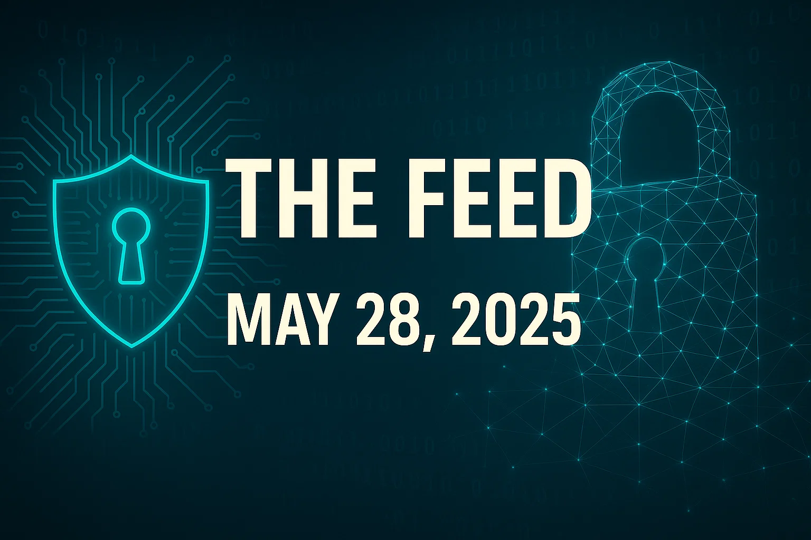
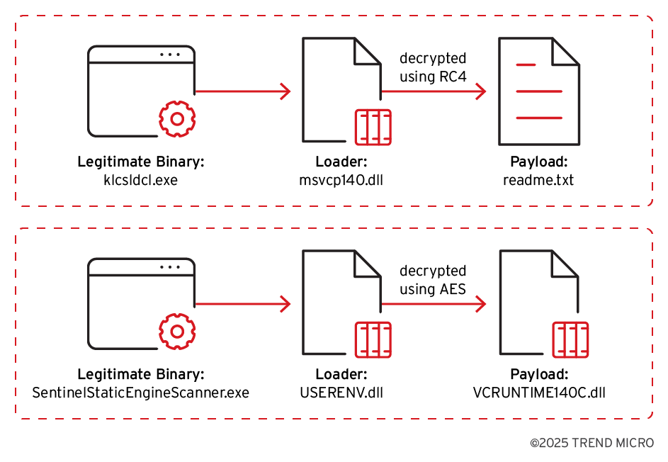
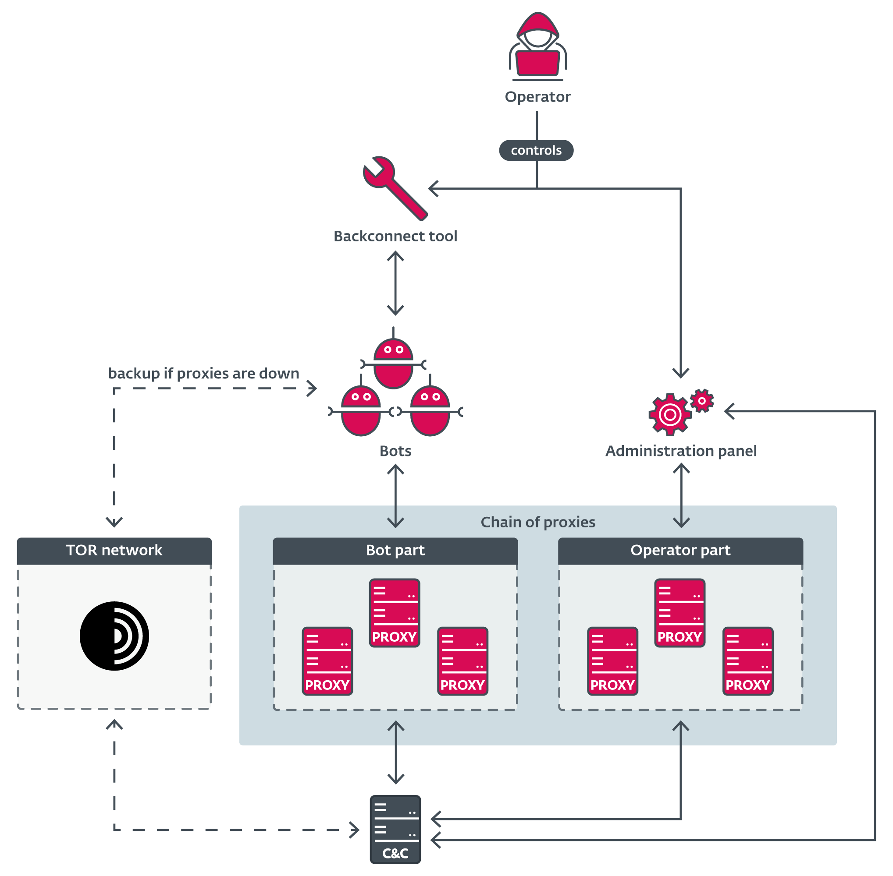
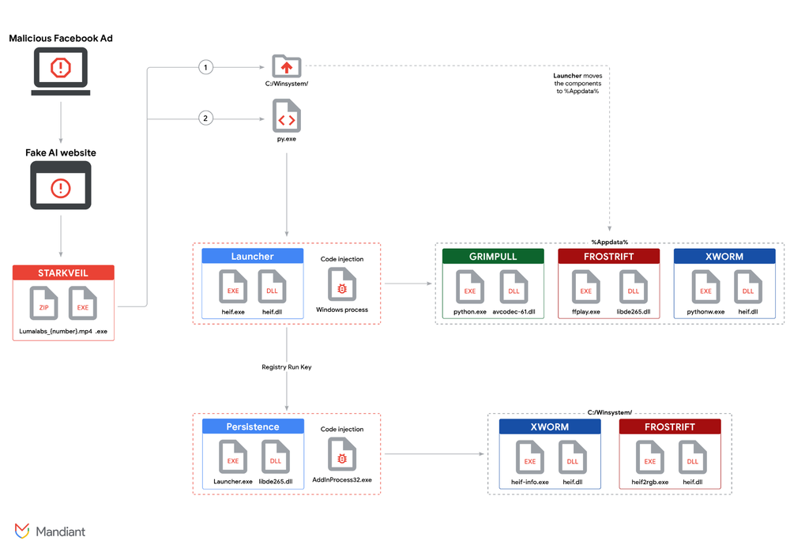

# The Feed 2025-05-28


## AI Generated Podcast

[Spotify](https://open.spotify.com/episode/2vJ9s5QpFPXYqLRvZPyCrU?si=2HC2zg5CTZqQpnXGa49sdA)

## Summarized Stories

- [**New Russia-affiliated actor Void Blizzard targets critical sectors for espionage**](#new-russia-affiliated-actor-void-blizzard-targets-critical-sectors-for-espionage): This source introduces Void Blizzard, a new Russia-affiliated threat actor conducting espionage operations mainly targeting government, defense, transportation, media, NGOs, and healthcare in Europe and North America, often using stolen credentials or phishing to gain access and rapidly exfiltrate large volumes of email and cloud-hosted files.

- [**Earth Lamia Develops Custom Arsenal to Target Multiple Industries**](#earth-lamia-develops-custom-arsenal-to-target-multiple-industries): This source details the Earth Lamia threat actor, a China-nexus intrusion set, which has been active since 2023 primarily targeting SQL injection vulnerabilities and public-facing servers in countries like Brazil, India, and Southeast Asia, utilizing customized open-source hacking tools, DLL sideloading, and payloads like Cobalt Strike.

- [**Danabot: Analyzing a fallen empire**](#danabot-analyzing-a-fallen-empire): This source provides insights into the Danabot malware-as-a-service operation, including its features, business model, toolset offered to affiliates, infrastructure changes, and disruption through Operation Endgame.

- [**Text-to-Malware: How Cybercriminals Weaponize Fake AI-Themed Websites**](#text-to-malware-how-cybercriminals-weaponize-fake-ai-themed-websites): This source investigates a UNC6032 campaign, assessed to have a Vietnam nexus, that leverages interest in AI by using fake AI video generator websites promoted via social media ads to distribute malware like the STARKVEIL dropper, which deploys information stealers and backdoors such as XWORM and FROSTRIFT using sophisticated execution and persistence techniques including DLL sideloading and registry run keys.

- [**The Sharp Taste of Mimo’lette: Analyzing Mimo’s Latest Campaign targeting Craft CMS**](#the-sharp-taste-of-mimolette-analyzing-mimos-latest-campaign-targeting-craft-cms): This source analyzes a recent campaign by the Mimo (Hezb) intrusion set that exploited a Craft CMS vulnerability (CVE-2025-32432) to deploy a loader, a crypto miner (XMRig), and residential proxyware, using a shell script downloader (`4l4md4r.sh`) and techniques to establish persistence and remove competing malware.

## Void Blizzard / LAUNDRY BEAR Threat Actor Summary

### Summary
Microsoft Threat Intelligence, in collaboration with the Netherlands General Intelligence and Security Service (AIVD), the Netherlands Defence Intelligence and Security Service (MIVD), and the US Federal Bureau of Investigation, has identified a new threat actor designated Void Blizzard, also tracked as LAUNDRY BEAR. This group is assessed with high confidence to be Russia-affiliated or state-supported and has been active since at least April 2024. The primary motivation behind their operations is espionage.

Void Blizzard / LAUNDRY BEAR focuses its targeting on organizations important to Russian government objectives, disproportionately impacting NATO member states and Ukraine, particularly in Europe and North America. Their activities align with previously observed patterns in Russia's state-sponsored cyber operations targeting the West. While their tactics, techniques, and procedures (TTPs) are often unsophisticated, the actor achieves widespread success due to the determination and probable automation of their operations. They are considered an emerging threat actor with a high espionage threat level. Their target selection shows overlap with other known Russian state actors, suggesting shared intelligence collection priorities. The Dutch services note that LAUNDRY BEAR and APT28 share some similarities in targeting and techniques like password spraying, but are distinct actors.

The Dutch services publicly disclosed information on LAUNDRY BEAR to raise awareness and enable organizations to strengthen their resilience.

### Technical Details
Void Blizzard / LAUNDRY BEAR conducts opportunistic yet targeted high-volume cyber operations. Initial access is frequently achieved through unsophisticated methods, including password spray and the use of stolen authentication credentials, which Microsoft assesses are likely procured from commodity infostealer ecosystems or criminal marketplaces. These methods can be difficult to detect, especially password spraying performed slowly over time across many accounts.

The actor has also evolved their initial access techniques. As of April 2025, Microsoft Threat Intelligence observed Void Blizzard using targeted spear phishing for credential theft. A notable example from April 2025 involved an adversary-in-the-middle (AitM) spear phishing campaign targeting over 20 NGO sector organizations in Europe and the United States. In this campaign, the threat actor utilized a typosquatted domain to spoof the Microsoft Entra authentication portal. They posed as an organizer from the "European Defense and Security Summit," sending emails with a PDF attachment containing a malicious QR code. Scanning the QR code redirected targets to Void Blizzard infrastructure hosting a credential phishing page spoofing the Microsoft Entra authentication page. Microsoft assesses that the open-source attack framework Evilginx is used to conduct this AitM phishing campaign, enabling the theft of authentication data including username, password, and server-generated cookies. The Dutch services noted that the attack on the Dutch police in September 2024 highly probably used a pass-the-cookie attack, where the cookie was likely stolen by infostealer malware operated by a third party and bought by LAUNDRY BEAR. Using a stolen cookie allows access without requiring a username and password.

Post-compromise, Void Blizzard / LAUNDRY BEAR has proven effective in gaining access to and collecting information from compromised organizations. They abuse legitimate cloud APIs, such as Exchange Online and Microsoft Graph, to enumerate users' mailboxes, including shared mailboxes, and cloud-hosted files. They likely automate the bulk collection of this cloud-hosted data (primarily email and files), including any mailboxes or file shares accessible to the compromised user. The Dutch services also note that the actor approaches victims through Microsoft Exchange Web Services (EWS) and Outlook Web Access (OWA) after successful authentication. They consider it highly probable that the actor first downloads the Global Address List (GAL), which can then be used for subsequent password spraying attacks to gain access to other accounts. They show specific interest in mail accounts with delegated access. Technical investigation by the Dutch services has confirmed LAUNDRY BEAR's capability to steal email messages at scale and, in some cases, data from SharePoint environments, where they exploit known vulnerabilities to collect login credentials for later operations.

In a smaller number of cases, Microsoft observed the actor accessing Microsoft Teams conversations via the Teams web client. They have also enumerated the compromised organization's Microsoft Entra ID configuration using the publicly available AzureHound tool to gather information about users, roles, groups, applications, and devices within the tenant.

The Dutch services report that LAUNDRY BEAR successfully flies under the radar by employing simple attack methods and utilizing tools already present on victims' computers ("living-off-the-land" or LOTL techniques), which makes detection difficult. By restricting their actions mainly to existing access within Microsoft accounts without significantly expanding into underlying networks, they appear to have avoided detection by network and system administrators for extended periods. The pace of operations suggests a level of automation, which contributes to their high success rate. They may also use proxy connections for command and control (C2) traffic and potentially exfiltrate data over non-C2, unencrypted protocols like HTTP, FTP, or DNS, sometimes obfuscating data within these protocols using encoding or compression.

### Countries
- Europe
- North America
- NATO member states
- Ukraine
- Netherlands
- European Union member states
- East- and Central-Asia

### Industries
- Government
- Defense Industrial Base / Defence contractors / Armed forces
- Transportation
- Media
- Non-governmental organizations (NGOs)
- Healthcare
- Communications/Telecommunications
- Education
- Information technology / IT and digital services
- Intergovernmental organizations
- Social and cultural organizations
- Foreign affairs ministries
- EU institutions
- Aerospace firms
- High tech businesses (involved in military production, advanced technologies)
- Political parties
- Critical sectors

### Recommendations
Based on the TTPs observed, organizations, particularly those in critical sectors like government and defense, should implement the following measures:

**Hardening Identity and Authentication:**
- Implement a sign-in risk policy to automate responses to risky sign-ins, potentially blocking access or forcing MFA based on risk levels.
- Monitor risky sign-in reports.
- Require Multi-Factor Authentication (MFA) for all accounts, leveraging phishing-resistant methods like FIDO Tokens or Microsoft Authenticator with passkey where possible. Avoid telephony-based MFA.
- Centralize identity management, integrating on-premises and cloud directories. Log identity data in a SIEM or connect to Microsoft Entra for centralized monitoring and leveraging ML models.
- Practice the principle of least privilege, assigning users and services the minimum necessary privileges.
- Audit privileged account activity.
- Implement Privileged Access Management (PAM) to monitor and reduce accounts with elevated privileges.
- Consider implementing a Zero-Trust security architecture.
- Disable old or inactive user and administrator accounts.
- Set policies for account lockout after a predetermined number of login failures.
- Implement Conditional Access policies (considering factors beyond just IP location).
- Consider using Microsoft Entra ID Protection or comparable solutions to detect malicious logins, risky sign-ins, and pass-the-cookie type attacks.

**Hardening Email Security:**
- Manage mailbox auditing to ensure actions by owners, delegates, and admins are logged. New mailboxes should have this on by default.
- Run a non-owner mailbox access report to detect unauthorized mailbox access.
- Check and limit API access and use context-sensitive access controls for email platforms.
- Encrypt sensitive emails and enforce Data Loss Prevention (DLP) policies.

**Hardening Against Post-Compromise Activity:**
- If a breach via infostealer is suspected, rotate credentials for potentially accessed accounts and remove malware.
- Conduct an audit search in the Microsoft Graph API for anomalous activity.
- Create Defender for Cloud Apps anomaly detection policies.
- Review mitigation techniques to prevent, detect, or investigate token theft.
- If password spray is suspected, refer to investigation guides.
- Implement monitoring tools to detect unusual login attempts and data traffic, including anomalies in mail item access by Graph API.
- Conduct regular audits of user accounts and privileges.
- Enforce strict monitoring of access management according to the least privilege principle.
- Enforce logging and monitoring of account activity to alert on unusual changes to user privileges or behavior.
- Monitor network traffic for potential C2 activity and exfiltration attempts. Implement advanced network monitoring capable of detecting unusual protocol-port pairings.
- Restrict network access to non-essential protocols and ports.
- Implement DLP solutions to identify and prevent unauthorized exfiltration of sensitive data.
- Ensure sensitive data in transit is appropriately encrypted.

**General / Network Hardening:**
- Do not allow or severely restrict Bring Your Own Device (BYOD). Enforce centralized device management for devices accessing IT systems.
- Only use managed systems to access sensitive environments like SharePoint and Exchange Online.
- Permit access to critical accounts only from trusted IP addresses.
- Set cookies to expire as quickly as practically possible.
- Enforce routine deletion of browser cookies and monitor intervals.
- Disable session rebinding to prevent a session cookie from being used by multiple IP addresses.
- Block IP addresses associated with multiple login attempts.
- Implement Security Information and Event Management (SIEM) solutions to monitor login attempts and account activity.
- Configure systems and applications to restrict account enumeration on public interfaces or in error messages.
- Conduct periodic security audits and misconfiguration checks.
- Implement network segmentation to isolate sensitive systems.
- Enforce strict firewall rules and Access Control Lists (ACLs).
- Use intrusion detection and intrusion prevention systems (IDS/IPS).
- Monitor traffic carried by CDNs.
- Analyze network and system logfiles for suspicious activity, like attempts to use proxy tools.
- Restrict the use of unauthorized software and tools.
- Conduct awareness and training programmes to help users recognize and report phishing, social engineering, and account abuse.

### Hunting methods
Microsoft Threat Intelligence provides several hunting queries, primarily in KQL (Kusto Query Language), for Microsoft Defender XDR and Microsoft Sentinel customers.

**Microsoft Defender XDR:**
- **Possible phishing email targets:**
    ```kql
    EmailEvents
    | where SenderFromDomain in~ ("ebsumrnit.eu")
    | project SenderFromDomain, SenderFromAddress, RecipientEmailAddress, Subject, Timestamp
    ```
    *Logic:* This query identifies emails received where the sender domain matches the observed domain used in Void Blizzard's spear phishing attempts (`ebsumrnit.eu`). It projects relevant details like sender/recipient addresses, subject, and timestamp.
- **Communication with Void Blizzard domain:**
    ```kql
    let domainList = dynamic(["micsrosoftonline.com", "outlook-office.micsrosoftonline.com"]);
    union
    (
        DnsEvents
        | where QueryType has_any(domainList) or Name has_any(domainList)
        | project TimeGenerated, Domain = QueryType, SourceTable = "DnsEvents"
    ),
    (
        IdentityQueryEvents
        | where QueryTarget has_any(domainList)
        | project Timestamp, Domain = QueryTarget, SourceTable = "IdentityQueryEvents"
    ),
    (
        DeviceNetworkEvents
        | where RemoteUrl has_any(domainList)
        | project Timestamp, Domain = RemoteUrl, SourceTable = "DeviceNetworkEvents"
    ),
    (
        DeviceNetworkInfo
        | extend DnsAddresses = parse_json(DnsAddresses), ConnectedNetworks = parse_json(ConnectedNetworks)
        | mv-expand DnsAddresses, ConnectedNetworks
        | where DnsAddresses has_any(domainList) or ConnectedNetworks.Name has_any(domainList)
        | project Timestamp, Domain = coalesce(DnsAddresses, ConnectedNetworks.Name), SourceTable = "DeviceNetworkInfo"
    ),
    (
        VMConnection
        | extend RemoteDnsQuestions = parse_json(RemoteDnsQuestions), RemoteDnsCanonicalNames = parse_json(RemoteDnsCanonicalNames)
        | mv-expand RemoteDnsQuestions, RemoteDnsCanonicalNames
        | where RemoteDnsQuestions has_any(domainList) or RemoteDnsCanonicalNames has_any(domainList)
        | project TimeGenerated, Domain = coalesce(RemoteDnsQuestions, RemoteDnsCanonicalNames), SourceTable = "VMConnection"
    ),
    (
        W3CIISLog
        | where csHost has_any(domainList) or csReferer has_any(domainList)
        | project TimeGenerated, Domain = coalesce(csHost, csReferer), SourceTable = "W3CIISLog"
    ),
    (
        EmailUrlInfo
        | where UrlDomain has_any(domainList)
        | project Timestamp, Domain = UrlDomain, SourceTable = "EmailUrlInfo"
    ),
    (
        UrlClickEvents
        | where Url has_any(domainList)
        | project Timestamp, Domain = Url, SourceTable = "UrlClickEvents"
    )
    | order by TimeGenerated desc
    ```
    *Logic:* This comprehensive query searches various data tables within Microsoft Defender XDR (DNS Events, Identity Query Events, Device Network Events, Device Network Info, VM Connection, W3C IIS Log, Email URL Info, URL Click Events) for communication attempts involving the identified Void Blizzard typosquatted domains (`micsrosoftonline.com`, `outlook-office.micsrosoftonline.com`). It helps surface devices or users that interacted with the phishing infrastructure.

**Microsoft Sentinel:**
While not specific to Void Blizzard, the following Sentinel queries can help detect relevant TTPs:
- **Campaign with suspicious keywords:**
    ```kql
    let PhishingKeywords = ()
        {pack_array("account", "alert", "bank", "billing", "card", "change", "confirmation","login", "password", "mfa", "authorize", "authenticate", "payment", "urgent", "verify", "blocked");};
        EmailEvents
        | where Timestamp > ago(1d)
        | where EmailDirection == "Inbound"
        | where DeliveryAction == "Delivered"
        | where isempty(SenderObjectId)
        | where Subject has_any (PhishingKeywords())
    ```
    *Logic:* This query identifies successfully delivered inbound emails (within the last day) that contain common phishing keywords in the subject line. It's designed to catch potentially malicious emails that bypassed initial filtering.
- **Determine successfully delivered phishing emails to Inbox/Junk folder:**
    ```kql
    EmailEvents
    | where isnotempty(ThreatTypes) and DeliveryLocation in~ ("Inbox/folder","Junk folder")
    | extend Name = tostring(split(SenderFromAddress, '@', 0)), UPNSuffix = tostring(split(SenderFromAddress, '@', 1))
    | extend Account_0_Name = Name
    | extend Account_0_UPNSuffix = UPNSuffix
    | extend IP_0_Address = SenderIPv4
    | extend MailBox_0_MailboxPrimaryAddress = RecipientEmailAddress
    ```
    *Logic:* This query looks for email events marked with `ThreatTypes` that were delivered to either the Inbox or Junk folder, indicating a potential threat bypassed security controls. It extracts recipient and sender information.
- **Successful sign-in from phishing link:**
    *Logic:* This query correlates security alerts related to phishing link clicks (from Microsoft Defender for Office 365 and potentially 3rd party network devices) with successful sign-in attempts originating from the destination IP address associated with the phishing infrastructure. It aims to identify instances where a user clicked a phishing link and then successfully authenticated from a suspicious IP.
- **Phishing link click observed in network traffic:**
    *Logic:* This query joins Microsoft Defender for Office 365 alerts about phishing link clicks with network activity logs from non-Microsoft network devices (like Palo Alto Networks, Fortinet, etc.). It aims to confirm if a user associated with a phishing alert actually accessed the malicious URL via their network device.
- **Suspicious URL clicked:**
    *Logic:* This query correlates Microsoft Defender for Office 365 alerts with Microsoft Entra ID identity data and Microsoft Defender for Endpoint `BrowserLaunchedToOpenUrl` events. It helps identify endpoint activity (browser launches) linked to clicks on malicious URLs recognized as part of spear phishing campaigns.
- **Anomalies in MailItemAccess by GraphAPI:**
    ```kql
    let starttime = 30d;
    let STDThreshold = 2.5;
    let allMailAccsessByGraphAPI = CloudAppEvents
    | where   ActionType == "MailItemsAccessed"
    | where Timestamp between (startofday(ago(starttime))..now())
    | where isnotempty(RawEventData['ClientAppId'] ) and RawEventData['AppId'] has "00000003-0000-0000-c000-000000000000"
    | extend ClientAppId = tostring(RawEventData['ClientAppId'])
    | extend OperationCount = toint(RawEventData['OperationCount'])
    | project Timestamp,OperationCount , ClientAppId;
    let calculateNumberOfMailPerDay = allMailAccsessByGraphAPI
    | summarize NumberOfMailPerDay =sum(toint(OperationCount)) by ClientAppId,format_datetime(Timestamp, 'y-M-d');
    let calculteAvgAndStdev=calculateNumberOfMailPerDay
    | summarize avg=avg(NumberOfMailPerDay),stev=stdev(NumberOfMailPerDay) by ClientAppId;
    calculteAvgAndStdev
    | join calculateNumberOfMailPerDay on ClientAppId
    | sort by ClientAppId
    |  where NumberOfMailPerDay > avg + STDThreshold * stev
    | project ClientAppId,Timestamp,NumberOfMailPerDay,avg,stev
    ```
    *Logic:* This query detects anomalous levels of email item access via the Microsoft Graph API (specifically looking for the Graph API AppId `00000003-0000-0000-c000-000000000000`). It calculates the average and standard deviation of `MailItemsAccessed` events per day for each client application ID and flags days where the count exceeds a threshold based on the average and standard deviation, indicating potentially unusual bulk access activity.

Detection rules can be created from high-value hunting queries in both Defender XDR and Sentinel. Beyond these specific queries, detecting TTPs like password spraying, token theft, account manipulation (e.g., delegate permissions), use of proxies, data exfiltration, and living-off-the-land techniques often relies on monitoring authentication logs, network traffic logs, system event logs, and cloud service logs for suspicious patterns and indicators using SIEMs, IDS/IPS, and potentially WAF rules depending on the vector.

**Original link:**
[https://www.microsoft.com/en-us/security/blog/2025/05/27/new-russia-affiliated-actor-void-blizzard-targets-critical-sectors-for-espionage/](https://www.microsoft.com/en-us/security/blog/2025/05/27/new-russia-affiliated-actor-void-blizzard-targets-critical-sectors-for-espionage/)
[https://www.aivd.nl/binaries/aivd_nl/documenten/publicaties/2025/05/27/aivd-en-mivd-onderkennen-nieuwe-russische-cyberactor/Advisory+AIVD+en+MIVD+Public+report+on+new+cyber+actor.pdf](https://www.aivd.nl/binaries/aivd_nl/documenten/publicaties/2025/05/27/aivd-en-mivd-onderkennen-nieuwe-russische-cyberactor/Advisory+AIVD+en+MIVD+Public+report+on+new+cyber+actor.pdf)


## Earth Lamia Develops Custom Arsenal to Target Multiple Industries
### Summary
Earth Lamia is an active APT (Advanced Persistent Threat) actor that has been targeting organizations in Brazil, India, and Southeast Asian countries since at least 2023. Initially focusing on exploiting vulnerabilities in web applications to gain access, they have consistently developed and customized their hacking tools and backdoors, such as PULSEPACK and BypassBoss, to evade detection and improve operations. Their targeting has shifted over time, moving from financial services in early 2024 and prior, to logistics and online retail in the second half of 2024, and most recently focusing on IT companies, universities, and government organizations. Research indicates that Earth Lamia is a China-nexus intrusion set. They have been linked to activities previously tracked under different identifiers such as REF0657, STAC6451, and CL-STA-0048, although some activities under these identifiers might include other intrusion sets. The actor is described as highly active and continuously refines their attack tactics with aggressive intentions.

### Technical Details


Earth Lamia primarily gains initial access by exploiting vulnerabilities in public-facing web applications and servers. A frequently used technique involves conducting vulnerability scans to identify SQL injection vulnerabilities on target websites. Upon identifying a vulnerability, the actor attempts to open a system shell to gain remote access to victims' SQL servers. It is suspected they may utilize tools like "sqlmap" for these attacks. Additionally, they exploit various known vulnerabilities on public-facing servers, including CVE-2025-31324 (SAP NetWeaver Visual Composer unauthenticated file upload vulnerability).

Following successful initial access, Earth Lamia engages in various post-exploitation and lateral movement activities. These activities include using legitimate Windows binaries like "certutil.exe" or “powershell.exe” to download additional tools from their machines. They also deploy webshells to website applications for persistent access. For privilege escalation, tools such as "GodPotato" and "JuicyPotato" are used. Network scanning within the victim's environment is performed using tools like "Fscan" and "Kscan". To maintain persistence and facilitate access, they have been observed creating a user account named "helpdesk" and adding it to the local administrators group. Credentials are obtained by dumping LSASS memory or extracting SAM and SYSTEM hives from the Windows Registry. They also clean Windows Application, System, and Security event logs using “wevtutil.exe” to cover their tracks. Domain controller information is collected with “nltest.exe” and “net.exe”. To establish proxy tunnels within the network, they use tools like "rakshasa" and "Stowaway". Backdoors generated from command-and-control (C&C) frameworks like "Vshell", "Cobalt Strike", and "Brute Ratel" are executed. Persistence for backdoor execution is also achieved using “schtasks.exe”. In SQL server compromises via SQL injection, they execute commands to create a new account, such as "sysadmin123," with administrator permissions, enabling direct access and exfiltration of victim databases.

Earth Lamia actively develops and customizes open-source hacking tools to reduce detection risk. They modify tools by removing unnecessary static strings and obfuscating essential ones. An example is "BypassBoss," a modified version of "Sharp4PrinterNotifyPotato," used for privilege escalation.

A significant technique observed is packaging hacking tools into DLL files for execution via DLL sideloading. They have used legitimate executables like “AppLaunch.exe” (Microsoft .NET ClickOnce Launch Utility) with suspicious arguments similar to those used by Mimikatz to load malicious DLLs. For instance, they packaged "JuicyPotato" into a DLL named "mscoree.dll" using "VOIDMAW," an open-source tool designed to package malicious code to bypass memory scanners. This allows tools to execute in memory within a legitimate process. Backdoor loaders also utilize DLL sideloading, often employing legitimate binaries from security vendors.

Backdoor loaders have been observed decrypting shellcode using RC4 or AES. An example loader used RC4 decryption for Cobalt Strike shellcode, where the first 128 bytes of a payload file ("readme.txt") served as the key, duplicated to 256 bytes, to decrypt the rest of the file. Another loader for Brute Ratel shellcode used AES, with an embedded 256-byte key whose SHA256 hash was used as the decryption key for the encrypted shellcode in a payload file ("VCRUNTIME140C.dll").

Earth Lamia developed a new .NET backdoor called PULSEPACK, first observed in August 2024. The initial version was modular, with a primary executable handling C&C communication and plugins loaded from the server. It embedded C&C IP/port, a URL for updates, and AES key/IV for communication encryption. It connected via TCP socket, decoded an embedded core DLL, and executed it in memory. The core DLL collected victim information (system version, username, process info, AV software, hardware hash) and executed plugins delivered from the C&C server. Plugins were Base64-encoded ZIP files. Execution results were AES encrypted before sending to the C&C.

A newer version of PULSEPACK, found since March 2025, uses WebSocket for C&C communication instead of TCP. This version is smaller as the core functionality is now a plugin ("InitStart.dll") loaded from the C&C server. Initialization involves exchanging messages containing a random UUID as a victim ID. The "InitStart.dll" plugin collects victim information similar to the old core DLL. While specific plugins are scarce, one ("TKRun.dll") creates a scheduled task for persistence after reboot. Observations suggest other plugins might exist for file dropping or remote shell access, as the backdoor process can drop files and execute commands via "cmd.exe".

Attribution efforts link Earth Lamia to REF0657, which targeted financial services in South Asia in January 2024. Similar tactics, tools ("GodPotato"), and Cobalt Strike loaders ("USERENV.dll") are observed. They are also linked to parts of the STAC6451 Mimic ransomware campaign through shared tactics (like the "helpdesk" account and "GodPotato" use) and tools, though other aspects differ, suggesting potential collaboration or coincidental targeting. Connections are also drawn to CL-STA-0048 and the suspected Chinese actor "DragonRank," with shared activities like downloading files from specific IPs and DLL sideloading with "AppLaunch.exe". An IP address (103[.]30[.]76[.]206) previously attributed to UNC5174 as a VShell C&C is now attributed to Earth Lamia with high confidence, based on VShell sample analysis showing the same packaging approach (VOIDMAW) and PDB strings as other Earth Lamia samples. The prior UNC5174 link might stem from using a default VShell stager (SNOWLIGHT).

### Countries
Brazil
India
Southeast Asian countries (specifically mentioned: Vietnam, Philippines, Malaysia, Indonesia, Thailand)

### Industries
Financial industry (specifically securities and brokerage) (early 2024 and prior)
Logistics (second half of 2024)
Online retail (second half of 2024)
IT companies (recently)
Universities (recently)
Government organizations (recently)

### Recommendations
Organizations should regularly update and patch their systems to prevent initial access via vulnerabilities. Monitoring for unusual activities is essential for detection. Adopting proactive security solutions that integrate prevention, detection, and response capabilities is recommended to strengthen defenses.

### Hunting methods
The source mentions the following hunting queries for Trend Vision One customers:

**Trend Vision One Search App:**
Customers can use the Search App to match or hunt the malicious indicators mentioned in the blog post with data in their environment.

**Hunting Queries (specifically for C&C servers):**
`eventSubId: 204 AND (dst: 154.211.89.5 OR dst: 185.238.251.38 OR dst: 206.237.2.40 OR dst: 206.237.5.19 OR dst: 206.238.179.172 OR dst: 206.238.199.21)`

*   **Logic:** This query targets specific destination IP addresses that have been identified as Earth Lamia's C&C servers. It looks for events with `eventSubId: 204` (presumably a specific event type relevant to network connections or suspicious activity within the Trend Vision One platform) and checks if the destination IP (`dst`) matches any of the listed addresses associated with Earth Lamia's C&C infrastructure. Detection on these IP addresses could indicate potential communication with Earth Lamia C&C servers.

More hunting queries are available for Trend Vision One customers with Threat Insights Entitlement enabled.

The source also provides a list of MITRE ATT&CK techniques observed in Earth Lamia's operations. Threat hunters can use this list to build detections and hunting queries based on specific behaviors aligned with these techniques. For example, searching for:
*   Processes downloading files using `certutil.exe` or `powershell.exe` (T1105)
*   Creation of user accounts named "helpdesk" or other suspicious administrator accounts (T1136.001, T1098.007)
*   Execution of credential dumping tools or commands targeting LSASS or SAM hive (T1003.001, T1003.002)
*   Execution of legitimate binaries like `AppLaunch.exe` loading suspicious DLLs or with unusual arguments (T1574.001, T1036.005)
*   Attempts to clear event logs using `wevtutil.exe` (T1070.001)
*   Execution of network scanning tools like `Fscan` or `Kscan` (T1590)
*   Creation of scheduled tasks for persistence (T1053.005)

### IOC
**Hashes**
```
1d0b246f8d43442ea0eaecde5cfa7fcd8139a9ba93496cd82a8ac056f7393bcf
bb6ab67ddbb74e7afb82bb063744a91f3fecf5fd0f453a179c0776727f6870c7
```

**Domains**
```
chrome-online[.]site
sentinelones[.]com
```

**IP Addresses**
```
43[.]247[.]135[.]53
103[.]30[.]76[.]206
154.211.89.5
185.238.251.38
206.237.2.40
206.237.5.19
206.238.179.172
206.238.199.21
206[.]237[.]0[.]49
149[.]104[.]23[.]176
```

**Original link:** [https://www.trendmicro.com/en_us/research/25/e/earth-lamia.html](https://www.trendmicro.com/en_us/research/25/e/earth-lamia.html)

## Danabot: Analyzing a fallen empire

### Summary
Danabot is described as a notorious infostealer and banking trojan that evolved into a malware-as-a-service (MaaS) operation. ESET Research had been tracking Danabot's activities since 2018, participating in a global effort led by law enforcement agencies from the US, Germany, the Netherlands, and Australia, alongside numerous cybersecurity companies. This collaborative endeavor, which included providing technical analyses and identifying C&C servers, resulted in a major disruption of Danabot's infrastructure under Operation Endgame. Operation Endgame is an ongoing global initiative coordinated by Europol and Eurojust, focused on identifying, dismantling, and prosecuting cybercriminal networks. The disruption effort also led to the identification of individuals involved in Danabot's development, sales, and administration. While primarily an infostealer, Danabot was also utilized to distribute other malware, including ransomware, and even employed in activities like launching DDoS attacks. The authors promoted their toolset through underground forums, offering various rental options to affiliates who then used the malware for their own malicious purposes and managed their own botnets. The success of this joint takedown represents a significant blow to the operation, though it remains to be seen if Danabot can recover.

### Technical Details

Danabot is a malware family coded in the Delphi programming language. Initially gaining prominence in 2018 through a spam campaign targeting Australia, it later expanded to other markets globally. Throughout ESET's monitoring since 2018, they analyzed numerous samples and identified over 1,000 unique C&C servers.

The Danabot authors operate a MaaS model, renting their tools to affiliates who then establish and manage their own botnets. The authors promote their toolset on underground forums through users like JimmBee (developer/administrator) and Onix (coadministrator/sales). They also maintain a support page on the Tor network detailing the tool's capabilities. The typical toolset for affiliates includes an administration panel application, a backconnect tool, and a proxy server application. Affiliates are responsible for generating new Danabot builds and distributing them through their own campaigns.

Key features offered by Danabot include stealing data from browsers, mail clients, FTP clients, and other software, keylogging, screen recording, real-time remote control, a FileGrabber command (often used for cryptocurrency wallets), support for Zeus-like webinjects and form grabbing, and the ability to upload and execute arbitrary payloads. Specific capabilities listed on their support site include proxy via TOR, Stealer (Chrome, Firefox, Opera, Edge, IE), Mail programs, Clipboard interception, Keylogger, File grabber (wallet grabber), Post grabber (browsers), Video recording, processes, sites, HVNC (a hidden remote desktop tool), Screen/cmd/file management, HTML injections (with extended Zeus format), Redirects, Blocking requests, Jabber notifications for events, automatic activation of HVNC, Impression export (browser info, cookies, passwords, OS), fast/convenient data processing, and multi-format data export.

Beyond its core stealer capabilities, Danabot has been used to distribute a variety of additional payloads, including other malware families like SystemBC, Rescoms, Ursnif, Smokeloader, Zloader, Lumma Stealer, RecordBreaker, and Latrodectus, as well as the NetSupportManager remote administration tool. It has also been observed being used to download ransomware, such as LockBit, Buran, Crisis, and a NonRansomware variant. In late 2023, Danabot was reportedly used to hand off control of a botnet to a ransomware operator. Danabot has also been used for less conventional activities, such as launching DDoS attacks, including against Ukraine's Ministry of Defense and a Russian site.

Distribution methods used by affiliates are diverse. They include numerous email spam campaigns, distribution by other malware like Smokeloader, DarkGate, and Matanbuchus. A prominent recent method is the misuse of Google Ads to direct victims to malicious websites masquerading as legitimate software sites (e.g., fake Advanced IP Scanner downloads) or sites promising help finding unclaimed funds (e.g., gfind.org). Another social engineering technique involves deceptive websites luring users into executing malicious commands stored in their clipboard, such as fake microphone test sites. Danabot developers have even partnered with authors of malware cryptors and loaders, offering special pricing for distribution bundles.

The infrastructure initially relied on a single centralized server, but newer versions shifted towards offering private server installations for affiliates alongside the shared infrastructure. The rental of accounts on the shared infrastructure controlled by the authors appears to be the most popular choice.

The C&C server application is a standalone DLL file installed on a Windows server, using a MySQL database. It acts as the central point for bot communication and affiliate management. Affiliates with the personal server option host this themselves, while others connect to servers set up by the Danabot authors.

The administration panel is a GUI application connecting to the C&C server, serving as the primary tool for botnet operators. It allows managing bots and retrieving statistics, issuing commands and configurations, viewing and exporting collected data, managing notifications (e.g., Jabber alerts), generating new Danabot builds, and setting up proxy server chains. Build generation options customizable via the panel include C&C server lists, obfuscation methods, and bitness (x32/x64). Four basic payload types are available: Main.dll (main component), Main.exe (loader), Drop.exe (dropper), and Drop.msi (MSI package). The panel also allows configuring dynamic commands with specific options (e.g., FileGrabber settings). Available commands cover a wide range of actions such as Video recording, Keylogging, PostFilter, WebInject, Redirect, Block, Screenshots, Alerts, Uninstall, UAC bypass, FileGrabber, Tor activation, Stealer config, TimeOut, Installation/Persistence, Windows Defender/Firewall Exclusion, ConfigSave, HideProcess, and CoreProtect (process injection). The panel also includes an "Uploader" function to configure the download and execution of additional payloads.

The backconnect tool is a separate utility allowing real-time remote control of online bots. Its features include viewing/controlling the victim's desktop (User Desktop, Hidden Desktop), file system reconnaissance (Files Manager), process exploration, command execution, forwarding, starting a Socks server, viewing stealer information, restarting bots, and disconnecting.

The proxy server application, available for Windows and Linux, relays traffic between bots and the C&C server, hiding the real backend location. Affiliates also use this proxy between their administration panel and the C&C for anonymity. Bots can also use the Tor network as a fallback if proxy chains fail.

Communication between bots and the C&C server uses a proprietary TCP protocol. Data is encrypted using AES-256, with unique session keys further encrypted using RSA. The packet structure has evolved over time. In recent versions (introduced in 2022, fixed in Feb 2025), a bug caused random junk bytes added to packets to unintentionally include surrounding memory regions, providing researchers with valuable infrastructure and user insights. Typical infrastructure involves bots communicating through a chain of proxies to the C&C server, with the operator controlling via an administration panel and potentially a backconnect tool, also potentially routed through proxies.

Danabot employs various techniques mapped to the MITRE ATT&CK framework, including acquiring infrastructure (VPS, Server, Malvertising), using initial access methods (Phishing, User Execution via malicious links/files), execution via native API calls and user execution, privilege escalation by bypassing UAC, defense evasion through obfuscation (dynamic API resolution, junk data), process injection (DLL injection), use of system binaries as proxies (Msiexec, Regsvr32, Rundll32), and impersonation. It performs credential access by stealing data from web browsers and session cookies. Discovery techniques include application window, browser information, file/directory, and process discovery. Lateral movement capabilities include Remote Desktop Protocol and VNC. Collection methods involve keylogging, archiving collected data (ZIP, zlib, custom AES/RSA encryption), automated collection, browser session hijacking via webinjects, clipboard data collection, data from the local file system, screen capture, and video capture. For Command and Control, Danabot uses data encoding (ZIP/zlib), data obfuscation (junk data), encrypted channels (AES/RSA), fallback channels (Tor), a custom non-application layer TCP protocol on non-standard ports, proxy chains (multi-hop), and remote access software. Exfiltration is typically automated, can have transfer size limits, and occurs over the C2 channel. Finally, Danabot has an impact capability via a DDoS module.

### Countries
Worldwide. Historically, Poland has been one of the most targeted countries. Danabot originated with a campaign targeting Australian users. Detections have been seen across North and South America, Europe, and parts of Asia and Oceania. Some DDoS activity targeted sites in Ukraine and Russia.

### Industries
The sources do not explicitly name specific targeted industries. Danabot's capabilities as an infostealer, banking trojan, and tool for delivering ransomware or conducting DDoS attacks suggest a broad range of potential targets, likely opportunistic based on compromised systems acquired by affiliates. The targeting of cryptocurrency wallets via FileGrabber and specific DDoS targets like a Ministry of Defense indicates diverse motivations among affiliates.

### Recommendations
Based on the provided sources, there are no specific technical recommendations for defending against Danabot outlined in the text. The focus of the article is on the analysis of the malware's workings and the success of the disruption effort.

### Hunting methods
The sources do not explicitly provide specific hunting rules or queries in formats like Yara, Sigma, KQL, or SPL, nor do they provide IDS/IPS or WAF rules. However, the provided Indicators of Compromise (IoCs) and the detailed technical analysis, including the mapping to MITRE ATT&CK techniques, can be used to inform and build hunting methodologies. For instance, hunting could involve searching for:
*   Files matching the listed SHA-1 hashes.
*   Network connections to the listed IP addresses or domains, especially on non-standard ports or via suspicious proxy chains.
*   System and network activity corresponding to the documented TTPs, such as:
    *   Execution of DLLs or MSIs via `rundll32.exe`, `regsvr32.exe`, or `msiexec.exe`.
    *   Attempts to bypass User Account Control (UAC).
    *   Process injection attempts.
    *   Activity associated with data theft from browsers, mail clients, or FTP clients.
    *   Keylogging or screen/video capture activity.
    *   File system enumeration or searches for specific file types (e.g., wallet files).
    *   Attempts to establish remote desktop or VNC connections.
    *   Compression (ZIP, zlib) or encryption (AES, RSA) of collected data before exfiltration.
    *   Outbound connections potentially using a custom TCP protocol or Tor as a fallback.
    *   Modification of firewall rules or Windows Defender exclusions.
    *   Attempts to hide processes.

The MITRE ATT&CK table provides a comprehensive list of behaviors to look for when hunting for Danabot activity on endpoints and networks.

### IOC
**Hashes**
```
6D361CD9ADBF1630AF7B323584168E0CBD9315FB
A7475753CB865AEC8DC4A6CEA27F2AA594EE25E8
787EAB54714F76099EC350E029154ADFD5EDF079
17B78AD12B1AE1C037C5D39DBE7AA0E7DE4EC809
```
**Domains**
```
advanced-ip-scanned.com
gfind.org
mic-tests.com
```
**IPs**
```
212.18.104.245
212.18.104.246
34.16.215.110
34.65.116.208
34.168.100.35
```

**Original link:** [https://www.welivesecurity.com/en/eset-research/danabot-analyzing-fallen-empire/](https://www.welivesecurity.com/en/eset-research/danabot-analyzing-fallen-empire/)

## Text-to-Malware: How Cybercriminals Weaponize Fake AI-Themed Websites
### Summary
Since at least mid-2024, and actively investigated by Mandiant Threat Defense since November 2024, the threat actor UNC6032 has been conducting a campaign that exploits public interest in AI video generation tools. The campaign involves creating fake websites that impersonate legitimate AI services like Luma AI, Canva Dream Lab, and Kling AI. These fraudulent websites are promoted through malicious advertisements on social media platforms such as Facebook and LinkedIn. Millions of users have been reached by these ads. When a user interacts with the fake AI generation function on these sites, they are prompted to download a malicious ZIP archive containing malware. The dropped malware includes multiple components, primarily focusing on information theft and establishing persistence through backdoors. UNC6032 compromises can lead to the exfiltration of sensitive data such as login credentials, cookies, credit card information, and Facebook data. The actor is assessed by Google Threat Intelligence Group (GTIG) to have a Vietnam nexus. This campaign highlights how cybercriminals quickly adapt to capitalize on emerging technologies and trends to lure victims across various geographies and industries.

### Technical Details


The UNC6032 campaign initiates when users are lured by malicious social media ads, primarily on Facebook and LinkedIn, promoting fake "AI video generator" websites. These ads impersonate legitimate tools like Luma AI, Canva Dream Lab, and Kling AI. The fake websites often mimic the look and feel of legitimate AI services, offering functionalities such as text-to-video or image-to-video generation. When a user provides input and clicks a button to generate a video, the website displays a loading bar to create a sense of legitimacy before presenting a download button.

Regardless of the user's input, clicking the download button serves a pre-hosted ZIP archive file from the attacker-controlled server. Mandiant observed that the server hosts multiple archives and serves the one with the most recent "Last Modified" timestamp, indicating the actor continuously updates payloads.

The downloaded ZIP archive, such as `Lumalabs_1926326251082123689-626.zip`, contains an executable file. This executable utilizes a deception technique by including a double extension and thirteen or more Braille Pattern Blank Unicode characters (U+2800) between the `.mp4` and `.exe` extensions. This causes the `.exe` extension to be pushed out of the user's view in file explorers, making the file appear as an ordinary MP4 video file (e.g., `Lumalabs_1926326251082123689-626.mp4⠀⠀⠀⠀⠀⠀⠀⠀⠀⠀⠀⠀⠀.exe`). The malicious executable also uses the default Windows `.mp4` icon to enhance the masquerade. This executable is tracked as STARKVEIL and is written in Rust.

STARKVEIL requires two executions for a successful compromise. The first execution drops an embedded archive containing benign executables and malicious components into the `C:\winsystem\` directory. It also displays a fake error window to trick the user into running it again.

On the second execution, STARKVEIL spawns the Python interpreter `C:\winsystem\py\py.exe` and passes an obfuscated Python command as an argument. This command decodes, decompresses (using zlib), and deserializes (using the marshal module) an embedded Base85-encoded string, executing it as Python code. This initial Python code, tracked as COILHATCH, decrypts a second-stage Python bytecode using a hybrid decryption routine involving RSA, AES, RC4, and XOR. The decrypted second-stage Python script executes the legitimate executable `C:\winsystem\heif\heif.exe`.

The execution of `C:\winsystem\heif\heif.exe` is part of a widespread DLL sideloading technique used throughout the infection chain. `heif.exe` side-loads the malicious DLL `heif.dll` located in the same directory. This malicious `heif.dll` is an in-memory dropper that spawns a legitimate Windows process and injects a .NET executable via process replacement (likely PE hollowing). This injected .NET executable acts as the **Launcher**.

The Launcher performs several key actions:
1.  It moves multiple folders containing malware components and benign executables from `C:\winsystem\` to `%APPDATA%` directories (`python`, `pythonw`, `ffplay`, `Launcher`).
2.  It launches three legitimate processes (`python.exe`, `pythonw.exe`, `ffplay.exe`) from the newly created `%APPDATA%` directories. Each of these legitimate executables is used to side-load a specific malicious DLL located in the same `%APPDATA%` folder:
    *   `%APPDATA%\python\python.exe` side-loads `%APPDATA%\python\avcodec-61.dll`, injecting the **GRIMPULL** downloader.
    *   `%APPDATA%\pythonw\pythonw.exe` side-loads `%APPDATA%\pythonw\heif.dll`, injecting the **XWORM** backdoor.
    *   `%APPDATA%\ffplay\ffplay.exe` side-loads `%APPDATA%\ffplay\libde265.dll`, injecting the **FROSTRIFT** backdoor.
3.  It establishes persistence by adding an AutoRun registry key under `HKCU\SOFTWARE\Microsoft\Windows\CurrentVersion\Run\` with the name "Dropbox". The value data is `"cmd.exe /c \"cd /d "<exePath>" && "Launcher.exe""`, where `<exePath>` is the path to `%APPDATA%\Launcher\`.

The persistence mechanism via the "Dropbox" registry key executes `%APPDATA%\Launcher\Launcher.exe`. This executable side-loads `%APPDATA%\Launcher\libde265.dll`. This DLL then spawns and injects code into `AddInProcess32.exe` via PE hollowing. The injected code executes two legitimate binaries, `C:\winsystem\heif2rgb\heif2rgb.exe` and `C:\winsystem\heif-info\heif-info.exe`. These binaries are also used for DLL sideloading: `heif2rgb.exe` side-loads `C:\winsystem\heif2rgb\heif.dll` to inject FROSTRIFT for persistence, and `heif-info.exe` side-loads `C:\winsystem\heif-info\heif.dll` to inject XWORM for persistence.

**GRIMPULL** is a .NET downloader injected via `python.exe` side-loading `avcodec-61.dll`. It contains anti-VM and anti-analysis capabilities, checking for a mutex (`aff391c406ebc4c3`), sandbox/analysis tool DLLs (`SbieDll.dll`, `cuckoomon.dll`, `vmGuestLib.dll`), querying WMI for BIOS and system information indicating virtualization (`VMware`, `VIRTUAL`, `A M I`, `Xen`, `Microsoft`), checking the parent process name, checking for specific screen resolutions, and looking for common analysis usernames (`john`, `anna`, `xxxxxxxx`). GRIMPULL downloads and executes Tor if not already present, then uses a Tor tunnel on port 9050 to connect to its C2 server at `strokes[.]zapto[.]org:7789` via TCP. It downloads .NET payloads which are decrypted using TripleDES in ECB mode (with the MD5 hash of the campaign ID `aff391c406ebc4c3` as the key), decompressed, reversed, and loaded into memory. Its configuration, including the C2 domain/server, port, and unique identifier, is Base64 encoded.

**XWORM** is a .NET backdoor injected via `pythonw.exe` side-loading `%APPDATA%\pythonw\heif.dll` or `heif-info.exe` side-loading `C:\winsystem\heif-info\heif.dll` for persistence. Its configuration is decoded using AES. XWORM performs host reconnaissance, collecting the Bot ID, username, OS name, USB status, CPU, GPU, RAM size, and list of installed AV products. It sends a victim notification via the Telegram API using a hardcoded token and chat ID, including the collected system information. XWORM logs keystrokes to `%temp%\Log.tmp`. It communicates with its C2 server at `artisanaqua[.]ddnsking[.]com:25699` via TCP. XWORM supports a wide range of commands from the C2, including echoing, restarting/stopping/uninstalling the bot, updating, executing files (on disk or in memory), downloading and executing from a URL, network requests via browser, PC control (shutdown, restart, logoff), shell command execution, hosts file manipulation, DDOS capabilities (unimplemented in sample), ngrok integration (unimplemented), plugin loading, saving plugins to the registry (`HKCU\Software\<victim_id>\<plugin_name>`), removing registry plugins, reading keylogs, and screen capture.

**FROSTRIFT** is a .NET backdoor injected via `ffplay.exe` side-loading `%APPDATA%\ffplay\libde265.dll` or `heif2rgb.exe` side-loading `C:\winsystem\heif2rgb\heif.dll` for persistence. Its configuration is a Base64-encoded and GZIP-compressed protobuf message embedded in its strings table. FROSTRIFT collects extensive system information, including installed AV, webcam presence, hostname, username/role, OS name, local time, and generates a victim ID based on the sample process ID, disk serial, physical memory serial, and username. It specifically checks for the presence of certain software applications like Foxmail and Telegram, a list of browsers, standalone crypto wallets (Atomic, Bitcoin-Qt, Dash-Qt, Electrum, Ethereum, Exodus, Litecoin-Qt, Zcash, Ledger Live), and checks for 48 specific browser extensions related to password managers, authenticators, and digital wallets. FROSTRIFT can achieve persistence by copying itself to `%APPDATA%` and adding a Run registry key (`HKCU\SOFTWARE\Microsoft\Windows\CurrentVersion\Run`). It communicates with its C2 server at `strokes.zapto[.]org:56001` via TCP/SSL, using GZIP-compressed protobuf messages. Instead of receiving commands, it receives .NET modules from the C2 which are stored (reversed) in the registry under `HKCU\Software\<victim_id>` and loaded in-memory. The malware sends empty GZIP-compressed Protobuf messages as a keep-alive mechanism. Although not enabled in the analyzed sample, FROSTRIFT has hardcoded URLs to download WebDrivers (`WebDriver2.exe`, `chromedriver2.exe`, `msedgedriver2.exe`) from a GitHub repository, which could potentially be used to deploy additional payloads.

Overall, UNC6032 employs sophisticated techniques including social engineering via fake ads/websites, file masquerading using Unicode characters and icons, multi-stage execution, multiple layers of droppers (Rust, Python, .NET), extensive use of DLL sideloading with legitimate binaries, in-memory execution, PE hollowing, anti-analysis checks, multiple backdoors with distinct capabilities (downloading, information theft, keylogging, command execution), separate C2 channels/protocols (Tor TCP, TCP, TCP/SSL, Telegram API), varied data exfiltration methods, and multiple persistence mechanisms. The threat actor continuously rotates domains and ad creatives to evade detection.

### Countries
Victims have been impacted across different geographies. Malicious ads used in the campaign have targeted users in:
European Union countries
United States
Australia
(The source does not specify where *victims* are located, only where ads were shown or reach was measured).

### Industries
Victims have been impacted across different industries.
The lures are themed around "AI video generation" tools. The specific industries of the compromised victims are not explicitly listed in the provided text.

### Recommendations
Users should exercise caution when engaging with AI tools.
Users should verify the legitimacy of the website's domain before downloading or interacting with it.

### Hunting methods
The provided source includes several YARA rules and mentions YARA-L rules available in Google SecOps.

**YARA Rules:**

Can be found in the original [source]((https://cloud.google.com/blog/topics/threat-intelligence/cybercriminals-weaponize-fake-ai-websites/))

**YARA-L Rules (Google SecOps Mandiant Intel Emerging Threats curated detections):**
These rules detect specific behaviors observed in the campaign:
*   `Suspicious Binary File Execution - MP4 Masquerade`: Likely detects executables attempting to masquerade as MP4 files, potentially checking file name patterns, icon, and actual file type mismatch.
*   `Suspicious Binary File Execution - Double Extension and Braille Pattern Blank Masquerade`: Specifically targets the use of double extensions and Braille characters in filenames to hide the `.exe` extension.
*   `Python Script Deobfuscation - Base85 ZLib Marshal`: Detects the specific sequence of Python operations (Base85 decode, zlib decompress, marshal loads, exec) used by the COILHATCH dropper.
*   `Suspicious Staging Directory WinSystem`: Detects the creation or use of the specific staging directory `C:\winsystem\` used by STARKVEIL to drop components.
*   `DLL Search Order Hijacking AVCodec61`: Detects the specific DLL side-loading behavior involving `python.exe` and `avcodec-61.dll` used for GRIMPULL.
*   `DLL Search Order Hijacking HEIF`: Detects DLL side-loading involving `heif.exe`, `pythonw.exe`, `heif-info.exe`, and `heif2rgb.exe` with the malicious `heif.dll` used for the Launcher and XWORM persistence.
*   `DLL Search Order Hijacking Libde265`: Detects DLL side-loading involving `Launcher.exe`, `ffplay.exe`, and the malicious `libde265.dll` used for Launcher persistence and FROSTRIFT.

Hunting efforts can also focus on the specific TTPs mentioned in the technical details, such as monitoring for processes writing files to `C:\winsystem\`, the execution of `py.exe` with suspicious encoded arguments, the execution of benign binaries (`heif.exe`, `python.exe`, `pythonw.exe`, `ffplay.exe`, `Launcher.exe`, `AddInProcess32.exe`, `heif-info.exe`, `heif2rgb.exe`) paired with DLLs in unusual paths (`%APPDATA%`, `C:\winsystem`), creation of the "Dropbox" Run key, network connections to the listed C2 domains/ports or Telegram API, file creation in `%temp%` named `Log.tmp`, and attempts by processes to access or collect browser/wallet information.

### IOC
**Hashes**
```
8863065544df546920ce6189dd3f99ab3f5d644d3d9c440667c1476174ba862b
d3f50dc61d8c2be665a2d3933e2668448edc31546fea84517f8e61237c6d2e5d
839260ac321a44da55d4e6a5130c12869066af712f71c558bd42edd56074265b
4982a33e0c2858980126b8279191cb4eddd0a35f936cf3eda079526ba7c76959
8d2c9c2b5af31e0e74185a82a816d3d019a0470a7ad8f5c1b40611aa1fd275cc
a0e75bd0b0fa0174566029d0e50875534c2fcc5ba982bd539bdeff506cae32d3
1a037da4103e38ff95cb0008a5e38fd6a8e7df5bc8e2d44e496b7a5909ddebeb
dcb1e9c6b066c2169928ae64e82343a250261f198eb5d091fd7928b69ed135d3
e663c1ba289d890a74e33c7e99f872c9a7b63e385a6a4af10a856d5226c9a822
```

**Domains**
```
strokes.zapto[.]org
artisanaqua[.]ddnsking[.]com
creativepro[.]ai
boostcreatives[.]ai
creativepro-ai[.]com
boostcreatives-ai[.]com
creativespro-ai[.]com
klingxai[.]com
lumaai-labs[.]com
klings-ai[.]com
luma-dream[.]com
quirkquestai[.]com
lumaai-dream[.]com
lumaai-lab[.]com
lumaaidream[.]com
lumaailabs[.]com
luma-dreamai[.]com
ai-kling[.]com
dreamai-luma[.]com
aikling[.]ai
aisoraplus[.]com
lumalabsai[.]in
canvadream-lab[.]com
canvadreamlab[.]com
adobe-express[.]com
canva-dreamlab[.]com
canvadreamlab[.]ai
canvaproai[.]com
capcutproai[.]com
luma-aidream[.]com
luma-dreammachine[.]com
```

**URLs**
```
https://archive.torproject.org/tor-package-archive/torbrowser/13.0.9/tor-expert-bundle-windows-i686-13.0.9.tar.gz
hxxps[:]//api[.]telegram[.]org:443/bot8060948661:AAFwePyBCBu9X-gOemLYLlv1owtgo24fcO0/sendMessage
hxxps://github[.]com/DFfe9ewf/test3/raw/refs/heads/main/WebDriver.dll
hxxps://github[.]com/DFfe9ewf/test3/raw/refs/heads/main/chromedriver.exe
hxxps://github[.]com/DFfe9ewf/test3/raw/refs/heads/main/msedgedriver.exe
```

**Original link:** [https://cloud.google.com/blog/topics/threat-intelligence/cybercriminals-weaponize-fake-ai-websites/](https://cloud.google.com/blog/topics/threat-intelligence/cybercriminals-weaponize-fake-ai-websites/)

Okay, Analyst. Here is a summary of the provided article, structured according to your requirements, drawing solely from the source material.

## The Sharp Taste of Mimo’lette: Analyzing Mimo’s Latest Campaign targeting Craft CMS
### Summary
This report details an analysis of a recent campaign conducted by the threat actor known as Mimo, also referred to as Hezb. Mimo is an intrusion set that has been active since at least March 2022 and is primarily known for exploiting software vulnerabilities to deploy the XMRig cryptominer. The investigation focuses on their exploitation of a Remote Code Execution (RCE) vulnerability, CVE-2025-32432, affecting the Craft Content Management System (CMS). This vulnerability was discovered by Orange Cyberdefense and publicly disclosed on April 25, 2025, but active exploitation by Mimo was observed as early as mid-February 2025. Mimo's attack chain involves the deployment of malicious payloads, including a loader, a crypto miner (XMRig), and residential proxyware (IPRoyal Pawns). This simultaneous deployment of XMRig and IPRoyal Pawns is assessed as part of a profit-maximisation strategy to monetise both processing power and network bandwidth of compromised hosts. While Mimo's historical primary goal has been cryptomining, in 2023, they reportedly shifted tactics in some campaigns to deploy the Minus Ransomware, a fork of the publicly available MauriCrypt project. The actors' primary motivation appears to be financial, although ideological elements are present in their online presence. Mimo remains active and demonstrates technical agility by rapidly adopting and exploiting newly disclosed vulnerabilities.

### Technical Details
The campaign analyzed involves the exploitation of CVE-2025-32432, a Remote Code Execution vulnerability in the Craft CMS that does not require authentication and has a CVSS score of 10. The vulnerability affects Craft CMS versions from 3.0.0-RC1 up to (but not including) 3.9.15, from 4.0.0-RC1 up to 4.14.15, and from 5.0.0-RC1 up to 5.6.17.

The exploitation unfolds in a two-step process.
**Step 1:** The attacker injects PHP code via a specially crafted GET request that manipulates the `p` and `a` parameters to `p=admin/dashboard&a=<?=exec($_GET["cmd"]);die()?>`. This request triggers a redirection, causing the application to record the return URL within a server-side PHP session file. This effectively activates a webshell. Once the webshell is enabled, remote commands can be executed on the compromised machine by supplying a system command via the `cmd` URL parameter, which is executed directly in the server's shell environment.

**Step 2:** The attacker sends a POST request to the `/index.php?p=actions/assets/generate-transform` endpoint. The body of this request contains an illegitimate field starting with "as " (e.g., "as hack"). This field contains the filepath to the PHP session file created in Step 1, which contains the webshell code. The session file path is constructed by combining the default session file location `/varlib/php/sessions/sess_` with the session ID obtained from the `CraftSessionID` cookie in Step 1. The POST request also includes the `cmd` parameter containing the desired shell command to be executed. This action triggers a deserialisation bug using JSON data. An example of this POST request is provided.

The command submitted via the webshell, after base64 decoding, was designed to fetch and execute a remote shell script named `4l4md4r.sh` from an attacker-controlled server. This script is retrieved using `curl`, `wget`, or `python`, depending on availability, and piped directly into `bash` for execution, ensuring it runs immediately. The script imports the `urllib2` library under the alias `fbi` when using Python, a potentially distinctive coding choice.

The infection script (`4l4md4r.sh`) consists of several functions executed sequentially to prepare the environment and deploy payloads:
-   `d()`: Checks for indicators of prior compromise by scanning process names under `/proc`.
-   `rc()`: Clears user startup configuration files like `.bashrc` and `.bash_profile`, and `/etc/ld.so.preload`, likely to remove defensive or competing persistence mechanisms.
-   `unins()`: Uninstalls any existing `c3pool_miner` instances and terminates all `xmrig` processes to avoid conflicts.
-   `kp()`: Aggressively kills processes associated with competing cryptomining tools (e.g., `peer2profit`, `iproyal`) and binaries in temporary directories (`/tmp`, `/var/tmp`) or the user's home directory.
-   `fd()`: Recursively searches the root filesystem (`/`) for writable and executable directories to drop payloads.
-   `funcGet()`: Identifies or downloads a functional `curl` or `wget` binary, creating a symlink for consistent usage.
-   `get()`: Downloads the main malicious binary (`4l4md4r`) into a suitable directory found by `fd()`, sets execution permissions, and finally executes it.

The main component deployed by the script is a 4Mb ELF binary named `4l4md4r`, packed with UPX using default settings, making it easy to unpack. This binary is developed in Golang and is statically compiled and unstripped. This binary acts as a loader.

The loader (`4l4md4r`) performs initial tasks to ensure elevated privileges. If necessary, it downloads a binary named `su` and attempts to call `chmod` wrapped with `su`. It then downloads a file named `alamdar.so`.

The loader has three primary behaviors:
1.  It hijacks execution flow using `/etc/ld.so.preload` to hide the presence of the malware process (filename: `alamdar.so`). This is achieved by creating a malicious `.so` library that redefines functions like `readdir`, `getpid`, etc., and adding the path to this library in `/etc/ld.so.preload`. When dynamically-linked binaries run, the linker loads the attacker's `.so` first, hijacking execution and allowing the malicious code to run in the context of affected processes, potentially hiding files or PIDs. Specifically, `alamdar.so` redefines `readdir` and `readdir64`. Pseudo C code for the retyped `readdir` function shows it iterates through directory entries and filters out entries matching "alamdar" and "4l4md4r".
2.  It downloads and executes the Residential Proxy binary IPRoyal (filename: `hezb.x86_64`). This malware registers the infected device on the IPRoyal network, allowing the attacker to monetise the victim's internet bandwidth by selling access to the residential IP address. The IPRoyal payload takes parameters for an email address, a password for authentication, and a request to accept the terms of service. The email `4l4md4r[@]proton.me` and a password are used.
3.  It downloads and executes the XMRig miner (filename: `alamdar`). XMRig is also packed with UPX default settings and has its configuration embedded within the payload. It is configured to mine Monero via the public mining pool MoneroOcean. The associated wallet is `46HmQz11t8uN84P8xgThrQXSYm434VC7hhNR8be4QrGtM1Wa4cDH2GkJ2NNXZ6Dr4bYg6phNjHKYJ1QfpZRBFYW5V6qnRJN`. The worker name used is "alamdar". This wallet has been attributed to the Mimo Intrusion Set (Hezb). The total hashrate observed for the "alamdar" worker is around 52.43 KH/s, with the wallet's total hashrate being approximately 53.44 KH/s. This indicates a significantly lower hashrate compared to observations in 2022, suggesting previously compromised systems may have been cleaned.

In addition to cryptomining, the Mimo IS has been linked to the Minus Ransomware. A Bitcoin wallet associated with the Mimo ransomware, `15Jz1fmreZx9wG93DKjTXMhuLpPpCgvEQk`, has received transactions typically ranging between $400 and $600, suggesting successful ransom payments. A total of 0.37342974 BTC ($35,363.52 USD at current rates) has been received by this wallet, with funds transferred to other addresses for potential laundering. Three distinct wallets receiving these transfers are `1JdgXqDpmBSqMjAb3zHia8o8ppQf8pGsac`, `3BhtK1j8EBvpFsMpPAiVtZL2WXgjH75Erw`, and `1CSfam568zRscwyiYXMwhha9MDmZLo1Ewm`. The latter wallet shows recent low-value transactions in 2025, assessed with low confidence to be potentially linked to processing micro-payments for the IPRoyal service.

An IP address `85.106.113[.]168`, geolocated in the Balıkesir area, Turkey, was observed attempting to invoke the webshell with a simple test command `echo etxarny`. This IP address's repeated usage suggests it is likely associated with the attacker's personal internet connection, indicating a potential physical location for the operator. The keywords "etxarny" and "4L4md4r" led to the identification of a TikTok account `@etxarny` which has posted PoC exploits and videos with Middle Eastern themes, including former Iranian President Ebrahim Raisi and a video from southern Lebanon. The term "Alamdar" is of Persian origin meaning "standard-bearer," often with religious or heroic connotations, particularly in Shia traditions. The use of "Hezb" is likely a reference to Hezbollah. A connection between this TikTok account and the Mimo intrusion set is reinforced by the publication of PoC exploits and the use of shared hashtags (`#EtxArny`, `#N1tr0`, `#4l4md4r`). A second TikTok account `@n1tr0_s` and an X profile `@n1tr0_S` are linked via the pattern "4l4md4r" and potentially a defunct WordPress site `n1tr0[.]online`. A TikTok playlist by `@nitr0.s` features a video explaining a Python PoC previously published by EtxArny, suggesting a connection. The identifier "n1tr0" is also associated with a Mimus ransomware binary `n1tro.exe` and an IOC `windows.n1tro[.]cyou`. This profile is assessed with moderate confidence to correspond to a second Mimo IS operator.

### Countries
The sources do not explicitly list targeted countries. However, an IP address linked to attacker activity was geolocated in the Balıkesir area, Turkey, suggesting a potential operator location.

### Industries
The sources do not explicitly list targeted industries. The attack targets the Craft Content Management System.

### Recommendations
Based on the observed techniques, potential detection opportunities include monitoring for:
-   Webshell deployment and activation.
-   Execution of the infection script.
-   Deployment and execution of the loader binary (`4l4md4r`).
-   Deployment and execution of the IPRoyal binary (`hezb.x86_64`).
-   Deployment and execution of the XMRig binary (`alamdar`).
-   Alteration of `/etc/ld.so.preload`.

### Hunting methods
Tracing infection can be done by searching for specific patterns such as "hezb", "alamdar", or variants like "4l4mdar". This search should target command-line arguments, process names, or file names.

Sekoia Defend Sigma rules triggered by the loader's behavior include:
-   "Unusual Process Executed in Temporary Directory": Triggered when payloads are written and executed from directories like /tmp.
-   "File and Directory Permissions Modification": Triggered when execution rights are assigned to the dropped payloads.
-   "Kernel Module Alteration": Triggered by the loader modifying `/etc/ld.so.preload` to hijack execution flow.
-   "Main Memory Dumping": Triggered by the execution flow hijacking technique.

A potential SOL query to identify infection traces is not explicitly provided but can be inferred from the hunting advice:
```sol
event.metadata.event_type = "process_creation" and (process.command_line contains "hezb" or process.command_line contains "alamdar" or process.command_line contains "4l4mdar" or process.file.full_path contains "hezb" or process.file.full_path contains "alamdar" or process.file.full_path contains "4l4mdar")
```
*Note: The specific query language (SOL) is mentioned, but a direct query is not given in the source. The above query is a logical construction based on the suggested search terms and target fields mentioned in the source.*

The logic of the suggested hunting query is to look for process creation events where the command line arguments or the full path of the executed file contain the distinctive keywords "hezb", "alamdar", or "4l4mdar". These keywords are associated with the names of the deployed payloads and the attacker's patterns.

### IOC
**Hashes**
```
1aa4d88a38f5a27a60cfc6d6995f065da074ee340789ed00ddc29abc29ea671e
3a71680ffb4264e07da4aaca16a3f8831b9a30d444215268e82b2125a98b94aa
fc04f1ef05847607bce3b0ac3710c80c5ae238dcc7fd842cd15e252c18dd7a62
7868cb82440632cc4fd7a451a351c137a39e1495c84172a17894daf1d108ee9a
2e46816450ad1b4baa85e2a279031f37608657be93e1095238e2b6c36bbb3fd5
```
**Urls**
```
http://15.188.246[.]198/alamdar.so
http://15.188.246[.]198/alamdar.x86_64
http://15.188.246[.]198/4l4md4r.sh
http://15.188.246[.]198/hezb.x86_64
```
**Others**
```
46HmQz11t8uN84P8xgThrQXSYm434VC7hhNR8be4QrGtM1Wa4cDH2GkJ2NNXZ6Dr4bYg6phNjHKYJ1QfpZRBFYW5V6qnRJN
4l4md4r[@]proton.me
15Jz1fmreZx9wG93DKjTXMhuLpPpCgvEQk
1JdgXqDpmBSqMjAb3zHia8o8ppQf8pGsac
3BhtK1j8EBvpFsMpPAiVtZL2WXgjH75Erw
1CSfam568zRscwyiYXMwhha9MDmZLo1Ewm
85.106.113[.]168
```

**Original link:** [https://blog.sekoia.io/the-sharp-taste-of-mimolette-analyzing-mimos-latest-campaign-targeting-craft-cms/](https://blog.sekoia.io/the-sharp-taste-of-mimolette-analyzing-mimos-latest-campaign-targeting-craft-cms/)