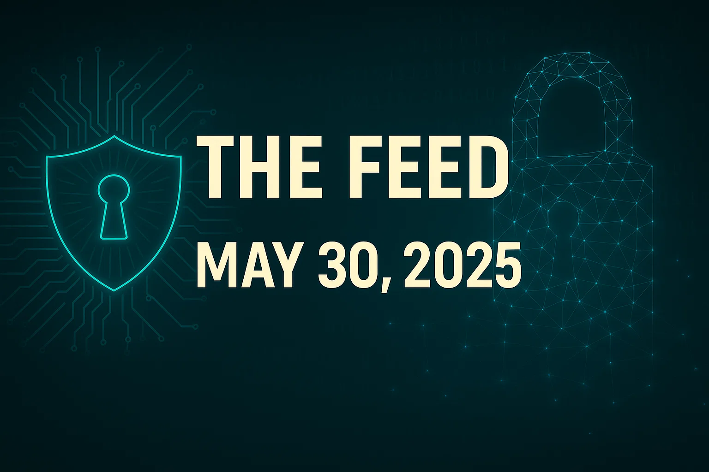
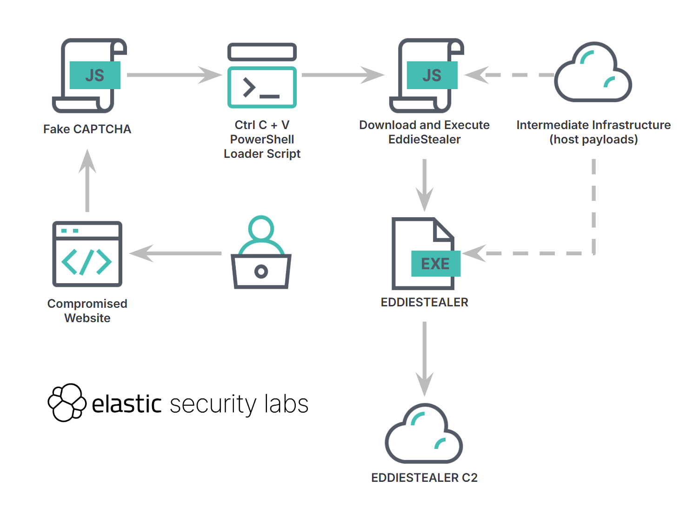
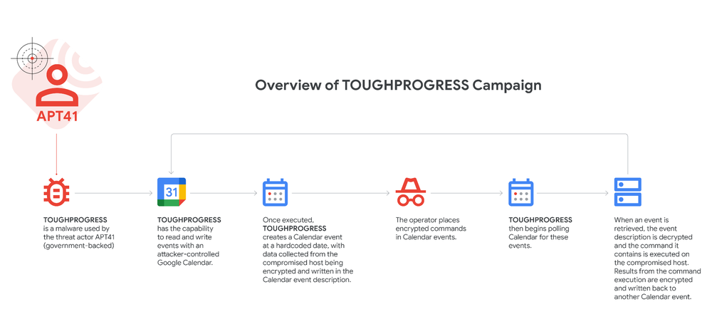

# The Feed 2025-05-30


## AI Generated Podcast

[Spotify](https://open.spotify.com/episode/6pcFJbP5efWzyKJUfETu2G?si=hint6fENS_O2FKzPouHI-g)

## Summarized Stories

- [**AyySSHush: Tradecraft of an emergent ASUS botnet – GreyNoise Labs**](#ayyysshush-tradecraft-of-an-emergent-asus-botnet-greynoise-labs): GreyNoise Labs discovered an emergent ASUS botnet leveraging vulnerabilities and novel tradecraft to disable security features and install a persistent SSH backdoor on ASUS routers.

- [**Chasing Eddies: New Rust-based InfoStealer used in CAPTCHA campaigns**](#chasing-eddies-new-rust-based-infostealer-used-in-captcha-campaigns): Elastic Security Labs uncovered EDDIESTEALER, a novel Rust-based infostealer disseminated via fake CAPTCHA campaigns that trick users into executing a malicious PowerShell script to steal credentials, browser information, and cryptocurrency details from Windows hosts.

- [**Mark Your Calendar: APT41 Innovative Tactics**](#mark-your-calendar-apt41-innovative-tactics): Google Threat Intelligence Group (GTIG) discovered APT41 using TOUGHPROGRESS malware that exploits Google Calendar for command and control (C2), including storing encrypted commands and exfiltrating data via calendar events.

- [**Higher Education Sector RAT Malware Campaign**](#higher-education-sector-rat-malware-campaign): Quorum Cyber's Threat Intelligence team analyzed NodeSnake, a JavaScript-based Remote Access Trojan (RAT) likely used by the Interlock ransomware group, observed targeting UK higher education institutions and leveraging Cloudflare Tunnelling for stealthy access.

- [**PumaBot: Novel Botnet Targeting IoT Surveillance Devices**](#pumabot-novel-botnet-targeting-iot-surveillance-devices): Darktrace researchers identified PumaBot, a custom Go-based Linux botnet targeting embedded Linux IoT devices, which gains access through SSH brute-forcing and maintains persistence using system service files and authorized keys.


## AyySSHush: Tradecraft of an emergent ASUS botnet – GreyNoise Labs
### Summary
Strategic Threat Intelligence:
This report details an emergent botnet observed targeting ASUS routers, utilizing a combination of known and novel techniques to achieve persistence and control. The attackers initially gain access through common methods like brute-force and exploiting older authentication bypass vulnerabilities. Their tradecraft then involves disabling built-in security features, specifically those provided by TrendMicro AiProtection. A key novel technique is the exploitation of a command injection vulnerability to enable a debug logging feature (`BWDPI logging`) by creating a specific file (`/tmp/BWSQL_LOG`). This logging feature itself contains a critical format string vulnerability that allows command execution. Ultimately, the goal is to establish persistent access by enabling SSH on an unusual high port and adding an attacker-controlled public key to the authorized keys. This persistence method leverages official ASUS settings, ensuring the backdoor remains even after firmware updates that patch the initial exploitation vector. The activity was first identified by GreyNoise on March 18, 2025.

### Technical Details
Operational Threat Intelligence:
The attack chain begins with initial access attempts against ASUS routers. These attempts include generic brute-force attacks targeting the `login.cgi` endpoint. Following or in parallel with brute-force, the attackers also utilize older authentication bypass vulnerabilities. One specific authentication bypass technique observed involves injecting a NULL byte (0x00) in the `asus_token` cookie. This NULL byte prematurely terminates string parsing in certain ASUS firmware versions, effectively bypassing authentication checks and allowing subsequent requests to be treated as authenticated.

Once authenticated or access is gained via bypass, the attackers proceed to interact with the router's settings and exploit vulnerabilities. A primary objective is to disable security features. Payloads are observed targeting the `AiProtection_HomeProtection.asp` page via POST requests to `/start_apply.htm`. An example payload includes `current_page=AiProtection_HomeProtection.asp&action_wait=15&action_mode=apply&action_script=restart_wrs%3Brestart_firewall%3B&wrs_protect_enable=1`, which explicitly sets `wrs_protect_enable=1`, likely to disable TrendMicro's protection features.

A critical step involves exploiting a command injection vulnerability, identified as CVE-2023-39780 in specific firmware versions. This is achieved by injecting commands into the `oauth_google_refresh_token` parameter within a POST request to `/start_apply.htm` targeting `AiProtection_HomeProtection.asp`. The immediate command executed is `touch /tmp/BWSQL_LOG`. The creation of this file activates the `BWDPI logging` feature. This logging mechanism, implemented in the `bwsdpi_sqlite` binary, contains a critical design flaw: it uses a `system()` call with a format string that incorporates potentially user-controlled data, making it vulnerable to command injection. This secondary vulnerability allows the attacker to execute arbitrary system commands. The vulnerability was confirmed and is slated for a CVE. Analysis of a newer firmware patch indicates the vulnerable function (`auth_google_check_token_status`) is now guarded by an `is_valid_oauth_code()` check within `/usr/lib/libshared.so`. However, researchers note potential issues with buffer size handling in the validation and suggest checking other similar functions for unpatched vulnerabilities.

The ultimate goal of the attack is to establish a persistent backdoor. This is accomplished by leveraging legitimate ASUS configuration settings via a POST request to `Advanced_System_Content.asp` also through `/start_apply.htm`. The payload sets parameters like `sshd_enable=1` to enable the SSH daemon, `sshd_port=53282` to bind SSH to a high, non-standard TCP port, and `sshd_authkeys=` followed by the attacker's public key to add it to the authorized keys list. An example of the public key used is provided in the source. By using these official settings, the attacker gains exclusive SSH access. Crucially, this configuration persists even if the router's firmware is updated, making remediation difficult. The attacker is believed to obtain valid usernames, likely through initial brute-force attempts, potentially targeting common usernames like "admin". Researchers confirmed the presence of the attacker's public key installed for the "admin" user on port TCP/53282 using the `sshamble` tool.

The attackers utilize a specific User-Agent string, `asusrouter--`, which has been historically associated with internal ASUS functions, potentially aiding in evasion or exploitation of specific code paths. Targeted devices observed by GreyNoise include ASUS RT-AC3100 and RT-AC3200 in Out-Of-Box configurations, while CVE-2023-39780 is explicitly linked to RT-AX55 v3.0.0.4.386.51598. Researchers successfully replicated command execution and spawned a netcat listener on an RT-AX55 using the identified payloads.

### Countries
The source does not mention specific targeted countries.

### Industries
The source does not mention specific targeted industries; the target appears to be home or small office users of specific ASUS router models.

### Recommendations
Technical recommendations mentioned in the source include:
*   Be aware that simply upgrading firmware will **NOT** remove the SSH backdoor if your router was previously exploited using this method, as the public key is added using official settings that persist across upgrades.
*   If you are not capable of reverse engineering firmware patches to verify the fix for the underlying command injection vulnerability (especially checking similar functions), consider taking your ASUS router off the internet.

### Hunting methods
Hunting methods can focus on identifying signs of the exploitation attempts, the enabled backdoor, or the persistent access:
*   **Network Traffic Analysis:** Monitor network traffic for POST requests targeting `/start_apply.htm` on ASUS routers. Look for requests with the `User-Agent: asusrouter--`. Specifically, look for `oauth_google_refresh_token` parameters containing shell commands or escape sequences, such as `\'%60touch+%2Ftmp%2FBWSQL_LOG%60\%27`. Also monitor for outbound SSH connections or activity on unusual high ports, particularly TCP/53282.
    *   Logic: Attackers use POST requests to this endpoint for authenticated function calls, including the vulnerable ones and configuration changes. The specific User-Agent might indicate malicious automated activity or exploitation attempts targeting this code path. The injected command in the oauth parameter is the direct sign of CVE-2023-39780 exploitation. Monitoring the high SSH port helps identify routers where the backdoor has been successfully installed and is being accessed.
*   **System Configuration Checks:** Examine router configurations for SSH enabled on unexpected ports, especially TCP/53282. Check the SSH authorized keys list (`/tmp/home/root/.ssh/authorized_keys`) for the presence of the known attacker public key.
    *   Logic: The SSH backdoor is established by enabling SSH on a non-standard port and adding the attacker's key using legitimate configuration mechanisms, which are directly visible in the router's settings or filesystem.
*   **Filesystem Checks:** Check the `/tmp` directory on the router for the existence of the file `/tmp/BWSQL_LOG`.
    *   Logic: The presence of this file is a direct indicator that the command injection vulnerability (CVE-2023-39780) was successfully exploited to enable the vulnerable BWDPI logging feature.
*   **External Scanning/Verification:** Use tools like `sshamble` (or similar SSH public key verification tools) to scan public-facing ASUS router IP addresses on TCP/53282. Attempt to verify the presence of the attacker's known public key for common usernames like "admin".
    *   Logic: This proactively identifies routers on the internet that have the persistent SSH backdoor installed and accessible, even if the initial exploitation vector has been patched.

### IOC
Tactical Threat Intelligence:

**IPs**
```
101.99.91.151
101.99.94.173
79.141.163.179
111.90.146.237
```
**Public Keys**
```
ssh-rsa AAAAB3NzaC1yc2EAAAABIwAAAQEAo41nBoVFfj4HlVMGV+YPsxMDrMlbdDZJ8L5mzhhaxfGzpHR8Geay/xDlVDSJ8MJwA4RJ7o21KVfRXqFblQH4L6fWIYd1ClQbZ6Kk1uA1r7qx1qEQ2PqdVMhnNdHACvCVz/MPHTVebtkKhEl98MZiMOvUNPtAC9ppzOSi7xz3cSV0n1pG/dj+37pzuZUpm4oGJ3XQR2tUPz5MddupjJq9/gmKH6SJjTrHKSECe5yEDs6c3v6uN4dnFNYA5MPZ52FGbkhzQ5fy4dPNf0peszR28XGkZk9ctORNCGXZZ4bEkGHYut5uvwVK1KZOYJRmmj63drIgdIioFv/x6IcCcKgi2w== rsa 2048
```
**File Paths**
```
/tmp/BWSQL_LOG
/tmp/home/root/.ssh/authorized_keys
```
**User-Agents**
```
asusrouter--
```
**Web Paths**
```
/start_apply.htm
```
**TCP Ports**
```
53282
```

**Original link:** [https://www.labs.greynoise.io/grimoire/2025-03-28-ayysshush/](https://www.labs.greynoise.io/grimoire/2025-03-28-ayysshush/)

## Chasing Eddies: New Rust-based InfoStealer used in CAPTCHA campaigns
### Summary
Elastic Security Labs has identified and analyzed EDDIESTEALER, a novel infostealer written in the Rust programming language, distributed through deceptive Fake CAPTCHA campaigns. Adversaries are hosting this malware on multiple web properties. The campaign tricks users into executing a malicious PowerShell script through fake CAPTCHA verification pages. This script ultimately deploys the EDDIESTEALER payload, designed to harvest sensitive data, including credentials, browser information, and cryptocurrency wallet details. The use of Rust in malware development is a growing trend, favored by threat actors for its potential benefits in stealth, stability, and resilience against traditional analysis methods and detection engines. Analyzing Rust binaries often requires more dedicated effort due to language features like zero-cost abstractions, type systems, compiler optimizations, and difficulties in analyzing memory-safe code.

### Technical Details

The initial vector for the EDDIESTEALER campaign observed in the telemetry analysis is a compromised website. This website deploys an obfuscated React-based JavaScript payload that presents a fake "I'm not a robot" verification screen to the user. This fake CAPTCHA interface is designed to mimic Google's reCAPTCHA. It instructs the user to perform specific manual steps: Press `Windows Key + R` to open the Run dialog box, then `Ctrl + V` to paste content from the clipboard, and finally `Enter` to execute the pasted command. The malicious JavaScript uses the `document.execCommand("copy")` method to copy a PowerShell command into the user's clipboard.

The PowerShell command, once executed by the user, silently downloads a second-stage payload, named `gverify.js`. It fetches this file from an attacker-controlled domain, `hxxps://llll.fit/version/`. The command saves the downloaded script to the user's `Downloads` folder. Following the download, the script executes `gverify.js` using `cscript //nologo` in a hidden window. `gverify.js` is itself an obfuscated JavaScript payload. Upon deobfuscation, its functionality is revealed to be quite simple: it fetches the main EDDIESTEALER executable from `hxxps://llll.fit/io` and saves it to the user’s `Downloads` folder with a pseudorandom 12-character file name.

EDDIESTEALER is identified as a novel, commodity infostealer written in Rust. Most of its malicious strings are encrypted. The malware initially lacked robust anti-sandbox or anti-VM protections against behavioral fingerprinting, although newer variants suggest these checks might have been moved to the server side. The malware receives a task list from its C2 server as part of its configuration, specifying the data it should target. It also has a self-deletion capability if specified by the configuration.

Analysis of the Rust binary reveals several characteristics and techniques:
*   **Stripped Symbols:** Samples feature stripped function symbols, making static analysis more difficult and requiring symbol restoration tools like `rustbinsign`.
*   **String Obfuscation:** Most strings are encrypted using a simple XOR cipher. Decryption is a two-stage process involving calling one of several key derivation functions and then performing the decryption inline. The key derivation functions take an address within the binary and a 4-byte constant.
*   **Thread-safe String Decryption:** Thread-safe, lazy initialization is used for shared resources like module names, C2 domain/port, and the sample's unique identifier, ensuring they are decrypted only once. This involves checks using a status flag and synchronization primitives (`WaitOnAddress`/`WakeByAddressAll`).
*   **API Obfuscation:** EDDIESTEALER uses a custom WinAPI lookup mechanism. It decrypts module and function names, checks a local hashtable, and if not found, dynamically loads the module using a custom `LoadLibrary` wrapper. It then uses `GetProcAddress` to get the API address and caches it in the hashtable.

Upon execution, EDDIESTEALER performs initial setup and checks:
*   **Mutex Creation:** It creates a mutex to ensure only a single instance runs at a time. The mutex name is a decrypted UUID string (unique per sample), like `431e2e0e-c87b-45ac-9fdb-26b7e24f0d39`. This UUID is later used as a unique identifier for build tracking during C2 communication.
*   **Sandbox Detection:** A basic check assesses if the total physical memory is above approximately 4.0 GB. If it's below this threshold, the malware deletes itself from the disk.
*   **Self-Deletion:** It can delete itself using a technique similar to LATRODECTUS, leveraging NTFS Alternate Data Streams renaming (`$DATA` to `:metadata`) and the "delete on close handle" flag (`FILE_DISPOSITION_INFO.DeleteFile`) to bypass file locks. This process involves getting the executable path (`GetModuleFileName`), opening a handle (`CreateFileW`), renaming the stream (`SetFileInformationByHandle`), closing and reopening the handle, and setting the delete flag (`SetFileInformationByHandle`).

The C2 communication process is detailed:
*   **Initial Contact:** The malware constructs a URI using decrypted configuration data: `<C2_ip_or_domain>/api/handler/<UUID>`. It sends an HTTP GET request to this URI to retrieve a second-stage configuration containing the task list.
*   **Second-Stage Configuration:** The response is AES CBC encrypted and Base64 encoded, in the format `Base64(IV):Base64(AESEncrypt(data))`. The AES key for decrypting server-to-client messages is stored unencrypted in the `.rdata` section of the binary. The decrypted configuration includes a session ID, the task list (specifying data targets), the AES key for client-to-server encryption (in older variants), and a self-delete flag.
*   **Client-to-Server Communication:** After retrieving tasks, EDDIESTEALER performs system profiling to gather information like executable location, locale ID, username, total physical memory, and OS version. Initial host information is AES-encrypted using the client-to-server key and sent via an HTTP POST request to `<C2_ip_or_domain>/api/handler/info/<session_id>`. Subsequently, data collected for each completed task is encrypted and sent in separate HTTP POST requests to `<C2_ip_or_domain>/api/handler<session_id>/<task_id>`. This generates a distinct C2 traffic pattern of multiple, task-specific POST requests, which is easier to identify as the malware primarily uses HTTP instead of HTTPS.
*   **Variant C2 Changes:** Newer variants preemptively send host system information *before* requesting the decrypted configuration. The client-to-server AES encryption key is hardcoded in the binary, rather than received dynamically. The server-to-client key also remains hardcoded.

EDDIESTEALER is configured to target various types of sensitive data based on the tasks received from the C2. This includes:
*   **Crypto wallets:** Armory, Bitcoin, WalletWasabi, Daedalus Mainnet, Coinomi, Electrum, Exodus, DashCore, ElectronCash, Electrum-DASH, Guarda, Atomic.
*   **Browsers:** Microsoft Edge, Brave, Google Chrome, Mozilla Firefox.
*   **Password managers:** Bitwarden, 1Password, KeePass.
*   **FTP clients:** FileZilla, FTP Manager Lite, FTPbox, FTP Commander Deluxe, Auto FTP Manager, 3D-FTP, FTPGetter, Total Commander.
*   **Messaging applications:** Telegram Desktop.
*   **Browser extensions**.

The malware reads targeted files using standard `kernel32.dll` functions like `CreateFileW`, `GetFileSizeEx`, `ReadFile`, and `CloseHandle`.

For Chromium-based browsers, EDDIESTEALER utilizes sophisticated techniques, including a reimplementation of ChromeKatz to bypass Application-bound encryption for accessing sensitive data like cookies. It checks the browser version. If a targeted Chromium browser is not running, the malware spawns a new instance with the command-line arguments `--window-position=-3000,-3000 https://google.com`. This renders the window invisible but ensures the necessary child process (the network service process) is running with memory accessible for reading. Newer variants add credential theft capabilities. This involves spawning a Chrome process with the `--remote-debugging-port=<port_num>` flag to enable the DevTools Protocol over a local WebSocket interface. It queries `http://localhost:<port>/json/version` to get the `webSocketDebuggerUrl`. Using this, it issues a `Target.createTarget` command with `chrome://password-manager/passwords`. While this page isn't directly scrapable, opening it causes Chrome to decrypt and load stored credentials into memory, which the malware then scans using CredentialKatz lookalike code. Decrypted strings like `os_crypt`, `encrypted_key`, and `CryptUnprotectData` suggest support for older Chrome versions using DPAPI encryption.

Newer variants of EDDIESTEALER also gather additional system information during the initial profiling stage, including running processes, GPU information, number of CPU cores, CPU name, and CPU vendor. The change in C2 communication to send host info preemptively, especially when paired with the observation that an empty task list might be returned, suggests the developers introduced server-side checks to profile the client environment and evade analysis systems. Newer compiled samples show extensive function inline expansion, making analysis more challenging.

EDDIESTEALER developers utilize panic metadata, such as embedded source file paths (`apps\bin\src\services\chromium_hound.rs`, `apps\bin\src\services\system.rs`), line numbers, and column numbers, which are included in error messages sent to the C2 server. This provides built-in debugging feedback. These paths can also be useful for analysts to segment code and identify logic related to specific functionalities if the metadata is not stripped.

The malware's behavior aligns with several MITRE ATT&CK tactics and techniques:
*   **Tactics:** Initial Access, Execution, Defense Evasion, Exfiltration, Credential Access, Discovery, Collection.
*   **Techniques:** Phishing, Content Injection, Command and Scripting Interpreter, Credentials from Password Stores, User Execution, Obfuscated Files or Information, Exfiltration Over C2 Channel, Virtualization/Sandbox Evasion.

### Recommendations
Technical recommendations mentioned in the source primarily relate to analysis techniques rather than user remediation or defense steps. However, implied recommendations based on the TTPs would include:
*   Educate users about fake CAPTCHA schemes that prompt manual steps like opening Run and pasting commands.
*   Monitor for suspicious PowerShell execution, especially commands involving `Invoke-WebRequest` or `cscript` downloading and executing scripts from unusual domains.
*   Implement endpoint detection rules for file activity targeting known sensitive paths (browser profiles, wallet directories, password manager files, etc.).
*   Monitor network traffic for HTTP POST requests to suspicious domains or IP addresses, particularly those with the distinct `/api/handler/info/<session_id>` or `/api/handler<session_id>/<task_id>` path patterns.
*   Be aware that Rust malware analysis can be more complex due to stripped symbols, obfuscation, and compiler optimizations like extensive inlining and stack slot reuse. Use appropriate tools and techniques (e.g., `rustbinsign`, tracing, handling stack reuse, interpreting panic metadata).

### Hunting methods

#### YARA

Elastic Security has created the following YARA rules related to this research:

-   [Windows.Infostealer.EddieStealer](https://github.com/elastic/protections-artifacts/blob/main/yara/rules/Windows_Infostealer_EddieStealer.yar)

#### Behavioral prevention rules

-   [Suspicious PowerShell Execution](https://github.com/elastic/protections-artifacts/blob/3e068e2ab4a045350c67ae26ff1439149ad68d1d/behavior/rules/windows/execution_suspicious_powershell_execution.toml)
-   [Ingress Tool Transfer via PowerShell](https://github.com/elastic/protections-artifacts/blob/3e068e2ab4a045350c67ae26ff1439149ad68d1d/behavior/rules/windows/command_and_control_ingress_tool_transfer_via_powershell.toml)
-   [Potential Browser Information Discovery](https://github.com/elastic/protections-artifacts/blob/3e068e2ab4a045350c67ae26ff1439149ad68d1d/behavior/rules/windows/discovery_potential_browser_information_discovery.toml)
-   [Potential Self Deletion of a Running Executable](https://github.com/elastic/protections-artifacts/blob/3e068e2ab4a045350c67ae26ff1439149ad68d1d/behavior/rules/windows/defense_evasion_potential_self_deletion_of_a_running_executable.toml)

*   **Elastic Security YARA Rule:**
    *   `Windows.Infostealer.EddieStealer`
    *   Logic: This rule is designed to identify the EDDIESTEALER binary based on its unique characteristics, likely including specific patterns, imported functions (even if resolved dynamically), or encrypted strings present within the executable. (Details on the specific rule logic are not provided in the excerpt).

*   **Elastic Behavioral Prevention Rules:**
    *   `Suspicious PowerShell Execution`:
        *   Logic: Detects PowerShell commands that exhibit suspicious behavior, such as downloading or executing external scripts or payloads. This would likely flag the initial PowerShell loader script (`powershell -WindowState Hidden -Command "Invoke-WebRequest ..."`).
    *   `Ingress Tool Transfer via PowerShell`:
        *   Logic: Identifies instances where PowerShell is used to download potentially malicious files or tools from external sources, directly applicable to the `Invoke-WebRequest` usage to download `gverify.js` and potentially the EDDIESTEALER executable itself if downloaded directly by PS.
    *   `Potential Browser Information Discovery`:
        *   Logic: Flags activity indicative of malware attempting to access or collect data from web browsers, which aligns with EDDIESTEALER's targeting of browser profiles, history, bookmarks, and credentials.
    *   `Potential Self Deletion of a Running Executable`:
        *   Logic: Detects techniques used by malware to delete its own executable file while still running, matching EDDIESTEALER's use of NTFS Alternate Data Streams renaming and the "delete on close" flag.

*   **Network Monitoring/Hunting:**
    *   Monitor for HTTP POST requests to suspicious IP addresses or domains (listed in IOCs).
        *   Logic: The malware relies heavily on HTTP POST for exfiltrating initial host information and collected task data.
    *   Look for specific URI path patterns in HTTP POST requests: `/api/handler/info/<session_id>` or `/api/handler<session_id>/<task_id>`.
        *   Logic: These specific path structures are unique identifiers of EDDIESTEALER's client-to-server communication protocol.
    *   Monitor for HTTP GET requests to suspicious IP addresses or domains with the path `/api/handler/<UUID>`.
        *   Logic: This is the initial request made by the malware to retrieve its second-stage configuration.
    *   Monitor for outbound HTTP requests from local processes to `http://localhost:<port>/json/version` with the HTTP GET method.
        *   Logic: This indicates the malware interacting with the Chrome DevTools Protocol enabled by the `--remote-debugging-port` flag to facilitate credential theft.

*   **Filesystem Monitoring/Hunting:**
    *   Monitor for the creation or modification of files in sensitive paths known to store crypto wallets, browser profiles, password manager data, and FTP client configurations (listed in and).
        *   Logic: These are the specific locations EDDIESTEALER is configured to target for data collection.
    *   Monitor the `Downloads` folder for new executable files with pseudorandom 12-character names, especially if downloaded by `cscript` or PowerShell.
        *   Logic: `gverify.js` saves the EDDIESTEALER executable to the Downloads folder with a pseudorandom name.
    *   Monitor for the creation of files named `gverify.js` in the `Downloads` folder, especially if downloaded by PowerShell.
        *   Logic: The initial PowerShell loader script downloads the second-stage JavaScript loader with this name.

*   **Process Monitoring/Hunting:**
    *   Monitor for `cscript.exe` being executed with the `//nologo` flag, especially if its parent process is PowerShell.
        *   Logic: The initial PowerShell script executes `gverify.js` using `cscript //nologo`.
    *   Monitor for PowerShell execution with hidden window (`-WindowState Hidden`) and commands involving `Invoke-WebRequest`.
        *   Logic: This is how the initial loader script downloads `gverify.js`.
    *   Monitor for the creation of mutexes with specific UUID names, such as `431e2e0e-c87b-45ac-9fdb-26b7e24f0d39`.
        *   Logic: EDDIESTEALER creates a mutex with a unique UUID name to prevent multiple instances.
    *   Monitor for the execution of Chrome processes with command-line arguments `--window-position=-3000,-3000` or `--remote-debugging-port`.
        *   Logic: The malware uses these arguments when spawning Chrome to make its memory accessible for data theft or to handle inactive instances.

### IOC
Tactical Threat Intelligence:

**Hashes**
```
47409e09afa05fcc9c9eff2c08baca3084d923c8d82159005dbae2029e1959d0
162a8521f6156070b9a97b488ee902ac0c395714aba970a688d54305cb3e163f
f8b4e2ca107c4a91e180a17a845e1d7daac388bd1bb4708c222cda0eff793e7a
53f803179304e4fa957146507c9f936b38da21c2a3af4f9ea002a7f35f5bc23d
20eeae4222ff11e306fded294bebea7d3e5c5c2d8c5724792abf56997f30aaf9
1bdc2455f32d740502e001fce51dbf2494c00f4dcadd772ea551ed231c35b9a2
d905ceb30816788de5ad6fa4fe108a202182dd579075c6c95b0fb26ed5520daa
b8b379ba5aff7e4ef2838517930bf20d83a1cfec5f7b284f9ee783518cb989a7
f6536045ab63849c57859bbff9e6615180055c268b89c613dfed2db1f1a370f2
d318a70d7f4158e3fe5f38f23a241787359c55d352cb4b26a4bd007fd44d5b80
73b9259fecc2a4d0eeb0afef4f542642c26af46aa8f0ce2552241ee5507ec37f
2bef71355b37c4d9cd976e0c6450bfed5f62d8ab2cf096a4f3b77f6c0cb77a3b
218ec38e8d749ae7a6d53e0d4d58e3acf459687c7a34f5697908aec6a2d7274d
5330cf6a8f4f297b9726f37f47cffac38070560cbac37a8e561e00c19e995f42
acae8a4d92d24b7e7cb20c0c13fd07c8ab6ed8c5f9969504a905287df1af179b
0f5717b98e2b44964c4a5dfec4126fc35f5504f7f8dec386c0e0b0229e3482e7
e8942805238f1ead8304cfdcf3d6076fa0cdf57533a5fae36380074a90d642e4
7930d6469461af84d3c47c8e40b3d6d33f169283df42d2f58206f43d42d4c9f4
```

**Domains**
```
shiglimugli[.]xyz
xxxivi[.]com
llll[.]fit
plasetplastik[.]com
militrex[.]wiki
```

**IPs**
```
45.144.53[.]145
84.200.154[.]47
192.168.56[.]2
```

**Mutex Name**
```
431e2e0e-c87b-45ac-9fdb-26b7e24f0d39
```

**Original link:** [https://www.elastic.co/security-labs/eddiestealer](https://www.elastic.co/security-labs/eddiestealer)

## Mark Your Calendar: APT41 Innovative Tactics

### Summary
The Google Threat Intelligence Group (GTIG) has identified a new malware campaign leveraging Google Calendar for Command and Control (C2), attributed with high confidence to the PRC-based threat actor APT41, also known as HOODOO. APT41 is known for its creative malware campaigns, sometimes utilizing Google Workspace applications. The threat actor's targets are global, spanning governments and organizations in the shipping and logistics, media and entertainment, technology, and automotive sectors. This particular campaign involved the malware dubbed "TOUGHPROGRESS". Misuse of cloud services like Google Calendar for C2 is a common tactic used by threat actors to blend in with legitimate network traffic. Google's approach to countering such threats involves monitoring, disruption, and notification. They have proactively blocked this campaign by developing custom detection signatures, shutting down attacker-controlled infrastructure, and adding protections to Safe Browsing. GTIG and Mandiant Consulting also notified compromised organizations and provided them with information and logs to assist detection and incident response.

### Technical Details


The TOUGHPROGRESS campaign leverages a multi-stage infection chain and employs various techniques for stealth and evasion. The initial delivery method observed involves spear phishing emails containing a link to a ZIP archive hosted on an exploited government website. The ZIP archive, named "出境海關申報清單.zip", contains an LNK file, "申報物品清單.pdf.lnk", masquerading as a PDF, and a directory named "image" with files disguised as JPG images ("1.jpg" through "7.jpg").

When the victim clicks the LNK file, it is executed, subsequently deleted, and replaced with a decoy PDF file ("申報物品清單.pdf") which is displayed to the user. This LNK file executes the malware payload. The files "6.jpg" and "7.jpg" within the archive are not actual images. "6.jpg" contains an encrypted payload, while "7.jpg" is a DLL file launched by the LNK file. This DLL is identified as **PLUSDROP** and is responsible for decrypting and executing the next stage of the malware in memory.

The malware infection chain consists of three distinct modules deployed sequentially:
1.  **PLUSDROP**: A DLL used to decrypt and execute the subsequent stage in memory.
2.  **PLUSINJECT**: Launches and performs process hollowing on a legitimate Windows process, specifically "svchost.exe", injecting the final payload into it.
3.  **TOUGHPROGRESS**: The main module that executes actions on the compromised Windows host and utilizes Google Calendar for C2 communications. An additional stage called **PLUSBED** has been observed in other TOUGHPROGRESS campaigns.

TOUGHPROGRESS begins by decrypting embedded shellcode stored in its ".pdata" region using a hardcoded 16-byte XOR key. This shellcode then decompresses a DLL in memory using `COMPRESSION_FORMAT_LZNT1`. This DLL employs multiple obfuscation techniques to obscure control flow. These techniques include Register-based Indirect Calls, Dynamic Address Arithmetic, 64-bit register overflow, and a Function Dispatch Table. The register-based indirect calls involve dynamically calculating the address to store in a register. This calculation uses two or more hardcoded values that intentionally cause a 64-bit register overflow, resulting in the correct address of the function to be called (e.g., `CreateThread`). These obfuscation techniques, including indirect calls and arithmetic operations, make it difficult for disassemblers to accurately recreate a control flow graph, manifesting as a Control Flow Obfuscation tactic.

For Command and Control, TOUGHPROGRESS leverages Google Calendar. It has the capability to read and write events within an attacker-controlled Google Calendar. Upon execution, TOUGHPROGRESS creates a zero-minute Calendar event on a hardcoded date (2023-05-30). Data collected from the compromised host is encrypted and written into the description of this event. The attacker operator then places encrypted commands in Calendar events on predetermined dates (2023-07-30 and 2023-07-31), which are also hardcoded into the malware. TOUGHPROGRESS continuously polls the Calendar for these specific events. When an event is retrieved, the event description is decrypted, and the contained command is executed on the compromised host. The results of the command execution are then encrypted and written back into another Calendar event.

The C2 encryption protocol used by TOUGHPROGRESS involves a combination of LZNT1 compression and XOR encryption. It uses a hardcoded 10-byte XOR key and generates a per-message 4-byte XOR key. The process is as follows:
1.  Compress the message using LZNT1.
2.  Encrypt the compressed message with the 4-byte XOR key.
3.  Append the 4-byte key to a 6-byte header, creating a 10-byte header.
4.  Encrypt the 10-byte header with the hardcoded 10-byte XOR key.
5.  Prepend the encrypted header to the front of the encrypted message. The combined encrypted header and message form the content written into the Calendar event description.

APT41 has also been observed using free web hosting infrastructure for distributing their malware since at least August 2024. This infrastructure has been used for VOLDEMORT, DUSTTRAP, TOUGHPROGRESS, and potentially other payloads. Links to these hosting sites have been sent to hundreds of targets across various geographic locations and industries. Cloudflare Worker subdomains are the most frequently used, but InfinityFree and TryCloudflare have also been observed. URL shorteners are also used in phishing messages to redirect to the malware hosted on these free hosting subdomains.

GTIG has taken action to disrupt this campaign, including developing custom fingerprints for identifying and taking down attacker-controlled Calendars, terminating attacker-controlled Workspace projects to dismantle infrastructure, updating file detections, and adding malicious domains and URLs to the Google Safe Browsing blocklist.

### Countries
The source indicates that APT41's targets span the globe. It does not specify particular countries targeted in this campaign.

### Industries
APT41's targets include governments and organizations within the global shipping and logistics, media and entertainment, technology, and automotive sectors.

### Recommendations
Based on the actions taken by GTIG to disrupt the campaign, recommendations for defense against similar attacks include:
*   Implementing and updating file detections for the malware components (LNK, DLLs).
*   Blocking known malicious domains and URLs used for distribution and C2. Google Safe Browsing blocklist includes the domains and URLs listed in the source.
*   Monitoring for and blocking suspicious activity related to Google Calendar API usage from potentially compromised systems that aligns with the TOUGHPROGRESS C2 pattern.
*   Staying informed about APT41's tactics and indicators.
*   Organizations should review information provided by threat intelligence groups like GTIG and Mandiant if they are notified of potential compromise.

### Hunting methods
The source provides several YARA rules that can be used for hunting for components of this campaign:

*   **YARA Rule: G_Backdoor_TOUGHPROGRESS_LNK_1**
    ```
    rule G_Backdoor_TOUGHPROGRESS_LNK_1 {
     	meta:
     		author = "GTIG"
     		date_created = "2025-04-29"
     		date_modified = "2025-04-29"
     		md5 = "65da1a9026cf171a5a7779bc5ee45fb1"
     		rev = 1
     	strings:
     		$marker = { 4C 00 00 00 }
     		$str1 = "rundll32.exe" ascii wide
     		$str2 = ".\\image\\7.jpg,plus" wide
     		$str3 = "%PDF-1"
     		$str4 = "PYL="
     	condition:
     		$marker at 0 and all of them
     }
    ```
    *   **Logic:** This rule is designed to detect the malicious LNK file used in the initial delivery. It checks for the standard LNK file header bytes (`4C 00 00 00`) at the beginning of the file. It also searches for specific strings indicative of this particular LNK: `"rundll32.exe"` (often used to execute DLLs), `".\\image\\7.jpg,plus"` (pointing to the specific DLL and export function used to launch the next stage), `"%PDF-1"` (part of the decoy PDF content), and `"PYL="`. The condition requires the header marker at the beginning and all four defined strings to be present.

*   **YARA Rule: G_Dropper_PLUSDROP_1**
    ```
    rule G_Dropper_PLUSDROP_1 {
     	meta:
     		author = "GTIG"
     		date_created = "2025-04-29"
     		date_modified = "2025-04-29"
     		md5 = "9492022a939d4c727a5fa462590dc0dd"
     		rev = 1
     	strings:
     		$decrypt_and_launch_payload = { 48 8B ?? 83 ?? 0F 0F B6 ?? ?? ??   30 04 ?? 48 FF ?? 49 3B ?? 72 ?? 80 00 75 ?? B? 5B 55 D2 56 E8   33 ?? 33 ?? FF D? FF D? }
     	condition:
     		uint16(0) == 0x5a4d and all of them
     }
    ```
    *   **Logic:** This rule targets the PLUSDROP DLL, which is the first stage dropper. It checks for the standard Windows Portable Executable (PE) signature `MZ` (`0x5a4d`) at the beginning of the file, confirming it's an executable or DLL. It also includes a byte pattern (`$decrypt_and_launch_payload`) that is likely associated with the code responsible for decrypting and launching the next payload stage in memory. The condition requires the PE header and the specific byte pattern to be present.

*   **YARA Rule: G_Dropper_TOUGHPROGRESS_XML_1**
    ```
    rule G_Dropper_TOUGHPROGRESS_XML_1 {
         meta:
             author = "GTIG"
             description = "XML lure file used to launch a PLUSDROP dll."
             md5 = "dccbb41af2fcf78d56ea3de8f3d1a12c"
         strings:
             $str1 = "System.Convert.FromBase64String"
             $str2 = "VirtualAlloc"
             $str3 = ".InteropServices.Marshal.Copy"
             $str4 = ".DllImport"
             $str5 = "kernel32.dll"
             $str6 = "powrprof.dll"
             $str7 = ".Marshal.GetDelegateForFunctionPointer"
         condition:
             uint16(0)!= 0x5A4D and all of them and filesize > 500KB and filesize < 5MB
     }
    ```
    *   **Logic:** This rule identifies a specific XML lure file observed in another TOUGHPROGRESS campaign. It looks for files that are *not* PE executables (checked by `uint16(0)!= 0x5A4D`) but are within a certain size range (500KB to 5MB). It checks for strings commonly found in malicious XML files that use .NET libraries or system calls to execute code, such as `"System.Convert.FromBase64String"`, `"VirtualAlloc"`, `".InteropServices.Marshal.Copy"`, `".DllImport"`, `"kernel32.dll"`, `"powrprof.dll"`, and `".Marshal.GetDelegateForFunctionPointer"`. These strings suggest the XML file is likely loading and executing malicious code.

*   **YARA Rule: G_Dropper_PLUSBED_2**
    ```
    rule G_Dropper_PLUSBED_2 {
     	meta:
     		author = "GTIG"
     		date_created = "2025-04-29"
     		date_modified = "2025-04-29"
     		md5 = "39a46d7f1ef9b9a5e40860cd5f646b9d"
     		rev = 1
     	strings:
     		$api1 = { BA 54 B8 B9 1A }
     		$api2 = { BA 78 1F 20 7F }
     		$api3 = { BA 62 34 89 5E }
     		$api4 = { BA 65 62 10 4B }
     		$api5 = { C7 44 24 34 6E 74 64 6C 66 C7 44 24 38 6C 00 FF D0 }
     	condition:
     		uint16(0) != 0x5A4D and all of them
     }
    ```
    *   **Logic:** This rule detects the PLUSBED stage, which is an additional dropper observed in other TOUGHPROGRESS campaigns. Similar to the XML rule, it looks for files that are *not* PE executables (`uint16(0) != 0x5A4D`). It contains several byte patterns (`$api1` through `$api5`) that likely correspond to API calls or specific code sequences used by this particular malware stage. The condition requires the non-PE file type and all the specified byte patterns to be present.

Additionally, monitoring network traffic for connections to the identified domains, URL shortener links, and Google Calendar API URLs associated with the campaign can help detect activity. Specifically, looking for Calendar API calls related to reading/writing event descriptions containing encrypted data on the hardcoded dates could indicate C2 communication.

### IOC
**Hashes**
```
469b534bec827be03c0823e72e7b4da0b84f53199040705da203986ef154406a
876fb1b0275a653c4210aaf01c2698ec
3b88b3efbdc86383ee9738c92026b8931ce1c13cd75cd1cda2fa302791c2c4fb
65da1a9026cf171a5a7779bc5ee45fb1
50124174a4ac0d65bf8b6fd66f538829d1589edc73aa7cf36502e57aa5513360
1ca609e207edb211c8b9566ef35043b6
151257e9dfda476cdafd9983266ad3255104d72a66f9265caa8417a5fe1df5d7
2ec4eeeabb8f6c2970dcbffdcdbd60e3
```

**Domains**
```
word[.]msapp[.]workers[.]dev
cloud[.]msapp[.]workers[.]dev
term-restore-satisfied-hence[.]trycloudflare[.]com
ways-sms-pmc-shareholders[.]trycloudflare[.]com
resource[.]infinityfreeapp[.]com
pubs[.]infinityfreeapp[.]com
```

**URL Shortener Links**
```
https[:]//lihi[.]cc/6dekU
https[:]//lihi[.]cc/v3OyQ
https[:]//lihi[.]cc/5nlgd
https[:]//lihi[.]cc/edcOv
https[:]//lihi[.]cc/4z5sh
https[:]//tinyurl[.]com/mr42t4yv
https[:]//tinyurl[.]com/hycev3y7
https[:]//tinyurl[.]com/mpa2c5wj
https[:]//tinyurl[.]com/3wnz46pv
https[:]//my5353[.]com/ppOH5
https[:]//my5353[.]com/nWyTf
https[:]//my5353[.]com/fPUcX
https[:]//my5353[.]com/ZwEkm
https[:]//my5353[.]com/vEWiT
https[:]//reurl[.]cc/WNr2Xy
```

**Calendar C2**
```
104075625139-l53k83pb6jbbc2qbreo4i5a0vepen41j.apps.googleusercontent.com
https[:]//www[.]googleapis[.]com/calendar/v3/calendars/ff57964096cadc1a8733cf566b41c9528c89d30edec86326c723932c1e79ebf0@group.calendar.google.com/events
```

**Original link:** [https://cloud.google.com/blog/topics/threat-intelligence/apt41-innovative-tactics/](https://cloud.google.com/blog/topics/threat-intelligence/apt41-innovative-tactics/)

## Higher Education Sector RAT Malware Campaign

### Summary
This report details the discovery and analysis of a Remote Access Trojan (RAT) campaign primarily targeting the higher education sector in the United Kingdom. Analysis by Quorum Cyber's Threat Intelligence (QCTI) team has identified this malware, tracked as NodeSnake, with a strong likelihood that it is being utilized by the ransomware group Interlock. Interlock, which emerged in October 2024, is known for double extortion campaigns against large or high-value organizations and does not operate as a Ransomware-as-a-Service (RaaS).

The observed campaign involves the deployment of NodeSnake RATs within university networks. These RATs provide attackers with remote control capabilities, enabling actions such as file access, activity monitoring, system setting manipulation, maintaining persistence, deploying additional tools or malware, and accessing, manipulating, destroying, or exfiltrating data. The infection can also potentially spread laterally across the network.

Threat actors have increasingly leveraged Cloudflare Tunnelling in these campaigns to achieve stealthy access to networks, including universities. Cloudflare Tunnels allow attackers to configure access to services like SSH, RDP, and SMB, facilitating lateral movement while bypassing firewalls, maintaining persistent access, and evading detection. The use of Cloudflare Tunnels for delivering RATs like Xworm, AsyncRAT, and VenomRAT has been reported elsewhere, indicating a broader threat landscape utilizing this technique.

Analysis of two NodeSnake samples, referred to as NodeSnake.A and NodeSnake.B, shows an iterative development with NodeSnake.B being a significantly more advanced version. This evolution highlights the threat actor's commitment to long-term persistence and operational flexibility. The malware blends legitimate infrastructure (Cloudflare) with fileless execution and modular payloads, reflecting modern adversary tactics. The transition to NodeSnake.B demonstrates a strategic shift towards modularity, interactive compromise, enhanced stealth, and targeting versatility.

### Technical Details
NodeSnake is a RAT written in JavaScript and executed using NodeJS. Two distinct iterations, NodeSnake.A and NodeSnake.B, have been identified and analyzed.

**NodeSnake.A Capabilities:**
NodeSnake.A exhibits typical RAT capabilities including persistent access, system reconnaissance, and remote command execution. It employs several evasion techniques and communicates with Command-and-Control (C2) servers.

*   **Persistence & Evasion:** NodeSnake.A achieves persistence by adding a registry entry to ensure execution at startup. This is done by constructing and executing a `reg add` command, often via PowerShell or CMD, to create a "ChromeUpdater" entry that points to a randomly named script.
    ```powershell
    reg add 'HKCU\Software\Microsoft\Windows\CurrentVersion\Run' /v 'ChromeUpdater' /t REG_SZ /d '<scriptPath>' /f
    ```
    Additionally, the malware spawns a background process using the `spawn` function with `detached: true` and `windowsHide: true` options, allowing it to run independently of its parent process and remain hidden.
*   **System Reconnaissance:** The malware gathers system metadata by executing a series of commands. This includes obtaining user privileges, identifying running processes (`tasklist /svc`), listing services (`Get-Service`), and gathering network information (`arp -a`, `Get-PSDrive`). An example command sequence used for reconnaissance is shown in the source.
*   **Encryption:** Collected reconnaissance data is XOR-encrypted using a static key (0x78) and then compressed using zlib before exfiltration.
*   **C2 Communication:** NodeSnake.A connects to predefined C2 servers, which include Cloudflare-proxied domains (e.g., sublime-forecasts-pale-scored.trycloudflare[.]com) and hardcoded IP addresses. Exfiltrated data is sent via HTTP POST requests.
*   **Payload Delivery & Execution:** The malware receives responses from the C2 server that can trigger specific actions, such as self-termination (`ooff` payload) or the execution of secondary payloads. The `start` function handles payload execution based on file type, supporting `.exe`, `.dll`, and `.js` files.
    - `.exe` files are executed directly using `spawn`.
    - `.dll` files are loaded and executed via `rundll32.exe` with the 'start' argument (e.g., `rundll32.exe <filePath>,start`).
    - `.js` files are executed in memory using `node -e <filePath>`.
*   **Anti-Analysis:** NodeSnake.A utilizes randomized filenames for stored payloads and randomly delays C2 communication to hinder detection and analysis.

**NodeSnake.B Advancements:**
NodeSnake.B is an advanced iteration with significant enhancements in obfuscation, payload capabilities, and adaptive C2 communication.

*   **Advanced Obfuscation:** The code is heavily obfuscated using a string array and dynamic lookup functions to conceal critical strings and logic. This replaces human-readable strings with hexadecimal offsets, making static analysis more challenging.
*   **Expanded Payload Types:** NodeSnake.B supports five payload types: EXE, DLL, JavaScript, CMD, and ACTIVE.
    - **CMD:** Executes shell commands supplied by the attacker via `cmd.exe`. The `startCmd` function is used for this purpose.
    - **ACTIVE:** Updates a flag (`useActive`) to adjust C2 polling intervals, indicating dynamic behavioral adjustments.
*   **Dynamic Command Execution:** The `startCmd` function spawns `cmd.exe` to run attacker-provided commands. Crucially, it captures the standard output and standard error of these commands.
    ```javascript
    spawn('cmd.exe', { shell: true, windowsHide: true }) // Simplified representation
    // ... code to capture stdout/stderr ...
    ```
    The collected output (`lastCmd`) is then appended to the data exfiltrated to the C2 server, enabling interactive remote control.
*   **Enhanced Encryption:** The XOR encryption algorithm in NodeSnake.B is more complex, using a rolling key derived from the payload and an initialization vector. Data is also compressed with zlib and prefixed with a random seed (`encKey`) for uniqueness and further obfuscation.
*   **Anti-Analysis Techniques:** NodeSnake.B incorporates more sophisticated anti-analysis techniques.
    - **Console Tampering:** It overwrites `console.log` and `console.error` functions to suppress debug output.
    - **Process Detachment:** Like NodeSnake.A, it runs as a detached process (`detached: true`, `windowsHide: true`).
    - **Dynamic Delays:** C2 polling intervals are adjusted dynamically based on the `useActive` flag, ranging from 10 seconds to 5 minutes, making network traffic patterns less predictable.
*   **C2 Communication & Infrastructure:** NodeSnake.B continues to use Cloudflare-proxied domains and hardcoded IP addresses. It can alternate between HTTP (port 80) and HTTPS (port 443) for C2 communication. Server responses are decrypted, parsed, and executed based on their payload type.
*   **Payload Storage & Execution (Differences from A):**
    - EXE, DLL, and CMD payloads are written to `%APPDATA%\<random_dir>\<random_file>`.
    - JavaScript payloads are still executed in memory (`node -e`), but the code sanitization is more aggressive (e.g., stripping whitespace and comments).
    - CMD command output is stored in the `lastCmd` variable for exfiltration.
    - Persistence still relies on the registry entry, but `ACTIVE` payloads allow for toggling behaviors.

Overall, NodeSnake, particularly iteration B, represents a significant threat due to its robust persistence mechanisms, effective evasion techniques, flexible payload execution including interactive command capabilities, and advanced obfuscation and encryption methods. The use of Cloudflare Tunnels adds another layer of stealth by leveraging legitimate infrastructure.

### Countries
United Kingdom
North America
Europe

### Industries
Higher Education
Various sectors (targeted by Interlock)

### Recommendations
Implement a Zero Trust policy to limit user permissions and slow down threat actor lateral movement, providing more time for detection.
Ensure all systems and software are kept up to date with the latest security patches to close vulnerabilities and improve the detection of malicious files.
Provide user training and awareness programs to educate staff on safe practices for installing programs and interacting with content from the internet, which is considered the most effective initial mitigation against this type of threat.
Utilize endpoint protection solutions with policies that can restrict the execution of applications, potentially limiting unauthorized software installations.

### Hunting methods
The provided source document does not contain specific hunting methods such as Yara, Sigma, KQL, SPL, IDS/IPS, or WAF rules.

### IOC
**Hashes**
```
f76d907ca3817a8b2967790315265469
e11d147dad6e47a1cecb1f2755f95a55
f7f679420671b7e18677831d4d276277
5cc81e0df62e0d68710e14b31e2270f2ec7ed166
1cb6a93e6d2d86d3479a1ea59f7d5b258f1c5c53
f99fb136427fc8ed344d455eb1cbd7eabc405620ae8b4205d89a8e2e1e712256
a26f0a2da63a838161a7d335aaa5e4b314a232acc15dcabdb6f6dbec63cda642
28c3c50d115d2b8ffc7ba0a8de9572fbe307907aaae3a486aabd8c0266e9426f
e86bb8361c436be94b0901e5b39db9b6666134f23cce1e5581421c2981405cb1
f00a7652ad70ddb6871eeef5ece097e2cf68f3d9a6b7acfbffd33f82558ab50e
```
**Domains**
```
speak-head-somebody-stays[.]trycloudflare[.]com
mortgage-i-concrete-origins[.]trycloudflare[.]com
musicians-implied-less-model[.]trycloudflare[.]com
suffering-arnold-satisfaction-prior[.]trycloudflare[.]com
strain-brighton-focused-kw[.]trycloudflare[.]com
una-idol-ta-missile[.]trycloudflare[.]com
sublime-forecasts-pale-scored.trycloudflare[.]com
washing-cartridges-watts-flags.trycloudflare[.]com
investigators-boxing-trademark-threatened.trycloudflare[.]com
```
**IPs**
```
212[.]237[.]217[.]182
168[.]119[.]96[.]41
216[.]245[.]184[.]181
140[.]82[.]14[.]117
45[.]61[.]136[.]202
84[.]200[.]24[.]41
45[.]61[.]136[.]228
188[.]34[.]195[.]44
```
**URLs**
```
hxxp[:]//23[.]95[.]182[.]59/31279geuwtoisgdehbiuowaehsgdb/cht
hxxp[:]//23[.]95[.]182[.]59/31279geuwtoisgdehbiuowaehsgdb/klg
hxxps[:]//apple-online[.]shop/ChromeSetup[.]exe
hxxps[:]//rvthereyet[.]com/wp-admin/images/rsggj[.]php
```
**Ransom Notes**
```
!__README__!.txt
FIRST_READ_ME.txt
_QUICK_GUIDE_.txt
```

**Original link:** [https://www.quorumcyber.com/wp-content/uploads/2025/04/20250416-Higher-Education-Sector-RAT-MP.pdf](https://www.quorumcyber.com/wp-content/uploads/2025/04/20250416-Higher-Education-Sector-RAT-MP.pdf)

## PumaBot: Novel Botnet Targeting IoT Surveillance Devices

### Summary

Darktrace researchers have identified a new Go-based Linux botnet named "PumaBot" which targets embedded Linux Internet of Things (IoT) devices. This botnet focuses its efforts on gaining initial access by brute-forcing SSH credentials on potential targets obtained from a command-and-control (C2) server. Unlike traditional worms that might scan the internet autonomously, PumaBot retrieves its target list externally, suggesting a more controlled, semi-automated campaign. Once access is gained, the malware deploys itself, establishes persistence on the compromised system, and receives remote commands. The campaign appears to include a suite of related binaries designed for tasks such as credential theft and maintaining access. PumaBot exhibits behaviors aimed at evading detection, including mimicking legitimate system files and services and employing fingerprinting techniques to avoid unfavorable environments like honeypots. While it doesn't spread like a worm, its brute-forcing activity gives it a worm-like characteristic focused on achieving long-term access to compromised devices.

### Technical Details

PumaBot is implemented in Go and initiates compromise by obtaining a list of IP addresses from its C2 server, `ssh.ddos-cc[.]org`, utilizing a function called `getIPs()`. It then proceeds to perform brute-force login attempts on port 22 of these targets using credential pairs also retrieved from the C2 through functions such as `readLinesFromURL()`, `brute()`, and `trySSHLogin()`.

A key operational technique within `trySSHLogin()` is environment fingerprinting. This is performed to identify and potentially avoid honeypots or restricted execution environments. Notably, the malware checks for the presence of the string "Pumatronix", which is associated with a manufacturer of surveillance and traffic camera systems, hinting at specific targeting or a method to bypass certain device types. If the environment is deemed suitable, PumaBot executes the command `uname -a` to gather basic system information, including the operating system name, kernel version, and architecture. This reconnaissance data, along with the compromised victim's IP address, SSH port, username, and password used for access, is formatted into a JSON payload and reported back to the C2 server. Communication with the C2 server over HTTP includes a distinctive custom header: `X-API-KEY: jieruidashabi`.

For persistence on the compromised system, the malware takes multiple steps. It writes its main binary to `/lib/redis`, attempting to masquerade as a legitimate Redis system file. It then creates a systemd service file in `/etc/systemd/system/`, naming it either `redis.service` or `mysqI.service` (using a capital 'I' for 'mysql'), which allows it to automatically restart across system reboots. An example service file structure shows `ExecStart=/lib/redis e` to launch the dropped binary. In addition to the systemd service, PumaBot also adds its own SSH public keys to the `authorized_keys` file of compromised user accounts, ensuring a fallback method for maintaining access even if the systemd service is removed.

The main PumaBot binary includes a function named `cleankill()` which contains an infinite loop. This loop repeatedly attempts to execute commands `xmrig` and `networkxm`. These commands are launched without full paths, suggesting the binaries may be downloaded or unpacked elsewhere. The use of `time.Sleep` within this loop indicates a mechanism to continuously run or restart these components, likely related to cryptocurrency mining or further malicious activities.

Analysis of the campaign revealed related binaries. `ddaemon` (`md5`: `48ee40c40fa320d5d5f8fc0359aa96f3`) is a Go-based backdoor that periodically verifies its MD5 hash and can download and replace itself with an updated version from `db.17kp[.]xyz/getDdaemonMd5`. `ddaemon` also establishes persistence by creating a systemd service unit to auto-start on boot.

Another related binary, `networkxm` (`md5`: `0e455e06315b9184d2e64dd220491f7e`), functions as an SSH brute-force tool similar to the main botnet binary. It verifies its own integrity via MD5 hash against the latest version available from the C2 server `db.17kp[.]xyz` and updates itself if necessary. `networkxm` enters an infinite loop to fetch a password list from `/getPassword` and a target IP list from `/getIP` endpoints on `db.17kp[.]xyz`, then attempts SSH connections. It also creates a systemd service named `networkxm.service` in `/etc/systemd/system/` for persistence. The `networkxm` binary and a bash script `installx.sh` are retrieved using the `main_downloadNetwork()` function, stored in `/usr/src/bao/networkxm` and executed respectively.

The `installx.sh` script (`md5`: `a9412371dc9247aa50ab3a9425b3e8ba`) downloads another bash script, `jc.sh`, from `1.lusyn[.]xyz`, sets its permissions using `chmod 777`, executes it using `./jc.sh`, and finally clears the bash history using `history -c`.

The `jc.sh` script downloads a replacement `pam_unix.so` file from `http://dasfsdfsdfsdfasfgbczxxc[.]lusyn[.]xyz/jc/pam_unix.so_$pam_version`, where `$pam_version` is determined by querying the system's PAM version. It first detects the Linux distribution type (Debian or Red Hat) to find the location of the `pam_unix.so` file. Before downloading, it attempts to disable file immutability on the existing `pam_unix.so` using `chattr -ia` (or `ddos -ia`, likely a typo in the script snippet) and backs up the original file. The download is attempted using either `curl` or `wget`.

The malicious `pam_unix.so` binary (`md5`: `1bd6bcd480463b6137179bc703f49545`) functions as a rootkit designed to steal credentials by intercepting successful PAM-authenticated logins, including local and SSH sessions. It captures the logged-in username and password and stores them in a file named `con.txt` located at `/usr/bin/.`.

In addition to the malicious PAM file, `jc.sh` also downloads and executes a binary named "1" (`md5`: `cb4011921894195bcffcdf4edce97135`) from `http://dasfsdfsdfsdfasfgbczxxc[.]lusyn[.]xyz/jc/1`. This binary "1" acts as a watcher for the malicious PAM file, using `inotify` to monitor `/usr/bin/con.txt` for write or move events. After daemonizing itself using `daemonize()`, it runs silently in the background. The function `read_and_send_files()` is called, which reads the contents of `/usr/bin/con.txt`, determines the system's external IP address using `ifconfig.me`, identifies SSH ports by parsing `/etc/ssh/sshd_config` using `grep` and `awk` commands, and sends this collected data to the C2 server `http://dasfsdfsdfsdfasfgbczxxc[.]lusyn[.]xyz/api/`. For persistence, binary "1" creates a systemd service `my_daemon.service`. Finally, `con.txt` is deleted, likely to remove traces of the credential harvesting.

The `jc.sh` script also modifies system security settings by enabling PAM in the SSH configuration and disabling SELinux enforcement before restarting the SSH service. After completing its tasks, the script removes itself from the system.

The botnet leverages native Linux tools and scripts (`uname`, `xmrig`, `networkxm`, `curl`, `wget`, `chmod`, `history`, `chattr`, `mv`, `grep`, `awk`, `inotify`, `ifconfig.me`, bash scripts, systemd) to achieve its objectives, demonstrating an ability to integrate with the target environment.

### Countries

Targeted Countries: Information not available in the provided sources.

### Industries

Targeted industries: Internet of Things (IoT) devices. Specifically mentioned are potential targets being surveillance and traffic camera systems.

### Recommendations

Based on the analysis, the following technical recommendations can help defend against PumaBot:

*   Monitor for anomalous SSH login activity, particularly failed login attempts across a wide range of IP addresses, as this can indicate brute-force attempts.
*   Regularly audit systemd services. Pay attention to suspicious entries within `/etc/systemd/system/`, such as services with misspelled names (e.g., `mysqI.service`) or those pointing to binaries in non-standard locations like `/lib/redis`.
*   Inspect `authorized_keys` files across all user accounts for any unfamiliar or unauthorized SSH keys.
*   Implement filtering or alerting rules for outbound HTTP requests containing non-standard headers, specifically looking for `X-API-KEY: jieruidashabi`, which is used for botnet C2 communication.
*   Apply strict firewall rules to minimize the exposure of SSH services (port 22) to the public internet.

### Hunting methods

A Yara rule is provided to identify PumaBot samples:

```yara
rule Linux_PumaBot
{
meta:
description = "Rule to match on PumaBot samples"
author = "tgould@cadosecurity.com"
strings:
$xapikey = "X-API-KEY" ascii
$get_ips = "?count=5000" ascii
$exec_start = "ExecStart=/lib/redis" ascii
$svc_name1 = "redis.service" ascii
$svc_name2 = "mysqI.service" ascii
$uname = "uname -a" ascii
$pumatronix = "Pumatronix" ascii
condition:
uint32(0) == 0x464c457f and
all of (
$xapikey,
$uname,
$get_ips,
$exec_start
) and any of (
$svc_name1,
$svc_name2
) and $pumatronix
}
```
**Explanation of Yara Rule Logic:**
This rule is designed to detect executable files specifically crafted for Linux systems (identified by the ELF magic bytes `uint32(0) == 0x464c457f`). The rule then checks for the presence of several key strings found within the PumaBot binary. It requires the presence of `$xapikey` (`X-API-KEY`), `$uname` (`uname -a`), and `$get_ips` (`?count=5000`) which are associated with C2 communication and reconnaissance activities. It also requires `$exec_start` (`ExecStart=/lib/redis`), indicating the path where the malware writes itself and the command used in the systemd service file. Furthermore, it requires the presence of either `$svc_name1` (`redis.service`) or `$svc_name2` (`mysqI.service`), which are the names used for the persistence mechanism. Finally, the rule mandates the presence of the `$pumatronix` string, used for environmental fingerprinting and evasion. The condition clause `all of (...) and any of (...) and $pumatronix` ensures that a combination of these specific indicators must be present for a file to be flagged as a match, increasing confidence in detections.

### IOC

**Hashes**
```
cab6f908f4dedcdaedcdd07fdc0a8e38
a9412371dc9247aa50ab3a9425b3e8ba
0e455e06315b9184d2e64dd220491f7e
cb4011921894195bcffcdf4edce97135
48ee40c40fa320d5d5f8fc0359aa96f3
1bd6bcd480463b6137179bc703f49545
```
**RSA Key**
```
ssh-rsa AAAAB3NzaC1yc2EAAAADAQABAAABAQC0tH30Li6Gduh0Jq5A5dO5rkWTsQlFttoWzPFnGnuGmuF+fwIfYvQN1z+WymKQmX0ogZdy/CEkki3swrkq29K/xsyQQclNm8+xgI8BJdEgTVDHqcvDyJv5D97cU7Bg1OL5ZsGLBwPjTo9huPE8TAkxCwOGBvWIKUE3SLZW3ap4ciR9m4ueQc7EmijPHy5qds/Fls+XN8uZWuz1e7mzTs0Pv1x2CtjWMR/NF7lQhdi4ek4ZAzj9t/2aRvLuNFlH+BQx+1kw+xzf2q74oBlGEoWVZP55bBicQ8tbBKSN03CZ/QF+JU81Ifb9hy2irBxZOkyLN20oSmWaMJIpBIsh4Pe9 @root
```
**Domains**
```
ssh.ddos-cc.org
db.17kp.xyz
1.lusyn.xyz
dasfsdfsdfsdfasfgbczxxc.lusyn.xyz
dow.17kp.xyz
input.17kp.xyz
ifconfig.me
```
**URLs**
```
http://ssh.ddos-cc.org:55554
http://ssh.ddos-cc.org:55554/log_success
http://ssh.ddos-cc.org:55554/get_cmd
http://ssh.ddos-cc.org:55554/pwd.txt
https://dow.17kp.xyz/
https://input.17kp.xyz/
https://db.17kp.xyz/
http://1.lusyn.xyz
http://1.lusyn.xyz/jc/1
http://1.lusyn.xyz/jc/jc.sh
http://1.lusyn.xyz/jc/aa
http://1.lusyn.xyz/jc/cs
http://dasfsdfsdfsdfasfgbczxxc.lusyn.xyz/api
http://dasfsdfsdfsdfasfgbczxxc.lusyn.xyz/jc
```

**Original link:** [https://www.darktrace.com/blog/pumabot-novel-botnet-targeting-iot-surveillance-devices](https://www.darktrace.com/blog/pumabot-novel-botnet-targeting-iot-surveillance-devices)