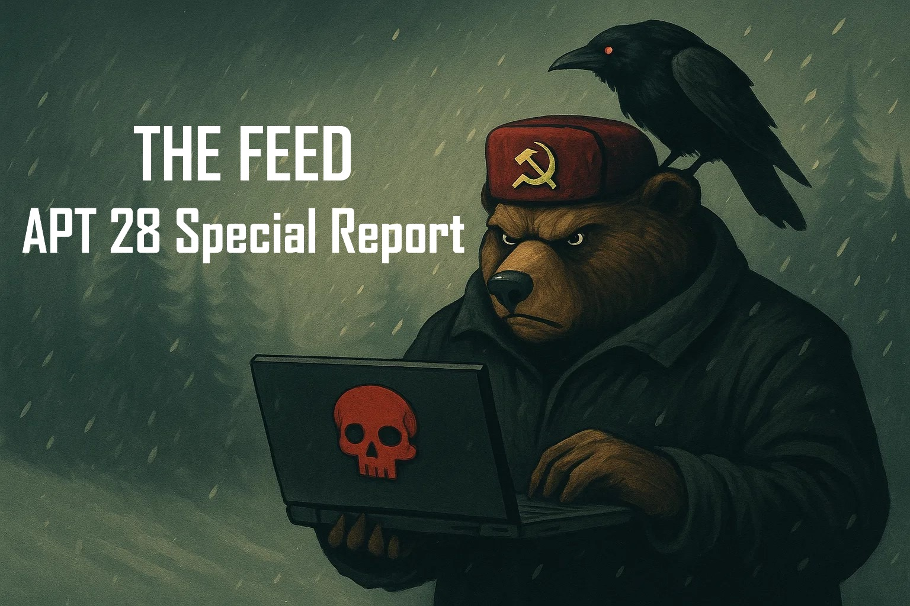
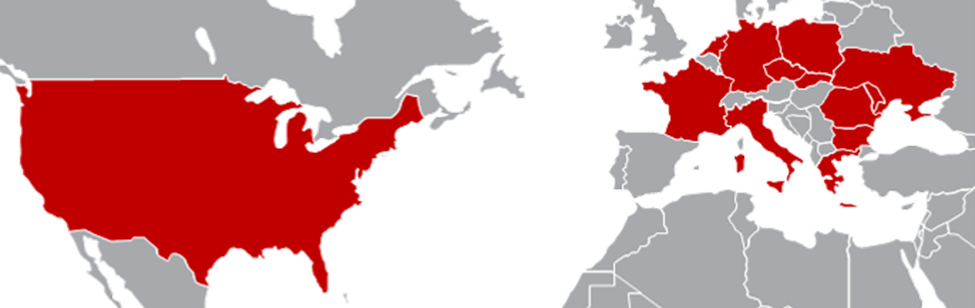

# The Feed 2025-06-04


## AI Generated Podcast

[Spotify](https://open.spotify.com/episode/5ovT3YTo6bUC2bV8v6eiFr?si=nJhp0MjvTD2e8SvvYpvi1A)

## Table of Contents

[APT28 Threat Actor Overview](#apt28-threat-actor-overview)\
[Strategic Objectives and Motivation](#strategic-objectives-and-motivation)\
[Targeting Landscape](#targeting-landscape)\
[Malware and Tools](#malware-and-tools)\
[Influence Operations](#influence-operations)\
[Notable Campaigns](#notable-campaigns)\
[Tactics, Techniques, and Procedures (TTPs)](#tactics-techniques-and-procedures-ttps)\
[APT28 Recent campaign to Target European Logistic Companies](#apt28-recent-campaign-to-target-european-logistic-companies)\
[Sources](#sources)

## APT28 Threat Actor Overview

APT28, known by numerous monikers including Fancy Bear, Forest Blizzard, and Sednit, is a state-integrated cyber espionage group widely and consistently attributed to Russia's Main Intelligence Directorate (GRU), specifically Unit 26165. This group has been operational since at least 2004, making it one of the most enduring threat actors in the cyber landscape. Official attribution has been made by governments in the United States, United Kingdom, and members of the European Union. Despite these public attributions, the group has continued its operations, suggesting efforts to enhance operational security and diversify toolkits to evade detection and complicate attribution.

Attribution Names:
 - APT28
 - Fancy Bear
 - Forest Blizzard
 - Sednit
 - Sofacy
 - STRONTIUM
 - Pawn Storm
 - Tsar Team
 - Blue Delta
 - G0007

## Strategic Objectives and Motivation

The primary driver behind APT28's activities is intelligence collection in direct support of Russian foreign policy and military objectives. Their targeting aligns closely with Russia's geopolitical interests, focusing on entities that can provide insights into security, diplomatic strategies, and international relations.

While intelligence gathering is the main focus, APT28 also engages in influence operations and, to a lesser extent, disruptive and destructive attacks. The war in Ukraine since 2022 has intensified Russian cyber operations, with APT28 concentrating heavily on broadly disrupting Ukrainian sectors and industries while gathering intelligence to support military objectives. Between November 2023 and October 2024, approximately 90% of observed Russian cyberattacks, including those by APT28, impacted organizations in Ukraine or NATO member states, underscoring Moscow's prioritization of intelligence related to the Ukraine conflict.

## Targeting Landscape

APT28 targets a broad spectrum of entities globally, with a notable shift in focus since the 2022 invasion of Ukraine. While Eastern Europe remains a key area, campaigns have extended across nearly every European nation, as well as select countries in Asia, the Caucasus, Central Asia, and North and South America.

Key targeted sectors include:
*   **Government and Diplomatic Institutions:** Consistently among the most frequent targets, seeking intelligence on geopolitical strategies and foreign policies. This includes foreign affairs ministries, ministries of defense, embassies, and government offices worldwide. Targeted to monitor international support for Ukraine and anticipate potential military or economic aid strategies.
*   **Military and Defense:** Aimed at uncovering sensitive information related to security measures, military operations, and defense technologies. This sector, including NATO and affiliated entities, is a consistent priority.
*   **Transportation and Logistics:** A significant focus since 2020, intensifying since 2023, particularly targeting Western civilian aviation-related organizations, transportation logistics companies, and rail and maritime organizations. This targeting appears aimed at collecting intelligence to monitor humanitarian and military logistical support to Ukraine and potentially in preparation for disruptive operations in the event of escalation. Targeted entities include government civil aviation agencies, air traffic control, maritime companies, rail operators, and companies involved in producing ICS components for railway management.
*   **Non-Governmental Organizations (NGOs):** Targeted due to their ties to current or former politicians and their provision of aid to Ukraine.
*   **Information Technology (IT):** Targeted to access downstream customers through supply chain compromises and MSP abuse. Midnight Blizzard (SVR-aligned) is particularly noted for this.
*   **Energy Sector:** A consistent target, including critical infrastructure. Seashell Blizzard (GRU-aligned) has capabilities tailored to ICS/SCADA systems and has targeted energy distribution systems.
*   **Education:** Targeted for access to individuals connected to government, defense, and NGOs.
*   **Supranational Organizations:** Including entities like the European Commission, various UN agencies, the World Bank, and WHO's European Region.
*   **Think Tanks:** Targeted likely for their role in shaping regional strategic policies.
*   **Private Security Companies:** Targeted to steal information related to weapons systems and strategic plans.

Geographically, Ukraine has been the primary focus, accounting for approximately 37% of activity since 2022. Poland follows at 18%. Other frequently targeted countries mentioned include the United States, United Kingdom, Spain, Germany, France, Belgium, Bulgaria, Romania, Czech Republic, Greece, Italy, Moldova, Netherlands, Slovakia, Turkey, Australia, Canada, Central Asia, Caucasus, East Asia, and South America.



## Malware and Tools

APT28 utilizes a mix of bespoke malware and commercially available tools. Custom malware often features sophistication and modularity.
*   **Custom Backdoors/Implants:** FoggyWeb, MagicWeb (Midnight Blizzard), Tavdig, Kazuar, TwoDash (Secret Blizzard), Merlin (Storm-1837), ZorRoar (Ghost Blizzard), Jaguar Tooth (Cisco IOS backdoor), CredoMap (stealer, evolved into OCEANMAP), Headlace (multi-stage backdoor, uses headless browser), MASEPIE (Python backdoor, C2 via TCP), OCEANMAP (C# backdoor, C2 via IMAP), HATVIBE (HTA loader), CHERRYSPY (Python backdoor, uses AES/RSA), GooseEgg (privilege escalation/loader, exploits CVE-2022-38028), SkinnyBoy, Drovorub, SOURFACE/Sofacy, EvilToss/CHOPSTICK, JHUHUGIT, Komplex, Zebrocy.
*   **JavaScript Payloads (SpyPress):** SpyPress.HORDE, SpyPress.MDAEMON, SpyPress.ROUNDCUBE, SpyPress.ZIMBRA, used to steal webmail credentials, contacts, login history, emails, 2FA secrets, and create App Passwords by injecting into vulnerable webmail clients.
*   **Commodity/Commercial Tools:** AADInternals (PowerShell toolkit for Azure AD/O365 abuse), Cobalt Strike (penetration testing tool used for C2, reconnaissance, lateral movement), Mimikatz (extracts Windows passwords), Meterpreter (Metasploit payload for stealthy C2/control), Impacket (open-source tool for lateral movement, execution, etc.), PsExec (SysInternals tool for remote execution).
*   **Exploitation Tools:** GooseEgg (for CVE-2022-38028), tools exploiting Outlook CVE-2023-23397, tools exploiting WinRAR CVE-2023-38831, tools exploiting Follina CVE-2022-30190.

## Influence Operations

APT28 complements its espionage efforts with covert influence operations. Since mid-2023, actors like Ruza Flood (known for Doppelganger campaign), Storm-1516, Storm-1679, and Volga Flood have been prominent. These groups leverage digital platforms to craft tailored disinformation, often using multimedia content and AI, aiming to dissuade Western support for Ukraine. APT28 has historically engaged in hack-and-leak campaigns (e.g., DNC, WADA, Macron campaign) where stolen data is released to shape narratives. Overlaps with pseudo-hacktivist groups are noted, potentially used for plausible deniability.

## Notable Campaigns

The Russian state-sponsored threat actor group known by various names, including APT28, Forest Blizzard, Fancy Bear, Sednit, and STRONTIUM, has been involved in numerous notable cyber campaigns and operations. These activities are primarily driven by intelligence-gathering objectives to support Russia's political and military goals, particularly in the context of the war in Ukraine. While their main focus is espionage, they also engage in influence operations and, to a lesser extent, disruptive and destructive attacks. Since the start of the war in Ukraine in 2022, APT28 has adapted its methods and objectives, shifting its focus and evolving its tactics and tools.

Here is a list of notable campaigns and operations attributed to APT28 and its aliases :

**1. Operation RoundPress**
This operation, assessed with medium confidence to be run by the Sednit group (an alias for APT28), targets high-value webmail servers with the goal of stealing confidential data from specific email accounts. The compromise chain involves sending spearphishing emails leveraging Cross-Site Scripting (XSS) vulnerabilities to inject malicious JavaScript code into the victim's webmail page. Initially, in 2023, the operation focused on Roundcube. However, in 2024, it expanded to target other webmail software such as Horde, MDaemon, and Zimbra. Sednit used both known and zero-day XSS vulnerabilities, including CVE-2020-35730, CVE-2023-43770 in Roundcube, a zero-day vulnerability in MDaemon (CVE-2024-11182), and vulnerabilities in Horde and Zimbra. The payloads used in this operation are various SpyPress stealers (SpyPress.HORDE, SpyPress.MDAEMON, SpyPress.ROUNDCUBE, and SpyPress.ZIMBRA). These payloads are designed to steal webmail credentials and exfiltrate contacts and email messages from the victim's mailbox. Notably, SpyPress.MDAEMON also has capabilities to steal the two-factor authentication secret and create an App Password to bypass 2FA protection, and can add Sieve rules to forward incoming emails to an attacker-controlled mailbox. The targets primarily include Ukrainian governmental entities and defense companies, as well as African, EU, and South American governments.

**2. Targeting Western Logistics Entities and Technology Companies**
As detailed in a Joint Cybersecurity Advisory (CSA) by multiple international agencies, including CISA, NSA, FBI, and others, Russia's GRU Unit 26165 (known as APT28, Fancy Bear, Forest Blizzard, etc.) has conducted a sustained cyber-espionage campaign targeting Western logistics entities and technology companies since early 2022. This campaign reflects a strategic effort to compromise supply chains supporting Ukraine. The operations target dozens of entities across air, sea, and rail transportation modes, including government organizations and private/commercial entities in NATO member states, Ukraine, and at international organizations, focusing on the defense industry, transportation hubs, maritime, air traffic management, and IT services. Initial access methods include credential guessing/brute force, spearphishing (for credentials and malware delivery), and the exploitation of various vulnerabilities like the Outlook NTLM vulnerability (CVE-2023-23397), Roundcube vulnerabilities, WinRAR vulnerability (CVE-2023-38831), public-facing applications (VPNs, SQL injection), and compromised SOHO devices. After gaining access, actors perform reconnaissance, move laterally using tools like Impacket and PsExec, dump Active Directory databases, modify mailbox permissions for sustained email collection, retrieve plaintext passwords via Group Policy Preferences, and delete event logs. Malware used includes HEADLACE and MASEPIE, and persistence is established through scheduled tasks, run keys, and startup folders. Data exfiltration is conducted using methods like PowerShell, Exchange Web Services (EWS), and Internet Message Access Protocol (IMAP). This campaign is also likely connected to the targeting of IP cameras at Ukrainian border crossings to monitor aid shipments.

**3. Targeting Western Civilian Transportation**
Microsoft Threat Intelligence has observed Forest Blizzard, a GRU-linked threat actor, targeting the civilian transportation sector in the West, including aviation, logistics, rail, and maritime organizations. The primary objective is assessed to be collecting intelligence to monitor humanitarian and military logistical support to Ukraine. This targeting has occurred since at least 2020, with a possible increase in operational tempo since 2023, particularly against Western civilian aviation-related organizations. Forest Blizzard uses multiple access vectors, with primary approaches being password spray attacks, phishing emails, and exploitation of Internet-facing edge devices and servers. Notable instances include password spray attacks against air traffic control organizations in Europe and the U.S., compromising maritime and transportation/logistics companies in the U.S. and Ukraine, NTLM hash stealing campaigns targeting civil aviation agencies, credential stealing phishing emails to government transportation departments, obtaining credential access to airport management companies, tunneling through Fortinet devices to target rail operators, and exploiting vulnerabilities like CVE-2020-0688 in Microsoft Exchange.

**4. Global Brute Force Campaign**
Russian GRU, including unit 26165 (APT28, Fancy Bear, Forest Blizzard), has conducted extensive password spraying attacks as a low-cost and effective method to gain initial access to networks using valid accounts. This campaign involves targeting common or weak passwords across many accounts, often spreading attempts over time to avoid detection. Operations exhibit characteristics such as the use of anonymization infrastructure like Tor and commercial VPNs, frequent rotation of IP addresses, and connections made via encrypted TLS. Microsoft Threat Intelligence has observed Forest Blizzard and Midnight Blizzard conducting password spray attacks.

**5. Exploitation of CVE-2023-23397 (Outlook NTLM vulnerability)**
APT28 and GRU unit 26165 have weaponized the Microsoft Outlook NTLM vulnerability (CVE-2023-23397) to collect NTLM hashes and credentials. This vulnerability allows external actors to send specially crafted emails that cause a connection from the victim to an untrusted location controlled by the attacker, leaking the Net-NTLMv2 hash which can then be relayed for authentication against other systems. The exploitation does not require user interaction. APT28 began exploiting this zero-day vulnerability in March 2022, prior to its public disclosure, and continued its use even after it was patched, demonstrating a dedication to intelligence gathering. This exploit has been used in numerous campaigns targeting over 30 organizations in 14 nations, with a primary focus on NATO members, and has been used in campaigns against logistics entities and technology companies.

**6. Exploitation of CVE-2022-30190 (Follina)**
APT28 has utilized weaponized documents exploiting the Follina vulnerability (CVE-2022-30190) in their CredoMap campaigns and other attacks. This vulnerability in the Microsoft Support Diagnostic Tool (MSDT) allows for code execution by exploiting a flaw when opening a malicious RTF document. This method was used to download an HTML file, which then executes JavaScript code to download and launch malware like the CredoMap stealer.

**7. Exploitation of CVE-2023-38831 (WinRAR)**
GRU unit 26165 and Forest Blizzard have leveraged the WinRAR vulnerability (CVE-2023-38831) as a means of initial access. This vulnerability allows attackers to execute arbitrary code via specially crafted ZIP archives. When a user attempts to open a benign file within a malicious archive containing a folder with a matching name concealing executable content, it results in the execution of the malicious code. This technique was used to deliver the Headlace malware.

**8. Exploitation of CVE-2022-38028 (Windows Print Spooler via GooseEgg)**
Forest Blizzard has used a custom tool called GooseEgg to exploit the CVE-2022-38028 vulnerability in the Windows Print Spooler service. This exploitation allows for privilege escalation and credential theft. GooseEgg exploits the vulnerability by modifying a JavaScript constraints file and executing it with SYSTEM-level permissions. Microsoft has observed Forest Blizzard using GooseEgg as part of post-compromise activities against government, non-governmental, education, and transportation sector organizations.

**9. Jaguar Tooth Campaign**
The Jaguar Tooth malware campaign, attributed to APT28, targets Cisco IOS routers by exploiting the Simple Network Management Protocol (SNMP) vulnerability CVE-2017-6742. This vulnerability allows for remote code execution and write access to the target operating system. The exploit uses Return Oriented Programming (ROP) techniques to overwrite memory and incrementally deploy the malware payload. This vulnerability has also been used by APT28 for reconnaissance purposes.

**10. CredoMap Campaign**
CredoMap is a stealer malware used in a campaign by APT28 to target users in Ukraine during the ongoing war. The malware is distributed through weaponized documents that exploit the Follina vulnerability (CVE-2022-30190). CredoMap's primary function is to steal credentials and cookies from web browsers like Google Chrome, Mozilla Firefox, and Microsoft Edge, and exfiltrate the stolen information using the IMAP email protocol. It specifically targeted users in Ukraine.

**11. Headlace Campaign**
The HeadLace malware campaign is a multi-stage operation used by APT28 to compromise systems and steal credentials. Infection typically begins with a phishing email containing a malicious URL that leads to legitimate web services weaponized to host malicious scripts. These scripts use techniques like the search-ms protocol and browser history manipulation. The initial script downloads a ZIP archive containing the HeadLace dropper, which is disguised with a double file extension and can be executed by exploiting the CVE-2023-38831 WinRAR vulnerability, DLL hijacking, or direct execution. The HeadLace dropper writes and executes files for malicious operations, using self-deleting mechanisms and leveraging Microsoft Edge in headless mode to fetch and execute additional payloads. It facilitates data exfiltration and maintains persistence through a continuous execution loop. Phishing lures often relate to current events or attractive offers, such as a fake advertisement for a car. HEADLACE has been used in campaigns targeting logistics and IT entities and critical infrastructure organizations.

**12. Steal-It Campaign**
The "Steal-It" campaign is a cyber espionage operation designed by APT28 to steal and exfiltrate NTLMv2 hashes and system information. The threat actors utilize customized PowerShell scripts, system commands, and the Mockbin API platform. This campaign employs a geofencing strategy targeting specific regions including Australia, Poland, and Belgium. The initial infection vector involves LNK files concealed in zip archives, and persistence is established through the use of the StartUp folder. Different infection chains are used, including one for NTLMv2 hash stealing, and others that use lures like the OnlyFans or Fansly brands, or are disguised as Windows updates, to trick users into downloading malicious files that collect and exfiltrate system information.

**13. MASEPIE, OCEANMAP, STEELHOOK**
APT28 uses a suite of malware including MASEPIE, OCEANMAP, and STEELHOOK, which are linked through their coordinated use and evolution from older malware like CREDOMAP. MASEPIE is a Python-based backdoor used after initial access to establish a foothold and execute further payloads. OCEANMAP is a C# backdoor that executes commands using cmd.exe and uses the IMAP protocol as a control channel, achieving persistence by creating a .URL file in the autorun directory. STEELHOOK is a PowerShell script designed to steal Internet browser data from Chrome and Edge, exfiltrating data to a management server. These malware variants work together in cyberattacks to establish persistence, steal data, and enable further reconnaissance and lateral movement. They have been used in phishing campaigns impersonating government and non-governmental organizations (NGOs) in Europe, the South Caucasus, Central Asia, and North and South America, using lures on various topics. While OCEANMAP and STEELHOOK were not directly observed targeting logistics or IT entities, their use in other sectors suggests they could be deployed there.

**14. HATVIBE and CHERRYSPY**
The malware campaign involving HATVIBE and CHERRYSPY represents a significant cyber espionage threat used by APT28. First observed in April 2023, it targets government entities, human rights organizations, educational institutions, and private security companies, predominantly in Central Asia, but also extending to East Asia and Europe. HATVIBE, a custom HTML Application (HTA) loader, serves as the initial entry point, delivering and executing other malicious payloads, most notably the CHERRYSPY backdoor. Persistence is achieved through scheduled tasks executing the HTA file. CHERRYSPY, a custom Python backdoor, also achieves persistence through scheduled tasks and uses a combination of asymmetric (RSA) and symmetric (AES) encryption for secure communication with its C2 server.

**15. Compromise of Ubiquiti EdgeRouters**
APT28, Forest Blizzard, and GRU unit 26165 demonstrate a preference for compromising edge infrastructure, such as routers and other internet-connected devices like Ubiquiti EdgeRouters. This tactic allows them to maintain access and facilitate covert cyber operations. Compromised routers are used to collect credentials, proxy network traffic, host spear-phishing pages, deploy custom tools, collect NTLMv2 digests, execute NTLM relay attacks, and serve as command-and-control infrastructure. A notable instance involved cooperation between cybercriminals and APT28, where Moobot malware deployed by cybercriminals on Edge OS routers was repurposed by APT28 using bespoke scripts.

**16. DNC Hack (2016)**
Fancy Bear (APT28), linked to GRU Unit 26165, is known for hacking into Democratic National Committee (DNC) email servers in 2016 in an attempt to influence the outcome of the United States presidential elections. The group penetrated the networks of the Democratic Congressional Campaign Committee (DCCC) and the DNC via phishing attacks. They employed X-Agent malware for remote-command execution, file transmissions, and keylogging, and X-Tunnel malware. Material obtained, including emails from Hillary Clinton's campaign staff, was subsequently leaked to WikiLeaks and posted online using fronts like DCLeaks and Guccifer 2.0.

**17. German Federal Parliament Hack (2015)**
Fancy Bear (APT28), attributed to GRU Unit 26165, was publicly linked to intrusions into the German Bundestag in 2015. During April and May 2015, APT28 penetrated the network by means of a large-scale phishing campaign. An estimated 16 gigabytes of data, including emails from Members of Parliament (MPs), were exfiltrated to foreign servers. A German arrest warrant was issued in May 2020 for Dmitriy Badin, a suspected Unit 26165 officer, for his alleged involvement.

**18. Hack of Macron's Presidential Campaign (2017)**
On the eve of the French Presidential Election in 2017, the campaign of presidential candidate Emmanuel Macron was targeted by Fancy Bear (APT28) in a coordinated phishing campaign. Tens of thousands of emails and other internal documents were released online overnight. France, the EU, and the US blamed Russia and APT28 for trying to influence the election.

**19. World Anti-Doping Agency (WADA) Hack (2016)**
Fancy Bear (APT28/Sednit) played a major role in manipulating athletes' medical records stored in the Administration and Management System (ADAMS) database of the World Anti-Doping Agency (WADA) in September 2016. This incident occurred amid controversy over the exclusion of Russian athletes from the 2016 Rio Olympics due to doping allegations, and the attack was perceived as retaliatory.

**20. Ukraine Military App Hack (2014-2016)**
APT28 (Fancy Bear) was involved in hacking a Ukrainian military application between 2014 and 2016. This involved the use of Fancy Bear Android malware in the tracking of Ukrainian field artillery units.

These campaigns demonstrate APT28's diverse capabilities, evolving tactics, and consistent alignment with Russian strategic interests, particularly in the realm of cyber espionage and information operations.

## Tactics, Techniques, and Procedures (TTPs)

APT28 employs a sophisticated and adaptable set of TTPs, often combining well-known methods with custom tools and exploits to achieve objectives while evading detection.

*   **Initial Access (TA0001):**
    *   **Spear Phishing (T1566):** A primary vector, frequently using tailored emails with malicious attachments (T1566.001), malicious links (T1566.002), or via services (T1566.003) to harvest credentials or deploy malware. Lures are often related to current events or relevant topics, sometimes using compromised legitimate accounts or free webmail. Star Blizzard (FSB-linked) is known for elaborate phishing campaigns.
    *   **Password Spraying / Brute Force (T1110.003):** A low-cost method exploiting weak password hygiene and authentication policies, often spread over time to avoid detection. Forest Blizzard and Midnight Blizzard are observed using this technique. Includes password guessing (T1110.001).
    *   **Exploiting Public-Facing Applications (T1190):** Targeting vulnerabilities in web servers, webmail (Roundcube, Horde, MDaemon, Zimbra), VPNs, Cisco IOS, and the Windows Print Spooler service. This includes exploiting known vulnerabilities and previously unknown (zero-day) flaws. Notable exploited CVEs include CVE-2023-23397 (Microsoft Outlook NTLM vulnerability), CVE-2022-38028 (Windows Print Spooler), CVE-2023-38831 (WinRAR), CVE-2022-30190 (Follina), CVE-2017-6742 (Cisco IOS SNMP), and various Roundcube vulnerabilities (CVE-2020-35730, CVE-2021-44026, CVE-2020-12641, CVE-2020-13965, CVE-2023-43770). A zero-day in MDaemon (CVE-2024-11182) was also exploited.
    *   **Trusted Relationships (T1199) / Supply Chain Compromise:** Gaining access through IT firms or service providers to target downstream customers. Midnight Blizzard is known for this, including the SolarWinds attack. Leveraging relationships with entities that have business ties to the primary target.
    *   **Token Replay (T1528):** Leveraging stolen tokens for access, particularly to cloud resources.

*   **Execution (TA0002):**
    *   Uses various scripting languages and command interpreters like PowerShell (T1059.001), Windows Command Shell (T1059.003), Visual Basic (T1059.005), Python (T1059.006), and JavaScript (T1059.007). Often involves user execution via malicious links (T1204.001) or files (T1204.002). Exploitation for client execution (T1203) via vulnerable webmail is observed.

*   **Persistence (TA0003):**
    *   **Scheduled Task/Job (T1053.005):** Creating scheduled tasks for persistence.
    *   **Boot or Logon Autostart Execution (T1547):** Using Registry Run Keys / Startup Folder (T1547.001) or modifying shortcuts in the startup folder (T1547.009).
    *   **External Remote Services (T1133):** Maintaining access via compromised edge devices/VPNs.
    *   **Server Software Component (T1505.003):** Installing web shells on servers.
    *   **Account Manipulation (T1098.002):** Modifying mailbox permissions for sustained email collection.

*   **Defense Evasion (TA0005):**
    *   **Obfuscated Files or Information (T1027):** Including encoding/encryption (T1027.013) and using obfuscated JavaScript.
    *   **Masquerading (T1036):** Matching legitimate names or locations (T1036.005) or using legitimate tools.
    *   **Living Off the Land (LOLBINs):** Leveraging legitimate, pre-installed system binaries (mshta.exe, cmd, bat, vbs, PowerShell, search-ms URI handler, python, wevtutil, vssadmin, ntdsutil, reg, etc.) to perform malicious activities under the radar, blending in with normal operations and reducing forensic evidence.
    *   **Impair Defenses (T1562.004):** Disabling or modifying system firewalls. Deleting event logs (T1070.001) and manipulating volume shadow copies (vssadmin) to hide tracks and disrupt recovery.
    *   **Process Injection (T1055):** Injecting code into remote processes.
    *   **API Hooking (T1179):** Patching authentication functions (Jaguar Tooth).
    *   **Runtime Checks:** Using checks to detect analysis environments.
    *   **Toolkit Diversification:** Continuously refining TTPs and employing new custom techniques/malware to circumvent detection.

*   **Credential Access (TA0006):**
    *   **OS Credential Dumping (T1003):** Extracting passwords from memory (Mimikatz), dumping registry hives (SAM, SECURITY), and targeting ntds.dit (T1003.003). Forest Blizzard uses `vssadmin` to dump credentials.
    *   **Credentials from Password Stores (T1555.003):** Stealing browser credentials (LightSwipe, STEELHOOK).
    *   **Brute Force (T1110):** Password spraying (T1110.003). Password guessing (T1110.001).
    *   **Forced Authentication (T1187):** Exploiting Outlook NTLM vulnerability (CVE-2023-23397).
    *   **Steal Application Access Token (T1528):** Stealing tokens.
    *   **Adversary-in-the-Middle (T1557):** Intercepting network traffic. Includes phishing techniques like "man-in-the-browser" or "browser in browser" attacks.
    *   **Multi-Factor Authentication Interception (T1111):** Using multi-stage redirectors or dedicated webpages/scripts to bypass MFA.
    *   **Modify Authentication Process (T1556.006):** Stealing 2FA tokens and creating application passwords (SpyPress.MDAEMON).
    *   **Unsecured Credentials (T1552.006):** Retrieving plaintext passwords from Group Policy Preferences.

*   **Discovery (TA0007):**
    *   Remote System Discovery (T1018), File and Directory Discovery (T1083), Account Discovery (T1087), Network Service Discovery (T1046). Enumerating Windows environments using tools like ldap-dump.py (T1087.002) and ADExplorer.
    *   Conducting contact information reconnaissance (T1589.002) and reconnaissance of cybersecurity departments, transport coordinators, and partner companies (T1591).

*   **Collection (TA0009):**
    *   **Data from Local System (T1005), Data Staged (T1074), Automated Collection (T1119):** Collecting various data types automatically. Includes collecting configuration files, firmware versions, directory listings, network information from routers (Jaguar Tooth), and capturing NTLMv2 hashes.
    *   **Email Collection (T1114):** Retrieving sensitive data from email servers (T1114), including remote collection via protocols like EWS and IMAP (T1114.002). Using periodic EWS queries for new emails (T1119, T1029). Stealing webmail credentials, contacts, login history, and email messages via injected JavaScript (SpyPress).
    *   **Input Capture (T1056.003):** Web Portal Capture using fake login forms.
    *   **Archive Collected Data (T1560):** Archiving data in .zip files (T1560.001) before exfiltration.
    *   **Video Capture (T1125):** Attempting to gain access to IP camera feeds (RTSP).

*   **Command and Control (TA0011):**
    *   **Application Layer Protocol (T1071.001):** Using Web Protocols (HTTP/HTTPS) for C2 communication. Mail Protocols (IMAP) can also be used (OCEANMAP).
    *   **Ingress Tool Transfer (T1105):** Transferring tools into the network.
    *   **Dynamic Resolution (T1568.002):** Using Domain Generation Algorithms.
    *   **Proxy (T1090):** Using external proxies (T1090.002), multi-hop proxies (T1090.003) like TOR and commercial VPNs, and compromised SOHO devices to facilitate operations and obfuscate origin.
    *   **Multi-Stage Channels (T1104):** Using multi-stage redirectors.
    *   **Encrypted Channel (T1573):** Connecting to victim infrastructure using encrypted TLS.
    *   **Data Encoding (T1132.001):** Base64 encoding data before sending to C2.

*   **Exfiltration (TA0010):**
    *   **Exfiltration Over C2 Channel (T1041) / Exfiltration Over Web Service (T1567):** Exfiltrating data over the established C2 communication channels.
    *   **Automated Exfiltration (T1020):** Automatically exfiltrating data (SpyPress).
    *   **Exfiltration Over Alternative Protocol (T1048):** Attempting to exfiltrate archived data via a previously dropped OpenSSH binary.
    *   **Scheduled Transfer (T1029):** Using periodic EWS queries to collect new emails.
    *   **Email Collection: Email Forwarding Rule (T1114.003):** Creating Sieve rules to forward incoming emails to attacker-controlled addresses.


## APT28 Recent campaign to Target European Logistic Companies

### Summary

Russian state-sponsored threat actors, including those tracked under names such as APT28, Fancy Bear, Forest Blizzard, GRU Unit 26165, BlueDelta, Sednit, and Sofacy, are employed by the Russian state to support its strategic goals. For approximately the last two years, these goals have been heavily concentrated on supporting Russia's war in Ukraine. The primary focus of these actors is intelligence-gathering operations, although they also engage in influence operations and, to a lesser extent, disruptive and destructive attacks. Since November 2023, Microsoft Threat Intelligence has observed that roughly 90% of cyberattacks carried out by Russian threat actors have impacted organizations located in Ukraine or NATO member states. This concentration of targeting underscores Moscow's priority on collecting intelligence relevant to the conflict in Ukraine and Western policies concerning it.

Cyber operations serve as a strategic extension of geopolitical aggression, particularly since the onset of the Ukraine conflict. GRU Unit 26165, specifically, has been predominantly involved in espionage activities. As Western countries began providing aid to support Ukraine's defense, Unit 26165 expanded its targeting to include logistics entities and technology companies involved in the coordination, transport, and delivery of this foreign assistance. This campaign reflects a refined and persistent strategic effort by the group to compromise supply chains supporting Ukraine. Beyond direct targeting of logistics entities, these actors have also sought to monitor and track aid shipments by targeting Internet-connected cameras located at Ukrainian border crossings and other key locations. Understanding the tactics, techniques, and procedures (TTPs) of these actors is crucial for organizations deemed most at risk.

### Technical Details

The recent cyber campaign attributed to Russia's GRU Unit 26165 (APT28/Forest Blizzard) targeting Western logistics entities and technology companies involved in supporting Ukraine is primarily espionage-oriented and utilizes a combination of previously disclosed and evolving TTPs. This sustained campaign has been active since at least early 2022, exploiting both legacy and zero-day vulnerabilities.

**Initial Access:**
The initial access techniques employed by Unit 26165 actors in this campaign are diverse:
*   **Credential Guessing/Brute Force:** Actors conducted credential guessing [T1110.001] and password spraying [T1110.003] operations. These attacks often use anonymization infrastructure like Tor and commercial VPNs [T1090.003], frequently rotating IP addresses to evade detection. All observed connections in this type of activity were made via encrypted TLS [T1573].
*   **Spearphishing:** Spearphishing is a frequent initial access vector. Emails often contain links [T1566.002] leading to fake login pages impersonating government entities or Western cloud email providers, hosted on free third-party services or compromised SOHO devices. These lures often use legitimate documents and are written in the target's native language. Phishing emails are typically sent from compromised accounts or free webmail providers [T1586.002, T1586.003]. Some campaigns utilize multi-stage redirectors [T1104] to verify IP-geolocation [T1627.001] and browser fingerprints [T1627], providing MFA [T1111] and CAPTCHA [T1056] relaying capabilities. Redirector services observed include Webhook[.]site, FrgeIO, InfinityFree, Dynu, Mocky, Pipedream, and Mockbin[.]org. Spearphishing is also used to deliver malware executables [T1204.002] (like HEADLACE and MASEPIE) via third-party services and redirectors [T1566.002], or scripts [T1059] in various languages (BAT [T1059.003], VBScript [T1059.005]), and links to hosted shortcuts [T1204.001].
*   **Exploitation of Public-Facing Applications and CVEs:** Actors exploit vulnerabilities in public-facing applications. Specific CVEs leveraged include the Outlook NTLM vulnerability (CVE-2023-23397) to collect NTLM hashes and credentials via crafted calendar invites [T1187], and several Roundcube CVEs (CVE-2020-12641, CVE-2020-35730, CVE-2021-44026) to execute arbitrary shell commands [T1059], access email accounts, and retrieve data. Since at least Fall 2023, the WinRAR vulnerability (CVE-2023-38831) has been exploited, allowing arbitrary code execution from a malicious archive [T1659], delivered via email attachments [T1566.001] or links [T1566.002]. Exploitation of Internet-facing infrastructure, including corporate VPNs [T1133], public vulnerabilities, and SQL injection [T1190] are also used. Additionally, actors abused SOHO devices [T1665] to facilitate covert operations and proxy malicious activity near the target.

**Post-Compromise TTPs:**
After gaining initial access, actors conduct detailed reconnaissance and move laterally within the compromised environment.
*   **Reconnaissance:** Post-compromise reconnaissance involves identifying additional targets in key positions by gathering contact information [T1589.002]. They also conduct reconnaissance on the cybersecurity department [T1591], individuals coordinating transport [T1591.004], and companies cooperating with the victim entity [T1591.002].
*   **Lateral Movement:** Native commands and open-source tools like Impacket and PsExec are used for lateral movement [TA0008]. Impacket scripts may be used as .exe files or python versions. Lateral movement also occurs via Remote Desktop Protocol (RDP) [T1021.001]. PsExec's default behavior involves dropping an 8-character executable and creating a service with a 4-character name. It also uses named pipes (e.g., RemCom\_*, *-stdin, *-stderr, *-stdout) for command execution and output.
*   **Credential Access and Data Collection:** A major focus is credential access and collecting sensitive information. Actors move onto Domain Controllers (often via RDP) to extract the NTDS.dit database [T1003.003] using `ntdsutil.exe`. An observed command for this is `C:\Windows\system32\ntdsutil.exe "activate instance ntds" ifm "create full C:\temp\[a-z]{3}" quit quit`. Tools like ADExplorer and Certipy are used to harvest and exfiltrate data from Active Directory. Python [T1059.006] is installed on compromised machines to run Certipy. They also retrieve plaintext passwords via Group Policy Preferences [T1552.006] using tools like `Get-GPPPassword.py`. A modified `ldap-dump.py` is used to enumerate the Windows environment [T1087.002] and conduct password spray attacks [T1110.003] via LDAP. Actors locate and exfiltrate lists of Office 365 users and set up sustained email collection by manipulating mailbox permissions [T1098.002]. They enroll compromised accounts in MFA mechanisms [T1556.006] to increase trust and maintain sustained access. After gaining initial access, they seek accounts with sensitive shipment information. In one instance, voice phishing [T1566.004] impersonating IT staff was attempted to gain access to privileged accounts.
*   **Persistence:** Persistence is achieved through various methods, including scheduled tasks [T1053.005], adding entries to Run registry keys [T1547.001], and placing malicious shortcuts in the Startup folder [T1547.009]. They were observed creating scheduled tasks using XML files. Manipulation of mailbox permissions is also a persistence method. DLL search order hijacking [T1574.001] is used to facilitate malware execution.
*   **Defense Evasion:** Actors use native Windows utilities to erase evidence and maintain stealth. This includes using `wevtutil.exe` to delete event logs [T1070.001] and `vssadmin.exe` to manipulate volume shadow copies. They also exploit Windows DLL loading by planting malicious DLLs in search order directories. Base-64 encoding is used to obfuscate scripts like LightSwipe.
*   **Data Exfiltration:** Data exfiltration techniques vary. PowerShell commands [T1059.001] prepare data, often archiving files in .zip format [T1560.001] for upload to actor infrastructure. Server data exchange protocols and APIs such as Exchange Web Services (EWS) and IMAP [T1114.002] are used to exfiltrate data from email servers. Periodic EWS queries [T1119] collect new emails since the last exfiltration [T1029]. Actors typically use infrastructure geographically close to the victim for exfiltration. Attempted exfiltration via a previously dropped OpenSSH binary [T1048] has been observed.

**Malware and Tools:**
The campaign utilizes both custom and commodity malware/tools.
*   **Custom Malware:** Notable custom variants include HEADLACE (multi-stage backdoor, headless browser automation, discreet script execution), MASEPIE (exfiltration tool), LightSwipe (Base64-encoded malicious PowerShell script to steal browser credentials), GooseEgg (exploits Windows Print Spooler), FoggyWeb and MagicWeb (Midnight Blizzard backdoors), Tavdig and Kazuar (Secret Blizzard backdoors), TwoDash (Secret Blizzard .NET implant), Merlin (Storm-1837 Golang backdoor), and ZorRoar (Ghost Blizzard RAT). While OCEANMAP and STEELHOOK have not been directly observed in logistics/IT targeting, they could be deployed. STEELHOOK is a PowerShell script targeting browser credentials.
*   **Commodity Tools:** Widely available tools are leveraged, often with minor modifications. This includes AADInternals (PowerShell toolkit for Microsoft Entra ID/O365, used for backdoors, password/key theft), Cobalt Strike (commercial pen testing, used for C2, recon, lateral movement), Mimikatz (open-source, extract plaintext Windows passwords, escalate privileges), and Meterpreter (Metasploit component, stealthy C2, in-memory DLL injection). Impacket and PsExec are also frequently used commodity/open-source tools. Certipy and ADExplorer are used for Active Directory exploration and data exfiltration. OpenSSH is used for attempted exfiltration. Native Windows utilities like `ntdsutil`, `wevtutil`, `vssadmin`, `schtasks`, `whoami`, `tasklist`, `hostname`, `arp`, `systeminfo`, `net`, `wmic`, `cacls`, `icacls`, `ssh`, and `reg` are heavily relied upon ("living off the land"). Python is installed to run tools like Certipy.

**Use of Cybercriminal and Hacktivist Resources:**
Russian state-sponsored actors are observed leveraging or impersonating cybercriminal and hacktivist groups to obfuscate activity and enhance impact. This provides plausible deniability. Examples include Seashell Blizzard being the likely perpetrator behind attacks claimed by Cyber Army of Russia and Solntsepek. Overlapping IP infrastructure between Seashell Blizzard and Cyber Army of Russia suggests shared resources. Secret Blizzard used the Amadey-bot malware of the Storm-1919 cybercriminal group to download a reconnaissance tool before deploying its custom backdoors.

**Connection to IP Camera Targeting:**
As part of monitoring aid shipments to Ukraine, Unit 26165 actors likely targeted private and municipal IP cameras, particularly those near border crossings, military installations, and rail stations. This large-scale campaign began in March 2022, involving attempts to enumerate devices [T1592] and access camera feeds [T1125]. Actor-controlled servers send RTSP DESCRIBE requests [T1090.002] with Base64-encoded credentials (including defaults and brute-forced attempts [T1110]) to RTSP servers. Successful responses provide camera snapshots and metadata. The geographic distribution of targeted cameras showed a strong focus on Ukraine (81.0%) and bordering countries like Romania (9.9%), Poland (4.0%), Hungary (2.8%), and Slovakia (1.7%).

### Countries

The countries with organizations targeted by Russian GRU Unit 26165 (APT28/Forest Blizzard) and other related Russian threat actors, particularly in campaigns impacting logistics and critical infrastructure, include:
*   Ukraine
*   United States
*   United Kingdom
*   Spain
*   Germany
*   Poland
*   Belgium
*   France
*   Bulgaria
*   Czech Republic
*   Greece
*   Italy
*   Moldova
*   Netherlands
*   Romania
*   Slovakia
*   Hungary
*   Canada
*   Central Asian countries
*   South Asian countries
*   Middle Eastern nations
*   Central European countries
*   Southern European countries
*   Balkans
*   Caucasus
*   Australia

Approximately 90% of Russian cyber targets were in Ukraine or NATO member states between November 2023 and October 2024.

### Industries

Russian state-sponsored threat actors, particularly APT28/Forest Blizzard, target a broad spectrum of individuals and organizations to support Russia's political and military objectives. Microsoft commonly observes targeting of the following sectors:
*   Government agencies and services (41% of intrusions between Nov 2023 - Oct 2024)
*   Military and defense
*   Telecommunications
*   Non-governmental organizations (NGOs) (15% of intrusions between Nov 2023 - Oct 2024)
*   Transportation and Transportation Hubs (ports, airports, etc.) (5% of intrusions between Nov 2023 - Oct 2024, including civilian aviation, logistics, rail, maritime)
*   Information Technology (IT) (12% of intrusions between Nov 2023 - Oct 2024, including IT service providers and firms)
*   Education (9% of intrusions between Nov 2023 - Oct 2024)
*   Energy (6% of intrusions between Nov 2023 - Oct 2024)
*   Financial services
*   Public services
*   Aviation entities (including air traffic control, air navigation)
*   Maritime entities
*   Rail organizations
*   Judiciary
*   Law enforcement
*   Non-profit organizations
*   Critical Infrastructure (including ICS components for railway management)
*   Media
*   Sports organizations

The targeting is driven by intelligence needs related to the war in Ukraine and broader foreign policy objectives.

### Recommendations

Organizations can enhance their security posture against Russian state-sponsored threat actors by implementing the following technical recommendations:

*   **Harden Cloud Identities and Protect Against Password Spraying:**
    *   Improve credential hygiene.
    *   Harden cloud identities.
    *   Centralize identity management into a single platform, integrating on-premises and cloud directories. Log third-party identity data into a SIEM or connect to Microsoft Entra. Synchronize most user accounts, excluding administrative/high-privileged ones, to maintain boundaries.
    *   Block legacy authentication protocols (POP3, IMAP4, SMTP) that don't support MFA and Conditional Access; use modern authentication.
    *   Understand your cloud environment’s “trust chain” and review access consistently to limit elevated privileges.
    *   Require all users to enroll in multifactor authentication (MFA) using strong factors like passkeys, PKI smartcards, Microsoft Authenticator, or FIDO2 security keys, and require regular re-authentication. Consider transitioning to passwordless primary authentication methods.
    *   Implement a sign-in risk policy using Conditional Access to automate response to risky sign-ins, such as blocking access or forcing MFA on medium-or-above risk levels.
    *   Consider using account throttling over account lockout for failed login attempts to prevent Denial of Service.
    *   Use a service to check for compromised passwords before use.
    *   Change all default credentials.
    *   Implement Active Directory Federation Service (AD FS) extranet lockout.
    *   Deploy Microsoft Entra Connect Health for AD FS to capture failed attempts and risky IPs.
    *   Use Microsoft Entra password protection to detect and block weak passwords.
    *   Turn on identity protection in Microsoft Entra.
*   **Defend Against Social Engineering and Malware Entry Vectors:**
    *   Educate users about protecting information online, filtering unsolicited communication, identifying phishing lures and watering holes, and reporting suspicious activity.
    *   Educate users on preventing malware infections by ignoring or deleting unsolicited emails or attachments.
    *   Use advanced anti-phishing solutions like Microsoft Defender for Office 365.
    *   Use web browsers that block malicious websites and solutions that detect/block malicious emails, links, and files.
    *   Configure Endpoint Detection and Response (EDR) in block mode.
    *   Enable attack surface reduction rules (available to all Microsoft Defender Antivirus customers) to prevent common malware techniques:
        *   Block Office applications from creating child processes, executable content, or injecting code.
        *   Block Office communication applications from creating child processes.
        *   Block execution of potentially obfuscated scripts.
        *   Block JavaScript or VBScript from launching downloaded executable content.
        *   Block executable content from email client and webmail.
        *   Block execution of files from globally writable directories.
        *   Unless users develop scripts, limit the local execution of scripts to known scripts and audit attempts.
        *   Disable Windows Host Scripting functionality and configure PowerShell to run in Constrained mode.
    *   Assess the potential impact of attack surface reduction rules on your network before deployment.
    *   Microsoft has changed the default behavior of Office to block macros in files from the internet.
    *   Consider using open-source SIGMA rules as a baseline for detecting suspicious file execution or command parameters.
    *   Implement allowlisting for applications and scripts where feasible.
*   **Limit Lateral Movement and Harden Endpoints:**
    *   Limit lateral movement within a network.
    *   Block process creations originating from PSExec and WMI commands on non-server systems.
    *   Block credential stealing from the Windows local security authority subsystem.
    *   Deploy and monitor Group Policies for Windows authentication.
    *   Use Microsoft Defender for Identity to explore lateral movement paths.
    *   Ensure host firewalls and network security appliances are configured to only allow legitimately needed data flows. Alert on attempts to connect laterally between devices or unusual flows.
    *   Utilize EDR and other cybersecurity solutions on all systems, prioritizing high-value systems like mail servers and domain controllers.
    *   Enable optional security features in Windows to harden endpoints.
*   **Prevent Data Exfiltration:**
    *   Follow security best practices like Zero Trust principles and implementing least privilege.
    *   Use the Microsoft Security Compliance Toolkit.
    *   Prepare for a breach and implement measures to prevent and detect exfiltration.
    *   Monitor the network perimeter and understand normal data access and internet traffic.
    *   Implement a next-generation firewall (NGFW) like Azure Firewall to monitor outbound connections to C2 servers. Azure Firewall Premium provides signature-based IDS/IPS. Integrate firewalls into a SIEM.
    *   Use a Cloud Access Security Broker (CASB) like Microsoft Defender for Cloud Apps to prevent data downloads, force encryption, control access from risky IPs, and reevaluate conditional access.
    *   Continually evaluate user access in real-time with continuous access evaluation.
    *   Classify sensitive information and create custom policies using Microsoft Information Protection and conditional access app control.
    *   Use Microsoft Defender for Cloud Apps to mark risky applications (potential exfiltration tools) as unsanctioned, blocking their use in environments with Microsoft Defender for Endpoint.
    *   Block or alert on outgoing traffic to hosting and API mocking services frequently used by GRU Unit 26165, allowlisting legitimate activity.
    *   Implement heuristic detections for web requests to new subdomains. Log requests for each subdomain in DNS or firewall logs.
*   **Incident Response and Recovery:**
    *   Reset account passwords for any accounts impacted by password spraying or whose password was discovered. If system-level permissions were involved, investigate further.
    *   Disconnect or terminate active sessions.
    *   If a compromised account has cloud resource access, revoke user access in Microsoft Entra ID.
    *   If `ntds.dit` was copied, assume all domain accounts are compromised and reset everything.
    *   If malicious sign-ins to the domain controller are seen, reset all domain administrator accounts.
    *   Isolate the system involved in exfiltration through network or physical isolation.
    *   Exercise incident-response readiness through tabletop and live drills, and conduct after-action reviews.
    *   Maintain robust backups following the 3-2-1 rule (three copies, two media types, one offline/offsite) and perform automated verification.
*   **Other Recommendations:**
    *   Onboard devices to Microsoft Defender for Endpoint to utilize automated user containment.
    *   Use device discovery to identify unmanaged devices and onboard them.
    *   For legacy systems, physically or logically isolate them and ensure no credential overlap with other systems.
    *   Perform threat and attack modeling to understand potential compromise paths and develop monitoring strategies.
    *   Collect and monitor Windows logs for certain events, especially cleared logs.
    *   Centralize auditing and logging across all layers (Windows Events, app/db, cloud, network telemetry) into your SIEM. Implement a minimum six-month retention policy for logs.
    *   Deploy Network Detection and Response (NDR) solutions to analyze network telemetry and spot lateral movement, C2, or exfiltration that EDR might miss.
    *   Restrict privileged access: have administrators use standard user accounts for routine tasks and dedicated admin accounts only for elevated activities. Restrict admin account logins to hardened, monitored jump hosts or dedicated workstations.
    *   Educate users to only use approved corporate systems for relevant government/military business and avoid personal accounts for official business. Audit email and web request logs for such activity.
    *   For organizations using on-premises authentication/email, plan to disable NTLM entirely and migrate to robust processes like PKI certificate authentication.
    *   Do not store passwords in Group Policy Preferences (GPP); remove any existing ones and change the associated account passwords.
    *   Disable protocols using weak authentication or not supporting MFA.
    *   Configure access controls carefully.

*   **Specific IP Camera Mitigations:**
    *   Ensure IP cameras are supported and apply security patches and firmware updates. Replace end-of-life devices.
    *   Disable remote access if unnecessary.
    *   Protect cameras with a security appliance (firewall), allowing communication only from an allowlist of IPs.
    *   If remote access is required, enable authentication, use a VPN, and use MFA for management accounts if supported. If supported, enable authenticated RTSP access only.
    *   Disable Universal Plug and Play (UPnP), Peer-to-Peer (P2P), and Anonymous Visit features on IP cameras and routers.
    *   Turn off other unused ports/services.
    *   Review all authentication activity for remote access and investigate unexpected activity.
    *   Audit IP camera user accounts.
    *   Configure, tune, and monitor logging if available.

### Hunting methods


*   **Logpoint Queries and Alerts (Requires Windows Process Creation/Command-Line Auditing, Registry Auditing, Sysmon, NDR, Office365 logs):**
    *   **Suspicious File Execution Using Wscript or Cscript:** Flags unexpected uses of wscript.exe or cscript.exe based on file extension patterns, while excluding known benign paths/commands.
        ```
        label="Process" label=Create "process" IN ["*\wscript.exe", "*\cscript.exe"] command IN ["*.jse*", "*.vbe*", "*.js*", "*.vba*","*.vbs*"] -path IN ["C:\Program Files\Microsoft Monitoring Agent\Agent\Health Service State\*"] -command IN ["*.json*","*C:\Windows\system32\slmgr.vbs*-rearm*"]
        ```
    *   **Detect WinRAR Spawning Unexpected Processes (CVE-2023-38831 exploitation):** Looks for `winRAR.exe` as a parent process launching suspicious child processes like command shells or scripting interpreters.
        ```
        label="Process" label=Create parent_process="*\winRAR.exe" "process" IN ["*\cmd.exe", "*\cscript.exe", "*\mshta.exe", "*\powershell.exe", "*\pwsh.exe", "*\regsvr32.exe", "*\rundll32.exe", "*\wscript.exe"]
        ```
    *   **Spot PsExec Service Install Activity:** Identifies service installation events (`norm_id=WinServer label=Service label=Install label=Successful`) and uses regex to find the characteristic 8-character executable name and 4-character service name dropped by PsExec.
        ```
        norm_id=WinServer label=Service label=Install label=Successful | process regex("(?P<new_file_name>[A-Za-z]{8}\.exe)", file) | process regex("(?P<new_service>[A-Za-z]{4})", service) |filter new_file_name=* |filter new_service=* |chart count() by host, new_file_name, new_service, image_file
        ```
    *   **Spot PsExec Named Pipe Creation (Sysmon Event IDs 17, 18):** Detects pipe creation events in Sysmon logs looking for patterns typical of PsExec communication pipes (`*RemCom*`, `*-stdin`, `*-stderr`, `*-stdout`).
        ```
        norm_id=WindowsSysmon event_id IN pipe IN ["*RemCom*", "*-stdin", "*-stderr", "*-stdout"]
        ```
    *   **Detect Impacket Invoking cmd.exe:** Hunts for `cmd.exe` executions with specific command-line arguments (`*/c*`, `*&1*`) where the parent process is a common admin or service process (`wmiprvse.exe`, `mmc.exe`, `explorer.exe`, `services.exe`, `svchost.exe`, `taskeng.exe`) often associated with Impacket's execution methods.
        ```
        label="Process" label=Create command="*cmd.exe*" command="*/c*" command="*&1*" (parent_process In ["*\wmiprvse.exe", "*\mmc.exe", "*\explorer.exe", "*\services.exe"] command="*/Q*" ) OR (parent_command IN ["*svchost.exe -k netsvcs*", "*taskeng.exe*"] command="*Windows\Temp\*")
        ```
    *   **Detect Active Directory Database Dump Attempt (NTDSUTIL):** An alert tuned to catch attempts to dump the NTDS.dit database, looking for processes like `ntdsutil.exe` or specific command-line arguments related to creating a full dump or copying the NTDS.dit and system.hiv files.
        ```
        label="Process" label=Create (("process" IN ["*\NTDSDump.exe", "*\NTDSDumpEx.exe","*\ntdsutil.exe"]) OR (command="*ntds.dit*" command="*system.hiv*") OR (command="*NTDSgrab.ps1*")) OR (command="*ac i ntds*" command="*create full*") OR (command="*/c copy *" command="*\windows\ntds\ntds.dit*") OR (command="*activate instance ntds*" command="*create full*") OR (command="*powershell*" command="*ntds.dit*") OR (command="*ntds.dit*" "process" IN ["*\apache*", "*\tomcat*", "*\AppData\*", "*\Temp\*", "*\Public\*", "*\PerfLogs\*"] OR "parent_process" IN ["*\apache*", "*\tomcat*", "*\AppData\*", "*\Temp\*", "*\Public\*", "*\PerfLogs\*"])
        ```
    *   **ADExplorer Snapshot Detection:** Detects the use of `adexplorer.exe` or files named `AdExp` when used with the `*snapshot*` command-line argument, indicating a snapshot of the Active Directory hierarchy is being taken.
        ```
        label="Process" label=Create ("process"="*\adexplorer.exe" OR "file"="AdExp") command="*snapshot*"
        ```
    *   **Certipy Tool Execution Detection (AD CS Abuse):** Detects the execution of `Certipy.exe` or processes/files/descriptions matching "Certipy" when used with command-line arguments indicative of its function (e.g., `* auth *`, `* find *`, `* forge *`, `* relay *`, `* req *`, `* shadow *`) combined with arguments related to BloodHound export or credential files (`* -bloodhound*`, `* -ca-pfx *`, etc.).
        ```
        label="Process" label=Create ("process"="*\Certipy.exe" OR file="Certipy.exe" OR description="*Certipy*") OR (command IN ["* auth *", "* find *", "* forge *", "* relay *", "* req *", "* shadow *"] command IN ["* -bloodhound*", "* -ca-pfx *", "* -dc-ip *", "* -kirbi*", "* -old-bloodhound*", "* -pfx *", "* -target*", "* -username *", "* -vulnerable*", "*auth -pfx*", "*shadow auto*", "*shadow list*"])
        ```
    *   **Python Installation Hunting:** Hunts for application installation events where the description includes "*python*", potentially indicating unexpected Python installation on a host.
        ```
        label=Install label=Application label=Successful rule_description="*python*" | chart count() by user,host,rule_description
        ```
    *   **Exchange Mailbox Folder Delegation Configured:** Detects actions related to adding or setting mailbox folder permissions in Office365 logs, specifically excluding Calendar and Contacts which often have default permissions, focusing on actions that grant broad read rights (`*ReadAny*`).
        ```
        norm_id=Office365 ((action IN ["Add-MailBoxFolderPermission", "Set-MailBoxFolderPermission"] -identity IN ["*:\Calendar", "*:\Contacts"]) OR (action IN ["AddFolderPermissions", "ModifyFolderPermissions"] item_parent_folder_member_rights="*ReadAny*" -item_parent_folder_name IN ["Calendar", "Contacts"]))
        ```
    *   **Multiple Exchange Mailboxes Accessed via API in a Short Span:** Identifies Office365 `MailItemsAccessed` actions performed by applications (user_type="Application"), particularly those using Exchange Web Services (`Client=WebServices;ExchangeWebServices%`) or Microsoft Graph, grouping by target application and counting distinct users and source addresses accessing more than 5 mailboxes within a 10-minute window.
        ```
        norm_id=Office365 action="MailItemsAccessed" user_type="Application" | process eval("match=like(client_information, 'Client=WebServices;ExchangeWebServices%')") | process eval("search_result=if(match) {return 1} else-if(target_application=='Microsoft Graph') {return 1} else {return 0}") | filter search_result=1 | timechart distinct_count(upn) as user_mailbox_count, distinct_list(user) as user_list, distinct_list(source_address) as source_address by target_application every 10 minutes | filter user_mailbox_count > 5
        ```
    *   **Suspicious Eventlog Clear or Configuration Using Wevtutil Detected:** Detects the use of utilities or commands associated with clearing, removing, limiting, or configuring event logs (`Clear-EventLog`, `Remove-EventLog`, `Limit-EventLog`, `Clear-WinEvent`, `ClearEventLog`, `clear-log`, `cl`, `set-log`, `sl`, `lfn: `) via PowerShell, wmic, or wevtutil, with exceptions for legitimate installer processes.
        ```
        label="Process" label=Create ( (("process" IN ["*\powershell.exe","*\pwsh.exe*"] command IN ["*Clear-EventLog*", "*Remove-EventLog*", "*Limit-EventLog*","*Clear-WinEvent*"]) OR ("process"="*\wmic.exe" command="* ClearEventLog *")) OR ("process"="*\wevtutil.exe" command IN ["*clear-log*", "* cl *", "*set-log*", "* sl *","*lfn: "]) ) -(parent_process IN ["C:\Windows\SysWOW64\msiexec.exe","C:\Windows\System32\msiexec.exe"] command="* sl *")
        ```
    *   **Safe DLL Search Mode Disabled (Sysmon Event ID 13):** Detects Sysmon registry value set events (event_id=13) targeting the `SafeDllSearchMode` registry key (`*\CurrentControlSet\Control\Session Manager\SafeDllSearchMode`) where the detail is set to `DWORD (0x00000000)`, indicating the safe DLL search mode has been disabled, which can be used for DLL search order hijacking.
        ```
        norm_id=WindowSysmon event_id=13 target_object='*\CurrentControlSet\Control\Session Manager\SafeDllSearchMode' detail="DWORD (0x00000000)"
        ```
    *   **Scheduled Task Creation Detected:** A generic alert that catches scheduled task creation events, looking for `schtasks.exe /create`, registry key creations under `Schedule\TaskCache\Tree`, or Windows Event ID 4698, with some exclusions for known benign tasks.
        ```
        (label="Process" label=Create "process"="*\schtasks.exe" command="* /create *" -user IN EXCLUDED_USERS) OR (label="Registry" label="Key" label="Map" "target_object"="*\SOFTWARE\Microsoft\Windows NT\CurrentVersion\Schedule\TaskCache\Tree\*" -target_object IN ["*\SOFTWARE\Microsoft\Windows NT\CurrentVersion\Schedule\TaskCache\Tree\Microsoft\Windows\UpdateOrchestrator*"] event_type=CreateKey) OR (norm_id=WinServer event_id=4698 (-command IN ["*MpCmdRun.exe","*msfeedssync.exe","*usoclient.exe"] OR (-task="\CreateExplorerShellUnelevatedTask" command="*explorer.exe")))
        ```
    *   **Suspicious Scheduled Task Creation:** Pinpoints scheduled task creations originating from common malware locations such as user directories, temporary folders, or ProgramData.
        ```
        norm_id=WinServer label=Schedule label=Task label=Create command IN ["*C:\Users\*", "*C:\Windows\Temp\*", "*C:\ProgramData\*"] -command="C:\ProgramData\Microsoft\Windows Defender\Platform\*"
        ```
    *   **Suspicious Scheduled Task Creation via Masqueraded XML File:** Detects scheduled task creation (`schtasks.exe`) using the `*/xml*` or `*-xml*` arguments, suggesting the task definition is provided in an XML file, potentially a technique used by the adversary.
        ```
        label="Process" label=Create "process"="*\schtasks.exe" command IN ["*/create*", "*-create*"] command IN ["*/xml*", "*-xml*"] (-integrity_level=system OR -integrity_label=*system*) -command = *.xml* ((-parent_process IN ["*:\ProgramData\OEM\UpgradeTool\CareCenter_*\BUnzip\Setup_msi.exe", "*:\Program Files\Axis Communications\AXIS Camera Station\SetupActions.exe", "*:\Program Files\Axis Communications\AXIS Device Manager\AdmSetupActions.exe", "*:\Program Files (x86)\Zemana\AntiMalware\AntiMalware.exe", "*:\Program Files\Dell\SupportAssist\pcdrcui.exe" ] ) OR (-parent_process = "*\rundll32.exe" command = "*:\\WINDOWS\\Installer\\MSI*.tmp,zzzzInvokeManagedCustomActionOutOfProc" ))
        ```
    *   **Autorun Keys Modification Detected:** Monitors registry value set events (event_type=Set, Map) targeting common Windows Autorun/Startup registry keys (Run, Winlogon\Userinit, Winlogon\Shell, Policies\Explorer\Run, Windows, Explorer\User Shell Folders), especially when the value data (`detail`) points to suspicious locations (Temp, Recycle.bin, Public, ProgramData, AppData) or involves scripting interpreters (wscript, cscript, powershell.exe).
        ```
        label=Registry label=Set label=Value -event_type=info target_object IN ["*\software\Microsoft\Windows\CurrentVersion\Run*", "*\software\Microsoft\Windows NT\CurrentVersion\Winlogon\Userinit*", "*\software\Microsoft\Windows NT\CurrentVersion\Winlogon\Shell*", "*\Microsoft\Windows\CurrentVersion\Policies\Explorer\Run", "*\software\Microsoft\Windows NT\CurrentVersion\Windows*", "*\software\Microsoft\Windows\CurrentVersion\Explorer\User Shell Folders*"] detail IN ["*C:\Windows\Temp\*", "*C:\$Recycle.bin\*", "*C:\Temp\*", "*C:\Users\Public\*", "*\C:ProgramData\*", "*C:\Users\Default\*", "*C:\Users\Desktop\*", "*\AppData\Local\*", "*Public\*", "*wscript*", "*cscript*", "*powershell.exe*"] -detail="*\AppData\Local\Microsoft\Teams\Update.exe *"
        ```
    *   **Detect VSSADMIN, WBADMIN, DISKSHADOW, or PowerShell Shadow Copy/Recovery Manipulation:** Detects the use of system tools (`vssadmin.exe`, `wbadmin.exe`, `diskshadow.exe`) or PowerShell (`powershell.exe`, `pwsh.exe`) with command-line arguments related to creating, manipulating, or resizing shadow copies or shadow storage, or enabling/checkpointing computer restore. This indicates potential preparation to disable backup or forensic recovery.
        ```
        label="Process" label=Create (( "process" IN ["*\vssadmin.exe", "*\wbadmin.exe", "*\diskshadow.exe"] OR file IN ["VSSADMIN.EXE", "WBADMIN.EXE", "diskshadow.exe"]) command IN ["*create*", "*shadow*", "*resize*", "*shadowstorage*", "*/MaxSize=*"]) OR ("process" IN ["*\powershell.exe", "*\pwsh.exe"] command IN ["*Get-WmiObject*", "*gwmi*", "*Get-CimInstance*", "*gcim*"] command="*Win32_ShadowCopy*" command IN ["*Create()*", "*CreateShadowCopy*", "*Enable-ComputerRestore*", "*Checkpoint-Computer*"])
        ```
    *   **HEADLACE Execution Traces Hunting Query:** Hunts for process creation events with command-line arguments known to be used by HEADLACE, such as headless browser execution (`*headless-new -disable-gpu*`), NTDS database activation (`*activate instance ntds*`), SSH tunneling (`*ssh -Nf*`), or scheduled task creation via XML (`*schtasks /create /xml*`).
        ```
        label="Process" label=Create command IN ["*headless-new -disable-gpu*", "*activate instance ntds*" ,"*ssh -Nf*" ,"*schtasks /create /xml*"]
        ```
    *   **HEADLACE Batch Script Artifact Hunting Query:** Detects command-line patterns and batch scripting used by HEADLACE, looking for headless browser execution (`*headless-new -disable-gpu*`), setting codepages (`*chcp 65001*`), tasks like killing browser processes (`*taskkill /im msedge.exe /f*`), system reconnaissance (`*whoami*%programdata%*`), delays (`*timeout*`), copying files (`*copy*%programdata%*`), and deleting files in common locations (`*del /q /f *%programdata%*`, `*del /q /f *%userprofile%\Downloads\*`).
        ```
        label="Process" label=Create command IN ["*headless-new -disable-gpu*", "*chcp 65001*"] command IN ["*taskkill /im msedge.exe /f*","*whoami*%programdata%*", "*timeout*", "*copy*%programdata%*","*del /q /f *%programdata%*","*del /q /f *%userprofile%\Downloads\*","*del /q /f*"]
        ```
    *   **Logpoint Muninn (NDR) Notifications:** Can help detect post-compromise activity based on network patterns, including RDP brute force, lateral movement/execution, SMB admin share use, DarkNet/Tor activity, RPC-based credential dumping, large file exfiltration, and RPC-based event log clearing/forced reboot.

*   **Microsoft Security Product Alerts:**
    *   Microsoft Defender Antivirus detects LightSwipe as `PWS:PowerShell/LightSwipe.A!dha`.
    *   Microsoft Defender for Endpoint may generate a "Forest Blizzard attack detected" alert.
    *   Microsoft Entra ID Protection alerts on unusual user activity consistent with known attack patterns. Specific alerts include "Password Spray" and "Unfamiliar Sign-in properties".
    *   Respond swiftly to alerts referencing specific threat actors.

*   **YARA Rules:**
    *   **Customized NTLM listener (rule APT28_NTLM_LISTENER):** Detects NTLM listeners, including APT28's custom one, by looking for specific strings often present in the PowerShell script used for this activity, such as `New-Object System.Net.HttpListener`, `Prefixes.Add('http://localhost:8080/')`, `Authorization`, `GetValues('Authorization')`, remote endpoint IP addresses, specific NTLM challenge bytes (`@(0x4e,0x54,0x4c,0x4d, ...)`), and variable names like `$NTLMAuthentication`, `$NTLMType2`, `$listener`, `$hostip`, `$request`, `$ntlmt2`, `$NTLMType2Response`, `$buffer`. Condition requires matching 5 command strings or all variable strings.
    *   **HEADLACE shortcut (rule APT28_HEADLACE_SHORTCUT):** Detects the HEADLACE backdoor shortcut dropper by looking for specific strings found in the shortcut file (`[InternetShortcut]`, `file://`, `msedge.exe`, `IconFile`). Condition requires all strings to be present.
    *   **HEADLACE credential dialogbox phishing (rule APT28_HEADLACE_CREDENTIALDIALOG):** Detects scripts used to lure users into entering credentials by identifying strings related to looping (`while($true)`), getting credentials (`Get-Credential $(whoami)`), writing content (`Add-Content`), and extracting username (`.UserName`) and password (`.GetNetworkCredential().Password`) with checks for password length. Condition requires 5 of the listed strings.
    *   **HEADLACE core script (rule APT28_HEADLACE_CORE):** Detects the core batch scripts of HEADLACE by searching for strings related to setting the codepage (`chcp 65001`), launching headless Edge (`start "" msedge --headless=new --disable-gpu`), killing Edge processes (`taskkill /im msedge.exe /f`), system recon (`whoami>"%programdata%`), delays (`timeout`), copying files (`copy "%programdata%\\`), and deleting files (`del /q /f`). Condition requires the codepage and headless strings, and either one of the specific deletion strings or the generic deletion string and 3 command strings.
    *   **MASEPIE (rule APT28_MASEPIE):** Detects the MASEPIE Python script by searching for unique strings within the script, such as `os.popen('whoami').read()`, `elif message == 'check'`, `elif message == 'send_file:'`, `elif message == 'get_file'`, `enc_mes('ok'`, `Bad command!'.encode('ascii'`, `{user}{SEPARATOR}{k}`, and `raise Exception(\"Reconnect`). Condition requires 3 of these unique strings.
    *   **STEELHOOK (rule APT28_STEELHOOK):** Detects the STEELHOOK PowerShell script by searching for strings indicating access to Chrome/Edge browser credential storage paths, keywords related to obtaining the encryption key (`os_crypt.encrypted_key`), System.Security.Cryptography data protection classes, and the `Invoke-RestMethod` cmdlet. Condition requires all listed strings.
    *   **GENERIC_PSEXEC (rule GENERIC_PSEXEC):** Detects the SysInternals PsExec executable based on PE file headers, file size (less than 1MB), and the presence of strings related to SysInternals license terms, accepted EULA, network paths (`\\%s\\IPC$`, `\\%s\\ADMIN$\\%s`, `\\Device\\LanmanRedirector\\%s\\ipc$`), and PsExec service names or messages (`PSEXESVC`, `PSEXEC-{}-`, `Copying %s to %s...`, `gPSINFSVC`). Condition requires matching PE headers and size, plus either SysInternals and any PsExec strings, or 2 network and 2 PsExec strings.
    *   **Publicly available Impacket YARA rule:** Referenced for detecting Impacket TTPs. URL: `https://github.com/Neo23x0/signature-base/blob/master/yara/gen_impacket_tools.yar`.

*   **Other Hunting Guidance:**
    *   Use Microsoft Defender Vulnerability Management or Defender External Attack Surface Management to secure web-facing attack surfaces.
    *   Use the "Related incidents" tab in Microsoft Threat Intelligence reports to review alerts related to non-attributed Russian threat activity.
    *   Use the Microsoft script for CVE-2023-23397 to search for exploitation traces. URL: `https://aka.ms/CVE-2023-23397ScriptDoc`.
    *   Use automated tools to audit access logs for security concerns and identify anomalous access requests.
    *   For organizations using on-premises authentication and email services, block and alert on NTLM/SMB requests to external infrastructure.
    *   Collect and monitor Windows logs for events indicating logs were cleared unexpectedly.
    *   Audit email and web request logs for users using personal accounts for official business.
    *   Review authentication activity for remote access to ensure validity and investigate unexpected activity.
    *   Audit user accounts on all devices to ensure they reflect the organization accurately and are used as expected.
    *   Utilize heuristics for legitimate tools ("living off the land") to avoid false positives, enabling behavior analytics, anomaly detection, and proactive hunting.

### IOC
For a downloadable list of IOCs from **CISA**:\
[AA25-141A STIX XML](https://www.google.com/url?sa=E&q=https%3A%2F%2Fwww.cisa.gov%2Fnews-events%2Fcybersecurity-advisories%2Faa25-141a%23CybersecurityIndustryTracking)(XML, 117.02 KB)\
[AA25-141A STIX JSON](https://www.google.com/url?sa=E&q=https%3A%2F%2Fwww.cisa.gov%2Fsites%2Fdefault%2Ffiles%2F2025-05%2FAA25-141A-Russian-GRU-Targeting-Western-Logistics-Entities-and-Technology-Companies.stix_.json)(JSON, 144.29 KB)

**Email Addresses**
```
md-shoeb@alfathdoor[.]com[.]sa
jayam@wizzsolutions[.]com
accounts@regencyservice[.]in
m.salim@tsc-me[.]com
vikram.anand@4ginfosource[.]com
mdelafuente@ukwwfze[.]com
sarah@cosmicgold469[.]co[.]za
franch1.lanka@bplanka[.]com
commerical@vanadrink[.]com
maint@goldenloaduae[.]com
karina@bhpcapital[.]com
tv@coastalareabank[.]com
ashoke.kumar@hbclife[.]in
```

**IP Addresses (Brute Forcing)**
```
192[.]162[.]174[.]94
79[.]184[.]25[.]198
162[.]210[.]194[.]2
79[.]185[.]5[.]142
209[.]14[.]71[.]127
46[.]112[.]70[.]252
83[.]10[.]46[.]174
91[.]149[.]255[.]122
109[.]95[.]151[.]207
46[.]248[.]185[.]236
83[.]168[.]66[.]145
91[.]149[.]255[.]19
64[.]176[.]67[.]117
83[.]168[.]78[.]27
91[.]149[.]255[.]195
64[.]176[.]69[.]196
83[.]168[.]78[.]31
91[.]221[.]88[.]76
64[.]176[.]70[.]18
83[.]168[.]78[.]55
93[.]105[.]185[.]139
64[.]176[.]70[.]238
83[.]23[.]130[.]49
95[.]215[.]76[.]209
64[.]176[.]71[.]201
83[.]29[.]138[.]115
138[.]199[.]59[.]43
70[.]34[.]242[.]220
89[.]64[.]70[.]69
147[.]135[.]209[.]245
70[.]34[.]243[.]226
90[.]156[.]4[.]204
178[.]235[.]191[.]182
70[.]34[.]244[.]100
91[.]149[.]202[.]215
178[.]37[.]97[.]243
70[.]34[.]245[.]215
91[.]149[.]203[.]73
185[.]234[.]235[.]69
70[.]34[.]252[.]168
91[.]149[.]219[.]158
192[.]162[.]174[.]67
70[.]34[.]252[.]186
91[.]149[.]219[.]23
194[.]187[.]180[.]20
70[.]34[.]252[.]222
91[.]149[.]223[.]130
212[.]127[.]78[.]170
70[.]34[.]253[.]13
91[.]149[.]253[.]118
213[.]134[.]184[.]167
70[.]34[.]253[.]247
91[.]149[.]253[.]198
70[.]34[.]254[.]245
91[.]149[.]253[.]20
207[.]244[.]71[.]84
31[.]135[.]199[.]145
31[.]42[.]4[.]138
83[.]168[.]78[.]55
```

**IP Addresses (Outlook CVE Exploitation)**
```
213[.]32[.]252[.]221
124[.]168[.]91[.]178
194[.]126[.]178[.]8
159[.]196[.]128[.]120
```

**Domains/Hosting Services Used (Alert or Block)**
```
*.000[.]pe
*.1cooldns[.]com
*.42web[.]io
*.4cloud[.]click
*.accesscan[.]org
*.bumbleshrimp[.]com
*.camdvr[.]org
*.casacam[.]net
*.ddnsfree[.]com
*.ddnsgeek[.]com
*.ddnsguru[.]com
*.dynuddns[.]com
*.dynuddns[.]net
*.free[.]nf
*.freeddns[.]org
*.frge[.]io
*.glize[.]com
*.great-site[.]net
*.infinityfreeapp[.]com
*.kesug[.]com
*.loseyourip[.]com
*.lovestoblog[.]com
*.mockbin[.]io
*.mockbin[.]org
*.mocky[.]io
*.mybiolink[.]io
*.mysynology[.]net
*.mywire[.]org
*.ngrok[.]io
*.ooguy[.]com
*.pipedream[.]net
*.rf[.]gd
*.urlbae[.]com
*.webhook[.]site
*.webhookapp[.]com
*.webredirect[.]org
*.wuaze[.]com
portugalmail[.]pt
mail-online[.]dk
email[.]cz
seznam[.]cz
```

**Malicious Archive Filenames (CVE-2023-38831 Exploitation)**
```
calc.war.zip
news_week_6.zip
Roadmap.zip
SEDE-PV-2023-10-09-1_EN.zip
war.zip
Zeyilname.zip
```

**Malicious Scripts/Tools Identified**
```
Certipy
Get-GPPPassword.py
ldap-dump.py
LightSwipe (PWS:PowerShell/LightSwipe.A!dha)
HEADLACE
MASEPIE
STEELHOOK
OCEANMAP
GooseEgg
FoggyWeb
MagicWeb
Tavdig
Kazuar
TwoDash
Merlin
ZorRoar
AADInternals
Cobalt Strike
Mimikatz
Meterpreter
```

**Hikvision Backdoor String**
```
YWRtaW46MTEK
```
Note: Specific IOCs may no longer be actor controlled, may themselves be compromised infrastructure or email accounts, or may be shared infrastructure such as public VPN or Tor exit nodes. Care should be taken when basing triaging logs or developing detection rules on these indicators. GRU unit 26165 almost certainly uses extensive further infrastructure and TTPs not specifically listed in this report.

## Sources
[Russian GRU Targeting Western Logistics Entities and Technology Companies - CISA](https://www.cisa.gov/news-events/cybersecurity-advisories/aa25-141a)
[Frontline Intel: Pinpointing GRU’s TTPs in the Recent Campaign](https://www.logpoint.com/en/blog/frontline-intel-pinpointing-grus-ttps-in-the-recent-campaign/)
[logpoint-etpr-forest-blizzard.pdf](https://www.logpoint.com/wp-content/uploads/2024/06/logpoint-etpr-forest-blizzard.pdf)
[CVE-2023-23397: Detecting exploitation - Logpoint](https://www.logpoint.com/en/blog/cve-2023-23397-detecting-exploitation/)
[CSA_GRU_GLOBAL_BRUTE_FORCE_CAMPAIGN_UOO158036-21.PDF](https://media.defense.gov/2021/Jul/01/2002753896/-1/-1/1/CSA_GRU_GLOBAL_BRUTE_FORCE_CAMPAIGN_UOO158036-21.PDF)
[Operation RoundPress targeting high-value webmail servers](https://www.welivesecurity.com/en/eset-research/operation-roundpress/)
[CERTFR-2025-CTI-007.pdf](https://www.cert.ssi.gouv.fr/uploads/CERTFR-2025-CTI-007.pdf)
[Analyzing Forest Blizzard’s custom post-compromise tool for exploiting CVE-2022-38028 to obtain credentialsMicrosoft Security Blog](https://www.microsoft.com/en-us/security/blog/2024/04/22/analyzing-forest-blizzards-custom-post-compromise-tool-for-exploiting-cve-2022-38028-to-obtain-credentials/)
[Fancy Bear (APT28) Threat ActorRadware](https://www.radware.com/cyberpedia/ddos-attacks/fancy-bear-apt28-threat-actor/)
[APT28, IRON TWILIGHT, SNAKEMACKEREL, Swallowtail, Group 74, Sednit, Sofacy, Pawn Storm, Fancy Bear, STRONTIUM, Tsar Team, Threat Group-4127, TG-4127, Forest Blizzard, FROZENLAKE, GruesomeLarch, Group G0007MITRE ATT&CK®](https://attack.mitre.org/groups/G0007/)
[APT28-EN.pdf](https://eurepoc.eu/wp-content/uploads/2023/07/APT28-EN.pdf)
[APT_REPORT/APT28/APT28 the long hand of Russian interests.pdf at master · blackorbird/APT_REPORT](https://github.com/blackorbird/APT_REPORT/blob/master/APT28/APT28%20the%20long%20hand%20of%20Russian%20interests.pdf)
[APT_REPORT/APT28/APT28_CERTFR_2023_EN.pdf at master · blackorbird/APT_REPORT](https://github.com/blackorbird/APT_REPORT/blob/master/APT28/APT28_CERTFR_2023_EN.pdf)