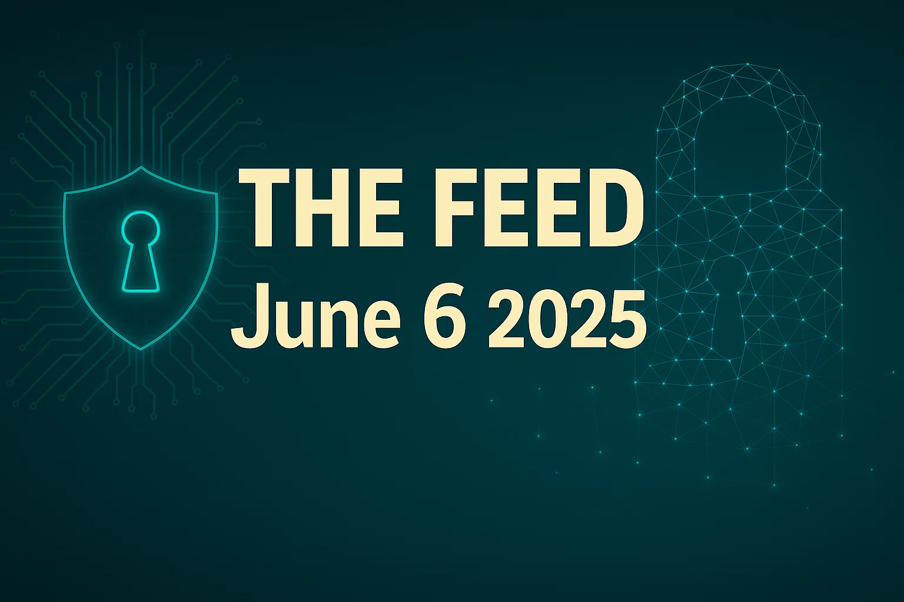
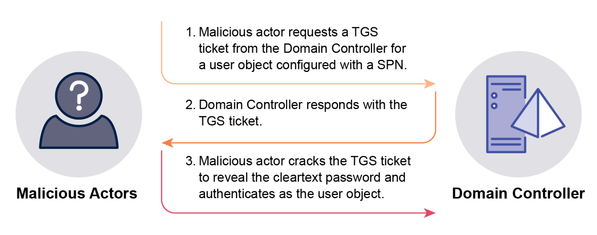
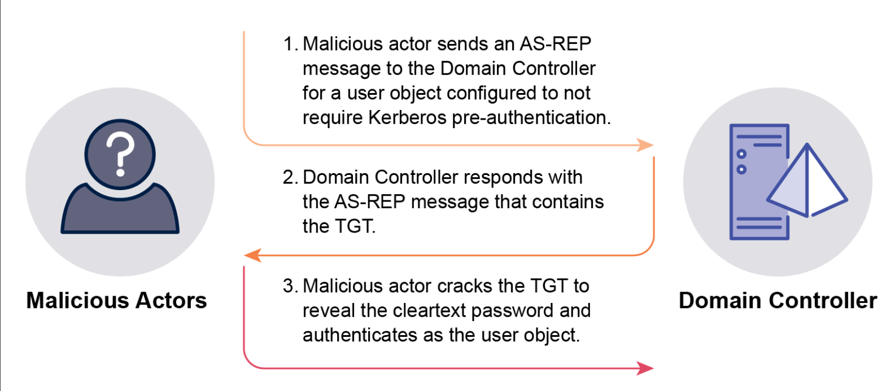
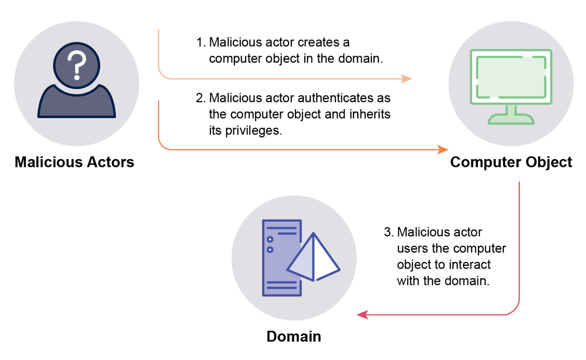
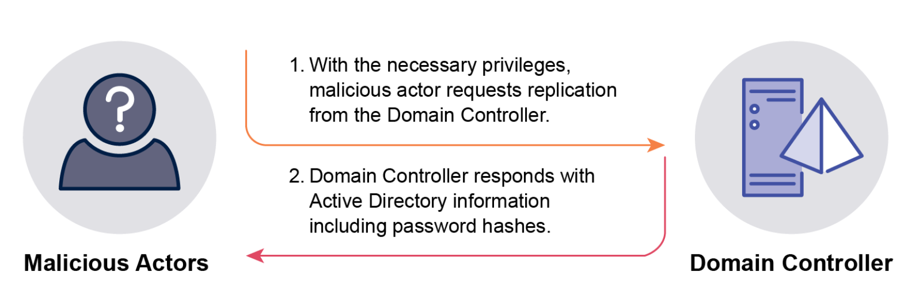
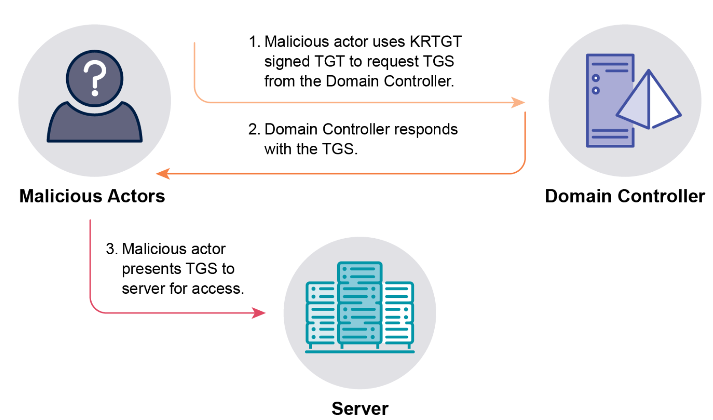
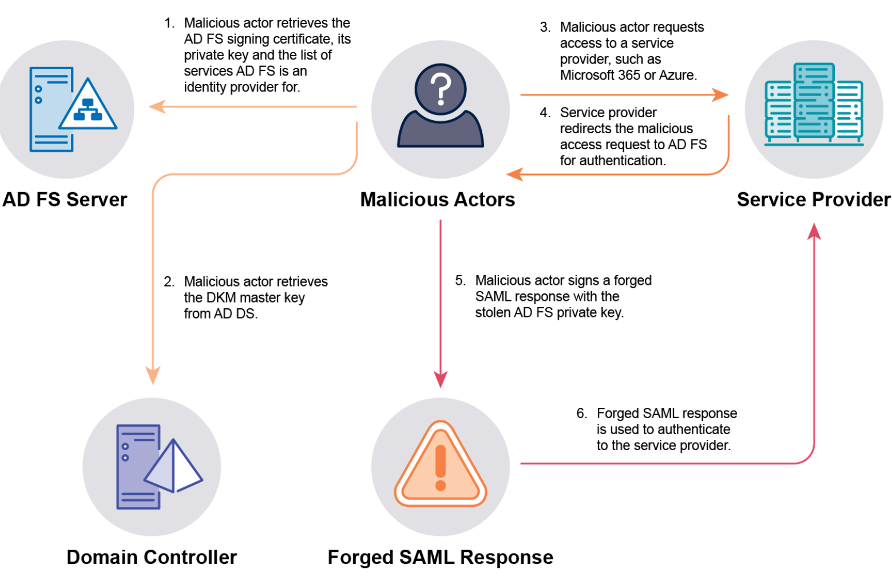
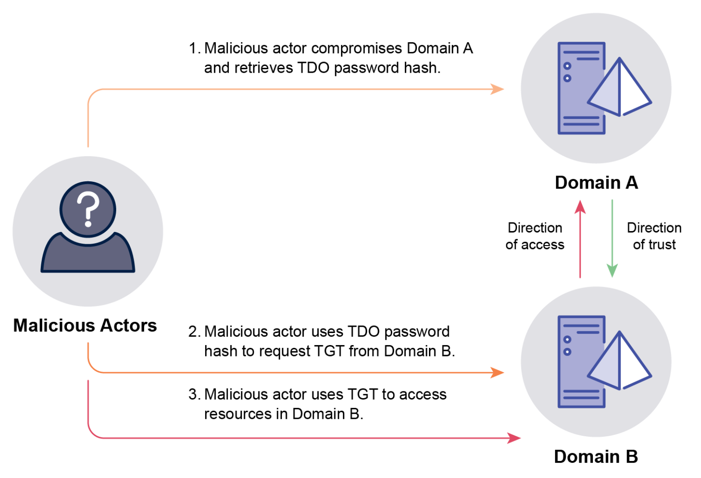
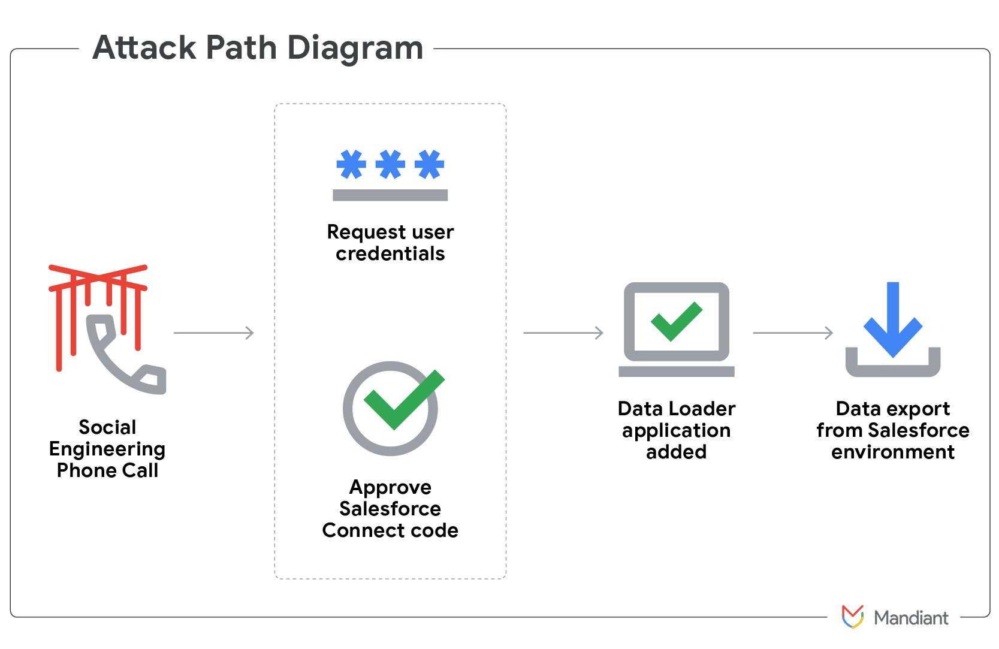

# The Feed 2025-06-06


## AI Generated Podcast

[Spotify](https://open.spotify.com/episode/51KUSBR5OrLo3F1U8dTdhl?si=iQMDlst8QdepRTo2u0FS3A)

## Table of Contents

*   [**Detecting and Mitigating Active Directory Compromises**](#detecting-and-mitigating-active-directory-compromises): This joint guidance from multiple cybersecurity agencies details **17 common techniques** used to target Active Directory, providing **overviews, malicious actor leverage methods, and recommended mitigation strategies** to improve Active Directory and overall network security.
*   [**Hello, Operator? A Technical Analysis of Vishing Threats**](#hello-operator-a-technical-analysis-of-vishing-threats): This analysis examines **voice-based social engineering (vishing)** by actors like UNC3944 (Scattered Spider) and UNC6040, describing their **reconnaissance, tactics for gaining access or data**, and offering **strategic recommendations and best practices** to defend against this threat vector.
*   [**Newly identified wiper malware PathWiper targets critical infrastructure in Ukraine**](#newly-identified-wiper-malware-pathwiper-targets-critical-infrastructure-in-ukraine): Cisco Talos observed a destructive attack using **PathWiper**, a new wiper malware deployed via a legitimate administration framework, targeting critical infrastructure in Ukraine by **corrupting file system artifacts and overwriting data**, showing some similarities to HermeticWiper.
*   [**Scattered Spider Three things the news doesn’t tell you**](#scattered-spider-three-things-the-news-doesnt-tell-you): This article clarifies that "Scattered Spider" (overlapping with UNC3944, Octo Tempest, etc.) refers to a **pattern of identity-based attacks**, primarily by English-speaking actors, emphasizing their frequent use of **help desk scams (vishing)** as a reliable way to **bypass MFA and achieve account takeover**, which is just one technique in their broader toolkit.
*   [**The strange tale of ischhfd83 When cybercriminals eat their own**](#the-strange-tale-of-ischhfd83-when-cybercriminals-eat-their-own): This investigation reveals a campaign involving **over a hundred backdoored GitHub repositories**, frequently targeting users looking for malware or gaming cheats, with a complex, multi-stage infection chain designed to install **multiple RATs and infostealers**, demonstrating cybercriminals targeting each other.

## Detecting and Mitigating Active Directory Compromises
### Summary
This joint guidance, developed by multiple national cybersecurity agencies, serves as strategic threat intelligence highlighting the pervasive risk posed by compromises targeting Microsoft Active Directory (AD) environments, including AD Domain Services (AD DS), Active Directory Federation Services (AD FS), and Active Directory Certificate Services (AD CS). AD's widespread use and pivotal role in authentication and authorization make it a prime target for malicious actors, ranging from cybercriminals seeking financial gain to nation-state actors conducting espionage. The inherent complexity, permissive default settings, support for legacy protocols, and often overlooked internal relationships within AD create a large attack surface susceptible to exploitation. Compromising AD grants actors privileged access to manage all systems and users, enabling lateral movement, bypassing other controls, accessing critical data, and establishing persistence, sometimes for extended periods. Evicting determined adversaries after an AD compromise is often costly, disruptive, and may require drastic measures like rebuilding the entire AD environment. This document provides a strategic overview of 17 common AD attack techniques and recommends mitigations and detection methods to help organizations proactively improve their AD security posture and reduce the risk and impact of such compromises.

### Technical Details
Active Directory is widely used globally for authentication and authorization. It stores data as objects like users, computers, and groups, which are used for authentication, authorization, and policy enforcement. Malicious actors, after gaining initial access, commonly enumerate AD to understand its structure, objects, configurations, and relationships, often gaining a better understanding than the target organization. This knowledge allows them to specifically target weaknesses and misconfigurations to escalate privileges, move laterally, and gain full control. Securing privileged access, particularly Tier 0 assets like Domain Admins, Enterprise Admins, KRBTGT accounts, AD FS service accounts, backup administrators, and Microsoft Entra Connect user objects, is crucial as compromising these accounts provides the highest level of control and is a primary objective for attackers. Domain Controllers, AD FS servers, AD CS root CAs, backup servers, and Microsoft Entra Connect servers are considered Tier 0 computer objects and require stringent security. Implementing a tiered model, such as Microsoft's Enterprise Access Model, which protects hybrid environments, is a key strategy.

The document details several common AD compromise techniques:

1.  **Kerberoasting:** Exploits user objects configured with a Service Principal Name (SPN). Any user can request a Ticket Granting Service (TGS) ticket for these SPN-configured accounts. The TGS ticket is encrypted with the target user object's password hash, which attackers can then crack offline to obtain the cleartext password. Tools like Mimikatz, Rubeus, Impacket, or native PowerShell can be used. Compromised service accounts can grant significant privileges, sometimes even Domain Admin access.


2.  **AS-REP Roasting:** Targets user objects configured *not* to require Kerberos pre-authentication (a legacy setting). Attackers request an Authentication Server Response (AS-REP) ticket, which contains a Ticket Granting Ticket (TGT) encrypted with the user object's password hash. This hash can be cracked offline to get the cleartext password.


3.  **Password Spraying:** Involves attempting to authenticate to multiple user objects using one or a few common passwords. This is effective against organizations with weak password policies or password reuse. Attackers may obtain user lists from AD and scan file shares for credentials (cleartext passwords, API keys, certificates, backups) using tools like SMBMap and Snaffler to increase success rates. Account lockout thresholds can slow this down, but tools like DomainPasswordSpray and Spray can manage attempts to stay below the threshold. Notably, password spraying directly to Domain Controllers via NTLM bypasses MFA, as NTLM does not support MFA. The built-in Administrator account is a particularly attractive target as it cannot be locked out.
4.  **MachineAccountQuota Compromise:** Exploits the default setting (`ms-DS-MachineAccountQuota`) allowing non-privileged users to create up to ten computer objects in the domain. These computer objects are added to the Domain Computers group. If the Domain Computers group has elevated privileges (e.g., membership in privileged groups, write access to objects), attackers can create a computer object, authenticate as it, and inherit those privileges. This can also be used in KrbRelayUp attacks against systems where LDAP signing is not enforced. Attackers commonly set the new computer object's name to blend in.


5.  **Unconstrained Delegation:** Exploits computer objects configured for unconstrained delegation, allowing them to impersonate users to access services on their behalf. When a user authenticates to such a computer, a copy of their TGT is stored in the computer's Local Security Authority Subsystem Service (LSASS) process. If an attacker gains local administrator access to this computer, they can extract stored TGTs, including those of highly privileged users like Domain Admins. Attackers can force users to authenticate to these compromised computers. A specific technique targets the Print Spooler service on Domain Controllers to force them to authenticate to an attacker-controlled system with unconstrained delegation, allowing extraction of the Domain Controller's computer account TGT and subsequent administrative access. Common tools like Rubeus can leverage this. Attackers may dump LSASS memory using commands like `procdump.exe -accepteula -ma lsass.exe lsass.dmp`, `.\rundll32.exe C:\windows\System32\comsvcs.dll, MiniDump <PID> C:\lsass.dmp full`, or `sekurlsa::minidump C:\lsass.DMP`.
6.  **Password in Group Policy Preferences (GPP) Compromise:** Exploits a legacy vulnerability (CVE-2014-1812) where passwords (cpasswords) distributed by GPP are stored in SYSVOL and readable by all domain users. Although Microsoft patched this vulnerability in 2014, removing the *creation* functionality, existing cpasswords were not removed and may still be present. The private key used to encrypt these passwords became public around 2012, making decryption trivial. Attackers can easily find and decrypt these passwords to gain local administrator or privileged domain user access. Attackers can search SYSVOL using PowerShell, cmd.exe, or Windows Explorer.
7.  **Active Directory Certificate Services (AD CS) Compromise:** Exploits misconfigurations in AD CS certificate templates or the Certificate Authority (CA). A common vulnerability (ESC1) allows any user to request a certificate on behalf of another user (including privileged ones) if templates allow enrollment, have user authentication EKU, allow Subject Alternative Name (SAN) to be supplied, and don't require CA approval. Such certificates can be used to authenticate as the impersonated user, persisting even if the user changes their password. Other vulnerabilities (ESC2-ESC13) also exist. Attackers can use built-in tools ("live off the land") or tools like PSPKIAudit and Certify to find and exploit vulnerabilities.
8.  **Golden Certificate:** A persistence technique building on AD CS compromise, where attackers gain administrative access to a CA and extract its certificate and private key. This key (from root or subordinate CA) can be used to forge valid client authentication certificates for *any* user in the domain, bypassing MFA if the Relying Party trusts the identity provider's MFA claims. Attackers can retrieve keys using built-in tools, Mimikatz, Seatbelt, SharpDPAPI, or ForgeCert. Forged certificates remain valid until revoked.
9.  **DCSync:** Exploits AD replication features to request and receive data, including password hashes (NTLM and potentially cleartext if reversible encryption is enabled), directly from a Domain Controller. Requires 'Replicating Directory Changes', 'Replicating Directory Changes All', or 'Replicating Directory Changes in Filtered Set' privileges, or 'GenericAll' or 'AllExtendedRights' permissions on the domain root. These are default for Domain Admins, Enterprise Admins, and Administrators on DCs. Compromising an account with these privileges allows attackers to retrieve all user/computer password hashes or target specific accounts like KRBTGT. Tools like Mimikatz are commonly used (though not explicitly named for DCSync execution in this excerpt, it's implied by being a common offensive tool for related hash retrieval). Retrieved NTLM hashes can be used in Pass-the-Hash (PtH) attacks without cracking. Reversible encryption, if enabled, allows retrieval of cleartext passwords. Successful DCSync is often considered a complete domain compromise.


10. **Dumping ntds.dit:** Involves copying the AD database file (ntds.dit) from a Domain Controller. This file contains all object information, including password hashes. Requires administrator privileges on the Domain Controller. To bypass file locks, attackers use native tools like Volume Shadow Copy Service or Ntdsutil. To decrypt sensitive data like password hashes and DPAPI backup keys, the SYSTEM hive from the same DC's registry is also needed. Attackers may target less secure backups of DCs to obtain ntds.dit. Exfiltrating and decrypting ntds.dit signifies a complete domain compromise, allowing attackers to crack hashes and gain control of accounts. DPAPI backup keys are highly sensitive and immutable; their compromise allows decryption of sensitive data and recovery often requires rebuilding the domain.
11. **Golden Ticket:** Forges TGTs by using the KRBTGT user object's password hash. The KRBTGT hash is the root of trust for a domain. Obtaining this hash (typically via DCSync or dumping ntds.dit) allows attackers to create TGTs for *any* user object offline. These forged TGTs bypass the KDC request and allow attackers to directly request TGS tickets to access systems as the impersonated user, enabling privilege escalation and lateral movement with low detection risk. Attackers can manipulate forged TGTs to include non-existent users, false group memberships, weaker crypto (RC4), or extended lifetimes (e.g., 10 years with Mimikatz). Mimikatz is a common tool for forging Golden Tickets. Like DCSync/ntds.dit compromise, a Golden Ticket is a sign of complete domain compromise.


12. **Silver Ticket:** Exploits specific services on target computers. Attackers compromise the password hash of a user account running a service or, more commonly, the target computer object's password hash. With the password hash, attackers can forge TGS tickets directly for services on that specific computer (e.g., CIFS, LDAP, SQL, HOST). This attack bypasses Domain Controllers for authentication, making it harder to detect via DC logs. Attackers can tamper with the computer object's password change process (which is initiated by the computer, not the DC, and doesn't invalidate older hashes for resource access) to maintain persistence indefinitely.
13. **Golden Security Assertion Markup Language (SAML):** Targets AD FS environments, which extend AD authentication to cloud services (like Azure, AWS, Microsoft 365) using SAML. Attackers compromise an AD FS server (often by compromising the AD FS service account or a privileged user like Domain Admin) to extract the token signing certificate and its private key, the Distributed Key Manager (DKM) master key (to decrypt the cert), and the list of relying parties (services). Using these, attackers can forge SAML responses (tokens) for *any* user to access configured cloud services, bypassing MFA if the RP trusts the AD FS server's claims. This is a post-exploitation persistence technique used for lateral movement to the cloud and evasion. It was used in the SolarWinds supply chain attack. Attackers may even create their own rogue AD FS server.


14. **Microsoft Entra Connect Compromise:** Targets the server running Microsoft Entra Connect (formerly Azure AD Connect), which synchronizes AD DS with Microsoft Entra ID (Azure AD).
    *   In **Password Hash Synchronization (PHS)** mode, two user objects are created: an AD MSOL account with replication permissions (like DCSync) and an Entra ID Sync account with permissions to manage Entra ID objects. Administrative access to the server allows extracting cleartext passwords for both accounts using tools like AADInternals. The MSOL account can then dump AD hashes, and the Sync account can manage Entra ID objects, including setting passwords for Global Admins, leading to full control of cloud resources.
    *   In **Pass-Through Authentication (PTA)** mode, the server forwards authentication requests to AD DS. Compromising the server allows overriding the PTA process to authenticate as any user without knowing the password or saving cleartext passwords during authentication, enabling persistence and impersonation. Other risks include exploiting soft/hard match features if not disabled.

15. **One-way domain trust bypass:** Exploits the TDO (Trusted Domain Object) password shared between domains in a trust relationship. If attackers gain administrator access to a Domain Controller in the "trusting" domain, they can retrieve the TDO password hash. This hash can then be used to request a TGT from the "trusted" domain, effectively bypassing the one-way trust and allowing access from the trusting domain to the trusted domain. Domain trusts do not act as security boundaries.



16. **Security Identifier (SID) History compromise:** Exploits the `sIDHistory` attribute, which stores previous SIDs for objects (e.g., during domain migrations). After gaining administrative access to a Domain Controller, attackers can add the SID of a privileged object (like Domain Admins) to the `sIDHistory` of an account they control. This grants the controlled account the privileges associated with the added SID, allowing it to perform privileged actions while appearing as a standard user, aiding persistence and evasion. This can be combined with Golden Tickets to "domain hop" by adding SIDs from other domains to a forged TGT, granting access to those domains if a trust exists. Tools like Mimikatz can be used.
17. **Skeleton Key:** Malware injected into the LSASS process on a Domain Controller that overrides the NTLM and Kerberos authentication flows. It sets a "Skeleton Key" password that allows anyone presenting it to authenticate as *any* user object in the domain, in addition to the user's legitimate password. This attack requires administrative privileges on the DC. Successful authentications using the Skeleton Key are virtually indistinguishable from legitimate ones. The malware may downgrade Kerberos crypto to RC4 to facilitate this, potentially causing issues for accounts restricted to stronger crypto. The malware resides in memory and is removed by restarting the DC, but attackers with administrative access can reinfect. Running LSASS in Protected Mode makes this harder but can be bypassed with vulnerable drivers. Common tools like Mimikatz (specifically Invoke-Mimikatz) can be used. Requires `SeDebugPrivilege` and often uses `SeTCBPrivilege`.

Across many techniques, attackers rely on privileged access to Domain Controllers or other Tier 0 assets. Securing these assets, limiting the number of privileged accounts, restricting privileged access pathways (e.g., using jump servers/secure workstations), and comprehensive logging are consistently recommended mitigations. Backups of critical servers (DCs, CAs, AD FS, Entra Connect) must be secured. Disabling legacy/unnecessary features like Print Spooler on DCs, SMBv1, and NTLM are also highlighted. Password policy enforcement (length, complexity, uniqueness) and using gMSAs or LAPS are critical for protecting accounts.

### Recommendations
Based on the technical details provided, here are the technical recommendations extracted:

*   **General/Tiered Model:**
    *   Implement a tiered access model such as Microsoft’s Enterprise Access Model to secure privileged access.
    *   Minimize the number of user objects with significant access in a domain (Tier 0 user objects).
    *   Ensure Tier 0 computer objects (DCs, AD FS servers, AD CS root CAs, backup servers, Entra Connect servers) are only managed by Tier 0 user objects.
    *   Enforce hierarchy to prevent control of higher tiers from lower tiers.
    *   Secure privileged access pathways by minimizing their number, implementing protections, and monitoring them closely.
    *   Apply additional security protections to Tier 0 user and computer objects, including phishing-resistant MFA, privileged access workstations, Kerberos armoring, and zero trust policy enforcement.
    *   Limit access to critical servers (DCs, CAs, AD FS, Entra Connect) to only privileged users who require it.
    *   Restrict privileged access pathways to critical servers using jump servers and secure admin workstations with only required ports/services.
    *   Only use critical servers (DCs, CAs, AD FS, Entra Connect) for their designated AD DS, AD CS, AD FS, or Microsoft Entra Connect functions and do not install non-security-related services or applications.
    *   Encrypt and securely store backups of critical servers and limit access to only Backup Administrators.
    *   Ensure passwords for local administrator accounts are long (30-character minimum), unique, unpredictable, and managed (e.g., using Microsoft LAPS).

*   **Kerberoasting Mitigation:**
    *   Minimize the number of user objects configured with SPNs.
    *   Create user objects with SPNs as group Managed Service Accounts (gMSAs) for automatic password rotation, 120-character passwords, and simplified SPN management. If gMSAs are not feasible, set minimum 30-character unique, unpredictable, and managed passwords for service accounts.
    *   Assign user objects with SPNs the minimum necessary privileges and ensure they are not members of highly privileged security groups like Domain Admins.

*   **AS-REP Roasting Mitigation:**
    *   Ensure user objects require Kerberos pre-authentication.
    *   If user objects must bypass pre-authentication, grant them minimum privileges and ensure they are not in highly privileged groups.
    *   For such accounts, set minimum 30-character passwords for service accounts or 15-character passwords for users, ensuring they are unique, unpredictable, and managed.

*   **Password Spraying Mitigation:**
    *   Create long (30-character minimum), unique, unpredictable, and managed passwords for local administrator, service, and break glass accounts. Use LAPS for local administrator accounts.
    *   For single-factor authentication, use passwords of at least four random words with a minimum total length of 15 characters.
    *   Lock out user objects, except break glass accounts, after a maximum of five failed logon attempts.
    *   Ensure randomly generated passwords for new user objects or password resets.
    *   Configure the built-in 'Administrator' account as sensitive to prevent delegation.
    *   Scan networks at least monthly for credentials stored in the clear and remove them.
    *   Disable the NTLM protocol wherever possible. When not possible, enable LDAP channel binding, extended protection authentication, and SMB signing.

*   **MachineAccountQuota Mitigation:**
    *   Set the `MS-DS-MachineAccountQuota` attribute to zero to prevent unprivileged users from adding computer objects.
    *   Ensure the Domain Computers security group is not a member of privileged security groups.
    *   Ensure the Domain Computers security group does not have write privileges to any Active Directory objects.
    *   Enable LDAP signing for Domain Controllers.

*   **Unconstrained Delegation Mitigation:**
    *   Do not configure computer objects for unconstrained delegation; use resource-based constrained delegation instead if delegation is required.
    *   Configure privileged user objects as ‘sensitive and cannot be delegated’.
    *   Ensure privileged user objects are members of the Protected Users security group.
    *   Disable the Print Spooler service on Domain Controllers.

*   **Password in GPP Mitigation:**
    *   Remove all existing GPP passwords (cpasswords) from the SYSVOL directory.
    *   Apply Microsoft's security patch 2962486 to remove the functionality to create new cpasswords.

*   **AD CS Compromise Mitigation:**
    *   Identify vulnerabilities using tools like Certificate Manager, Certutil, PSPKIAudit, and Certify.
    *   Remove the ‘Enrollee Supplies Subject’ flag on certificate templates used for client authentication.
    *   Restrict standard user object permissions on certificate templates, preventing write access.
    *   Remove vulnerable AD CS CA configurations, such as the `EDITF_ATTRIBUTESUBJECTALTNAME2` flag.
    *   Require CA Certificate Manager approval for certificate templates that allow the SAN to be supplied.
    *   Remove EKUs that enable user authentication if not needed.
    *   Limit access to AD CS CA servers to only necessary privileged users.
    *   Restrict privileged access pathways to AD CS CA servers (Tier 0) using jump servers/secure admin workstations.
    *   Only use AD CS CA servers for AD CS functions.
    *   Encrypt and securely store backups of AD CS CA servers.

*   **Golden Certificate Mitigation:**
    *   Secure root and subordinate CAs as critical (Tier 0) servers.
    *   Use MFA to authenticate privileged users accessing systems, including CAs.
    *   Implement application control on AD CS CAs to prevent execution of malicious tools like Mimikatz.
    *   Use a Hardware Security Module (HSM) to protect CA private keys, preventing their exfiltration.
    *   Limit access to AD CS CAs to only necessary privileged users.
    *   Restrict privileged access pathways to AD CS CA servers (Tier 0) using jump servers/secure admin workstations.
    *   Only use AD CS CA servers for AD CS functions.
    *   Encrypt and securely store backups of AD CS CA servers.

*   **DCSync Mitigation:**
    *   Minimize the number of user objects with DCSync permissions (default for Enterprise Admins, Domain Admins, Administrators on DCs).
    *   Limit direct assignment of DCSync permissions to other user objects.
    *   Ensure user objects configured with SPNs do not have DCSync permissions.
    *   Prevent user objects with DCSync permissions from logging on to unprivileged operating environments (Tier 1 or 2 systems).
    *   Review user objects with DCSync permissions every 12 months and remove when no longer required.
    *   Disable the NTLMv1 protocol.
    *   Ensure LAN Manager (LM) password hashes are not used (e.g., enforce minimum 15-character passwords).
    *   Do not enable 'store passwords using reversible encryption' setting on user objects.

*   **Dumping ntds.dit Mitigation:**
    *   Harden Domain Controllers by restricting privileged access pathways, disabling unused services/ports, not installing additional features/applications, using antivirus/EDR, and monitoring.
    *   Limit access to Domain Controllers to only necessary privileged users.
    *   Restrict privileged access pathways to Domain Controllers (Tier 0) using jump servers/secure admin workstations.
    *   Encrypt and securely store backups of Domain Controllers.
    *   Only use Domain Controllers for AD DS functions.
    *   Disable the Print Spooler service on Domain Controllers.
    *   Disable the SMB version 1 protocol on Domain Controllers and all systems.

*   **Golden Ticket Mitigation:**
    *   Mitigate DCSync and Dumping ntds.dit techniques to prevent compromise of the KRBTGT password hash.
    *   Change the KRBTGT password every 12 months, or immediately if the domain is compromised or suspected.
    *   Reset the KRBTGT password *twice* with sufficient time between resets for replication.

*   **Silver Ticket Mitigation:**
    *   Protect user objects running services and computer objects themselves.
    *   Create User objects with SPNs as gMSAs or use minimum 30-character unique, unpredictable, managed passwords.
    *   Change all computer object (including Domain Controller) passwords every 30 days.
    *   Ensure computer objects are not members of privileged security groups like Domain Admins.
    *   Ensure the Domain Computers security group does not have write or modify permissions to any Active Directory objects.

*   **Golden SAML Mitigation:**
    *   Protect the AD FS service account by making it a gMSA for automatic password rotation.
    *   Ensure the AD FS service account is used only for AD FS.
    *   Secure AD FS servers as critical (Tier 0) servers.
    *   Limit access to AD FS servers to only necessary privileged users.
    *   Restrict privileged access pathways to AD FS servers using jump servers/secure admin workstations.
    *   Only use AD FS servers for AD FS functions.
    *   Encrypt and securely store backups of AD FS servers.
    *   Rotate AD FS token-signing and encryption certificates every 12 months, or sooner if compromised; rotate *twice* in rapid succession.
    *   Configure Relying Parties (like Microsoft Entra ID) to require MFA even if the identity provider claims MFA.

*   **Microsoft Entra Connect Compromise Mitigation:**
    *   Protect Microsoft Entra Connect servers as critical (Tier 0) servers.
    *   Disable hard match takeover.
    *   Disable soft matching after initial synchronization.
    *   Do not synchronize privileged user objects from AD DS to Microsoft Entra ID; use separate privileged accounts.
    *   Enable MFA for all privileged users in Microsoft Entra ID.
    *   Limit access to Microsoft Entra Connect servers to only necessary privileged users.
    *   Restrict privileged access pathways to Microsoft Entra Connect servers using jump servers/secure admin workstations.
    *   Ensure long, unique, unpredictable, managed passwords for local administrator accounts on Entra Connect servers (e.g., LAPS).
    *   Only use Microsoft Entra Connect servers for their intended function.
    *   Encrypt and securely store backups of Microsoft Entra Connect servers.

*   **One-way domain trust bypass Mitigation:**
    *   Carefully consider domain trust relationships and do not rely on them as security boundaries.
    *   Secure privileged access to Domain Controllers.
    *   Limit access to Domain Controllers to only necessary privileged users.
    *   Restrict privileged access pathways to Domain Controllers using jump servers/secure admin workstations.
    *   Encrypt and securely store backups of Domain Controllers.
    *   Only use Domain Controllers for AD DS functions.
    *   Disable the Print Spooler service on Domain Controllers.
    *   If a domain is compromised, reset the TDO password first in the trusting domain, then in the trusted domain.

*   **SID History Compromise Mitigation:**
    *   Avoid using the `sIDHistory` attribute unless migrating user objects.
    *   Clear the `sIDHistory` attribute after user objects are migrated and access is configured via their new SID.
    *   Enable SID Filtering for domain and forest trusts (prevents built-in privileged SIDs, though RIDs > 1000 may still work).

*   **Skeleton Key Mitigation:**
    *   Reduce the likelihood of administrative access to Domain Controllers.
    *   Limit access to Domain Controllers to only necessary privileged users.
    *   Restrict privileged access pathways to Domain Controllers using jump servers/secure admin workstations.
    *   Run the LSASS process in protected mode.
    *   Implement Microsoft’s vulnerable driver blocklist.
    *   Restrict driver execution on DCs to an approved set (e.g., using Windows Defender Application Control).
    *   Only use Domain Controllers for AD DS functions.
    *   Disable the Print Spooler service on Domain Controllers.

### Hunting methods
Active Directory compromises often exploit legitimate functionality, making detection challenging via single events. Detection frequently requires correlating multiple events from various sources and analyzing them for discrepancies or deviations from normal activity.

**General Hunting:**
*   Centrally log and analyze security events in a SIEM.
*   Enable additional audit logging beyond defaults, such as specific object access auditing.
*   Monitor for unusual authentication events on Domain Controllers and other critical systems (e.g., unusual logon times, users logging onto systems they don't normally access).
*   Log and analyze PowerShell activity, as many attack tools use it.
*   Use Active Directory canaries. Configure canary objects to deny read access to 'Everyone'. Enable Directory Service Access audit policy for 'Success' and 'Failure'. Alert in SIEM on Event ID 4662 (Operation Performed on an Object) containing the GUID of a canary object.
    *   *Logic:* Most AD attacks begin with enumeration (e.g., using SharpHound) to find weaknesses. Attempting to enumerate a canary object triggers a logged read attempt, which should ideally never happen for these specific objects, providing a high-fidelity alert indicating reconnaissance/enumeration activity. This technique can detect Kerberoasting, AS-REP Roasting, and DCSync enumeration phases. Limitation: Attackers targeting only specific user objects might not trigger the canary.

**Kerberoasting Detection:**
*   Analyze Event ID 4769 (A Kerberos service ticket was requested) on Domain Controllers.
    *   *Logic:* Look for TGS requests for *multiple* user objects configured with SPNs within a short timeframe. Malicious Kerberoasting often targets all SPNs simultaneously.
    *   Look for Event 4769 with 'Ticket Encryption type' value '0x17' (RC4 encryption). RC4 is weaker and less frequently used legitimately, making it suspicious.
    *   Look for Event 4769 with 'Ticket Options' values '0x40800000' or '0x40810000', which are common in offensive tools.
*   Analyze Event ID 4738 (A user account was changed) and 5136 (A directory service object was modified) on Domain Controllers.
    *   *Logic:* Malicious actors might temporarily add an SPN to a user object to roast it, then remove the SPN to evade detection. Look for changes to user objects adding/removing SPNs.

**AS-REP Roasting Detection:**
*   Analyze Event ID 4768 (A Kerberos authentication ticket (TGT) was requested) on Domain Controllers.
    *   *Logic:* Look for TGT requests for *multiple* user objects with Kerberos pre-authentication disabled within a short timeframe. Malicious AS-REP Roasting often targets all non-pre-authenticated accounts simultaneously.
    *   Look for Event 4768 with 'Ticket Encryption type' value '0x17' (RC4 encryption). RC4 is weaker and less frequently used legitimately for TGTs, making it suspicious.
*   Analyze Event ID 4625 (An account failed to log on) on Domain Controllers.
    *   *Logic:* If AS-REP Roasting is attempted *prior* to authentication with invalid credentials, Event 4625 will be generated when the AS-REP ticket is requested. Correlate with Event 4768.
*   Analyze Event ID 4738 and 5136 on Domain Controllers.
    *   *Logic:* Malicious actors might temporarily disable Kerberos pre-authentication on a user object to roast it, then re-enable it. Look for changes to user objects enabling/disabling pre-authentication.

**Password Spraying Detection:**
*   Analyze Event ID 4625 (An account failed to log on) on Domain Controllers.
    *   *Logic:* Look for a *large number* of failed authentication events (4625) originating from a single source IP or system targeting *multiple* user accounts in a short period. This is common for SMB-based sprays.
*   Analyze Event ID 2889 (A computer object tries to make an unsigned LDAP bind) on Domain Controllers.
    *   *Logic:* Look for numerous Event 2889 occurrences in a short timeframe, indicating password spraying attempts using the LDAP protocol.
*   Analyze Event ID 4648 (A logon was attempted using explicit credentials) on systems where the spray is executed (e.g., domain joined workstation).
    *   *Logic:* If password spraying is run on a domain-joined system, look for numerous Event 4648 occurrences with different usernames in a short timeframe. Note: This event won't occur if the spray is from external infrastructure.
*   Analyze Event ID 4740 (A user account was locked out) on Domain Controllers.
    *   *Logic:* Look for multiple user objects getting locked out in a short period, which can indicate password spraying triggering lockout thresholds. Note: Tools may evade this.
*   Analyze Event ID 4771 (Kerberos pre-authentication failed) on Domain Controllers.
    *   *Logic:* When LDAP is used for spraying, Event 4771 with Failure Code '0x18' (incorrect password) may be generated. Look for numerous events with this code.
*   Query the `badPasswordTime` user object attribute in Active Directory.
    *   *Logic:* If multiple user objects show the same or nearly the same `badPasswordTime`, it suggests a spraying attempt occurred across those accounts.
*   Analyze Event ID 4624 (An account was successfully logged on) on Domain Controllers.
    *   *Logic:* Look for Event 4624 occurring near-simultaneously with a large number of Event 4625 failures, indicating a successful authentication amidst a spraying attempt.

**MachineAccountQuota Compromise Detection:**
*   Analyze Event ID 4741 (A computer account was created in Active Directory) on Domain Controllers.
    *   *Logic:* Identify newly created computer objects. Investigate if they were created by user objects that don't normally create computer objects.
*   Analyze Event ID 4724 (An attempt was made to reset an account's password) on Domain Controllers.
    *   *Logic:* Malicious actors set a password for the newly created computer object. Look for Event 4724 occurring around the same time as Event 4741 for the same computer object.
*   Analyze Event ID 4624 (An account was successfully logged on) on Domain Controllers.
    *   *Logic:* Look for Event 4624 for the newly created computer object, indicating the attacker is authenticating as the compromised object. Correlate with Event 4741.

**Unconstrained Delegation Detection:**
*   Monitor computer objects configured for unconstrained delegation for unusual authentication events.
    *   *Logic:* Look for user objects not normally authenticating to that system or authentication during unusual times.
*   Log and analyze PowerShell activity (Event IDs 4103 and 4104) on computer objects configured for unconstrained delegation.
    *   *Logic:* Tools like Rubeus use PowerShell. Analyze for unusual PowerShell executions, especially those related to Kerberos tickets or LSASS.
*   Analyze Event ID 4624 on computer objects configured for unconstrained delegation and Domain Controllers.
    *   *Logic:* On the delegation server, look for unusual user authentications. On DCs, look for Event 4624 where the 'Source Network Address' is the IP of the unconstrained delegation server; this can indicate the attacker is leveraging it to compromise a DC.
*   Analyze Event ID 4688 (A new process is created) on computer objects configured for unconstrained delegation.
    *   *Logic:* Look for processes created to dump LSASS memory (e.g., procdump, rundll32 with comsvcs.dll, Mimikatz/sekurlsa). Analyze command lines and parameters.
*   Analyze Event ID 4770 (A Kerberos TGT was renewed) on Domain Controllers.
    *   *Logic:* Malicious actors may renew extracted TGTs. Look for renewals, especially those extending the TGT lifetime beyond the default 7 days.

**Password in GPP Compromise Detection:**
*   No effective direct detection of searching SYSVOL for cpasswords exists due to numerous methods and legitimate activity.
*   Implement a canary GPP password. Create a GPP password for a dedicated user object that should never log in. Monitor this user object for *any* authentication events.
    *   *Logic:* If the canary user account authenticates, it strongly indicates its GPP password was found and used.

**AD CS Compromise Detection:**
*   Centrally log and analyze events from Domain Controllers and root/subordinate CAs.
*   Enable 'Audit object access' for Certificate Services in Group Policy on AD CS CAs and enable auditing for all options in the CA properties 'Auditing' tab.
*   Audit issued certificates for Client Authentication EKUs.
    *   *Logic:* Look for certificates issued for Client Authentication where the requester name does *not* match the subject name in the certificate. This mismatch indicates a user requested a certificate for someone else.
*   Analyze Event ID 4886 (Certificate Services received a certificate request) on CAs.
    *   *Logic:* This indicates a certificate request was received. Look for requests for authentication certificates for privileged users.
*   Analyze Event ID 4887 (Certificate Services approved a certificate request and issued a certificate) on CAs.
    *   *Logic:* This confirms a certificate was issued. Look for issuances of authentication certificates to potentially track successful privilege escalation.
*   Analyze Event ID 4899 (A Certificate Services template was updated) and 4900 (Certificate Services template security was updated) on CAs.
    *   *Logic:* Malicious actors may modify certificate templates to introduce vulnerabilities or change enrollment rights. Look for unauthorized changes to template configurations or Access Control Lists (ACLs).
*   Analyze Event ID 4674 (An operation is attempted on a privileged object) on Domain Controllers.
    *   *Logic:* May be triggered by attempts to change security descriptors of certificate templates. The 'Object Name' field can show the template name.
*   Analyze Event ID 4768 (A Kerberos TGT is requested) on Domain Controllers.
    *   *Logic:* 'PreAuthType' of '16' indicates a certificate was used in the TGT request. This helps track certificate-based authentication.
*   Analyze Event IDs 39, 40, and 41 on Domain Controllers (specifically in the Kerberos-Key-Distribution-Center log).
    *   *Logic:* These events indicate issues with certificate mapping or mismatches between the certificate's SID and the user's SID, which could signal attempts to authenticate with a forged or misused certificate.

**Golden Certificate Detection:**
*   Detection relies on detecting the initial compromise of the CA server and the export of the CA certificate and private key.
*   Enable 'Audit object access' for Certificate Services in Group Policy on CAs.
*   Enable 'Backup and restore the CA database' auditing in the Auditing tab of CA properties.
    *   *Logic:* Event 4876 (Certificate Services backup was started) is triggered if the CA database and log option is selected during backup, but *not* if only the private key/certificate is backed up. This event is a weak indicator alone.
*   Enable Windows CAPI2 logs on CAs within Event Viewer.
    *   *Logic:* Event 70 ('Acquire Certificate Private Key') is generated when a certificate and private key are exported. Filter for CA certificate names in the 'subjectName' field. This is a strong indicator of key exfiltration.
*   Analyze PowerShell activity (Event IDs 4103 and 4104) on CAs.
    *   *Logic:* Tools like Certutil and Mimikatz, used for exporting keys, often use PowerShell. Look for executions related to these tools or certificate exports.
*   Analyze Event ID 1102 (The 'Security' audit log is cleared) on CAs.
    *   *Logic:* Attackers may clear logs to hide activity. Investigating log clearance events can uncover compromise attempts.

**DCSync Detection:**
*   Analyze Event ID 4662 (An operation was performed on an object) on Domain Controllers.
    *   *Logic:* DCSync triggers replication events. Look for Event 4662 where the event properties contain the GUIDs associated with 'DS-Replication-Get-Changes-All' (`1131f6ad-9c07-11d1-f79f-00c04fc2dcd2`), 'Domain-DNS class WRITE_DAC' (`19195a5b-6da0-11d0-afd3-00c04fd930c9`), or 'DS-Replication-Get-Changes-In-Filtered-Set' (`89e95b76-444d-4c62-991a-0facbeda640c`). If this event is *not* generated by a Domain Controller's computer account, it is highly indicative of a DCSync attempt. Sophisticated attackers may impersonate a DC.
*   Canary objects can detect the enumeration phase often preceding DCSync.

**Dumping ntds.dit Detection:**
*   Centrally log and analyze Domain Controller logs.
*   Log and analyze PowerShell activity (Event IDs 4103 and 4104) on Domain Controllers.
    *   *Logic:* Tools like Volume Shadow Copy Service and Ntdsutil are often executed via PowerShell. Look for PowerShell executions mentioning ntds.dit, Volume Shadow Copy Service (VSS), or Ntdsutil.
*   Analyze Event ID 4688 (A new process is created) on Domain Controllers.
    *   *Logic:* Look for the creation of processes like PowerShell, vssadmin.exe (Volume Shadow Copy Service), or ntdsutil.exe, especially with parameters related to copying/dumping ntds.dit or system hive.
*   Analyze Event ID 8222 (A shadow copy is created) on Domain Controllers.
    *   *Logic:* Dumping ntds.dit often uses VSS. Look for unexpected shadow copy creation events.
*   Enable System Access Control List (SACL) auditing for the ntds.dit file itself.
    *   *Logic:* Configure SACLs on ntds.dit to audit attempts to access, read, write, or modify the file.
    *   Analyze Event ID 4656 (A handle to an object is requested) and 4663 (An attempt was made to access an object) on Domain Controllers where SACL is enabled. Look for events where the 'Object Name' matches the ntds.dit file.
*   Analyze Event ID 1102 (The 'Security' audit log is cleared) on Domain Controllers.
    *   *Logic:* Attackers may clear logs to hide activity.

**Golden Ticket Detection:**
*   Detecting a Golden Ticket directly by examining the forged TGT is difficult as attackers try to make them look legitimate.
*   Analyze Event ID 4768 (A Kerberos TGT is requested) and 4769 (A TGS is requested) on Domain Controllers.
    *   *Logic:* Normal Kerberos authentication generates both Event 4768 (requesting TGT from KDC) and Event 4769 (requesting TGS using TGT). A Golden Ticket *forges* the TGT offline, bypassing the KDC request. Therefore, look for occurrences of Event 4769 *without* a corresponding preceding Event 4768 for the same user/session.
*   Analyze Event ID 4769 for inconsistencies in the TGS ticket.
    *   *Logic:* Look for usage of weaker cryptographic algorithms (e.g., RC4 instead of AES). Look for unusual TGT lifetimes (e.g., 10 years instead of 10 hours, common with Mimikatz). Look for usernames that don't exist or mismatched security group memberships specified in the ticket.
*   Detecting the underlying DCSync or Dumping ntds.dit that provided the KRBTGT hash is a key hunting method for precursors to Golden Tickets.

**Silver Ticket Detection:**
*   Silver Tickets typically avoid generating events on Domain Controllers by authenticating directly to the target computer.
*   Detection relies on analyzing logs from the *targeted computer object*.
*   Centrally log authentication events from all computer objects, not just Domain Controllers.
*   Analyze Event ID 4624 (An account is successfully logged on) and 4627 (Group membership information) on the target computer.
    *   *Logic:* Event 4627 provides details about the group membership claimed by the logging-on account. A forged Silver Ticket can contain false information. Look for discrepancies between the logging-on user's actual SID/group memberships and the information provided in Event 4627. This mismatch can indicate a forged TGS ticket used to escalate privileges on the target system.

**Golden SAML Detection:**
*   Detection requires analyzing logs from AD FS servers and service providers (like Microsoft 365/Azure).
*   Analyze Event ID 70 (Certificate Private Key was acquired) on AD FS servers.
    *   *Logic:* This event indicates the export of a private key, the first step in creating a Golden SAML. Investigate unauthorized key exports.
*   Analyze Event ID 1007 (A certificate was exported) on AD FS servers. Similar logic to Event 70.
*   Analyze Event ID 307 (The Federation Service configuration was changed) and 510 (Additional information) on AD FS servers.
    *   *Logic:* Attackers might add a rogue trusted AD FS server. Investigate unauthorized changes to AD FS configuration.
*   Analyze Event ID 1102 (The 'Security' audit log is cleared) on AD FS servers.
    *   *Logic:* Attackers may clear logs.
*   Analyze authentication events on service providers (e.g., Microsoft 365, Azure) and correlate with AD FS server logs.
    *   *Logic:* A Golden SAML bypasses the AD FS server authentication flow. Therefore, look for authentication events on the service provider (e.g., successful login to Microsoft 365) that *do not* have corresponding authentication events (Event IDs 1200 - Federation Service issued token, 1202 - Federation Service validated credential) on the AD FS server for the same user/time. This absence indicates a forged token was used.
*   Analyze Event ID 146 (AD FS DKM container in Active Directory is accessed) on Domain Controllers.
    *   *Logic:* Configure auditing for 'Read All Properties' on the AD FS parent and child DKM containers. Monitor for access to the `thumbnailPhoto` attribute (GUID `{8d3bca50-1d7e-11d0-a081-00aa006c33ed}`) which stores the DKM master key. Access should be rare and only by the AD FS service account. Investigate unauthorized access.

**Microsoft Entra Connect Compromise Detection:**
*   Analyze event logs from Microsoft Entra Connect servers, Microsoft Entra ID, and associated services (Microsoft Entra Connect Health, Microsoft Sentinel).
*   Analyze Event ID 611 (PHS failed), 650 (Password synchronisation starts), 651 (Password synchronisation finishes), 656 (Password change detected), and 657 (Password successfully synced) on Microsoft Entra Connect Servers.
    *   *Logic:* Monitor for unusual password synchronization activity or failures.
*   Analyze Event ID 1102 (The security audit log was cleared) on Microsoft Entra Connect Servers.
    *   *Logic:* Attackers may clear logs.
*   Log and analyze PowerShell activity (Event IDs 4103 and 4104) on Microsoft Entra Connect Servers.
    *   *Logic:* Tools like AADInternals use PowerShell. Look for PowerShell executions related to AADInternals or other suspicious activity.
*   Monitor Microsoft Entra Connect Health service for alerts related to synchronization operations or changes to the Microsoft Entra ID Sync user object.
*   Correlate authentication events between Active Directory (Domain Controllers) and Microsoft Entra ID.
    *   *Logic:* If PTA is used, look for authentication events in Microsoft Entra ID that do *not* have corresponding authentication events on a Domain Controller. This indicates a PTA configuration exploit bypassing the expected flow.

**One-way domain trust bypass Detection:**
*   Centrally log and analyze Domain Controller logs in both the trusting and trusted domains.
*   Monitor authentication-related events and analyze the User ID value for matches to the Trusted Domain Object (TDO) username.
    *   *Logic:* The TDO account should only be used for communication between the two trusted domains. Any other activity (unusual LDAP queries, authentication events) associated with the TDO account is suspicious.
*   Analyze Event ID 4768 (A Kerberos TGT is requested) on Domain Controllers in the *trusted* domain.
    *   *Logic:* After compromising the TDO password hash, attackers use it to request a TGT in the trusted domain. If Event 4768 occurs and the 'User ID' value matches the TDO username, it strongly indicates the TDO has been compromised and used to bypass the trust.
*   Analyze PowerShell activity (Event IDs 4103 and 4104) on Domain Controllers.
    *   *Logic:* Tools like Mimikatz are used to retrieve the TDO password hash. Look for PowerShell executions related to TDOs or credential dumping on DCs.
*   Analyze Event ID 1102 (The 'Security' audit log is cleared) on Domain Controllers.
    *   *Logic:* Attackers may clear logs on compromised DCs.

**SID History Compromise Detection:**
*   Monitor for changes to the `sIDHistory` attribute on Active Directory objects. This attribute should rarely be modified legitimately.
    *   *Logic:* Analyze Event ID 4738 (A user account was changed) on Domain Controllers. Look for changes specifically to the `sIDHistory` attribute.
*   Log and analyze PowerShell activity (Event IDs 4103 and 4104) on Domain Controllers.
    *   *Logic:* Tools like Mimikatz use PowerShell to execute SID History compromises. Look for PowerShell executions related to SID History modification.
*   Analyze Event ID 1102 (The 'Security' audit log is cleared) on Domain Controllers.
    *   *Logic:* Attackers may clear logs on compromised DCs.
*   Analyze Event ID 4675 (SIDs were filtered) on Domain Controllers.
    *   *Logic:* This event triggers when SID Filtering is active. While not a direct indicator of compromise, filtering might occur if attackers attempt domain hopping with forged Golden Tickets using SIDs that get filtered. Its occurrence might warrant investigation in conjunction with other suspicious activity.
*   Weekly check the `sIDHistory` attribute on objects.

**Skeleton Key Detection:**
*   Detection relies on monitoring the LSASS process on Domain Controllers.
*   Analyze Event ID 1102 (The 'Security' audit log is cleared) on Domain Controllers.
    *   *Logic:* Attackers may clear logs on compromised DCs.
*   Enable 'Audit Kernel Object' on Windows Server 2016 or higher DCs.
    *   *Logic:* This logs attempts to access secure objects, including the LSASS process memory, if an appropriate SACL is configured (default on 2016+).
    *   Analyze Event ID 4663 (An attempt was made to access an object) on Domain Controllers where Kernel Object Auditing is enabled. Look for events where the 'Object Name' is 'lsass.exe' from an unexpected process (e.g., malicious tools, remote admin tools like PowerShell Remoting wsmprovhost.exe). This is a direct indicator of tampering attempts.
*   Enable audit mode for the LSASS process (part of LSA protection).
    *   *Logic:* If LSASS protection is enabled, this generates Event IDs 3033 and 3063 when drivers fail to load because they don't meet signing or security requirements. Look for these events, especially for unknown drivers or plugins, indicating attempts to load malicious drivers to bypass LSASS protection.
*   Log and analyze PowerShell activity (Event IDs 4103 and 4104) on Domain Controllers.
    *   *Logic:* Tools like Mimikatz (Invoke-Mimikatz) can deploy Skeleton Key. Look for PowerShell executions related to Skeleton Key deployment or abnormal script execution. Note that Mimikatz can run in memory.
*   Analyze Event ID 4688 (A new process is created) on Domain Controllers [ usages.
*   Analyze Event ID 4697 (A service is installed in the system) on Domain Controllers.
    *   *Logic:* Installation of an unknown kernel mode driver (service type '0x1' or '0x2') could indicate attempts to bypass LSA protection. PSExec also installs services.
*   Analyze Event ID 4703 (A user right is adjusted) on Domain Controllers.
    *   *Logic:* Look for accounts being granted sensitive privileges like `SeDebugPrivilege` or `SeTCBPrivilege`, which are needed to deploy Skeleton Key.

**Original Link**: [https://media.defense.gov/2024/Sep/25/2003553985/-1/-1/0/CTR-DETECTING-AND-MITIGATING-AD-COMPROMISES.PDF](https://media.defense.gov/2024/Sep/25/2003553985/-1/-1/0/CTR-DETECTING-AND-MITIGATING-AD-COMPROMISES.PDF)


## Hello, Operator? A Technical Analysis of Vishing Threats
### Summary
Organizations are increasingly reliant on diverse digital communication channels and remote IT structures, which expands the attack surface. Social engineering, specifically voice-based social engineering or "vishing," is an effective strategy that exploits human psychology, such as trust and the desire to be helpful, to manipulate individuals into performing unsolicited actions or divulging confidential information. Financially motivated threat actors have adopted vishing as a primary initial access vector, although their specific methods and end goals differ. Threat actors like UNC3944 and UNC6040 demonstrate this versatility. UNC3944 typically focuses on obtaining credentials and resetting Multi-Factor Authentication (MFA) to gain broad network access, which is then used for subsequent activities such as SIM swapping, ransomware deployment, and data theft extortion. In contrast, UNC6040 specializes in targeting Salesforce environments, deceiving employees into authorizing malicious applications like a modified version of Data Loader to facilitate large-scale data exfiltration for extortion purposes. Understanding the Techniques, Tactics, and Procedures (TTPs) of these actors allows organizations to evaluate their internal policies and for red teamers to better emulate real-world attacks, aiding in the development of defense-in-depth strategies. The success of recent vishing campaigns highlights the continued effectiveness of this refined approach for financially motivated groups seeking to breach defenses.

### Technical Details


Vishing campaigns begin with extensive reconnaissance to gather information about the target organization, including corporate culture, employees, policies, procedures, and technologies. This reconnaissance phase is critical for crafting convincing social engineering scenarios. Information discovery can include network ranges, IP address space, top-level domains and subdomains, cloud service providers, email infrastructure, internet-accessible and internally used web applications, code repositories, corporate phone numbers, email address formats, employee positions and titles, physical office locations, and publicly exposed internal documentation. Much of this information is sourced from publicly accessible resources such as company websites, marketing materials, social media platforms, and professional networking services. Attackers can use professional networking services to collect full names of employees and reconstruct corporate email addresses based on observed naming conventions. Resumes posted on these platforms may also contain additional contact details like phone numbers and personal email addresses. Threat actors may also attempt to elicit private information by interacting directly with employees via disposable email accounts, potentially gaining details from responses or out-of-office auto-replies. Public forums where employees seek assistance can inadvertently reveal company-specific details. Advanced search engine filters can be used to locate potentially sensitive files exposed online, for example, by specifying file types and keywords like "confidential". Anonymity networks such as TOR may be used to access hidden services or restricted content and obtain leaked credentials or Personally Identifiable Information (PII).

Attackers may also interact with automated phone systems to gather information, identifying common issues, internal application names, specific support team numbers, or company-wide technical alerts. Obtaining the number for automated services can be done by contacting employees, such as receptionists, under a pretext. Ultimately, attackers aim to interact with a human operator. While some automated systems offer direct access to live agents, others may require input like an employee ID, though repeated incorrect entries can still result in a transfer to a live agent. Service desk agents follow scripted processes for call handling, including caller identification and escalation procedures. During reconnaissance, attackers may feign ignorance or push for information disclosure before identification is enforced. They observe service desk personnel's reactions to incorrect information, potentially revealing correct details or verifying data formats. Iterative calls to different staff members, possibly using voice modulations, help attackers learn the service desk's identification process over time.

Once a service desk number is obtained, attackers may target standard employees directly. They can spoof the caller ID to appear as the legitimate service desk number. Without procedures for verifying inbound calls claiming to be from IT, employees can be convinced to grant account access or divulge information.

With sufficient reconnaissance, attackers craft convincing narratives. A common pretext for contacting a service desk is a forgotten password. If multi-factor verification is used, attackers may claim their device is unavailable (e.g., lost/damaged) to bypass device-based checks. Impersonating employees on Personal Time Off (PTO), identified via out-of-office replies, is another tactic leveraging urgency. If an MFA reset is successful, the attacker may call back to a different agent to reset the password for full account compromise.

A compromised account provides a foundation for further complex social engineering. Accessing internal resources like workflows, chats, documents, and meeting invites provides verified intelligence on employees. Tools like ROADrecon can extract details from Entra ID tenants, including phone numbers and organizational hierarchy. Attackers may also seek access to IT ticketing systems to impersonate service desk staff to end-users with open requests.

UNC6040 specifically focuses on compromising Salesforce environments. They impersonate IT support in phone calls to deceive employees. A key tactic involves guiding the victim to the Salesforce connected app setup page and convincing them to authorize a malicious connected app, often a modified version of Data Loader. The attacker uses a pretext, sometimes naming the malicious app to match it (e.g., "My Ticket Portal"). The victim enters a "connection code" to link the actor-controlled Data Loader instance to their environment. This action grants UNC6040 significant permissions to access, query, and exfiltrate sensitive data from the Salesforce environment. Data Loader is a legitimate Salesforce tool for mass data operations, offering both a user interface and command-line component that supports OAuth and connected app integration. UNC6040 abuses this legitimate functionality. Data exfiltration via Data Loader can vary in proficiency; some actors use small chunk sizes initially and then rapidly increase volume to extract entire tables once sufficient information is gathered. Upon initial access, UNC6040 has been observed immediately exfiltrating data from Salesforce. They also use credentials obtained via vishing or harvesting to move laterally to other cloud platforms like Okta and Microsoft 365. UNC6040 utilized infrastructure that hosted an Okta phishing panel, used during social engineering calls to trick victims into visiting it and entering credentials/MFA codes for authentication and adding the Data Loader app. Mullvad VPN IPs were primarily used by UNC6040 for accessing victim environments and performing data exfiltration. GTIG observes infrastructure and TTP overlaps between UNC6040 and groups potentially linked to "The Com," suggesting associated actors operating in similar communities. Extortion often follows successful data theft, sometimes months later, potentially indicating partnership with another actor for monetization. Actors have claimed affiliation with groups like ShinyHunters during extortion attempts to increase pressure.

### Countries
The sources mention the targeting of corporate service desks and employees, particularly within English-speaking branches of multinational corporations. No specific countries are listed.

### Industries
The sources discuss organizations relying on digital communication and remote IT structures, corporate service desks, and those using Salesforce. Multinational corporations are also highlighted as targets.

### Recommendations
To reinforce external perimeters and secure communication channels against vishing and social engineering threats, organizations should implement broad, proactive security initiatives and a defense-in-depth strategy.

Key technical recommendations include:
*   **Rigorously perform positive identity verification** for all employees before modifying accounts or providing security-sensitive information, especially for privileged accounts. Recommended methods include on-camera/video conference verification with corporate badge/government ID, utilizing an internal employee photo database, and challenge/response questions based on information not easily discoverable externally. Avoid relying on publicly available PII.
*   **Implement out-of-band verification** for high-risk changes like MFA resets or password changes for privileged accounts, such as a call-back to a registered phone number or confirmation via a known corporate email address.
*   **Consider temporarily disabling self-service password or MFA reset methods** during periods of heightened threat or suspected compromise, routing requests through a manual service desk workflow with enhanced scrutiny.
*   **Enforce MFA on all sensitive and internet-facing portals**.
*   **Standardize one primary MFA solution** for most employees to simplify security architecture and centralize detections and alerts.
*   **Remove weak forms of MFA** like SMS, voice calls, or simple email links as primary factors, as they are susceptible to vishing and SIM swapping.
*   **Prioritize phishing-resistant MFA methods**, including FIDO2-compliant security keys (especially for administrative/privileged users) and Authenticator applications providing number matching or robust geo-verification features. Use soft-tokens not reliant on easily intercepted channels.
*   **Ensure administrative users cannot register or use legacy/weak MFA methods**.
*   **Do not permit employees to self-register new MFA devices without stringent controls**, implementing an IT-managed or secure enrollment process.
*   **Restrict MFA registration and modification actions** to only be permissible from trusted IP locations and/or compliant corporate devices.
*   **Alert on and investigate suspicious MFA registration activities**.
*   **Notify managers** (via verified internal channels) upon an employee's password reset, particularly for sensitive accounts.
*   **Require manager approval** (through a verified channel) for all MFA resets.
*   **Consider segregating service desk responsibilities** in larger organizations so that customer-facing support desks cannot modify internal corporate employee accounts.
*   **Adhere to the Principle of Least Privilege**, especially for data access tools like Data Loader. Limit the "API Enabled" permission strictly. Review and configure Data Loader access to restrict users performing mass data operations. Regularly audit profiles and permission sets.
*   **Rigorously manage access to connected applications**. Control which users/profiles can use them and from where. Restrict powerful permissions that allow authorizing new apps ("Customize Application", "Manage Connected Apps") to essential administrators. Develop a process to review/approve connected apps, potentially allowlisting safe ones.
*   **Enforce IP-Based Access Restrictions**, such as login ranges and trusted IPs, to restrict access to defined enterprise/VPN networks. Define permitted IP ranges for user profiles and connected app policies.
*   **Leverage advanced security monitoring tools** like Salesforce Shield. Use Transaction Security Policies to monitor large data downloads and trigger alerts or block actions. Utilize Event Monitoring for visibility into user behavior, data access, and API usage for anomaly detection.

Organizations should also conduct regular phishing simulation exercises, including vishing scenarios, to educate employees. Train employees to verify unexpected calls claiming to be from IT or other internal departments by using an official internal directory for a call-back or contacting their manager. Train employees to recognize common vishing pretexts. Equip service desk employees with access to logs of previous calls/tickets to identify abnormal patterns.

### Hunting methods
While explicit hunting rules (Yara, Sigma, KQL, SPL, IDS/IPS, WAF) are not provided in the sources, they do outline monitoring and alerting strategies that can inform threat hunting activities.

**SIEM/SOAR Monitoring and Alerting Logic:**
Utilize SIEM and SOAR technologies to monitor employee sign-in activity and service desk interactions. Create specific alerts for:
*   Password reset activity, particularly for privileged accounts or outside of expected patterns.
*   New MFA device enrollment or modification of existing MFA methods.
*   Multiple failed login attempts followed by a successful password or MFA reset.
*   MFA fatigue attacks (multiple sequential incomplete authentications).
Any activity flagged as abnormal should be reviewed and investigated by an internal security team, involving the impacted employee and their manager.

**Salesforce Monitoring and Alerting Logic:**
Leverage Salesforce Shield for enhanced monitoring and response.
*   Configure **Transaction Security Policies** to monitor activities like large data downloads, which is a common sign of Data Loader abuse. These policies can be configured to automatically trigger alerts or block the suspicious actions. The logic would involve defining policy rules that detect large data export volumes initiated by specific users or tools.
*   Utilize **Event Monitoring** to gain visibility into user behavior, data access patterns (who viewed what data and when), API usage, and other critical activities. The logs from Event Monitoring can be ingested into internal security tools for broader analysis and hunting. Hunting queries would involve analyzing these logs for anomalous user actions, unusual data access patterns, or unexpected API calls related to data export or connected app modifications.

**Reconnaissance Search Filters:**
Although not for hunting within a compromised network, the sources provide an example of a search filter used by attackers for reconnaissance to find potentially sensitive files exposed online:
ee
```
“TARGET” filetype:pdf | filetype:doc | filetype:docx | filetype:xls | filetype:xlsx | filetype:ppt | filetype:pptx intext:"confidential" | intext:"internal use only" | intext:"not for public release" | intext:"restricted access"
```
*   **Logic:** This query targets a specific organization ("TARGET") and searches for files of common document and spreadsheet types (PDF, DOC, DOCX, XLS, XLSX, PPT, PPTX). It combines this with terms often found within confidential or restricted documents using the `intext:` operator and OR logic (`|`). This helps attackers discover inadvertently exposed internal documents. This technique is valuable for attackers during their reconnaissance phase.


**Original link:**\
[https://cloud.google.com/blog/topics/threat-intelligence/technical-analysis-vishing-threats/](https://cloud.google.com/blog/topics/threat-intelligence/technical-analysis-vishing-threats/)\
[https://cloud.google.com/blog/topics/threat-intelligence/voice-phishing-data-extortion/](https://cloud.google.com/blog/topics/threat-intelligence/voice-phishing-data-extortion/)


## Newly identified wiper malware “PathWiper” targets critical infrastructure in Ukraine

### Summary
This report details a destructive attack targeting a critical infrastructure entity in Ukraine using a novel wiper malware dubbed "PathWiper". The attack was orchestrated by leveraging a legitimate endpoint administration framework, indicating the attackers likely had authorized or compromised access to the administrative console which was then used to distribute the malware across endpoints. The wiper is attributed with high confidence to a Russia-nexus advanced persistent threat (APT) actor. This assessment is based on overlaps in tactics, techniques, and procedures (TTPs) and wiper capabilities with destructive malware previously observed targeting Ukrainian entities. The continued emergence of wiper malware variants highlights the persistent threat faced by Ukrainian critical infrastructure amidst the ongoing conflict.

### Technical Details
The attack leveraged a legitimate endpoint administration framework. Commands issued from the administrative tool's console were received by its client software running on the targeted endpoints. The client then executed these commands, often as batch (BAT) files. One observed command execution partially resembled Impacket commands, although this pattern does not necessarily confirm Impacket's presence in the environment.

A specific BAT file was used to execute a malicious VBScript file named `uacinstall.vbs`, which was also deployed to the endpoint via the administrative console. The execution command observed for the VBScript was `C:\WINDOWS\System32\WScript.exe C:\WINDOWS\TEMP\uacinstall.vbs`.

Upon execution, the `uacinstall.vbs` VBScript was responsible for writing the PathWiper executable to disk, naming it `sha256sum.exe`, and then executing it. The observed execution command for the wiper was `C:\WINDOWS\TEMP\sha256sum.exe`.

Throughout the operation, the attackers utilized filenames and actions designed to mimic those typically deployed by the legitimate administrative utility's console. This tactic suggests the attackers possessed prior knowledge of the specific console in use and potentially its typical functionality within the victim's environment.

Once executed, PathWiper's primary function is destructive, aiming to replace file system artifacts with random data generated dynamically. The wiper first inventories connected storage media on the endpoint. This discovery process includes identifying physical drive names, volume names and paths, and network shared and unshared (removed) drive paths. While most storage devices and volumes are discovered programmatically via APIs, PathWiper also queries the Windows Registry key `HKEY_USERS\Network\<drive_letter>| RemovePath` to retrieve the path of shared network drives for destruction.

After collecting storage media information, PathWiper initiates parallel destruction processes by creating one thread for each identified drive and volume. For every recorded path, the wiper overwrites associated artifacts directly on the disk with randomized bytes. PathWiper targets specific file system attributes, such as those found in the New Technology File System (NTFS). Artifacts targeted include:
*   MBR (Master Boot Record)
*   $MFT (Master File Table)
*   $MFTMirr (Master File Table Mirror)
*   $LogFile
*   $Boot
*   $Bitmap
*   $TxfLog
*   $Tops
*   $AttrDef

Before proceeding with overwriting artifact contents, the wiper attempts to dismount volumes by sending the `FSCTL_DISMOUNT_VOLUME IOCTL` command to the MountPointManager device object. In addition to critical file system structures, PathWiper also destroys regular files on disk by overwriting their contents with randomized bytes.

PathWiper shares semantic similarities with another wiper family, HermeticWiper (also known as FoxBlade or NEARMISS), which was also seen targeting Ukrainian entities in 2022. HermeticWiper is reportedly attributed to Russia's Sandworm group. Both PathWiper and HermeticWiper attempt to corrupt the MBR and NTFS-related artifacts. However, a notable difference lies in their drive and volume corruption mechanisms. PathWiper programmatically identifies all connected drives and volumes, including those dismounted, validates volume labels, and documents valid records. This is more sophisticated than HermeticWiper's method of simply enumerating physical drives from 0 to 100 and attempting to corrupt them sequentially.

The use of a legitimate administrative tool for deployment, mimicking legitimate actions, and targeting critical infrastructure components are key TTPs observed in this attack. The destruction capability relies on direct disk access and targeted overwriting of file system structures.

### Countries
Targeted Countries:
*   Ukraine

### Industries
Targeted Industries:
*   Critical infrastructure

### Recommendations
Based on the defensive capabilities highlighted in the report, potential technical recommendations to mitigate similar threats include:
*   Implementing Extended Detection and Response (XDR) and Endpoint detection and response (EDR) solutions designed to prevent malware execution.
*   Employing Multi-Factor Authentication (MFA) to enhance access security for administrative consoles and user accounts.
*   Deploying Secure Email Gateways to block malicious emails that could be part of initial access campaigns.
*   Utilizing Network Security solutions, such as next-generation firewalls, capable of detecting malicious activity associated with the threat.
*   Implementing Secure Internet Gateways (SIG) or Secure Web Gateways to block connections to malicious domains, IPs, or URLs and test suspicious sites.
*   Leveraging Network/Cloud Analytics tools to automatically analyze network traffic and alert on potentially unwanted activity across devices.
*   Utilizing Malware Analytics platforms to identify malicious binaries and integrate protection across security products.
*   Considering Security Service Edge (SSE) solutions built on Zero Trust principles for secure access.
*   Using Firewall Management Centers for context-specific protections.

**Original link:** [blog.talosintelligence.com](https://blog.talosintelligence.com/pathwiper-targets-ukraine/)

## Scattered Spider: Three things the news doesn’t tell you

### Summary
Recent high-profile attacks on UK retailers, including Marks & Spencer and Co-op, have brought significant media attention to the group or activity pattern known as "Scattered Spider". While this coverage is valuable for raising cybersecurity awareness, it has also created noise that can obscure the broader context of this threat. The term "Scattered Spider" itself is a name applied by researchers (specifically CrowdStrike) to a pattern of activity, rather than a self-proclaimed group name, leading to multiple monikers like UNC3944, Octo Tempest, 0ktapus, and Muddled Libra used by different security vendors. Furthermore, this activity pattern overlaps with or utilizes the services of self-named criminal groups and Ransomware-as-a-Service (RaaS) operations like Lapsus$, Yanluowang, Karakurt, ShinyHunters, and DragonForce. DragonForce, for instance, is described as a RaaS group providing tooling and encryption software used by actors classified under "Scattered Spider" after they achieve initial intrusion. Ultimately, "Scattered Spider" refers not to a tight-knit group of individuals, but rather a broader collective or community of criminals sharing similar techniques and a common financial motivation, primarily through data theft, ransomware, and extortion. Their attacks have demonstrated increasing severity and impact over time.

### Technical Details
The activity pattern classified as "Scattered Spider" is predominantly defined by its reliance on identity-based tactics, techniques, and procedures (TTPs). These attackers are described as cloud-conscious, having grown up in an era where accessing accounts on applications and services is more central than traditional network exploits. Their focus is on achieving account takeover. Key identity-based methods include phishing, credential attacks, help desk scams (also known as vishing), SIM swapping, and smishing.

A notable TTP highlighted in the report is the use of help desk scams. This involves the attacker contacting a company's help desk, often possessing some prior information like Personally Identifiable Information (PII) or a password, to impersonate a legitimate user. Leveraging native English-speaking abilities, they aim to trick the help desk operator into resetting credentials and/or Multi-Factor Authentication (MFA) for a target account. A common tactic is claiming to have a new phone and requesting the removal of existing MFA and enrollment of a new device. By establishing trust, the attacker attempts to redirect the MFA reset link to an email address or phone number they control. Once the MFA and potentially the password are reset, the attacker can then use self-service functionalities (like those for Okta or Entra) to take full control of the account. A critical aspect of this technique is that help desk processes are often standardized across all users, allowing attackers to target accounts likely to have top-tier administrative privileges. Gaining access to such privileged accounts significantly simplifies or eliminates the need for typical privilege escalation and lateral movement steps. This technique has been used successfully since at least 2022, impacting organizations like Twilio, LastPass, Riot Games, Coinbase, Caesars, MGM Resorts, and Transport for London. For example, the 2023 Caesars attack involved impersonating an IT user to convince an outsourced help desk to reset credentials. The MGM Resorts attack in September 2023 also used LinkedIn information to impersonate an employee for credential reset.

Beyond help desk scams, Scattered Spider employs a range of other techniques within the identity-based framework. This includes SIM swapping, smishing, and basic credential phishing, often targeting platforms like Okta. More recently, researchers have observed an increasing use of Attacker-in-the-Middle (AiTM) phishing toolkits, such as Evilginx, specifically designed to bypass MFA protections. These AiTM toolkits proxy the legitimate login process, allowing the attacker to capture both credentials and active session cookies, effectively bypassing MFA challenges in real-time.

Their attacks are often very direct, focusing on accounts with elevated permissions to quickly advance their objectives. In the 2023 MGM attack, for instance, the attacker gained Super Admin permissions in Okta and used this to perform an inbound federation attack, allowing them to impersonate any user and gain Azure administrative privileges. This facilitated authentication to the Azure-hosted VMware environment where ransomware was deployed. The targeting of VMware servers for ransomware deployment/encryption has also been noted in the M&S attacks. By compromising the VMware hypervisor (e.g., adding their identity to the VCentre Admins group), they can evade endpoint-level security controls running on the virtual machines themselves, such as EDR.

Comparison to adjacent groups like ShinyHunters highlights similar goals but potentially different initial access methods. The 2024 Snowflake attacks, attributed in part to ShinyHunters, leveraged stolen credentials from prior infostealer infections dating back to 2021 to log into accounts lacking MFA. This resulted in massive data breaches. Lapsus$ has also demonstrated techniques strikingly similar to those used by Scattered Spider. In summary, Scattered Spider and related actors prioritize identity compromise and MFA bypass methods to gain initial access, typically targeting high-privilege accounts, before proceeding with data theft, extortion, or ransomware deployment. They are adaptable and not tied to a single technique within this identity-based approach.

### Countries
The actors primarily associated with this activity pattern are reported to be English native speakers. Activity has been traced to:
*   UK
*   US
*   Canada
*   Australia
*   Mainland Europe
*   Russia
*   India

### Industries
The sources indicate that the actors target any and every company that presents an opportunity. Examples of targeted industries and organizations include:
*   Retail (Marks & Spencer, Co-op)
*   Cloud service providers (Twilio, Snowflake - though potentially via compromised customer accounts)
*   Password management (LastPass)
*   Gaming (Riot Games)
*   Cryptocurrency exchange (Coinbase)
*   Hospitality/Gaming (Caesars, MGM Resorts)
*   Transportation (Transport for London)

### Recommendations
The article provides several recommendations, particularly focused on securing identity and access, and hardening help desk processes:
*   Introduce friction into help desk processes to potentially delay or deny requests in high-risk situations.
*   Require multi-party approval or escalation for administrative-level account reset requests.
*   Mandate in-person verification if remote verification processes for high-risk requests cannot be reliably followed.
*   Implement processes to freeze self-service password/MFA resets when suspicious behavior is detected, supported by internal processes and awareness training.
*   Be cautious when a caller asks you to redial a number on file, as SIM swapping can mean you are still calling the attacker.
*   Be aware of the potential for sophisticated deepfakes if using video verification for identity proofing.
*   Recognize that help desks, by their nature of being "helpful" and often measured on rapid service delivery, can be inherently susceptible to social engineering. Help desks removed from day-to-day operations (especially outsourced or offshored) may be more susceptible.
*   Use the severity of recent attacks as justification for vital help desk reforms.
*   Consider the broader identity attack surface beyond just help desk scams. This includes apps and accounts with MFA gaps, local accounts that could provide backdoors, and accounts accessed via SSO.
*   Be prepared for MFA-bypassing AiTM phishing kits becoming the "new normal".
*   Explore security solutions offering identity attack detection and response capabilities against techniques such as AiTM phishing, credential stuffing, password spraying, and session hijacking using stolen session tokens.
*   Utilize tools to identify and remediate identity vulnerabilities across all applications employees use, including ghost logins, SSO coverage gaps, MFA gaps, weak/breached/reused passwords, and risky OAuth integrations.

### Hunting methods
The source article discusses the techniques used but does not provide specific hunting rules or queries (such as Yara, Sigma, KQL, SPL, etc.) for detection. However, based on the described TTPs, hunting efforts could focus on the following areas:

*   **Identity Provider Logs (Okta, Entra/Azure AD):** Look for suspicious authentication attempts, particularly from unexpected locations or devices. Hunt for events related to MFA resets or changes, password changes initiated via self-service or help desk processes, and the enrollment of new MFA devices/methods associated with high-privileged accounts. Monitor for changes to group memberships, especially additions to administrative groups. Look for signs of inbound federation attacks or suspicious application consent grants.
*   **Help Desk Ticketing Systems/Call Logs:** Review tickets or logs related to password resets, MFA resets, or account recovery, specifically those involving administrative or high-value accounts. Look for patterns indicative of social engineering attempts, such as callers requesting specific changes immediately or providing minimal verification information while pushing for the reset. Correlate help desk requests with suspicious login attempts or account changes in identity provider logs.
*   **Email/SMS Gateway Logs:** Hunt for messages containing MFA reset links or codes sent to suspicious external email addresses or phone numbers that do not match employee records. Look for patterns associated with phishing campaigns, particularly those mimicking identity provider login pages.
*   **Network Traffic Logs:** Monitor for connections to known AiTM phishing sites or domains that mimic legitimate login portals (e.g., using typosquatting, subdomains like `connecting.to`). Analyze TLS certificates for inconsistencies. Look for suspicious traffic patterns associated with credential harvesting or session token replay.
*   **Endpoint Logs (if applicable):** While the focus is identity-based, post-exploitation activities might leave traces. Monitor for access to sensitive files, unusual process execution, or attempts to modify system configurations related to security software. (Note: The source states they consciously evade endpoint controls by targeting hypervisors).
*   **VMware/Hypervisor Logs (VCentre, ESXi):** Hunt for changes to user permissions or group memberships within the hypervisor management interface, specifically additions of new users or accounts to administrative groups. Monitor for suspicious activity related to virtual machine state changes, snapshots, or direct file access on datastores.

**Original link:** [https://www.bleepingcomputer.com/news/security/scattered-spider-three-things-the-news-doesnt-tell-you/](https://www.bleepingcomputer.com/news/security/scattered-spider-three-things-the-news-doesnt-tell-you/)

## The strange tale of ischhfd83: When cybercriminals eat their own
### Summary
This article details a sophisticated cybercriminal operation discovered by Sophos X-Ops, which involves distributing backdoored open-source projects, primarily targeting gaming cheaters and inexperienced threat actors. The investigation began after a customer inquired about protection against 'Sakura RAT'. Researchers found that Sakura RAT itself was not a significant threat, but the repository hosting it contained malicious code designed to infect users who compiled the project. This led to the discovery of over a hundred other backdoored repositories linked to the same 'developer', offering various tools like malware, attack tools, and gaming cheats. The campaign employs techniques like automated commits on GitHub to make repositories appear legitimate, attempts to evade detection through obfuscation and long, convoluted infection chains, and uses multiple types of backdoors. The operation appears to be a large-scale effort, potentially linked to previously reported Distribution-as-a-Service (DaaS) operations, and has likely been active since at least late 2023, possibly earlier. The threat actor(s) leverage various platforms like GitHub, paste sites, and Telegram for hosting malicious payloads and communication. While the primary targets are specific user groups within the cybercrime and gaming communities, the nature of the distribution means others, including security researchers and those experimenting with open-source code, could also be infected.

### Technical Details
The core of this campaign relies on distributing malicious code within seemingly legitimate or desirable open-source projects hosted primarily on GitHub. The threat actor utilizes several types of backdoors, with the most prevalent being injected into project build files, specifically the `<PreBuild>` event in `.vbproj` files for Visual Basic projects.

**PreBuild Backdoor:**
This backdoor type was found in 111 repositories. It involves adding malicious commands to the `<PreBuildEvent>` field in the project file. These commands are executed silently before the project build process begins. The initial PreBuild event is a collection of batch commands that are heavily obfuscated with HTML encoding. This batch script echoes commands into a VBScript (.vbs) file in a temporary directory (e.g., `C:/Users/<username>/AppData/Local/Temp/a`) and then executes the VBS file. The VBScript concatenates three Base64-encoded strings, writes them to a PowerShell (.ps1) script in the same directory, and executes it. The PowerShell script decodes a hardcoded string (`$R`), reverses it, Base64-decodes it, and executes it using `Invoke-Expression`. This decoded PowerShell code loops over four functions (`r1`, `1`, `x`, `o`), each calling a `p()` function. The `p()` function decodes a hardcoded URL using a key (`$prooc`), fetches content from the URL, decodes the result, and downloads a 7z archive from a URL found in that result. It then uses the `e()` function (which decodes the archive password via the `d()` function) to extract the archive and executes an executable named `SearchFilter.exe` from the extracted contents. The script also checks for and installs 7zip if necessary. The four hardcoded strings in the PowerShell script decode to intermediate URLs hosted on `rlim[.]com`, `glitch[.]me`, and `pastebin[.]com`. The content at these URLs is another encoded string which, when decoded, provides the URL to the malicious `SearchFilter.7z` archive, often hosted on GitHub Releases. The `SearchFilter.exe` is a large binary associated with Electron app compilation. The malicious payload is contained within the `app.asar` file inside the extracted archive's `resources` subdirectory. This `app.asar` (Atom Shell Archive Format) contains obfuscated JavaScript code. Analysis of the malicious JavaScript (`main.js`) reveals capabilities such as disabling Windows Defender, deleting shadow copies, terminating analysis tools, collecting system information (username, hostname, home directory, network interfaces, OS details), reporting new infections via Telegram, and downloading and executing further malware like infostealers (e.g., Lumma Stealer) and RATs (e.g., AsyncRAT, Remcos). Some instances of the PreBuild backdoor were simpler, just downloading and executing standard tools like Putty for proof-of-concept testing.

**Python Backdoor:**
Found in 14 projects. These backdoors utilize a simple evasion technique: placing the malicious code very far to the right in the script, requiring horizontal scrolling to view. The Python script silently installs necessary packages (`cryptography`, `fernet`, `requests`) using `pip`. It then uses the `fernet` library for symmetric decryption of an embedded encrypted string, with the key "vibe.process-byunknown" hardcoded. The decrypted second-stage Python payload contains three encoded URLs decoded using the same key. These URLs point to `rlim[.]com`, `paste[.]fo`, and `pastejustit[.]com`, hosting another large encoded string. This string, when decoded, is written to the user's `%TEMP%` folder and executed as a third-stage Python script. This third-stage script contains two more encoded URLs and, notably, two comments in Russian. One of the URLs (`rlim[.]com`) is identical to one used in the PreBuild chain, leading to the same `SearchFilter.7z` payload. The password for the `SearchFilter.7z` archive is hardcoded in this Python script.

**Screensaver Backdoor:**
Observed in six repositories. A `.scr` (screensaver) file is disguised as a `.NET .sln` (solution) file using the right-to-left override (RLO) Unicode character (U+202E) in the filename. This causes the filename to display misleadingly, making a file named `Paypal Payment Resou[U+202E]nls..scr` appear as `Paypal Payment Resourcess..sln`. Five of these `.scr` files were identical, known on VirusTotal, and contained a simple backdoor: a large, reversed string. This string is reversed at runtime, written to a batch file, and executed. The batch script attempts to download multiple files (batch scripts and executables) from `img[.]guildedcdn[.]com` and execute some of them. Prior analysis suggests the final payload was AsyncRAT. The remaining `.scr` file was packed (UPX) and also linked to AsyncRAT according to VirusTotal.

**JavaScript Backdoor:**
Found in two examples. The first involves a JavaScript file with two large Base64-encoded blocks. One block is decoded and executed using `eval()`. The second-stage payload is heavily obfuscated JavaScript. Debugging revealed encoded strings and the key "vibe.process-byunknown". Decoded URLs point to `rlim[.]com` and `pastebin[.]com`, hosting another encoded string. This third-stage payload, when decoded, appears to download 7Zip if needed and contacts the same URLs used by the PreBuild backdoor, ultimately leading to the `SearchFilter.7z` payload. The second JavaScript backdoor variant is similar but embeds four encoded URLs within the code body. These are decoded using the `calc()` function with the "vibe.process-byunknown" key. The decoded URLs point to `rlim[.]com`, `paste[.]fo`, `pastebin[.]com`, and `pastejustit[.]com`. The subsequent infection chain is the same as the first JavaScript variant.

**Infrastructure and Tactics:**
The threat actor goes to significant lengths to appear legitimate. They use automated GitHub Actions workflows to generate frequent commits (sometimes every minute, although GitHub limits this to 5 minutes), making repositories appear actively maintained. This contrasts with previous campaigns that relied on fraudulent stargazing. The typical structure involves three contributors per repository: an owner with the `ischhfd83[at]rambler[.]ru` email (responsible for ~98.5% of commits via auto-commit), a second contributor with an Outlook email (responsible for ~1.4% of commits, adding backdoors and code), and a third contributor with an Outlook email (responsible for ~0.1% of commits, adding YAML files including the auto-commit workflow). This distinct role assignment suggests a possible automation framework behind the campaign. The `ischhfd83[at]rambler[.]ru` email address was found in YAML files. The threat actor uses paste sites like Pastebin, Pastejustit, and Paste.fo, as well as service providers like Guilded CDN and Glitch.me, for hosting intermediate payloads. Notification of infections occurs via Telegram, and the Telegram bot token was hardcoded in the malware, allowing researchers to obtain webhook information. The webhook URL pointed to `arturshi[.]ru`, which redirected to a deceptive financial trading website `octofin[.]co` registered under the name 'John Due' in Spain. Before the redirect, `arturshi[.]ru` hosted a site claiming to belong to a social media influencer. The threat actor is associated with aliases like "Unknown" and "Muck", which appear in code comments, encryption keys, Telegram bot usernames, and paste site URLs/usernames. This activity has been observed and reported by various researchers since at least August 2022, with overlaps and evolutions noted over time. The campaign observed in this article shows strong links to activity reported in late 2023 and early 2024.

### Countries
Based on the analysis, the primary targets of this campaign are specific user groups rather than geographical countries or traditional industries. While some infrastructure registration details might point to countries (e.g., Spain for `octofin[.]co` registrant, Russia for Rambler email), these do not indicate targeted user locations.

### Industries
The targets are explicitly stated as gaming cheaters and inexperienced threat actors. The repositories offering malicious code and game cheats are designed to attract these specific demographics.

### Recommendations
Based on the analysis of this campaign, the following technical recommendations can be extracted from the source:
*   Be cautious when downloading and running any tool or code, especially from unverified repositories, particularly those related to malware and gaming cheats.
*   Inspect open-source code for suspicious signs before downloading and compiling it. Red flags include blocks of obfuscated code or strings, code that hides itself using whitespace, calls to unusual domains, and suspicious file extensions.
*   Search online for information or reports about open-source repositories to check for any reported dubious activity.
*   Consider using tools like Intelix or VirusTotal to analyze files or associated URLs for suspicious activity.
*   Understand that compiling code from an unverified open-source repository carries the same risk as running an unverified executable from the internet.
*   Where possible, execute untested code in isolated environments such as sandboxes, containers, or virtual machines.
*   Monitor isolated environments for signs of suspicious activity, including outbound network connections, unexpected file creation in user directories, changes to registry keys or scheduled tasks, disabled security products, and abnormal memory usage.

### Hunting methods
The article states that indicators of compromise (IOCs) are available on the Sophos X-Ops GitHub repository. However, specific hunting rules (e.g., Yara, Sigma, KQL, SPL) or queries are not provided directly within the text of this source. Therefore, no such rules or queries can be extracted here.

### IOC
**Domains**
```
rlim.com
popcorn-soft.glitch.me
pastebin.com
pastejustit.com
github.com
paste.fo
guildedcdn.com
arturshi.ru
octofin.co
muckdeveloper.com
pastesio.com
```

**IP Addresses**
```
172.67.159.143
```

**Other (Email Addresses, Usernames, Telegram Bot Token)**
```
ischhfd83@rambler.ru
dfghtjyfdyhu567@outlook.com (Example pattern for second/third contributors' emails)
unheard44 (GitHub user)
Ali888Z (Pastebin user)
unkownx (Pastesio user)
searchBRO (Glitch.me user)
artproductgames (Glitch.me user handle)
Muck (Alias/Discord channel name)
Spidey Bot (Discord channel name)
6654786050 (Telegram Bot ID)
AAFTMXJ5vLqubu6x1w-tQSk-6ZCxuUIg9jA (Telegram Bot Token)
debugmodeunknown_bot (Telegram Bot username)
```

**Original link:** [https://news.sophos.com/en-us/2025/06/04/the-strange-tale-of-ischhfd83-when-cybercriminals-eat-their-own/](https://news.sophos.com/en-us/2025/06/04/the-strange-tale-of-ischhfd83-when-cybercriminals-eat-their-own/)