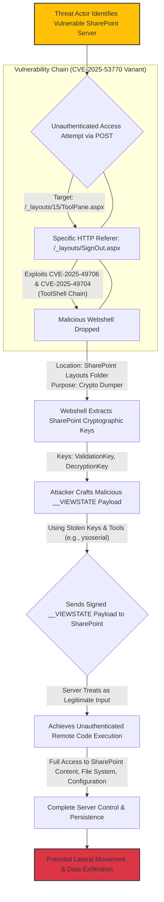

# The Feed 2025-06-23


## AI Generated Podcast

[Spotify](https://open.spotify.com/episode/1I96mwyBV9vToIDidW3Rhq?si=_tul5_OATDGE_zcw1BLh4w)

## SharePoint CVE-2025-53770 'ToolShell' RCE Vulnerability Under Active Exploitation
### Summary
CVE-2025-53770, publicly known as "ToolShell," is a new remote code execution (RCE) vulnerability actively exploited in the wild, enabling unauthenticated access to on-premise Microsoft SharePoint servers. This critical vulnerability is a variant of CVE-2025-49706 and involves a sophisticated chain combining it with CVE-2025-49704. The exploitation grants malicious actors full access to SharePoint content, including file systems and internal configurations, and the ability to execute code over the network. Notably, this vulnerability allows attackers to bypass traditional authentication mechanisms and steal sensitive cryptographic keys, such as ValidationKey and DecryptionKey, from SharePoint servers. This theft is particularly dangerous as it allows attackers to forge valid `__VIEWSTATE` payloads, maintaining persistence even after patching and system reboots. Eye Security identified the active exploitation on July 18, 2025, noting a remarkably rapid transition from proof-of-concept to mass exploitation within 72 hours of public disclosure. It's crucial to understand that only on-premises SharePoint Servers are affected; SharePoint Online in Microsoft 365 is not impacted.

### Technical Details
CVE-2025-53770 is a critical Remote Code Execution (RCE) vulnerability actively exploited in the wild, enabling unauthorized and unauthenticated access to on-premise SharePoint servers. It is identified as a variant of an existing vulnerability, CVE-2025-49706. The exploitation campaign is publicly known as "ToolShell". This exploit provides attackers with complete remote control, allowing them to fully access SharePoint content, including file systems and internal configurations, and execute code over the network. SharePoint Online (Microsoft 365) is not impacted, only on-premises SharePoint Servers are vulnerable.

The "ToolShell" exploit chain combines two critical security flaws: CVE-2025-49706 and CVE-2025-49704, which were initially demonstrated at Pwn2Own Berlin 2025 in May. While these were initially considered proof-of-concept, they were weaponized for large-scale coordinated attacks within 72 hours of public disclosure on July 15, 2025. Mass exploitation began systematically on July 18, 2025, from IP address 107.191.58[.]76, followed by a second wave from 104.238.159[.]149 on July 19, 2025.

The core of the exploitation process involves several key steps:

1.  **Initial Access and Authentication Bypass:** The exploit bypasses traditional authentication mechanisms by targeting SharePoint’s vulnerable `/_layouts/15/ToolPane.aspx` endpoint via an HTTP POST request. A crucial element enabling the unauthenticated RCE for CVE-2025-53770 is the use of a specific HTTP `Referer` header set to `/_layouts/SignOut.aspx`. This seemingly innocuous `Referer` allows the attack to proceed without requiring any successful authentication.

2.  **Webshell Dropping:** Upon successful exploitation of the `ToolPane.aspx` endpoint, attackers drop a malicious ASPX file, typically named `spinstall0.aspx`, to a specific path on the SharePoint server, such as `C:\PROGRA~1\COMMON~1\MICROS~1\WEBSER~1\16\TEMPLATE\LAYOUTS\spinstall0.aspx`. This file is a stealthy "crypto dumper" and is believed to be created using a tool like SharPyShell.

3.  **Cryptographic Key Extraction:** Unlike typical webshells designed for command execution, `spinstall0.aspx`'s primary purpose is to invoke internal .NET methods to extract sensitive cryptographic secrets from the SharePoint server. Specifically, it aims to leak the `MachineKey` configuration, including the crucial `ValidationKey` and `DecryptionKey` materials. These keys are essential for SharePoint to generate valid `__VIEWSTATE` payloads.

4.  **Remote Code Execution (RCE) via `__VIEWSTATE`:** Once the attacker obtains these cryptographic secrets (ValidationKey), they can craft completely valid, digitally signed `__VIEWSTATE` payloads. This is often achieved using a tool like `ysoserial`. By creating a malicious page request with a serialized payload and correctly signing it with the stolen `ValidationKey`, the attacker can cause SharePoint to deserialize arbitrary objects and execute embedded commands. This effectively mirrors the design weakness exploited in CVE-2021-28474, but now in a zero-day chain with automatic shell drop and full persistence without any authentication. The server then accepts these signed payloads as legitimate trusted input, completing the RCE chain and granting the attacker complete remote control.

**Impact and Persistence:** The theft of cryptographic keys is particularly concerning because it allows attackers to impersonate users or services even after the server is patched, necessitating cryptographic material rotation as a critical post-patching step. Attackers can also maintain persistence through backdoors or modified components that survive reboots and updates, emphasizing the need for thorough compromise assessments beyond just patching.

**Mermaid Flowchart Diagram of the Exploitation Process:**



This flowchart visually represents the step-by-step progression of the CVE-2025-53770 exploitation, from initial access to full compromise.

### Countries
The exploitation activity has been observed targeting "on-premise SharePoint servers across the world". Eye Security, a Dutch cybersecurity firm, identified active exploitation. The initial and second waves of attacks used US-based source IP addresses. Eye Security's scan covered "8000+ SharePoint servers worldwide" and identified compromises across "multiple organizations".

### Industries
While specific industries are not enumerated, the vulnerability affects all organizations utilizing "on-premises SharePoint servers". SharePoint is a widely used platform, implying that a broad range of sectors could be at risk. Eye Security confirmed compromises across "dozens of systems actively compromised across multiple organizations" and contacted national CERTs globally.

### Recommendations
Organizations must act immediately to mitigate the risks associated with CVE-2025-53770, as patching alone may not be sufficient due to persistence mechanisms.

1.  **Apply Security Updates Immediately**:
    *   For SharePoint Subscription Edition, apply the security update provided in CVE-2025-53771 immediately.
    *   For SharePoint 2019 and SharePoint 2016, apply the July 2025 Security Update. Microsoft has released comprehensive patches for SharePoint Server 2016, 2019, and Subscription Edition. Affected builds include SharePoint 2016 versions prior to 16.0.5508.1000 (KB5002744), SharePoint 2019 versions prior to 16.0.10417.20027 (KB5002741), and Subscription Edition versions prior to 16.0.18526.20424.
    *   There are no alternative workarounds; immediate patching is essential.
    *   Ensure the use of supported versions of on-premises SharePoint Server.
2.  **Enhance Endpoint Protection and Scanning**:
    *   Ensure the Antimalware Scan Interface (AMSI) is turned on and configured correctly in SharePoint, enabling Full Mode for optimal protection.
    *   Deploy Microsoft Defender Antivirus or an equivalent antivirus solution on all SharePoint servers. This can stop unauthenticated attackers from exploiting the vulnerability.
    *   If AMSI cannot be enabled, disconnect affected public-facing SharePoint servers from the internet until official mitigations or security updates are available.
    *   Deploy Microsoft Defender for Endpoint or equivalent threat solutions to detect and block post-exploit activity.
    *   Conduct thorough, comprehensive compromise assessments immediately, as sophisticated attacks enable persistent access that may survive patching and standard security scans.
3.  **Rotate Cryptographic Keys**:
    *   After applying security updates or enabling AMSI, it is critical to rotate SharePoint Server ASP.NET machine keys and restart IIS on all SharePoint servers. This can be done manually via PowerShell (`Update-SPMachineKey cmdlet`), manually via Central Admin, or by triggering the "Machine Key Rotation Job" timer job. Rotating keys invalidates any future IIS tokens that could be created by a malicious actor using previously stolen keys.
4.  **Implement Robust Logging and Monitoring**:
    *   Implement comprehensive logging to identify exploitation activity.
    *   Monitor for specific `POST` requests to `/_layouts/15/ToolPane.aspx?DisplayMode=Edit`.
    *   Update intrusion prevention system (IPS) and web-application firewall (WAF) rules to block exploit patterns and anomalous behavior.
5.  **Audit and Minimize Privileges**:
    *   Audit and minimize layout and admin privileges on SharePoint servers.
6.  **Incident Response if Compromised**:
    *   If compromise is verified, immediately isolate or shut down affected SharePoint servers (blocking via firewall is not sufficient due to potential persistence).
    *   Renew all credentials and system secrets that could have been exposed via the malicious ASPX file.
    *   Engage your incident response team or a trusted cybersecurity firm immediately.

### Hunting methods
Defenders can leverage various hunting methods and detection rules to identify and respond to CVE-2025-53770 exploitation.

*   **Endpoint Detection and Response (EDR) & Antivirus**:
    *   Microsoft Defender Antivirus provides detection and protection under names like `Exploit:Script/SuspSignoutReq.A` and `Trojan:Win32/HijackSharePointServer.A`.
    *   Microsoft Defender for Endpoint generates alerts indicating potential threat activity, such as "Possible web shell installation," "Possible exploitation of SharePoint server vulnerabilities," "Suspicious IIS worker process behavior," "IIS worker process loaded suspicious .NET assembly," "‘SuspSignoutReq’ malware was blocked on a SharePoint server," and "‘HijackSharePointServer’ malware was blocked on a SharePoint server".
    *   Look for suspicious process chains on SharePoint on-prem servers, specifically `w3wp.exe` (IIS worker process) spawning suspicious child processes, especially encoded PowerShell executions involving the `spinstall0` file or its known paths (`C:\PROGRA~1\COMMON~1\MICROS~1\WEBSER~1\16\TEMPLATE\LAYOUTS\spinstall0.aspx`).
*   **Log Analysis (IIS Logs)**:
    *   Monitor IIS logs for `POST` requests to `/_layouts/15/ToolPane.aspx?DisplayMode=Edit`.
    *   Crucially, look for these `POST` requests where the `Referer` HTTP header is set to `/_layouts/SignOut.aspx`.
    *   Check IIS logs where the `cs-username` column (client username) is empty or shows no successful authentications, despite the presence of suspicious activity.
    *   Identify the User-Agent string `Mozilla/5.0 (Windows NT 10.0; Win64; x64; rv:120.0) Gecko/20100101 Firefox/120.0` or its URL-encoded form (`Mozilla/5.0+(Windows+NT+10.0;+Win64;+x64;+rv:120.0)+Gecko/20100101+Firefox/120.0`) used during exploitation.
    *   Look for `GET` requests to `/_layouts/15/spinstall0.aspx` or any other suspicious `.aspx` file within the SharePoint layouts directory.
*   **File System Scanning**:
    *   Scan for the presence of the `spinstall0.aspx` file, especially at `C:\PROGRA~1\COMMON~1\MICROS~1\WEBSER~1\16\TEMPLATE\LAYOUTS\spinstall0.aspx`. The hash `92bb4ddb98eeaf11fc15bb32e71d0a63256a0ed826a03ba293ce3a8bf057a514` is associated with this file.
    *   Tools like Splunk's `ShellSweepX` ([https://github.com/splunk/ShellSweep](https://github.com/splunk/ShellSweep)) can detect suspicious webshell-like content on disk using entropy, pattern analysis, and file heuristics, without relying on IIS logs or process creation data.
*   **Splunk Analytic Story (for CVE-2025-53770)**: This story includes detection logic for `w3wp.exe` spawning suspicious child processes, PowerShell obfuscation detection, and `POST` requests to `ToolPane.aspx` with encoded content (a core part of this exploit chain).
*   **Microsoft 365 Defender Advanced Hunting Queries**:
    *   To locate successful exploitation via file creation: Look for the creation of `spinstall0.aspx`.
    *   To locate process creations: Look for process creations where `w3wp.exe` is spawning encoded PowerShell involving the `spinstall0` file or the file paths it’s been known to be written to.
    *   Queries can be set to search for a week's worth of events, extendable up to 30 days.
    *   **Logic**: These queries aim to identify the specific artifacts left by the exploit (the `spinstall0.aspx` file) or the suspicious parent-child process relationships (`w3wp.exe` spawning PowerShell) that indicate webshell deployment and execution. The presence of encoded PowerShell further points to malicious activity attempting to evade detection.
*   **Intrusion Prevention Systems (IPS) / Web Application Firewalls (WAF)**: Update rules to block exploit patterns and anomalous behavior, specifically targeting `POST` requests to `/layouts/15/ToolPane.aspx` with the `Referer: /_layouts/SignOut.aspx` header.

##### Mapping Exposure in Microsoft Defender Vulnerability Management[](https://msrc.microsoft.com/blog/2025/07/customer-guidance-for-sharepoint-vulnerability-cve-2025-53770/#mapping-exposure-in-microsoft-defender-vulnerability-management)

MDVM vulnerability records now include CVSS scores and zero days flags for both vulnerabilities, for all impacted SharePoint versions, including SharePoint Server 2010 & 2013.

Browse to Vulnerability management ▸ Software vulnerabilities and filter by the vulnerability identifiers to view exposed devices, remediation status and Evidence of Exploitation tags.

**Unified Advanced Hunting query**

```kql
DeviceTvmSoftwareVulnerabilities
| where CveId in ("CVE-2025-49706","CVE-2025-53770")
```

### Advanced hunting[](https://msrc.microsoft.com/blog/2025/07/customer-guidance-for-sharepoint-vulnerability-cve-2025-53770/#advanced-hunting)

**NOTE**: The following sample queries let you search for a week’s worth of events. To explore up to 30 days’ worth of raw data to inspect events in your network and locate potential related indicators for more than a week, go to the **Advanced Hunting** page > **Query** tab, select the calendar dropdown menu to update your query to hunt for the Last 30 days.

To locate possible exploitation activity, run the following queries in Microsoft 365 security center.

**Successful exploitation via file creation (requires Microsoft 365 Defender)**

Look for the creation of spinstall0.aspx, which indicates successful post-exploitation of CVE-2025-53770. [Run query in the Microsoft 365 Defender](https://security.microsoft.com/v2/advanced-hunting?query=H4sIAC8YfGgAA42RTUvDQBCG37Pgf1g8i7SC3jzUtmLBqjSKFLzUpDQrzQcm-AHib_fZiaGCe5AlzOw7M8_MTiZa61VeKfYCu8VOUdYq1arRvvb0Kac35WgvfI68irzM7rdakZej5ngN9kBzzTTWQjdK9KWhHjkPUM-5T9F7bahTs3eoc0hXGpkftOAvIdyjJDDjc3TzXtO5MOUMdpigUU2sxLbEtpyBjmy-Wu8_tApKjLF7R4yym6SmvtIzNSlxx5zeCF12QfwQdfJrv32PoM_gejK97S902bCBQEyN0fyZ7H9VY_yCsyKWscWQ09XGeLE_GfQFSm0baumZmTayd3rUkrd-EO8YiS6JHeuEv9nvJlR2VKcncmPbcZbRQP0GDl8cmYQCAAA&timeRangeId=week)

```kql
DeviceFileEvents
| where FolderPath has_any (@'microsoft shared\Web Server Extensions\16\TEMPLATE\LAYOUTS', @'microsoft shared\Web Server Extensions\15\TEMPLATE\LAYOUTS')
| where FileName has "spinstall0"
| project Timestamp, DeviceName, InitiatingProcessFileName, InitiatingProcessCommandLine, FileName, FolderPath, ReportId, ActionType, SHA256
| order by Timestamp desc
```

Look for process creations where w3wp.exe is spawning encoded PowerShell involving the spinstall0 file or the file paths it’s been known to be written to.

```kql
DeviceProcessEvents
| where InitiatingProcessFileName has "w3wp.exe"
 and InitiatingProcessCommandLine !has "DefaultAppPool"
 and FileName =~ "cmd.exe"
 and ProcessCommandLine has_all ("cmd.exe", "powershell")
 and ProcessCommandLine has_any ("EncodedCommand", "-ec")
| extend CommandArguments = split(ProcessCommandLine, " ")
| mv-expand CommandArguments to typeof(string)
| where CommandArguments matches regex "^[A-Za-z0-9+/=]{15,}$"
| extend B64Decode = replace("\\x00", "", base64_decodestring(tostring(CommandArguments)))  
| where B64Decode has_any ("spinstall0", @'C:\PROGRA~1\COMMON~1\MICROS~1\WEBSER~1\15\TEMPLATE\LAYOUTS', @'C:\PROGRA~1\COMMON~1\MICROS~1\WEBSER~1\16\TEMPLATE\LAYOUTS')
```
Shells provided by [Florian Roth](https://www.linkedin.com/in/floroth/) [https://x.com/cyb3rops/status/1947032951486574672](https://x.com/cyb3rops/status/1947032951486574672)

```yml
rule WEBSHELL_ASP_Runtime_Compile : FILE {
    meta:
        description = "ASP webshell compiling payload in memory at runtime, e.g. sharpyshell"
        license = "Detection Rule License 1.1 https://github.com/Neo23x0/signature-base/blob/master/LICENSE"
        author = "Arnim Rupp (https://github.com/ruppde)"
        reference = "https://github.com/antonioCoco/SharPyShell"
        date = "2021/01/11"
        modified = "2023-04-05"
        score = 75
        hash = "e826c4139282818d38dcccd35c7ae6857b1d1d01"
        hash = "e20e078d9fcbb209e3733a06ad21847c5c5f0e52"
        hash = "57f758137aa3a125e4af809789f3681d1b08ee5b"
        hash = "bd75ac9a1d1f6bcb9a2c82b13ea28c0238360b3a7be909b2ed19d3c96e519d3d"
        hash = "e44058dd1f08405e59d411d37d2ebc3253e2140385fa2023f9457474031b48ee"
        hash = "f6092ab5c8d491ae43c9e1838c5fd79480055033b081945d16ff0f1aaf25e6c7"
        hash = "dfd30139e66cba45b2ad679c357a1e2f565e6b3140a17e36e29a1e5839e87c5e"
        hash = "89eac7423dbf86eb0b443d8dd14252b4208e7462ac2971c99f257876388fccf2"
        hash = "8ce4eaf111c66c2e6c08a271d849204832713f8b66aceb5dadc293b818ccca9e"
        id = "5da9318d-f542-5603-a111-5b240f566d47"
    strings:
        $payload_reflection1 = "System" fullword nocase wide ascii
        $payload_reflection2 = "Reflection" fullword nocase wide ascii
        $payload_reflection3 = "Assembly" fullword nocase wide ascii
        $payload_load_reflection1 = /[."']Load\b/ nocase wide ascii
        // only match on "load" or variable which might contain "load"
        $payload_load_reflection2 = /\bGetMethod\(("load|\w)/ nocase wide ascii
        $payload_compile1 = "GenerateInMemory" nocase wide ascii
        $payload_compile2 = "CompileAssemblyFromSource" nocase wide ascii
        $payload_invoke1 = "Invoke" fullword nocase wide ascii
        $payload_invoke2 = "CreateInstance" fullword nocase wide ascii
        $payload_xamlreader1 = "XamlReader" fullword nocase wide ascii
        $payload_xamlreader2 = "Parse" fullword nocase wide ascii
        $payload_xamlreader3 = "assembly=" nocase wide ascii
        $payload_powershell1 = "PSObject" fullword nocase wide ascii
        $payload_powershell2 = "Invoke" fullword nocase wide ascii
        $payload_powershell3 = "CreateRunspace" fullword nocase wide ascii
        $rc_fp1 = "Request.MapPath"
        $rc_fp2 = "<body><mono:MonoSamplesHeader runat=\"server\"/>" wide ascii

        //strings from private rule capa_asp_input
        // Request.BinaryRead
        // Request.Form
        $asp_input1 = "request" fullword nocase wide ascii
        $asp_input2 = "Page_Load" fullword nocase wide ascii
        // base64 of Request.Form(
        $asp_input3 = "UmVxdWVzdC5Gb3JtK" fullword wide ascii
        $asp_input4 = "\\u0065\\u0071\\u0075" wide ascii // equ of Request
        $asp_input5 = "\\u0065\\u0073\\u0074" wide ascii // est of Request
        $asp_xml_http = "Microsoft.XMLHTTP" fullword nocase wide ascii
        $asp_xml_method1 = "GET" fullword wide ascii
        $asp_xml_method2 = "POST" fullword wide ascii
        $asp_xml_method3 = "HEAD" fullword wide ascii
        // dynamic form
        $asp_form1 = "<form " wide ascii
        $asp_form2 = "<Form " wide ascii
        $asp_form3 = "<FORM " wide ascii
        $asp_asp   = "<asp:" wide ascii
        $asp_text1 = ".text" wide ascii
        $asp_text2 = ".Text" wide ascii

        $sus_refl1 = " ^= " wide ascii
        $sus_refl2 = "SharPy" wide ascii

    condition:
        //any of them or
        (
            (
                filesize < 50KB and
                any of ( $sus_refl* )
            ) or
            filesize < 10KB
        ) and
        (
                any of ( $asp_input* ) or
            (
                $asp_xml_http and
                any of ( $asp_xml_method* )
            ) or
            (
                any of ( $asp_form* ) and
                any of ( $asp_text* ) and
                $asp_asp
            )
        )
        and not any of ( $rc_fp* ) and
        (
            (
                all of ( $payload_reflection* ) and
                any of ( $payload_load_reflection* )
            )
            or
            (
                all of ( $payload_compile* ) and
                any of ( $payload_invoke* )
            )
            or all of ( $payload_xamlreader* )
            or all of ( $payload_powershell* )
        )
}
```

### IOC
**IP Addresses**
```
107.191.58[.]76
104.238.159[.]149
96.9.125[.]147
103.186.30[.]186
```
**File Hashes (SHA256)**
```
4a02a72aedc3356d8cb38f01f0e0b9f26ddc5ccb7c0f04a561337cf24aa84030
b39c14becb62aeb55df7fd55c814afbb0d659687d947d917512fe67973100b70
fa3a74a6c015c801f5341c02be2cbdfb301c6ed60633d49fc0bc723617741af7
92bb4ddb98eeaf11fc15bb32e71d0a63256a0ed826a03ba293ce3a8bf057a514
```
**User-Agent Strings**
```
Mozilla/5.0 (Windows NT 10.0; Win64; x64; rv:120.0) Gecko/20100101 Firefox/120.0
Mozilla/5.0+(Windows+NT+10.0;+Win64;+x64;+rv:120.0)+Gecko/20100101+Firefox/120.0
```
**URLs / Paths**
```
POST /_layouts/15/ToolPane.aspx?DisplayMode=Edit&a=/ToolPane.aspx
GET /_layouts/15/<undisclosed>.aspx
GET /_layouts/15/spinstall0.aspx
```
**HTTP Referer**
```
Referer: /_layouts/SignOut.aspx
```
**File Paths**
```
C:\PROGRA~1\COMMON~1\MICROS~1\WEBSER~1\16\TEMPLATE\LAYOUTS\spinstall0.aspx
```

**Original Links:**
*   [Using Splunk to Hunt CVE-2025-53770 Webshells, IIS Logs, and Detection Wins](https://www.linkedin.com/posts/splunk_cve-2025-53770-is-under-active-exploitation-activity-7220268480356536320-vK-N)
*   [Microsoft Releases Guidance on Exploitation of SharePoint Vulnerability (CVE-2025-53770) CISA](https://www.cisa.gov/news-events/alerts/2025/07/20/microsoft-releases-guidance-exploitation-sharepoint-vulnerability-cve-2025-53770)
*   [SharePoint 0-Day RCE Vulnerability Actively Exploited in the Wild to Gain Full Server Access](https://cybersecuritynews.com/sharepoint-0-day-rce-vulnerability-exploited/)
*   [Customer guidance for SharePoint vulnerability CVE-2025-53770  MSRC Blog  Microsoft Security Response Center](https://msrc.microsoft.com/blog/2025/07/customer-guidance-for-sharepoint-vulnerability-cve-2025-53770/)
*   [SharePoint 0-day uncovered (CVE-2025-53770) Eye Security](https://research.eye.security/sharepoint-under-siege/)
